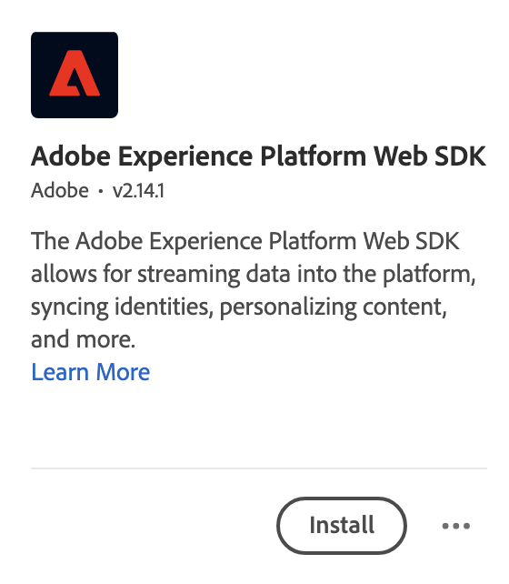

# Add the Web SDK extension to your tag {#upgrade-tag-extension}

<!-- markdownlint-disable MD034 -->

>[!CONTEXTUALHELP]
>id="cja-upgrade-tag-extension"
>title="Add the Platform Web SDK extension to your tag property"
>abstract="Add the Adobe Experience Platform Web SDK extension to your tag property. Adding the Web SDK extension to your tag property is streamlined, taking only a few minutes to complete."

<!-- markdownlint-enable MD034 -->

{{upgrade-note-step}}

You can use the Tags feature within Adobe Experience Platform to implement code on your site to collect data. This tag management solution lets you deploy code alongside other tagging requirements. Tags offer seamless integration with Adobe Experience Platform using the Adobe Experience Platform Web SDK extension.

The following information describes how to add the Web SDK extension to your tag. For supplemental information, see the [Configure the Web SDK tag extension](https://experienceleague.adobe.com/en/docs/experience-platform/tags/extensions/client/web-sdk/web-sdk-extension-configuration) in the Experience Platform documentation. The Web SDK includes the [!UICONTROL Adobe Experience Cloud ID Service] natively, so you do not need to add the ID service extension to your tag.

After you [create a tag](/help/getting-started/cja-upgrade/cja-upgrade-tag-property.md), you must configure it with the Adobe Experience Platform Web SDK extension. This ensures that you can send data to Adobe Experience Platform (through your datastream).

To add the Web SDK extension to your tag:

1. Log in to experience.adobe.com using your Adobe ID credentials.

1. In Adobe Experience Platform, go to **[!UICONTROL Data Collection]** > **[!UICONTROL Tags]**.

1. Select your newly created tag from the list of [!UICONTROL Tag Properties] to open it.

1. Select **[!UICONTROL Extensions]** in the left rail.

1. Select **[!UICONTROL Catalog]** in the top bar.

1. Search for or scroll to the **[!UICONTROL Adobe Experience Platform Web SDK extension]**, then select **[!UICONTROL Install]** to install it.

   

1. Select your sandbox and your earlier created datastream for your [!UICONTROL Production Environment] and (optional) [!UICONTROL Staging Environment] and [!UICONTROL Development Environment].

   

1. Select **[!UICONTROL Save]**.

{{upgrade-final-step}}
