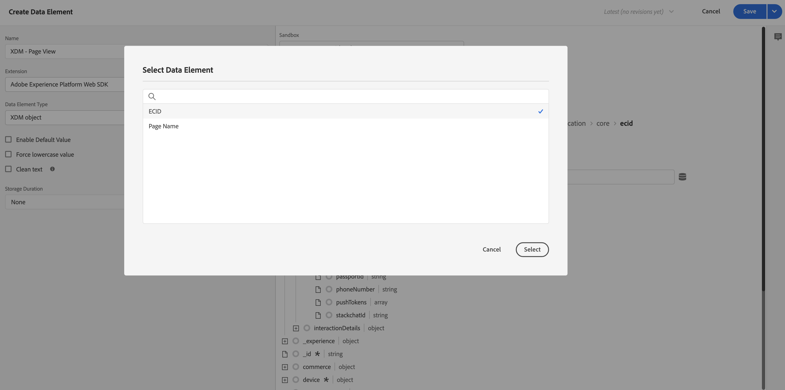

# Add XDM data collection logic to your tag {#upgrade-tag-xdm}

<!-- markdownlint-disable MD034 -->

>[!CONTEXTUALHELP]
>id="cja-upgrade-tag-xdm"
>title="Add XDM data collection logic to your tag"
>abstract="With the loader tag installed on your site, you can add rules and data elements to populate an XDM object to send to Adobe. Adobe recommends maintaining a solution design document to track how your tags are configured.  This step is a lot of work, as it involves setting up all Analytics logic for your property. Expect to dedicate a month or longer to establish the correct tag rules, test them, and deploy them on your site."

<!-- markdownlint-enable MD034 -->

{{upgrade-note-step}}

After [creating the tag and adding the Web SDK extension](/help/getting-started/cja-upgrade/cja-upgrade-tag-property.md), you must configure it with data elements and rules, according to how you want to track your site and send data to Adobe Experience Platform. After you configure data elements and rules for your tag, you can build and publish it.

## Configure data elements

Data elements are the building blocks for your data dictionary (or data map). Use data elements to collect, organize, and deliver data across marketing and ad technology. You set up data elements in your tag that read from your data layer and can be used to deliver data into Adobe Experience Platform. (For more information about data elements, see [Data elements](https://experienceleague.adobe.com/en/docs/experience-platform/tags/ui/data-elements) in the Tags Documentation.)

The following sections describe suggested data elements and other common data elements that you can configure. 

There are various types of data elements. Two common data elements that you might want to configure are: one that captures the page name that persons are viewing on your site, and another that captures the Experience Cloud ID of each person who visits your site. 

After you configure these two data elements, you can configure additional data elements for the specific data you want to capture.

Finally, after you define all your desired data elements, you need to assign the data elements to the [schema you created](/help/getting-started/cja-upgrade/cja-upgrade-schema-create.md) earlier. To do this, you define an XDM data element, which provides a representation of your XDM schema.

<!-- Assigning data elements to an XDM object. All of the available XDM objects are based on the schema -->

### Create suggested data elements

The following sections describe how to create common data elements that apply to most organizations.

#### Page name data element

A common data element that applies to most organizations is a data element that captures the page name that persons are viewing.

To create a page name data element:

1. Log in to experience.adobe.com using your Adobe ID credentials.

1. In Adobe Experience Platform, go to **[!UICONTROL Data Collection]** > **[!UICONTROL Tags]**.

1. On the **[!UICONTROL Tag Properties]** page, select your newly created tag from the list of properties to open it.

1. Select **[!UICONTROL Data Elements]** in the left rail.

1. Select **[!UICONTROL Add Data Element]**.

1. In the **[!UICONTROL Create Data Element]** dialog, specify the following information:

   * **[!UICONTROL Name]**: The name of your data element. For example `Page Name`.

   * **[!UICONTROL Extension]**: Select **[!UICONTROL Core]** from the list.

   * **[!UICONTROL Data Element Type]**: Select **[!UICONTROL Page Info]** from the list.

   * **[!UICONTROL Attribute]**: Select **[!UICONTROL Title]** from the list.

     

     Alternatively you could have used the value from a variable of your data layer, for example `pageName` and the [!UICONTROL JavaScript Variable] data element type to define the data element.

     

1. Select **[!UICONTROL Save]**.

   You now want to set up a data element referencing the Experience Cloud ID that is automatically provided by the Adobe Experience Platform Web SDK and available through the Experience Cloud ID Service extension.

1. Continue with [ECID data element](#ecid-data-element).

#### ECID data element

A common data element that applies to most organizations is a data element that captures the Experience Cloud ID of each person who visits your site.

To create an ECID data element:

1. Log in to experience.adobe.com using your Adobe ID credentials.

1. In Adobe Experience Platform, go to **[!UICONTROL Data Collection]** > **[!UICONTROL Tags]**.

1. Select your newly created tag from the list of [!UICONTROL Tag Properties] to open it.

1. (Conditional) Install the Experience Cloud ID Service extension if it is not already installed:

   1. Select **[!UICONTROL Extensions]** in the left rail.

   1. The **[!UICONTROL Installed]** tab is selected by default. If the **[!UICONTROL Experience Cloud ID Service]** tile is listed, skip to Step 5.
   
   1. If the **[!UICONTROL Experience Cloud ID Service]** tile is not listed, select the **[!UICONTROL Catalog]** tab.

   1. In the search field, search for **[!UICONTROL Experience Cloud ID Service]**, then select the tile when it appears
   
   1. Select **[!UICONTROL Install]** > **[!UICONTROL Save]**.

1. Select **[!UICONTROL Data Elements]** in the left rail.

1. Select **[!UICONTROL Add Data Element]**.

1. In the **[!UICONTROL Create Data Element]** dialog, specify the following information:

   * **[!UICONTROL Name]**: The name of your data element. For example `ECID`.

   * **[!UICONTROL Extension]**: Select **[!UICONTROL Experience Cloud ID Service]** from the list.

   * **[!UICONTROL Data Element Type]**: Select **[!UICONTROL ECID]** from the list.

     

1. Select **[!UICONTROL Save]**.

1. Continue with [Create additional data elements](#create-additional-data-elements).

### Create additional data elements 

Create a data element for each type of data that you want to collect. Use the same process described in [Page name data element](#page-name-data-element) and [ECID data element](#ecid-data-element) to create each additional data element.

The data elements that you create should have a correlating field in your schema. 

Common data elements vary depending on industry and business requirements. Consider the following common data elements, organized by industry:

**Retail data elements**

* Products

* Cart additions

* Checkouts

**Financial data elements**

* Transaction ID

* Transaction date

* Service type

**Healthcare data elements**

* Provider ID

* Visit date

* Treatment type

After you create all the data elements required by your organization for your implementation, continue with [XDM object data element](#xdm-object-data-element).

### XDM object data element

Finally, you now want to map any data element that you created to the [schema you created](/help/getting-started/cja-upgrade/cja-upgrade-schema-create.md) earlier. To do this, define an XDM object data element that provides a representation of your XDM schema.

To define an XDM object data element:

1. Log in to experience.adobe.com using your Adobe ID credentials.

1. In Adobe Experience Platform, go to **[!UICONTROL Data Collection]** > **[!UICONTROL Tags]**.

1. Select your newly created tag from the list of [!UICONTROL Tag Properties] to open it.

1. Select **[!UICONTROL Data Elements]** in the left rail.

1. Select **[!UICONTROL Add Data Element]**.

1. In the **[!UICONTROL Create Data Element]** dialog, specify the following information:

   * **[!UICONTROL Name]**: The name of your data element. For example `XDM - Page View`.

   * **[!UICONTROL Extension]**: Select **[!UICONTROL Adobe Experience Platform Web SDK]** from the list.

   * **[!UICONTROL Data Element Type]**: Select **[!UICONTROL XDM Object]** from the list.

   * **[!UICONTROL Sandbox]**: Select your sandbox from the list.

   * **[!UICONTROL Schema]**: Select your schema from the list.

1. Map the `identification > core > ecid` attribute, defined in your schema, to the ECID data element. Select the cylinder icon to easily pick the ECID data element from your list of data elements.

   

   

1. Map the `web > webPageDetails > name` attribute, defined in your schema, to the Page Name data element.

   

1. Select **[!UICONTROL Save]**.

1. Continue with [Configure rules](#configure-rules).

## **Configure rules**

Tags in Adobe Experience Platform follow a rule-based system. They look for user interaction and associated data. When the criteria outlined in your rules are met, the rule triggers the extension, script, or client-side code you identified. You can use rules to send data (like an XDM object) into Adobe Experience Platform using the Adobe Experience Platform Web SDK extension.

To define a rule:

>[!NOTE]
>
>The following steps are an example of defining a rule that sends XDM data, containing values from other data elements, to Adobe Experience Platform. 
>
>You can use rules in various ways in your tag to manipulate variables (using your data elements). 
>
>See [Rules](https://experienceleague.adobe.com/docs/experience-platform/tags/ui/rules.html) for more information.

1. Log in to experience.adobe.com using your Adobe ID credentials.

1. In Adobe Experience Platform, go to **[!UICONTROL Data Collection]** > **[!UICONTROL Tags]**.

1. Select your newly created tag from the list of [!UICONTROL Tag Properties] to open it.

1. Select **[!UICONTROL Rules]** in the left rail.

1. Select **[!UICONTROL Add Rule]**.

1. In the **[!UICONTROL Create Rule]** dialog, specify the following information:

   * **[!UICONTROL Name]**: The name of the rule. For example `Page View`.

   * **[!UICONTROL Events]**: Select **[!UICONTROL + Add]**. Then, in the **[!UICONTROL Event Configuration]** dialog, specify the following information. When you are finished, select **[!UICONTROL Keep Changes]**.

     * **[!UICONTROL Extension]**: Select **[!UICONTROL Core]** from the list.

     * **[!UICONTROL Event Type]**: Select **[!UICONTROL Window Loaded]** from the list.

       

   * **[!UICONTROL Actions]**: Select **[!UICONTROL + Add]**. Then, in the [!UICONTROL Action Configuration] dialog, specify the following information. When you are finished, select **[!UICONTROL Keep Changes]**.

     * **[!UICONTROL Extension]**: Select **[!UICONTROL Adobe Experience Platform Web SDK]** from the list.

     * **[!UICONTROL Action Type]**: Select **[!UICONTROL Send event]** from the list.

     * **[!UICONTROL Type]**: Select **[!UICONTROL Web Webpagedetails Page Views]** from the list.

     * **[!UICONTROL XDM data]**: Select the cylinder icon, then select **[!UICONTROL XDM - Page View]** from the list of data elements.

       

       Your rule should look like:

       

1. Select **[!UICONTROL Save]**.

1. Repeat this process for each rule that you want to add to your site.

   For more information about rules, see [Rules](https://experienceleague.adobe.com/en/docs/experience-platform/tags/ui/rules) in the Tags Documentation.

1. Continue with [Build and publish your tag](#build-and-publish-your-tag).

## Build and publish your tag

After you define data elements and rules, you must build and publish your tag. When you create a library build, you must assign it to an environment. The build's extensions, rules, and data elements are then compiled and placed into the assigned environment. Each environment provides a unique embed code that allows you to integrate its assigned build into your site.

Adobe Experience Platform Tags support simple to complex publishing workflows that should accommodate your deployment of the Adobe Experience Platform Web SDK. See [Publishing overview](https://experienceleague.adobe.com/docs/experience-platform/tags/publish/overview.html) for more information.

To build and publish your tag:

1. Log in to experience.adobe.com using your Adobe ID credentials.

1. In Adobe Experience Platform, go to **[!UICONTROL Data Collection]** > **[!UICONTROL Tags]**.

1. Select your newly created tag from the list of [!UICONTROL Tag Properties] to open it.

1. Select **[!UICONTROL Publishing Flow]** from the left rail.

1. Select **[!UICONTROL Add Library]**.

1. In the **[!UICONTROL Create Library]** dialog, specify the following information:

    * **[!UICONTROL Name]**: The name of the library.

    * **[!UICONTROL Environment]**: Select **[!UICONTROL Development (development)]** from the list.

1. Select **[!UICONTROL + Add All Changed Resources]**.

   

1. Select **[!UICONTROL Save & Build to Development]**.

    Your tag is saved and is built for your development environment. A green dot indicates a successful build of your tag on your development environment.

1. You can select **[!UICONTROL ...]** to rebuild the library or move the library to a staging or production environment.

   

1. {{upgrade-final-step}}

