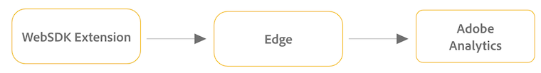
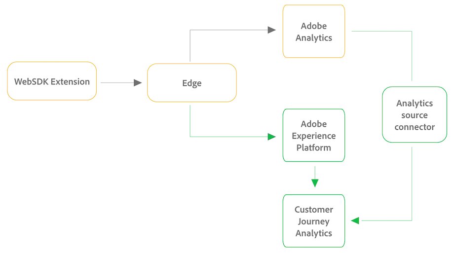

# Upgrade to Customer Journey Analytics from the WebSDK Extension

Use the following sections to understand the differences between your current and future implementations, and how to get started with the upgrade.

## Understand the upgrade from an Adobe Analytics implementation to a Customer Journey Analytics implementation

The following sections show the differences between a Web SDK Extension implementation that sends data only to Adobe Analytics, and an implementation after upgrading to Customer Journey Analytics. 

### WebSDK Extension implementation with Adobe Analytics only

When your Adobe Analytics environment is implemented with the WebSDK Extension, data is sent to Experience Platform Edge and then to Adobe Analytics, as depicted in the following graphic:

### WebSDK Extension implementation with both Adobe Analytics and Customer Journey Analytics

To upgrade to Customer Journey Analytics from an Adobe Analytics environment that is implemented with the WebSDK, Adobe recommends a two-pronged approach: First, begin sending data from Edge to Adobe Experience Platform, and from Platform to Customer Journey Analytics. Second, set up the Analytics source connector. 

This configuration is depicted in the following graphic, with changes from the original Adobe Analytics implementation shown in green:

## Upgrade to Customer Journey Analytics

Adobe recommends a two-pronged upgrade approach when upgrading from Adobe Analytics to Customer Journey Analytics: a new implementation of the Experience Platform WebSDK and the Adobe Analytics source connector.

When used together, this two-pronged approach lays the best foundation for a successful upgrade from Adobe Analytics to Customer Journey Analytics.

For more information about the benefits of using this approach when upgrading, see [Recommended path when upgrading from Adobe Analytics to Customer Journey Analytics](/help/getting-started/cja-upgrade/cja-upgrade-recommendations.md).

### Send data to Adobe Experience Platform

To upgrade to Customer Journey Analytics, you need to begin sending data to Adobe Experience Platform. Use the following process to send data to Platform: 

1. Begin sending data to Platform by [setting up a datastream](/help/data-ingestion/aepwebsdk.md#set-up-a-datastream).

   Because your Adobe Analytics implementation is already using the Experience Platform Web SDK, you can ignore the other sections in [Ingest data via the Adobe Experience Platform Web SDK](https://experienceleague.adobe.com/en/docs/analytics-platform/using/cja-data-ingestion/ingest-use-guides/edge-network/aepwebsdk).
   
   If you are already sending data to Platform with your Adobe Analytics implementation, this step is not required. You simply need to create a connection between Platform datasets and Customer Journey Analytics, as described later in this process.
   
1. (Optional) [Create an XDM schema for your organization](https://experienceleague.adobe.com/en/docs/analytics-platform/using/cja-data-ingestion/ingest-use-guides/edge-network/aepwebsdk#set-up-a-schema-and-dataset).

   Work with your data team to identify your organization's ideal schema design for Customer Journey Analytics.
   
   You can choose whether to use your existing Adobe Analytics schema, or you can update to your own XDM schema to better align with the needs of your organization as you begin to use other Platform services.

   The following information outlines advantages and disadvantages of creating an XDM schema: 

   +++Use the Adobe Analytics schema with the Adobe Analytics Web SDK implementation

   | Advantages | Disadvantages |
   |----------|---------|
   |
Advantages of using the Adobe Analytics schema include:
<ul><li>Ease of upgrade
If you are already sending data to Adobe Analytics with the Adobe Experience Platform Web SDK, you can add an additional service to your datastream to send data to Adobe Experience Platform (which then can be used in your Customer Journey Analytics configuration).
</li></ul> | 
Disadvantages of using the Adobe Analytics schema include:
<ul><li>While using the Adobe Analytics schema doesn't limit you in terms of how it can be used with other Platform applications, it does result in a schema that is more complex than it otherwise could be. This is because the Adobe Analytics schema contains many objects that are specific to Adobe Analytics that are unlikely to be used by your organization.
When changes to the schema are required, you have to sift through thousands of unused fields to find the field that requires updating.
</li></ul> |

   +++

   +++Use your own XDM schema with the Adobe Analytics Web SDK implementation

   | Advantages | Disadvantages |
   |----------|---------|
   |<ul>
Advantages of updating to your own XDM schema include:
<ul><li>A streamlined schema that is tailored to the needs of your organization and the specific Platform applications that you use.</li>
When changes to the schema are required, you don't have to sift through thousands of unused fields to find the field that requires updating.
</ul> | 
Disadvantages of updating to your own XDM schema include:
<ul><li>Updating your schema is a time-consuming process that is required before you begin sending data to Platform.</li></ul> |

   +++
   
1. (Conditional) If you created an XDM schema, [use Data Prep to map all of the fields in the data object to your XDM schema](https://experienceleague.adobe.com/en/docs/experience-platform/data-prep/home).

### Set up the Analytics source connector

The Analytics source connector allows you to:

   * Bring your historical Adobe Analytics report suite data into Adobe Experience Platform and Customer Journey Analytics. 
   
     You can keep the Analytics source connector running for as long as you need to retain the historical Adobe Analytics data. 
   
   * View the data collected with your original Adobe Analytics implementation (either AppMeasurement, the Analytics Extension, or the WebSDK Extension) within Customer Journey Analytics. You can compare this data side-by-side with that of your new WebSDK implementation. 
   
     You can keep the Analytics source connector running until you are familiar and comfortable with the differences. <!--elaborate on what those differences are? -->

To set up the Adobe Analytics source connector:

1. Follow the steps in [Ingest and use data from traditional Adobe Analytics](/help/data-ingestion/analytics.md). 

