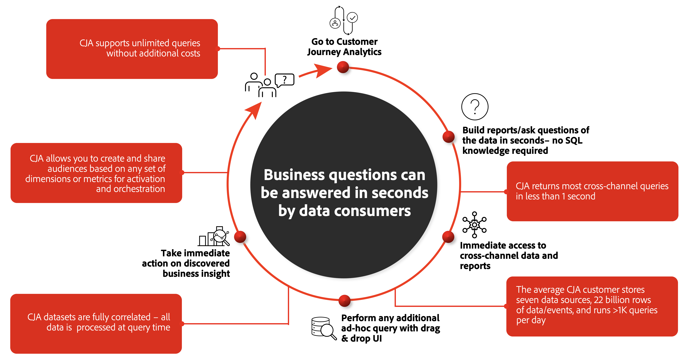

# Customer Journey Analytics vs. BI

With the current focus on customer experience, brands do require advanced solutions to better understand the holistic customer journey and analyze and gain valuable insights into how online and offline channels engage the customer and lead to increasing customer conversion, retention, and loyalty.

A customer journey in this context can range from the straightforward online order of a meal at a sushi food chain to the purchase of a new car, combinining online research with visits to the dealer showroom, and a final in-person purchase.

Many organizations have consolidated their omnichannel data into one or more data lakes for unstructured data, and/or data warehouse solutions for structured data. Business intelligence (BI) tools are used on top of these to provide the reports, visualizations, and insights the business is demanding in understanding the customer journey. Often, this combination of solutions and tools is general-purpose by nature and design, and not explicitly focusing on the customer. 

Customer Journey Analytics is  developed by Adobe with the sole purpose to empower anyone with focus on and responsible for customer experience (marketer, data analyst, data scientist) to visualize the customer journey in full context across all channels in real-time with no reporting or analysis limitations. 

This section of the documentation explains the fundamental differences between CJA and BI tools, first by looking at the general workflow used to accomplish the objective mentioned above: understanding that customer journey. Then it provides more details on how data is stored, collected and queried differently between CJA and BI tools. Finally it will explain the differences in visualization capabilities.

## Worklow

The problem with the traditional approach to analyzing customer journey is that it is not customer centric. Each team is collecting data in siloes and analyzing and optimizing experiences or journeys based on the data they have access to. 

If you want to understand how a specific digital campaign affected an offline action stored in a data silo, you issue a request into the BI team's queue. The BI team writes the required SQL to acquire and transform the data. Once the raw data is retrieved, the BI team creates the visualization. The data is shared with you and you will spend time combing through the insights and extracting data for activation in other systems. 

Each of these steps can take hours to days to weeks. If there are follow up questions, or issues, it can take yet more days before those questions are addressed and the cycle continues.
For ongoing analyzing, exploring and understanding of customer journeys, this process is inefficient and isn't built for scale. Let alone that BI teams do have to address more than only customer journey related questions.

CJA is a solution that provides an environment to connect online and offline cross-channel data at the customer level for the sole purpose of understanding the customer journey. It does require initial setup to connect and define views to the data you qualify as relevant. But once completed, that data is then readily available for ongoing analysis and exploration, resulting in progressively gaining insights into and understanding of customer journeys. By democratizing combined online and offline data, you will be able to answer customer journey related questions in seconds.

You can use CJA to ask questions using the visual analysis workspace environment and expect responses in seconds. The cross-channel data and reports are immediately available, with no SQL code required. Additional queries and analysis can be done with a simple drag & drop in the UI, with fully correlated data. You can continue to ask questions progressively exploring more and more details as you do require. You can then take immediate actions on the insights you discover, like sharing audiences out for activation and orchestration.

## Data

CJA is based on the data that is ingested in Adobe Experience Platform as datasets. You can use an Adobe Analytics dataset coming from Adobe Analytics data streaming into Adobe Experience Platform through the Analytics source connector. Or you can use a CRM dataset resulting from configuring a Microsoft Dynamics source connector to your Microsoft Dynamics instance. See Data Ingestion Overview for more information on how to ingest data into Adobe Experience Platform and use it in Customer Journey Analytics.

Technically, CJA does not directly use datasets from AEP, but replicates all data from datasets that are defined in a collection (See Collection for more information). It stores the data in a distributed reporting engine that makes extensive use of caching. That engine is fine-tuned for responsive queries on individual-level time series data, so perfectly optimized for individual customer related queries. The reporting engine stores data in column oriented, bitmap indices that permit rapid on-the-fly calculation of aggregate metrics. It has an extensive filtering engine that permits powerful segmentation/audience analysis. And it has a core understanding of the sequence among data points that is particularly useful in analyzing behavior across those data points (the order that things occurred) and for assigning attribution using various, complex models.

The reporting engine works on partially-ordered, hierarchical datasets (e.g. person -> sessions -> events), and all data for a particular top level object (individual profiles) resides on a single processing node for accurate results. This partitioning allows for fast application of complex pathing and filters.

One of the reporting engine biggest differences from traditional SQL and NoSQL databases is its ability to determine predicates based on sequence-oriented relationships at a fundamental level. These fundamental querying operations can powerfully look at the record stream, which is composed of many interleaved (and even nested) sequences, and perform a query against all of these intertwined streams of data with the efficiency of a single, contiguous sequence operation. 

Although the reporting engine is not as general purpose as other, more familiar big data systems, it is specifically designed to answer queries spanning millions or even billions of records (time-series data or experience events), generally in under a second. Unlike other big data systems, it doesn't do this by sampling the data or by precomputing the answers to all questions it thinks you may ask, but it is instead able to compute the answers quickly enough to support interactive querying use cases.

This specific design of CJA's reporting engine facilitates the data being readily available and at high speed for ongoing analysis and exploration, and therefor allowing to progressively gain insights and understanding of customer journeys.

