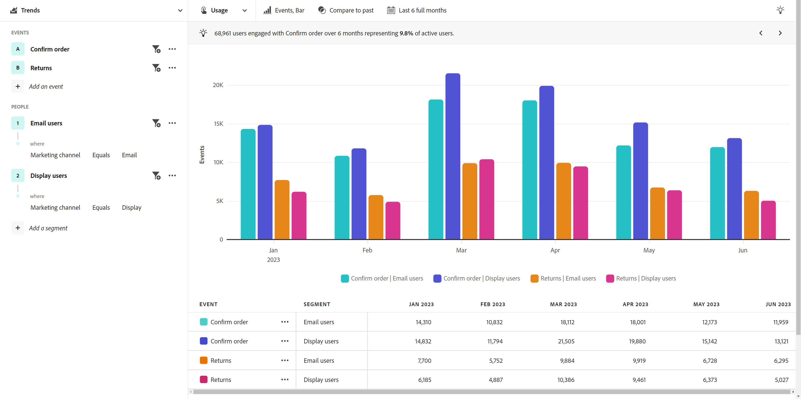
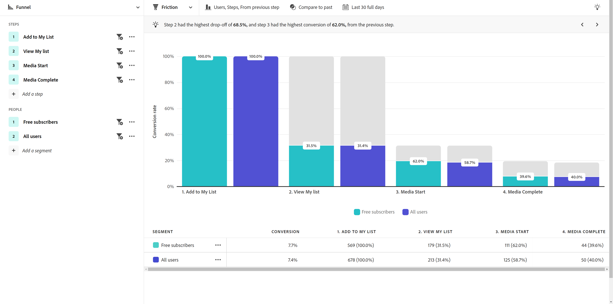
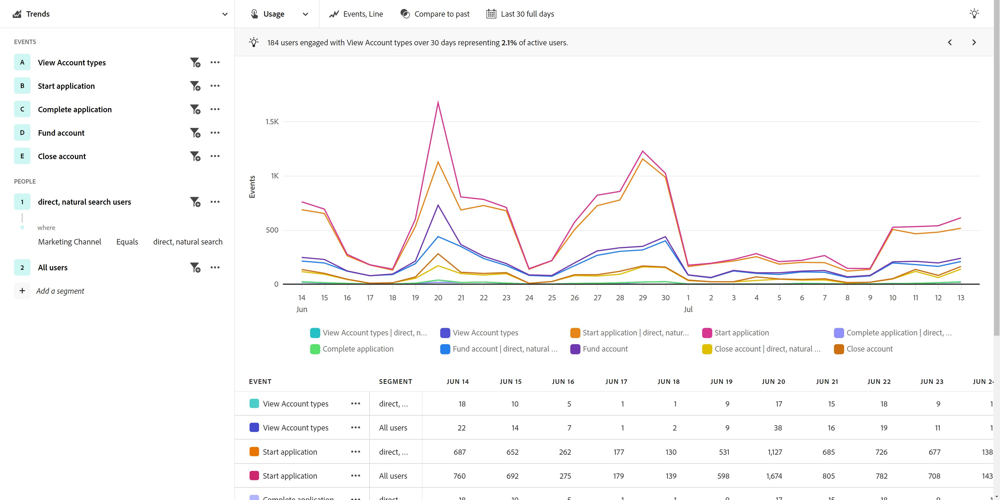
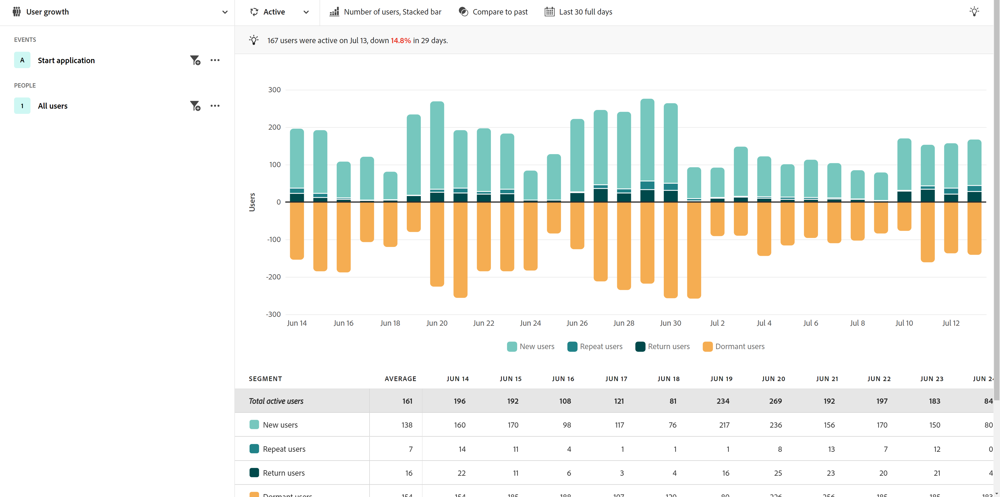
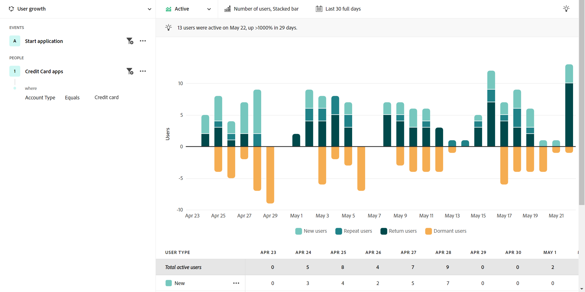
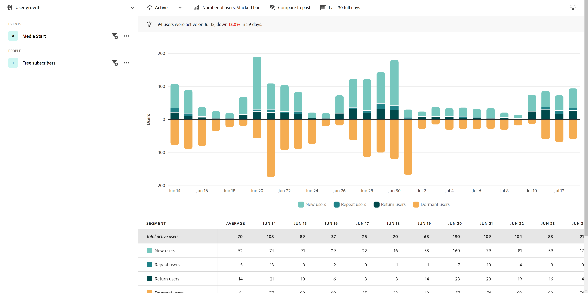
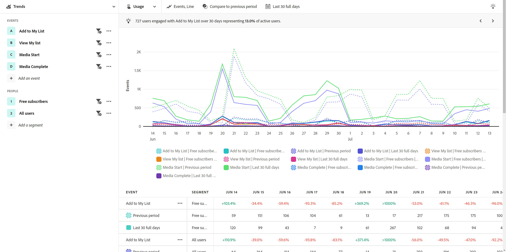
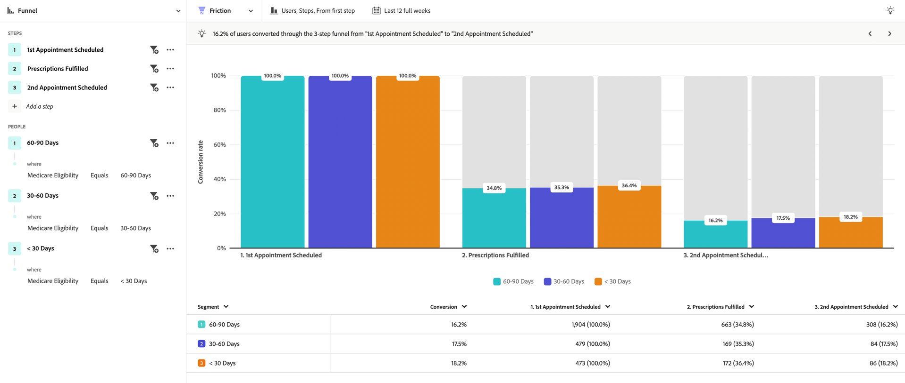

# Industry use cases

Use cases for guided analysis will vary by industry. This page provides some illustrative examples of what product teams can accomplish with guided analysis and Adobe Product Analytics capabilities. 

+++**Retail**

| Use case | Example | Impact | Analysis |
| --- | --- | --- | --- |
| **Optimize mobile shopping app** | Many customers downloaded our mobile app but never came back. We found they were using it just for the initial offer and re-engaged those dormant customers. | **Increase LTV of mobile users.** Measure and increase app usage to develop a more 'happy path' user experience. | [Active user growth view](types/active.md) 

 [Net growth view](types/net-growth.md) |
| **Quantify impact of new checkout features** | As a grocery store testing our way into online shopping, we can quickly measure the impact of new checkout features such as "Did you forget butter?" product recommendations or new methods for checkout such as Curbside Pickup. | **Increase conversion rates.** Measure business impact instead of just feature usage. | [Release impact view](types/release.md) 

 [First use view](types/first-use.md) |
| **Reduce membership churn** | We uncovered friction points in the customer journeys that cause customers to churn. This gave us the opportunity to review membership programs and analyze behaviors & signals of at-risk members. | **Reduce churn.** Identify ways to foster and nurture client relationships to prevent attrition and reduce churn. | [Active user growth view](types/active.md) 

 [Friction view](types/friction.md) |
| **Find inefficient sales journeys** | We uncovered inefficiencies in the journey of our in-store sales associates, where they were pulled away from customers. We adjusted their process, which gave customers a more enjoyable in-store shopping experience. | **Improve sales response.** Improve internal journeys to reduce inefficient processes, resulting in positive customer experiences. | [Friction view](types/friction.md) |

{style="table-layout:auto"}

+++

+++**Financial Services**

| Use case | Example | Impact | Analysis |
| --- | --- | --- | --- |
| **Quantify impact of new features** | We recently rolled out bank transfers with Zelle, and we needed to understand the impact of the new feature on finishing transfers. Now that we can see how customers are reacting, the marketing team can roll it out. | **Increase conversion rates.** Measure impact of new features on transfer conversions. | [Release impact view](types/release.md) 

 [First use view](types/first-use.md) |
| **Deflect call center calls** | Our 5-step mobile claim process was driving calls into the call center. We quickly analyzed this, created an audience and sent an email to those customers to understand their experience." | **Isolate friction in the experience.** Improve "happy path" journeys and reduce calls. | [Friction view](types/friction.md) 

 [Conversion trends view](types/conversion-trends.md) |
| **Reduce customer churn** | We know that customers that log into the banking mobile app with monthly frequency remain customers longer. When we view our app user growth, we can identify who is at risk to churn and create a win-back strategy. | **Reduce churn.** Maintain level of customers while spending to acquire actual new customers. | [Active user growth view](types/active.md) 

 [Net growth view](types/net-growth.md) |
| **Recommend new features** | Digital withdrawals have decreased over time in lieu of calling a financial advisor. We'd like to optimize the digital process, and  data trends help us prioritize the optimizations with a steering committee. | **Create a data-driven roadmap.** Leverage data to plan and implement optimizations. | [Usage trends view](types/usage.md) |

{style="table-layout:auto"}

+++

+++**Travel and Hospitality**

| Use case | Example | Impact | Analysis |
| --- | --- | --- | --- |
| **Quantify impact of new booking flow features** | We quickly analyzed the impact of a new booking step feature on conversion rates and identified the part of the experience with the biggest gains. | **Increase booking rates.** Measure business impact instead of just feature usage. | [Release impact view](types/release.md) 

 [Friction view](types/friction.md) |
| **Optimize mobile app experience** | We were able to quickly and easily understand our monthly active app users (MAUs) over time and identify positive impact by version. | **Increase MAUs.** Measure and increase app usage, which correlates with customer happiness. | [Active user growth view](types/active.md) 

 [Net growth view](types/net-growth.md) |
| **Find friction in mobile check-in flow** | Seeing where people are successful or dropping out of the expected mobile check-in process allows us to easily identify areas for experience optimization. | **Increase CSAT and reduce IROPs.** Removing friction leads to a more seamless "day of travel" experience. | [Friction view](types/friction.md) 

 [Conversion trends view](types/conversion-trends.md) |
| **Deflect call center calls** | Seeing my user experience in a funnel view showed me where our users were hitting friction, which was leading to costly call-center volume. We knew where we needed to focus next. | **Reduce call-center usage.** Get more 'happy path' user experiences and reduce costly calls. | [Friction view](types/friction.md) 

 [Conversion trends view](types/conversion-trends.md) |

{style="table-layout:auto"}

+++

+++**Media and Entertainment**

| Use case | Example | Impact | Analysis |
| --- | --- | --- | --- |
| **Identify churn risk** | We saw high turnover rate of customers who signed up for our platform to watch a seasonal event and then canceled as soon as the event was over. Quickly identifying these users let us show recommendations that entice them to stay engaged with the platform. | **Retain happy subscribers.** Find content that engages a growth segment to intervene with recommendations. | [Active user growth view](types/active.md) 

 [Net growth view](types/net-growth.md) |
| **Find opportunities for upsell** | Jey to our revenue growth is being able to understand what in-app offers are most enticing to our fans while they are at the stadium. | **Increase ancillary revenue.** Understand the impact of in-app offers on driving purchasing behaviors. | [First use view](types/first-use.md) 

 [Friction view](types/friction.md) |
| **Optimize cross-device experience** | I want to be able to analyze how my subscribers are interacting with multiple devices/apps so I can understand content consumption patterns and determine where it would be best to retarget to them. | **Personalize the experience.** Understand what content resonates best with subscribers on each device. | [Usage trends view](types/usage.md) |
| **Deflect call center calls** | I was able to identify an issue with our autopay feature not working, which led frustrated customers to call our support center to cancel their plan. | **Reduce support calls.** Create a better customer experience and decrease calls to customer service. | [Friction view](types/friction.md) 

 [Conversion trends view](types/conversion-trends.md) |

{style="table-layout:auto"}

+++

+++**Healthcare**

| Use case | Example | Impact | Analysis |
| --- | --- | --- | --- |
| **Improve patient health outcomes** | I didn't have a clear understanding of how many wellness plan members per week simply stopped using it altogether. We now have data to focus our efforts on growth. | **Reduce doctor visits.** Quickly identified dormant users for re-engagement. | [Active user growth views](types/active.md) |
| **Enhance patient experience** | Having direct visibility into how many patients were calling our call centers for simple password resets renewed my passion to be laser focused on reducing our company's overall cost to serve and strengthening our patient experience. | **Reduce the overall cost to serve.** Create a better patient experience and decrease calls to patient services. | [Usage trends view](types/usage.md) 

 [Friction view](types/friction.md) |
| **Identify repeat cross-channel actions by segment** | I need to understand how active Medicare eligible members are with their plan usage to provide specific messaging to them in our digital products. Product signals help make our marketing more effective. | **Personalize Medicare enrollment choices.** Compare common sequential actions by my most active plan members. | [Friction view](types/friction.md) 

 [Active user growth view](types/active.md) |
| **Retain top industry talent** | Our analytics resources are so strapped for time. I need to quickly get the product usage data I need for my leadership update calls. | **Reduce analyst workload.** Get answers faster. Approachable reporting for when I need it most. | [Guided analysis](overview.md) |

{style="table-layout:auto"}

+++

+++**High Tech and B2B**

| Use case | Example | Impact | Analysis |
| --- | --- | --- | --- |
| **Quantify impact of new features** | We could analyze the uptick in usage on a new product feature and determine what segments were working best. This helped us prioritize where we spend resources to maximize user engagement and strengthen our partnership with marketing. | **Data-driven prioritization.** Make informed decisions about allocating resources. | [Release impact view](types/release.md) 

 [First use view](types/first-use.md) |
| **Identify roles that are under-utilizing the product** | Our product is designed to be used by Engineers, Product Managers, and Marketing. Analysis showed that while PMs and Marketers were using it nearly daily, the Engineering staff had largely not adopted it. | **Grow product adoption.** Quickly identify user behavior in a variety of ways. | [Active user growth view](types/active.md) 

 [Net growth view](types/net-growth.md) |
| **Remove friction points in the conversion process** | User data showed that requiring a purchase order number in our purchase flow prevented users who preferred to buy with a credit card from completing their orders. By making that field optional, conversions increased. | **Improve customer experience.** Reduce potential churn. | [Friction view](types/friction.md) 

 [Conversion trends view](types/conversion-trends.md) |
| **Unlock self-serve analysis** | Trying to get access to insights is challenging and our users are not trained for analysis. They need to be able to get answers and harness the same data the entire organization is using, leading to a stronger partnerships and enabling true data-driven decisions. | **Closer partnerships across the org.** Give product managers access to previously siloed data. | [Guided analysis](overview.md) |

{style="table-layout:auto"}

+++
