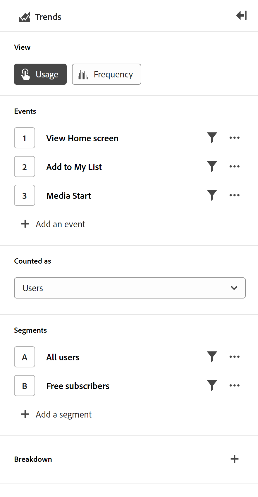

# Guided analysis overview

{{release-limited-testing}}

Guided analysis is a reporting format that allows product teams to quickly self-serve their data needs so that they can get high quality insights quickly and make more data-driven product decisions. Cross-functional teams can connect in real-time to use and understand these reports.

Similar to Analysis Workspace and Mobile scorecards, a Guided analysis report uses data from a [Data view](../data-views/data-views.md), which references data in Adobe Experience Platform through a [Connection](../connections/overview.md). All reports created in Guided analysis can seamlessly transfer to Analysis Workspace for additional research.

Guided analysis provides multiple ways to analyze and view data. View types can show the same data in different ways, leading to different insights using the same events and segments. You get different query rails and visualization settings depending on the view that you choose. You can freely switch between views, and any applicable query rail components carry over if the view supports them.

Guided analysis categorizes view types into **Analysis types**. The following analysis and view types are available:

| Analysis type | View type | Description |
| --- | --- | --- |
| Impact | [Release](types/release.md) | Compare performance across equal periods pre- and post-release. |
| Impact | [First use](types/first-use.md) | Measure the impact of first-time feature use on key indicators. |
| Funnel | [Friction](types/friction.md) | Compare conversion rates between steps. |
| Funnel | [Conversion trends](types/conversion-trends.md) | Track changes in conversion rates over time. |
| User growth | [Active](types/active.md) | Identify who is new, retained, returning, or dormant. |
| User growth | [Net growth](types/net-growth.md) | Are you gaining or losing users? |
| Trends | [Usage](types/usage.md) | Measure user engagement over time. |

{style="table-layout:auto"}

## Interface

The interface for Guided analysis, regardless of analysis type, comprises the following main UI elements:

| Interface preview | UI Element | Description |
| --- | --- | --- |
|  | Query rail | Configure the desired components (events, properties and segments) that make up an analysis. Each analysis type enforces different limits to the number of events and segments you can configure. If you switch to a new analysis type, your query selections are maintained within the allowed limits for that analysis type. |
|  | Chart | A visualization of the data returned based on your input from the query rail and settings. Which visualization you see depends on the view and settings above the chart. Available views depend on the analysis type above the query rail. The chart also includes: <ul><li>**Tooltips**: Hover over any chart data point to expose a tooltip with more information.</li><li>**Legend**: Hover over the chart legend to expose series definitions, when available.</li><li>**Click actions**: Left-click any data point to expose available next actions. Options include **Save segment**.</li></ul> |
|  | Table | A table representation of the data returned based on your input from the query rail and settings. Columns in the table depend on the view type above the chart. Available views depend on the analysis type above the query rail. The table also includes: <ul><li>**Click actions**: Click the **More menu** to expose available next actions. Options include **Save segment**.</li></ul> |
|  | Visualization settings | Several options above the chart that allow you to customize how the chart and table return data.<ul><li>**View type**: A drop-down selector that lets you present data for a given analysis type in a different way.</li><li>**Chart settings**: Fine-tune what your chart and table display. Available options depend on the view selected.</li><li>**Date range**: A calendar picker that allows you to determine the date range of the analysis. You can also select an interval for trended views, such as daily, weekly, or monthly.</li><li>**Insights**: Contextual insights depending on the analysis you view. You can tab to additional insights using the arrows or show or hide these insights using the light bulb icon in the top right.</li></ul> |
|  | Mmenu | Commands in the top-right of Guided analysis that provide overarching actions for your analysis.<ul><li>**Data view selector**: Change the data view that the analysis uses. When you change the data view, available components in the query rail also change.</li><li>**Save**: Saves the analysis. If you're saving a new analysis, a modal window appears that requests a name and description.</li><li>**Save as**: Saves the analysis separately from the current analysis, creating a copy. A modal window appears that requests a new name and description.</li><li>**Open in Workspace**: Recreates the current Guided analysis in Analysis Workspace. The Workspace project is created in a new tab, preventing interruption while working within Guided analysis. It is a copy of the analysis, and does not remain in sync with the original guided analysis once opened. Use this command when you want to handoff to your analyst team, or dive deeper into the data than what Guided analysis allows for.</li><li>**Copy to clipboard**: Copies the chart graphic to your clipboard, to be pasted in other applications. The query rail and table are not included in the graphic.</li><li>**Download PNG**: Downloads the chart graphic as a `.png`. The query rail and table are not included in the graphic.</li><li>**Download CSV**: Downloads the table data as a `.csv`. The query rail and chart are not included in the file.</li></ul> |

{style="table-layout:auto"}

## Provisioning

Guided analysis is part of Adobe Product Analytics, which is a paid add-on to Customer Journey Analytics. If your organization would like to start using this set of capabilities, contact your Adobe Account Team.

Once your organization is provisioned to use Guided analysis, product profile administrators can add or remove access to it in the Adobe Admin Console.

1. Log in to the [Adobe admin console](https://adminconsole.adobe.com).
1. Select **[!UICONTROL Customer Journey Analytics]** in the list of products.
1. Select the desired product profile to edit permissions.
1. Click the **[!UICONTROL Permissions]** tab, then click **[!UICONTROL Edit]** under [!UICONTROL Reporting Tools].
1. Click the plus icon next to **[!UICONTROL Guided Analysis Access]** in list of [!UICONTROL Available Permission Items] to add it to the list of [!UICONTROL Included Permission Items].
1. Click **[!UICONTROL Save]**.

>[!TIP]
>
>Some admins prefer to enable Guided analysis and disable Analysis Workspace for new users to Customer Journey Analytics. Once those users mature with the product and your organizational data, you can then enable access to Analysis Workspace.  
