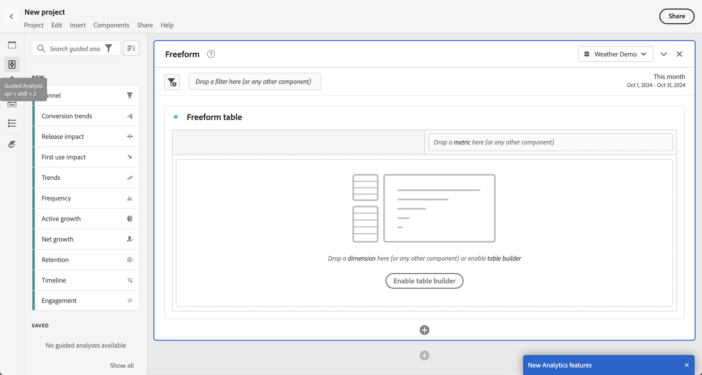

# Guided analysis overview

Guided analysis enables users, from marketing to product to analysts, to self-serve high quality data and insights about the customer journey through guided workflows, built on the cross-channel data of Customer Journey Analytics. Similar to Analysis Workspace and Mobile scorecards, guided analysis uses data from a [Data view](/help/data-views/data-views.md), which references data in Adobe Experience Platform through a [Connection](../connections/overview.md). Many reports created in guided analysis can seamlessly transfer to Analysis Workspace for additional research.

The following guided analyses are available:

| Icon |Analysis | Description |
| :----:|--- | --- |
|  |[Active growth](types/active-growth.md) | Identify who is new, retained, returning, or dormant. |
|  |[Conversion trends](types/conversion-trends.md) | Track changes in conversion rates over time. |
|  |[Engagement](types/engagement.md) | Understand the breadth and depth of feature engagement. |
|  |[First use impact](types/first-use-impact.md) | Measure the impact of first-time feature use on key indicators. |
| | [Frequency](types/frequency.md) | Measure engagement by frequency of use. |
|  |[Funnel](types/funnel.md) | Compare conversion rates between steps. |
|  | [Net growth](types/net-growth.md) | Are you gaining or losing users? |
|  | [Release impact](types/release-impact.md) | Compare performance across equal periods pre- and post-release. |
|  |[Retention](types/retention.md) | Measure your users' ongoing return habits. |
|  | [Timeline](types/timeline.md) | Explore patterns in session activity. |
|  |[Trends](types/trends.md) | Measure user engagement over time. |

## Access

You can access Guided Analysis from the Customer Journey Analytics homepage. 

1. Select **[!UICONTROL Guided analysis]** from the homepage, which takes you directly to the [Usage trends view](types/trends.md). 

   {style="border:1px solid gray"}

1. Select **[!UICONTROL Create new]** to see the different view options and choose a different starting point for your analysis. 

   {style="border:1px solid gray"}

You can also access Guided Analysis from within an Analysis Workspace project.

1. Select **[!UICONTROL Blank project]** from the homepage to create an empty Workspace project.
   
   {style="border:1px solid gray"}

1. Select  **[!UICONTROL Guided Analysis]** in the left rail.
   
   {style="border:1px solid gray"}

1. Drag any new analysis onto the Workspace canvas, then select **[!UICONTROL Create]**  to generate the desired analysis (for example: **[!UICONTROL Create Trends]**). You can also drag an existing analysis onto the Workspace canvas from under the **[!UICONTROL Saved]** section.

   

## Interface

The interface for guided analysis follows a question and answer format. Form your question in the query rail, then get an answer with a written insight, chart, and table. You can then ask the next question with view types and visualization settings.

Guided analysis uses the following UI elements:

| Interface preview | UI Element | Description |
| --- | --- | --- |
| {style="border:1px solid gray"} | Query rail | Configure your "question" be selecting the desired components (events, properties, and segments) that make up an analysis. The following options are available across all view types, with additional settings available on a per view basis. <ul><li>**Analysis selector**: A drop-down that lets you switch to a new analysis type. Your query selections are maintained within the allowed limits for the new analysis type.</li><li>**Events**: The events that you want to measure. Each view type enforces different limits to the number of events that you can configure.</li><li>**Filters**: Use the  icon in the Events or Segments section to narrow down by specific dimensions. When a dimension is selected, both standard filter criteria (such as [!UICONTROL Equals], [!UICONTROL Contains], or [!UICONTROL Ends with]) and the top 1000 dimension values are available.</li><li>**Counted as**: The counting method that you want to apply to the selected events.</li><li>**Segments**: The segments that you want to measure. Each view type enforces different limits to the number of segments that you can configure.</li></ul> |
| {style="border:1px solid gray"} | Chart | A visualization of the data returned based on your input from the query rail and settings. Which visualization you see depends on the view and settings above the chart. The chart also includes: <ul><li>**Tooltips**: Hover over any chart data point to expose a tooltip with more information.</li><li>**Legend**: Hover over the chart legend series to view definitions where available, focus on that series, and temporarily hide other series. Hide a series in the legend by clicking it.</li><li>**Annotations**: Applicable [annotations](../components/annotations/overview.md) are visible between the visualization and the legend. It is shown as a  icon in the annotation's configured color. View types that show data over time place the  icon under the configured date or date range. View types that do not show data over time show the  icon in the lower right corner of the chart.</li><li>**Select actions**: Expose available next actions by selecting any data point. Options include **Save segment**.</li></ul> |
| {style="border:1px solid gray"} | Table | A table representation of the data returned based on your input from the query rail and settings. Columns in the table depend on the view type above the chart. The table also includes: <ul><li>**Select actions**: Hide or expose a chart series by toggling the  icon in each row. Additional actions are available by selecting the **[!UICONTROL More]** menu. Options include **Save segment**.</li></ul> |
| {style="border:1px solid gray"} | Visualization settings | Options above the chart that allow you to ask the next question and customize how the chart and table return data. The following options are available across all view types, with additional settings available on a per view basis. <ul><li>**Chart settings**: Fine-tune what your chart and table display. Available options depend on the view selected.</li><li>**Date range**: A calendar picker that allows you to determine the date range of the analysis. You can also select an interval for trended views, such as daily, weekly, or monthly.</li><li>**Insights**: Contextual insights depending on the analysis that you view. These insights provide observations for the current analysis. If multiple insights are available, you can view them using the arrows on the right. You can toggle the visibility of this box by using the light bulb icon in the top right.</li></ul> |
| {style="border:1px solid gray"} | Menu | Commands in the top-right of guided analysis that provide overarching actions for your analysis.<ul><li>**Data view selector**: Change the data view that the analysis uses. When you change the data view, available components in the query rail also change.</li><li>**Copy link**: Copies a link to the analysis to your clipboard. You are prompted to save before sharing.</li><li>**Share**: Opens the sharing modal, with further options for sharing to individual users or groups. You can share an analysis with other users, or generate a link to share with anyone.</li><li>**Save**: Saves the analysis. If you're saving a new analysis, a modal window appears that requests a name and description.</li><li>**Save as**: Saves the analysis separately from the current analysis, creating a copy. A modal window appears that requests a new name and description.</li><li>**Export to Workspace**: Recreates the current guided analysis query in Analysis Workspace. The Workspace project is created in a new tab, preventing interruption while working within guided analysis. It is a copy of the analysis, and does not remain in sync with the original guided analysis once opened. Use this command when you want to handoff to your analyst team, or dive deeper into the data than what guided analysis allows for.</li><li>**Copy to clipboard**: Copies the chart graphic to your clipboard, to be pasted in other applications. The query rail and table are not included in the graphic.</li><li>**Download PNG**: Downloads the chart graphic as a `.png`. The query rail and table are not included in the graphic.</li><li>**Download CSV**: Downloads the table data as a `.csv`. The query rail and chart are not included in the file.</li></ul> |

{style="table-layout:auto"}

## Provisioning

Guided analyses are included in Customer Journey Analytics packages in the following way:

| Package | Available analyses |
| --- | --- |
| [!UICONTROL Customer Journey Analytics add-ons] | Active growth, Conversion trends, Frequency, Funnel, Net growth, Retention, Trends |
| [!UICONTROL Customer Journey Analytics Foundation] | Trends |
| [!UICONTROL Customer Journey Analytics Select] | Foundation views + Active growth, Conversion trends, Frequency, Funnel, Net growth, Retention |
| [!UICONTROL Customer Journey Analytics Prime] | Select views + Engagement, First use impact, Release impact, Timeline |
| [!UICONTROL Customer Journey Analytics Ultimate] | Prime views |

{style="table-layout:auto"}

Product profile administrators can add or remove access to guided analysis in the Adobe Admin Console.

1. Log in to the [Adobe Admin Console](https://adminconsole.adobe.com).
1. Select **[!UICONTROL Customer Journey Analytics]** in the list of products.
1. Select the desired product profile for the permissions that you want to edit.
1. Select the **[!UICONTROL Permissions]** tab, then click **[!UICONTROL Edit]** under [!UICONTROL Reporting Tools].
1. Select   next to **[!UICONTROL Guided Analysis Access]** in the list of [!UICONTROL Available Permission Items], which adds it to the list of [!UICONTROL Included Permission Items].
1. Select **[!UICONTROL Save]**.

See [User level access](/help/technotes/access-control.md#user-level-access) for more information.

>[!TIP]
>
>Some admins prefer to enable guided analysis and disable Analysis Workspace for new users to Customer Journey Analytics. Once those users mature with the product and your organizational data, you can then enable access to Analysis Workspace.
