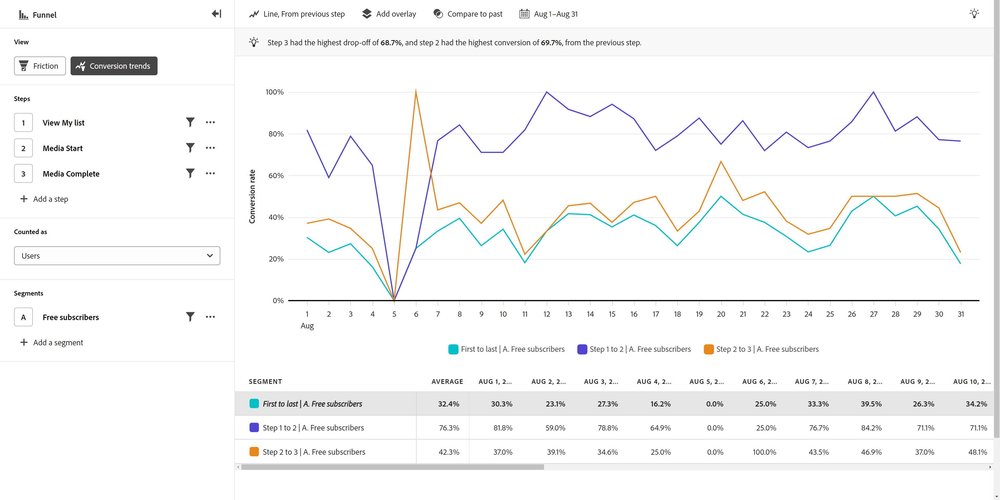

# Conversion trends view

{{release-limited-testing}}

The **Conversion trends** view provides a trended visualization around conversion rates over time. The horizontal axis is a time interval, while the vertical axis represents conversion rate.

## Use cases

Use cases for this view type include:

* **Track optimization efforts**: After identifying key bottlenecks that you want to improve using [Friction](friction.md), you can use this view to track how those optimizations impact conversion rate over time.
* **A/B testing evaluation**: Evaluate the effectiveness of A/B tests or experiments conducted within the context of a funnel. By comparing conversion rates between different variations, you can easily determine which tests provide higher conversion rates, leading to data-driven decisions around which variations to implement permanently.
* **Campaign evaluation over time**: Measure the effectiveness of marketing campaigns over time. You can create a segment that focuses on users that touched a given campaign, and compare their conversion rates with other campaigns. You can also compare current conversion rates with similar campaigns that were run in the past.

## Query rail

The query rail allows you to configure the following components:

* **Steps**: The event touchpoints that you want to track. Each bar in the chart represents a step. You can include up to ten steps.
* **People**: The segments that you want compare the funnel across. Each segment selected splits each step into multiple bars. Each color represents a different segment. You can include up to three segments.

## Chart settings

The Conversion trends view offers the following chart settings, which can be adjusted in the menu above the chart:

* **Metric**: The metric that you want to measure. Options include Sessions and Users.
* **Chart type**: The type of visualization that you want to use. Options include Line.
* **Conversion from**: Determines the percentage calculation from step to step. Options include calculating conversion from the First step or Previous step.

## Apply time comparison

{{apply-time-comparison}}

## Date range

The desired date range for your analysis. There are two components to this setting:

* **Interval**: The date granularity that you want to view trended data by. Valid options include Hourly, Daily, Weekly, Monthly, and Quarterly. The same date range can have different intervals which affect the number of data points in the chart and the number of columns in the table. For example, viewing an analysis spanning three days with daily granularity would show only three data points, while an analysis spanning three days with hourly granularity would show 72 data points.
* **Date**: The starting and ending date. Rolling date range presets and previously saved custom ranges are available for your convenience, or you can use the calendar selector to choose a fixed date range.
