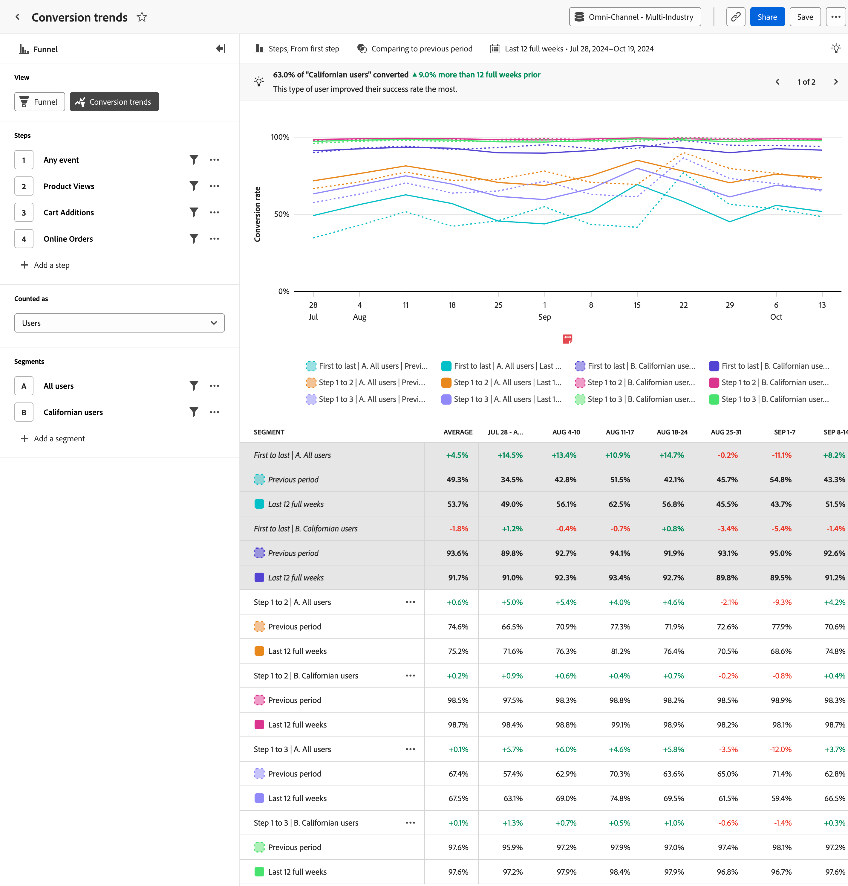

# [!UICONTROL Conversion trends] analysis {#conversion-trends}

<!-- markdownlint-disable MD034 -->

>[!CONTEXTUALHELP]
>id="workspace_guidedanalysis_conversiontrends_button"
>title="Conversion trends"
>abstract="Track changes in conversion rates over time."

<!-- markdownlint-enable MD034 -->

The  **[!UICONTROL Conversion trends]** analysis provides a trended visualization of conversion rates over time. The horizontal axis is a time interval, while the vertical axis represents the conversion rate.

>[!VIDEO](https://video.tv.adobe.com/v/3421662/?quality=12&learn=on)

## Use cases

Use cases for this analysis include:

* **Track optimization efforts**: After identifying key bottlenecks that you want to improve using the [Funnel](funnel.md) analysis, you can use this analysis to track how those optimizations impact conversion rate over time.
* **A/B testing evaluation**: Evaluate the effectiveness of A/B tests or experiments conducted within the context of a funnel. By comparing conversion rates between different variations, you can easily determine which tests provide higher conversion rates, leading to data-driven decisions around which variations to implement permanently.
* **Campaign evaluation over time**: Measure the effectiveness of marketing campaigns over time. You can create a segment that focuses on users that touched a given campaign, and compare their conversion rates with other campaigns. You can also compare current conversion rates with similar campaigns that were run in the past.

## Interface

See [Interface](../overview.md#interface) for an overview of the Guided analysis interface. The following settings are specific to this analysis:

### Query rail

The query rail allows you to configure the following components:

* **[!UICONTROL View]**: Switch between this analysis and [Funnel](funnel.md).
* **[!UICONTROL Steps]**: The event touchpoints that you want to track. Each bar in the chart represents a step. You can include up to ten steps.
* **[!UICONTROL Counted as]**: The counting method that you want to apply to the selected events. Options include [!UICONTROL Users] and [!UICONTROL Sessions].
* **[!UICONTROL Segments]**: The segments that you want to compare the funnel across. Each segment selected splits each step into multiple bars. Each color represents a different segment. You can include up to three segments.

### Chart settings

The [!UICONTROL Conversion trends] analysis offers the following chart settings, which can be adjusted in the menu above the chart:

* **[!UICONTROL Chart type]**: The type of visualization that you want to use. Options include [!UICONTROL Line].
* **[!UICONTROL Conversion from]**: Determines the percentage calculation from step to step. Options include calculating conversion from the [!UICONTROL First step] or [!UICONTROL Previous step].

>[!NOTE]
>
>The **Average** column in the Conversion trends analysis table differs from the **Total** column in the [Funnel analysis](funnel.md) table. The former is an average of the interval columns (for example, average of daily conversion rates), while the latter is an aggregated calculation across the full date range.

### Time comparison

{{apply-time-comparison}}

### Date range

The desired date range for your analysis. There are two components to this setting:

* **[!UICONTROL Interval]**: The date granularity that you want to view trended data by. Valid options include Hourly, Daily, Weekly, Monthly, and Quarterly. The same date range can have different intervals, which affect the number of data points in the chart and the number of columns in the table. For example, viewing an analysis spanning three days with daily granularity would show only three data points, while an analysis spanning three days with hourly granularity would show 72 data points.
* **[!UICONTROL Date]**: The starting and ending date. Rolling date range presets and previously saved custom ranges are available for your convenience, or you can use the calendar selector to choose a fixed date range.

<!--
## Example

See below for an example of the analysis.

-->
