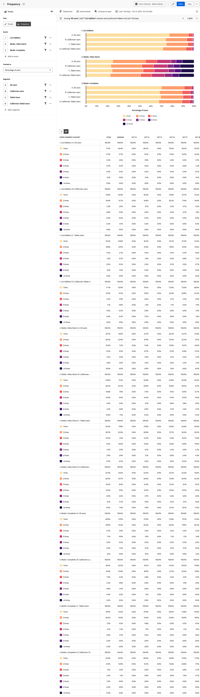

# [!UICONTROL Frequency] analysis {#frequency}

<!-- markdownlint-disable MD034 -->

>[!CONTEXTUALHELP]
>id="workspace_guidedanalysis_frequency_button"
>title="Frequency"
>abstract="View distribution of repeat user activity for specific events."

<!-- markdownlint-enable MD034 -->

The  **[!UICONTROL Frequency]** analysis groups event data by how often events occur in your product. The vertical axis of this analysis contains buckets that represent the frequency of the event. The horizontal axis measures the number of users or sessions for each bucket.

>[!VIDEO](https://experienceleague.adobe.com/en/docs/customer-journey-analytics-learn/tutorials/guided-analysis/frequency)

## Use cases

Use cases for this analysis include:

* **Engagement**: Track how engaged users are with any event in your product. You can click any part of the bar chart to save it as a segment. Segments for low engagement buckets can help you determine why users are not interacting with the event at the desired frequency. Segments for high engagement buckets can help you understand why users interact with the event often. From there, you can encourage other users to adopt similar behavior.
* **Customer loyalty**: Set the event to Orders and the metric to Users. This analysis allows you to group users by how many times that they have made a purchase on your site within the specified date range.
* **Support optimization**: View the number of support calls or open cases by user to gain insight into which users encounter the most issues. You can then create a segment to focus on their experience to help identify and resolve their issues.
* **Subscription services**: Users with low engagement are more likely to churn. Understanding the behavior of highly engaged users can help encourage similar behavior for low-engaged users, making them less likely to cancel their subscription.

## Interface

See [Interface](../overview.md#interface) for an overview of the Guided analysis interface. The following settings are specific to this analysis:

### Query rail

The query rail allows you to configure the following components:

* **[!UICONTROL View]**: Switch between this analysis and [Trends](trends.md).
* **[!UICONTROL Events]**: The events that you want to measure. Each selected event is represented as a separate graph. A row that represents the trended event is added to the table. You can include up to five events.
* **[!UICONTROL Counted as]**: The counting method that you want to apply to the selected events. Options include [!UICONTROL Users], [!UICONTROL Sessions], [!UICONTROL Percentage of users] and [!UICONTROL Percentage of sessions]. The denominator for percentage-based metrics in this analysis is users or sessions who did the selected events, not all active users of the product.
* **[!UICONTROL Segments]**: The segments that you want to measure. Each selected segment doubles the number of bars in the chart and rows in the table. You can include up to five segments.

### Chart settings

The [!UICONTROL Frequency] analysis offers the following chart settings, which can be adjusted in the menu above the chart:

* **[!UICONTROL Chart type]**: The type of visualization that you want to use. Options include [!UICONTROL Horizontal bar] and [!UICONTROL Stacked bar].

### Bucket settings

Determines how the event is categorized into groups (buckets). In the trended table view, users are bucketed based on frequency of use in total and in each interval, meaning 1 user can count toward different buckets in different intervals.

* **[!UICONTROL Auto buckets]**: Automatically identify the optimal bucket size based on the data distribution.
* **[!UICONTROL Customized buckets]**: Customize how the data is grouped into buckets.
  * [!UICONTROL From]: The first bucket. Frequency smaller than this value is excluded from reporting.
  * [!UICONTROL To]: Frequency larger than this value is grouped into the last bucket.
  * [!UICONTROL Size]: The bucket interval.

### Time comparison

{{apply-time-comparison}}

### Date range

The desired date range for your analysis. There are two components to this setting:

* **[!UICONTROL Interval]**: The date granularity that you want to view trended data by. The chart and table show aggregated data by default, with the option to expand the table to a trended view. In the trended view, users are bucketed based on frequency of use in total and in each interval, meaning 1 user can count toward different buckets in different intervals. 
* **[!UICONTROL Date]**: The starting and ending date. Rolling date range presets and previously saved custom ranges are available for your convenience, or you can use the calendar selector to choose a fixed date range.

<!--
## Example

See below foran example of the analysis.

-->
