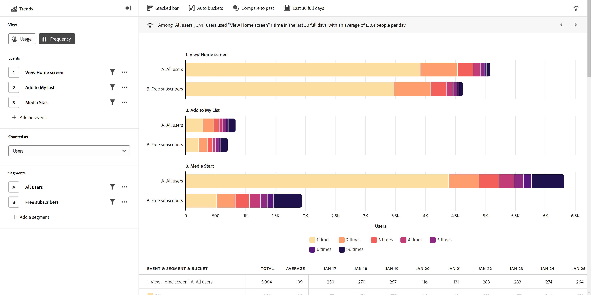

# [!UICONTROL Frequency] view

The **[!UICONTROL Frequency]** view groups event data by how often events occur in your product. The vertical axis of this view contains buckets that represent the frequency of the event. The horizontal axis measures the number of users or sessions for each bucket.

## Use cases

Use cases for this view type include:

* **Engagement**: Track how engaged users are with any event in your product. You can click any part of the bar chart to save it as a segment. Segments for low engagement buckets can help you determine why users are not interacting with the event at the desired frequency. Segments for high engagement buckets can help you understand why users interact with the event often. From there, you can encourage other users to adopt similar behavior.
* **Customer loyalty**: Set the event to Orders and the metric to Users. This view allows you to group users by how many times that they have made a purchase on your site within the specified date range.
* **Support optimization**: View the number of support calls or open cases by user to gain insight into which users encounter the most issues. You can then create a segment to focus on their experience to help identify and resolve their issues.
* **Subscription services**: Users with low engagement are more likely to churn. Understanding the behavior of highly engaged users can help encourage similar behavior for low-engaged users, making them less likely to cancel their subscription.

## Query rail

The query rail allows you to configure the following components:

* **[!UICONTROL Events]**: The events that you want to measure. Each selected event is represented as a separate graph. A row representing the trended event is added to the table. You can include up to five events.
* **[!UICONTROL People]**: The segments that you want to measure. Each selected segment doubles the number of bars in the chart and rows in the table. You can include up to five segments.

## Chart settings

The [!UICONTROL Frequency] view offers the following chart settings, which can be adjusted in the menu above the chart:

* **[!UICONTROL Metric]**: The metric that you want to measure. Options include [!UICONTROL Users],  [!UICONTROL Sessions],  [!UICONTROL Percentage of users] and  [!UICONTROL Percentage of sessions]. The denominator for percentage-based metrics in this view is users or sessions who did the selected events, not all active users of the product.
* **[!UICONTROL Chart type]**: The type of visualization that you want to use. Options include [!UICONTROL Horizontal bar] and [!UICONTROL Stacked bar].

## Bucket settings

Determines how the event is categorized into groups.

* **[!UICONTROL Auto buckets]**: Automatically identify the optimal bucket size based on the data distribution.
* **[!UICONTROL Customized buckets]**: Customize how the data is grouped into buckets.
  * [!UICONTROL From]: The first bucket. Frequency smaller than this value is excluded from reporting.
  * [!UICONTROL To]: Frequency larger than this value is grouped into the last bucket.
  * [!UICONTROL Size]: The bucket interval.

## Apply time comparison

{{apply-time-comparison}}

## Date range

The desired date range for your analysis. There are two components to this setting:

* **[!UICONTROL Interval]**: The date granularity that you want to view trend data by. This setting does not impact non-trended views such as Frequency.
* **[!UICONTROL Date]**: The starting and ending date. Rolling date range presets and previously saved custom ranges are available for your convenience, or you can use the calendar selector to choose a fixed date range.
