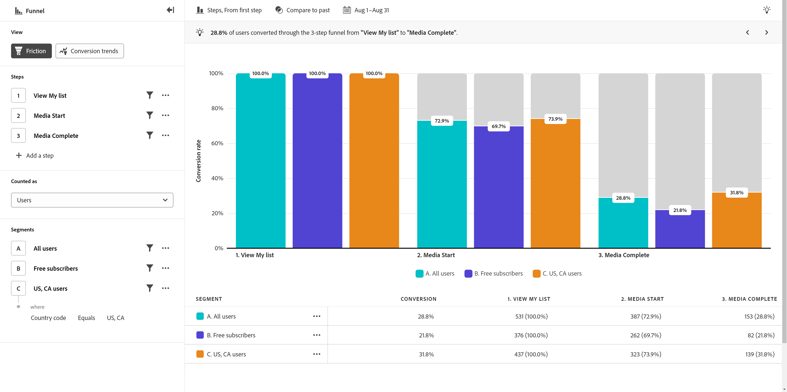

# Friction view

The **Friction** view provides a visual representation of a critical user journey in your product. The horizontal axis represents each step that a user must pass through. The vertical axis represents the percentage of users or sessions at each step. All steps must be done in eventual order, but can happen at any time within the reporting window.

## See Friction view in action

>[!VIDEO](https://video.tv.adobe.com/v/3421663/?learn=on)

## Use cases

Use cases for this view type include:

* **Conversion analysis**: You can analyze conversions at each stage of the funnel. By tracking the number of users who progress from one step to the next, you can identify bottlenecks that have unusual or undesired conversion rates. This information is valuable to understand where you can improve your product for immediate results.
* **Onboarding optimization**: Optimize your product's onboarding process by examining user behavior around key events. You can identify which steps that users struggle with or fail to complete.
* **Feature adoption and engagement**: Understand how users interact with specific features in your product. By analyzing the progression of users through feature-related steps, you can assess feature adoption rates and identify areas where users might abandon or underuse certain features. You can then use this information to focus on feature improvements to increase adoption rates.
* **Campaign evaluation**: Measure the effectiveness of marketing campaigns. You can create a segment that focuses on users that touched a given campaign, and compare their conversion process with other campaigns or within your product overall.

## Query rail

The query rail allows you to configure the following components:

* **[!UICONTROL Steps]**: The event touchpoints that you want to track. Each bar in the chart represents a step. You can include up to ten steps.
* **[!UICONTROL People]**: The segments that you want compare the funnel across. Each segment selected splits each step into multiple bars. Each color represents a different segment. You can include up to three segments.

## Chart settings

The Friction view offers the following chart settings, which can be adjusted in the menu above the chart:

* **[!UICONTROL Metric]**: The scope that you want applied to the funnel. Options include Sessions and Users. By selecting sessions, all steps must happen within the same session to be counted. By selecting users, all steps must happen within the reporting window selected to be counted.
* **[!UICONTROL Chart type]**: The type of visualization that you want to use. Options include Steps.
* **[!UICONTROL Conversion from]**: Determines the percentage calculation from step to step. Options include calculating conversion from the First step or Previous step.

## Apply time comparison

{{apply-time-comparison}}

## Date range

The desired date range for your analysis. There are two components to this setting:

* **[!UICONTROL Interval]**: The date granularity that you want to view trended data by. This setting does not impact non-trended views such as Friction. 
* **[!UICONTROL Date]**: The starting and ending date. Rolling date range presets and previously saved custom ranges are available for your convenience, or you can use the calendar selector to choose a fixed date range.
