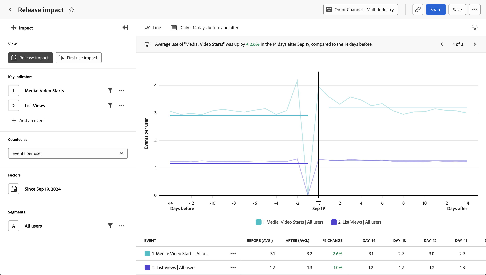

# [!UICONTROL Release impact] analysis {#release-impact}

<!-- markdownlint-disable MD034 -->

>[!CONTEXTUALHELP]
>id="workspace_guidedanalysis_releaseimpact_button"
>title="Release impact"
>abstract="Compare performance across equal periods pre- and post-release."

<!-- markdownlint-enable MD034 -->

The  **[!UICONTROL Release impact]** analysis shows a comparison of how key indicators performed before and after a given date. The horizontal axis of this report is a time interval, while the vertical axis measures the desired key indicators. A vertical bar in the middle of the chart represents the date that you want to compare before and after. This date typically represents a notable change to the product that you want to measure against, such as an update to the product or a campaign launch.

>[!VIDEO](https://experienceleague.adobe.com/en/docs/customer-journey-analytics-learn/tutorials/guided-analysis/release-impact)

## Use cases

Use cases for this analysis include:

* **Overall performance evaluation:** Comparing overall key indicators, such as engagement measures, can help you determine if a given release was overall successful.
* **Monitoring**: Track vital metrics that you would expect to remain flat when changes are made, such as load time or number of logins. Use this analysis to compare them before and after a release to ensure that it didn't have any unintended consequences.
* **Feature adoption**: If a product update is focused on improving a certain feature, you can use this analysis to directly compare that feature's usage before and after the product update.
* **Bug detection**: Tracking the number of errors before and after a release can provide an early indicator of customer issues. If you notice an increase of errors immediately following a release, you can work with engineering or development teams to identify and correct the issue, preventing further impact to customers.

## Interface

See [Interface](../overview.md#interface) for an overview of the Guided analysis interface. The following settings are specific to this analysis:

### Query rail

The query rail allows you to configure the following components:

* **[!UICONTROL View]**: Switch between this analysis and [First use impact](first-use-impact.md).
* **[!UICONTROL Key indicators]**: The events that you want to measure per user. Each selected key indicator is represented as a colored line. A row representing the event is added to the table. You can include up to three events.
* **[!UICONTROL Counted as]**: The counting method that you want to apply to the selected events. Options include [!UICONTROL Events per user], [!UICONTROL Percentage of users], [!UICONTROL Events], [!UICONTROL Sessions], and [!UICONTROL Users].
* **[!UICONTROL Factors]**: The date that you want to compare before and after.
* **[!UICONTROL Segments]**: The segment that you want to measure. The selected segment filters your data to focus only on the individuals who match your segment criteria.

### Chart settings

The [!UICONTROL Release impact] analysis offers the following chart settings, which can be adjusted in the menu above the chart:

* **[!UICONTROL Chart type]**: The type of visualization that you want to use. Options include [!UICONTROL Line] and [!UICONTROL Bar].

### Date range

Date selection in Impact analysis operates differently than other analyses, since the report revolves around the date specified in the query rail. The following options are available:

* **[!UICONTROL Interval]**: The date granularity that you want to view trended data by. Valid options include [!UICONTROL Daily], [!UICONTROL Weekly], [!UICONTROL Monthly], and [!UICONTROL Quarterly]. Changing the interval affects the options available for the Before and after period.
* **[!UICONTROL Before and after period]**: The amount of time to analyze before and after the date specified in the query rail. Available options depend on the [!UICONTROL Interval] selection.

<!--
## Example

See below for an example of the analysis.

-->
