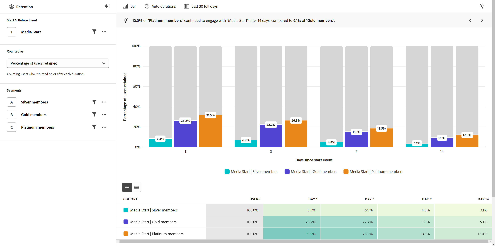

# Retention rates

{{release-limited-testing}}

The **[!UICONTROL Retention rates]** view shows the percentage of users that return after their initial engagement within the desired date range. The horizontal axis represents the number of days since a user's initial engagement. The vertical axis represents the percentage of users who engage again.

This analysis counts users based on two important events:

* Start event: The first time a user engaged with the event within the date range
* Return event: The most recent time a user engaged with the event within the analyzed date range

The "Day 0" duration bucket represents the initial time that a user engaged with the event, and always equals exactly 100%. This bucket is the denominator used to calculate the percentage of users retained.

Subsequent duration buckets count the number of users who returned on or after that duration. This count is the numerator used to calculate the percentage of users retained.

* If a user engages with the event only once during the desired date range (the initial engagement), they only appear in the "Day 0" duration bucket.
* If a user engages with the event multiple days after initially qualifying for inclusion in the analysis, they appear in the latest qualifying duration bucket and all duration buckets leading up to it. This type of calculation is sometimes referred to as "unbounded retention".
* If a user engages with the event many times during the configured date range, only the first and last events are included in the analysis.

## Use cases

Use cases for this view type include:

* **Cohort analysis**: Group users into cohorts based on actions that they take, such as sign-ups or purchases. You can compare how well these groups retain and determine how to approach improving each group's user experience.
* **Subscription service analysis**: If your product employs a subscription or another type of recurring revenue model, you can see the percentage of users that are making the most of your product. You can identify certain qualities and behaviors that these users exhibit to better understand your product market fit.
* **User engagement**: Evaluate how certain types of users engage with your product, and compare side by side how often they return. A given segment with lower retention than others can provide you with insight around improving potential subpar experiences that they might have.

## Query rail

The query rail allows you to configure the following components:

* **[!UICONTROL Start & return event]**: The event criteria that a user must engage with to qualify for inclusion in your analysis. One event is supported, but you can include property filters.
* **[!UICONTROL People]**: The segments that you want to measure. Each selected segment adds a row to the cohort table. You can include up to three segments.

## Chart settings

The [!UICONTROL Retention rates] view offers the following chart settings, which can be adjusted in the menu above the chart:

* **[!UICONTROL Metric]**: How you want to measure users retained. Options include [!UICONTROL Users retained] and [!UICONTROL Percentage of users retained].
* **[!UICONTROL Chart type]**: The type of visualization that you want to use. Options include [!UICONTROL Bar] and [!UICONTROL Line].

## Duration settings

Allows you to control how the analysis displays users by the number of days elapsed.

* **[!UICONTROL Auto durations]**: Automatically set durations based on the date range length and how close to the current day that the date range is. Duration buckets are curated for the most common use cases.
* **[!UICONTROL Custom durations]**: Manually set the desired elapsed intervals. You can set four durations.

Available duration buckets depend on the date range that you set.

## Date range

The desired date range for your analysis. There are two components to this setting:

* **[!UICONTROL Interval]**: The date granularity by which you want to view retention data. Valid options include Daily, Weekly, Monthly, and Quarterly. The same date range can have different intervals, which affect automatically set duration buckets.
* **[!UICONTROL Date]**: The starting and ending date. Rolling date range presets and previously saved custom ranges are available for your convenience, or you can use the calendar selector to choose a fixed date range.

If you select a date range close to the present day, users that initially engage too close to the current day are not included. This analysis always gives all users the chance to be included in all duration buckets. A message below the calendar picker provides information around the date range where users engage, and the interval that is reserved only for returning users:

* **Analyzing users who did the start event in [Date interval]**: If a user engages with the event within this date range, they are included in the analysis. This date range guarantees all users enough time to qualify for all duration buckets. This date range can be different than your selection if it is close to the present day.
* **Data from [Date interval] is reserved to complete the analysis**: If a user engages for the first time within this period, they are **not** included in the analysis. For recent date ranges, these users would not have an opportunity to qualify for all duration buckets. For past date ranges, these users were active outside of the selected date range.

## Cohort table

The table below the chart provides an aggregate view (similar to chart data), and a full cohort table. The full cohort table provides details around each individual date interval and when users engaged.
