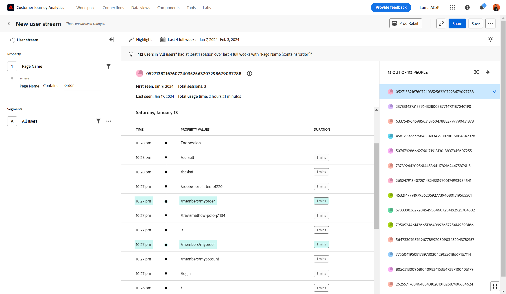

# [!UICONTROL Timeline] view

The **[!UICONTROL Timeline]** view allows you to observe user-level session events over time to find experience patterns and tell better user stories. The left rail allows you to filter the stream by property values and segments. The right rail allows you to select from a randomized list of users that match the filter criteria. The center area shows the stream for the selected user by session, consisting of timestamp, property values, and duration. Duration is not available for the last event in a given session.

>[!NOTE]
>
>The Timeline view requires that the **[!UICONTROL Person ID]** standard component be available in the [data view](/help/data-views/component-reference.md#optional). The inclusion of Person ID in a data view is managed by your Customer Journey Analytics administrator, giving your organization full privacy control over who can access this data. 

If a data view does not have the [!UICONTROL Person ID] component added, the following message is displayed:

* **Admins**: *The PersonID property is required for this analysis. Please add Person ID to the data view.*
* **Non-admins**: *The PersonID property is required for this analysis. Please work with your Customer Journey Analytics administrator to add Person ID to the data view.*

## Use cases

Use cases for this view type include:

* **Friction exploration**: If you find a steep drop in the [Friction](friction.md) view, you can create a segment of those users and apply the segment in this view to investigate potential causes.
* **Error behavior**: If users encounter a product error, you can explore what users were doing before or after seeing that error.
* **Data collection validation**: Data admins can filter this view to their own Person ID to validate that their organization's implementation is working as expected.

## Query rail

The query rail allows you to configure the following components:

* **[!UICONTROL Property]**: The property that you want to view streamed values for. The stream in the center shows values for the selected property. You can also apply filters to narrow down the stream to more relevant data. Valid operators for the filter include [!UICONTROL Equals], [!UICONTROL Does not equal], [!UICONTROL Starts with], [!UICONTROL Ends with], [!UICONTROL Contains], [!UICONTROL Does not contain], [!UICONTROL Exists], and [!UICONTROL Does not exist].
* **[!UICONTROL Segments]**: The segment that you want to analyze. The selected segment filters your data to focus only on the individuals who match your segment criteria. If you want to narrow down the view to a specific Person ID, you can filter to that Person ID here. One segment is supported for this view. 

## Chart settings

The [!UICONTROL Timeline] view offers the following chart settings, which can be adjusted in the menu above the chart:

* **[!UICONTROL Show as]**: Shows the desired property values.
  * [!UICONTROL Show all]: Show all property values in a session.
  * [!UICONTROL Highlight]: Visually highlights property values in a session that match the query filters.
  * [!UICONTROL View only]: Only show property values in a session that match the query filters.

## Date range

The desired date range for your analysis. There are two components to this setting:

* **[!UICONTROL Interval]**: The date granularity that you want to view trend data by. This setting does not impact non-trended views such as Timeline.
* **[!UICONTROL Date]**: The starting and ending date. Rolling date range presets and previously saved custom ranges are available for your convenience, or you can use the calendar selector to choose a fixed date range.
