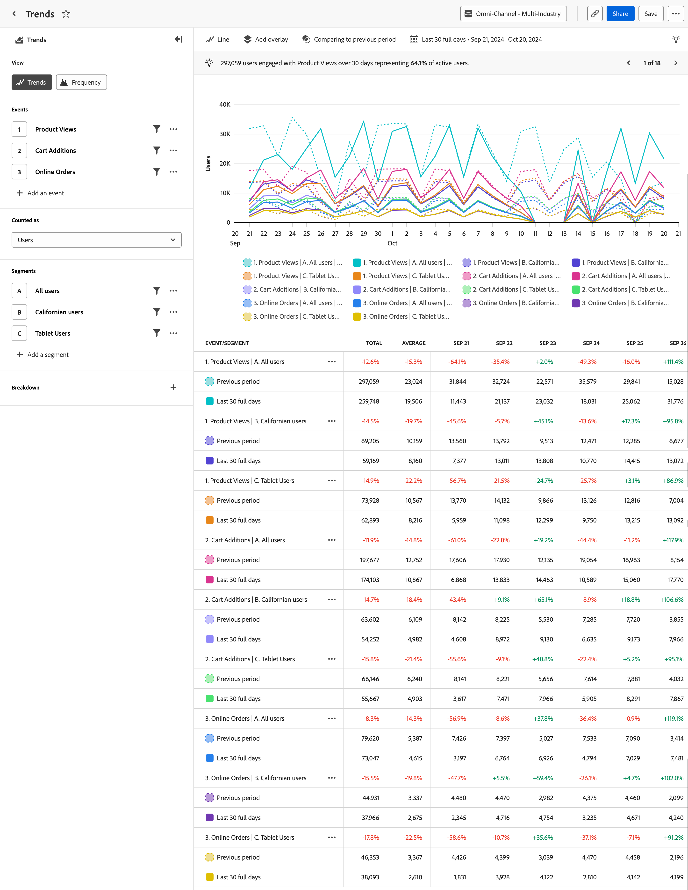

# [!UICONTROL Trends] analysis {#trends}

<!-- markdownlint-disable MD034 -->

>[!CONTEXTUALHELP]
>id="workspace_guidedanalysis_trends_button"
>title="Trends"
>abstract="Measure user engagement over time."

<!-- markdownlint-enable MD034 -->

The  **[!UICONTROL Trends]** analysis provides valuable insight around the performance of your product or the behavior of your users over time. The horizontal axis of this report is a time interval, while the vertical axis measures your desired events.

>[!VIDEO](https://experienceleague.adobe.com/en/docs/customer-journey-analytics-learn/tutorials/guided-analysis/trends)

## Use cases

Use cases for this analysis include:

* **Evaluate product performance**: Trends allow you to assess the overall performance of your product over a given period. By analyzing metrics such as user engagement, adoption, or conversion rates, you can identify if the performance of your product is improving, stagnating, or declining.
* **Feature adoption**: Trends allow you to understand how users adopt new features or updates that you release. You can determine which features are popular and which features require improvement. This information allows you to make data-driven decisions around what features to prioritize your development efforts around.
* **User behavior**: Trends can provide insight into user behavior over time. By examining specific actions that users take, you can identify patterns where users might drop off. You can combine insights from this analysis with [Funnel](funnel.md) for even more insight around behavior.
* **A/B testing and experimentation**: If you run A/B tests within your product, you can use Trends to gauge which tests are the most successful over time.

## Interface

See [Interface](../overview.md#interface) for an overview of the Guided analysis interface. The following settings are specific to this analysis:

### Query rail

The query rail allows you to configure the following components:

* **[!UICONTROL View]**: Switch between this analysis and [Frequency](frequency.md).
* **[!UICONTROL Events & Metrics]**: The events or metrics that you want to measure. Each selection is represented as a chart series and table row. Events and metrics cannot be combined in the query; once you've made your first selection, the remaining query selections must be of the same type. You can include up to five selections.
* **[!UICONTROL Counted as]**: The counting method that you want to apply to the selected events. <ul><li>**[!UICONTROL Options]** include [!UICONTROL Users], [!UICONTROL Events], [!UICONTROL Sessions], [!UICONTROL Percentage of users], [!UICONTROL Events per session], and [!UICONTROL Events per user].</li><li>[!BADGE B2B Edition]{type=Informative url="https://experienceleague.adobe.com/en/docs/analytics-platform/using/cja-overview/cja-b2b/cja-b2b-edition" newtab=true tooltip="Customer Journey Analytics B2B Edition"} Additional **[!UICONTROL B2B options]** are available for Customer Journey Analytics B2B Edition: [!UICONTROL Global accounts], [!UICONTROL Accounts], [!UICONTROL Buying groups], [!UICONTROL Opportunities], [!UICONTROL Percentage of global accounts], [!UICONTROL Percentage of accounts], [!UICONTROL Percentage of buying groups], [!UICONTROL Percentage of opportunities], [!UICONTROL Events per global account], [!UICONTROL Events per account], [!UICONTROL Events per buying group], and [!UICONTROL Events per opportunity].</li></ul>Counted as options are only applicable for event queries and are removed for metric queries.
* **[!UICONTROL Segments]**: The segments that you want to measure. Each selected segment doubles the number of chart series and table rows. You can include up to five segments.
* **[!UICONTROL Breakdown property]**: Breaks down the chart series and table rows by the values of the selected property. A single breakdown property is supported. The top 20 values appear in the table, and up to ten values can be viewed in the chart. You can hide or expose a row in the chart by toggling the  icon.  

### Chart settings

The [!UICONTROL Trends] analysis offers the following chart settings, which can be adjusted in the menu above the chart:

* **[!UICONTROL Chart type]**: The type of visualization that you want to use. Options include Line, Bar, Stacked bar, and Stacked area.

### Overlays

Add additional data to the chart. When more than one series is visible on the chart, overlays appear on hover only. 

* **[!UICONTROL Anomaly detection]**: Runs [anomaly detection](/help/analysis-workspace/c-anomaly-detection/anomaly-detection.md) on the trended analysis. Outliers appear as dots that you can hover over for more information.
* **[!UICONTROL Trendline overlay]**: Adds a trendline to the chart which helps depict a clearer pattern in the data.
  * [!UICONTROL Linear]: Creates a straight regression line. Best for simple linear data that increases or decreases at a steady rate. Equation: `y = a + b * x`
  * [!UICONTROL Logarithmic]: Creates a curved regression line. Best for data that increases or decreases quickly, then becomes more level. Equation: `y = a + b * log(x)`
  * [!UICONTROL Moving average]: Creates a smooth trendline based on a set of averages. Also known as a rolling average, a moving average uses a specific number of previous data points (determined by your selection), averages them, and uses the average as the point in the line. Examples include seven day moving average or four week moving average. Available moving average options depend on your selected interval and date range.

### Time comparison

{{apply-time-comparison}}

### Date range

The desired date range for your analysis. There are two components to this setting:

* **[!UICONTROL Interval]**: The date granularity that you want to view trended data by. Valid options include Hourly, Daily, Weekly, Monthly, and Quarterly. The same date range can have different intervals which affect the number of data points in the chart and the number of columns in the table. For example, viewing an analysis spanning three days with daily granularity would show only three data points, while an analysis spanning three days with hourly granularity would show 72 data points.
* **[!UICONTROL Date]**: The starting and ending date. Rolling date range presets and previously saved custom ranges are available for your convenience, or you can use the calendar selector to choose a fixed date range.

<!--

## Example

See below for an example of the analysis.

-->