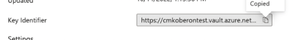

# Customer-managed keys

Adobe Customer Journey Analytics provides the option for [Healthcare Shield](https://www.adobe.com/trust/compliance/hipaa-ready.html) and Privacy & Security Shield customers to use customer-managed keys (CMK) for Customer Journey Analytics data. Note that this process is separate from the [Adobe Experience Platform CMK setup](https://experienceleague.adobe.com/en/docs/experience-platform/landing/governance-privacy-security/customer-managed-keys/overview). Customer-managed keys are only available for organizations that have purchased the [Healthcare Shield or Privacy & Security Shield](https://experienceleague.adobe.com/en/docs/events/customer-data-management-voices-recordings/governance/healthcare-shield) add-on offering.

## Set up customer-managed keys for Customer Journey Analytics on Azure

Follow these steps to set up CMK for Customer Journey Analytics running on Azure:

1. Ensure that you are entitled to Adobe Customer Journey Analytics CMK and that your organization uses Adobe Experience Platform running on Azure. You can check these entitlements by contacting your Adobe Account team.
1. Ensure that, in Azure, you are an administrator with a privileged role such as Application Administrator, Cloud Application Administrator, or Global Administrator. See [Microsoft Entra built-in roles](https://learn.microsoft.com/en-us/entra/identity/role-based-access-control/permissions-reference) for more information.
1. Create a new Azure Key Vault to be used only with Customer Journey Analytics. See [Microsoft Azure Key Vault documentation](https://learn.microsoft.com/en-us/azure/key-vault/general/) for more information.
1. Grant the Adobe Azure App access to your key in the key vault. You can do so by using either of the following methods:
   * Grant permissions via authorization consent via the following URL: [https://login.microsoftonline.com/common/oauth2/authorize?response_type=code&client_id=251e3919-1940-4296-bb8b-6b9a5e8a4805&redirect_uri=https://experience.adobe.com&scope=user.read](https://login.microsoftonline.com/common/oauth2/authorize?response_type=code&client_id=251e3919-1940-4296-bb8b-6b9a5e8a4805&redirect_uri=https://experience.adobe.com&scope=user.read)
   
   * Follow the instructions in [Configure customer-managed keys for an existing account](https://learn.microsoft.com/en-us/azure/storage/common/customer-managed-keys-configure-cross-tenant-existing-account?toc=%2Fazure%2Fstorage%2Fblobs%2Ftoc.json&tabs=powershell-preview%2Cazure-portal#the-customer-grants-the-service-providers-app-access-to-the-key-in-the-key-vault). The Adobe Application ID is:

      **`251e3919-1940-4296-bb8b-6b9a5e8a4805`**

1. Create an Adobe Customer Care ticket requesting CMK setup. Include the Azure URI in your ticket. The URI can be found in the **Key Identifier** field of your Azure key:

   

1. Adobe Customer Care confirms the completion of the CMK application on your Customer Journey Analytics data.

All data used by Platform is encrypted in transit and at rest to keep your data secure, with or without customer-managed keys. For information on Adobe Experience Platform encryption, see [Data encryption in Adobe Experience Platform](https://experienceleague.adobe.com/en/docs/experience-platform/landing/governance-privacy-security/encryption).

## Set up customer-managed keys for Customer Journey Analytics on Amazon Web Services

>[!AVAILABILITY]
>
>This section applies to implementations of Experience Platform running on Amazon Web Services (AWS). Experience Platform running on AWS is currently available to a limited number of customers. To learn more about the supported Experience Platform infrastructure, see the [Experience Platform multi-cloud overview](https://experienceleague.adobe.com/en/docs/experience-platform/landing/multi-cloud).

If your organization uses Adobe Experience Platform running on Amazon Web Services, CMK is already configured for you. No additional setup is needed.
