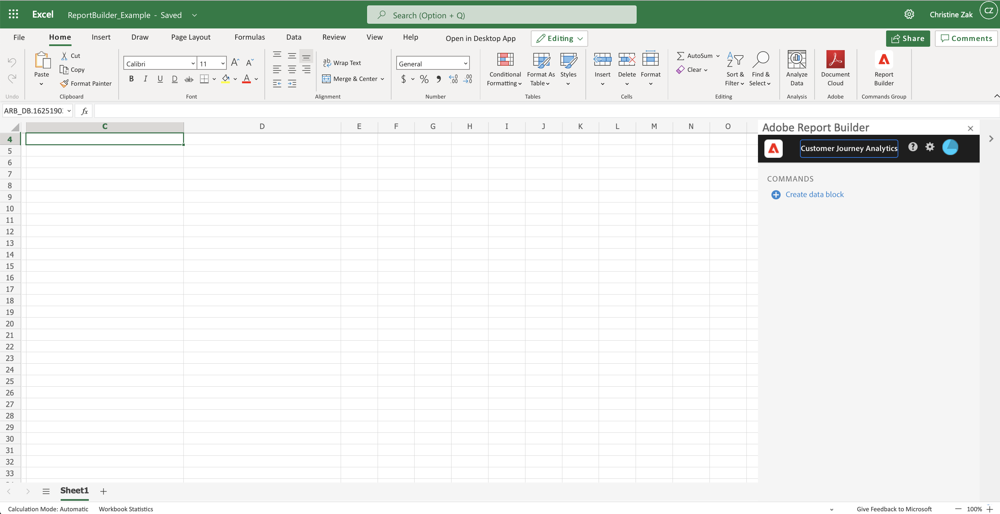
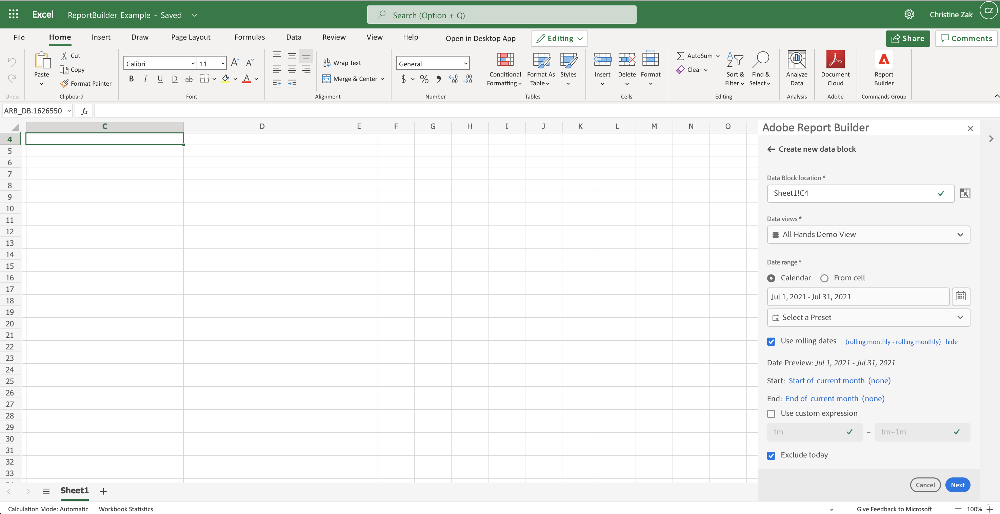
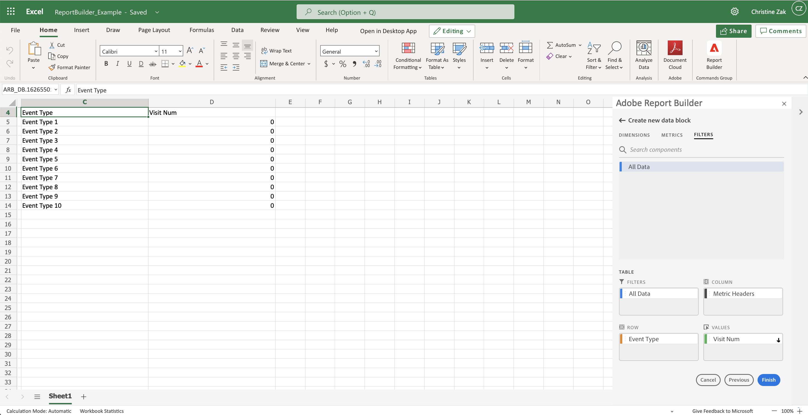
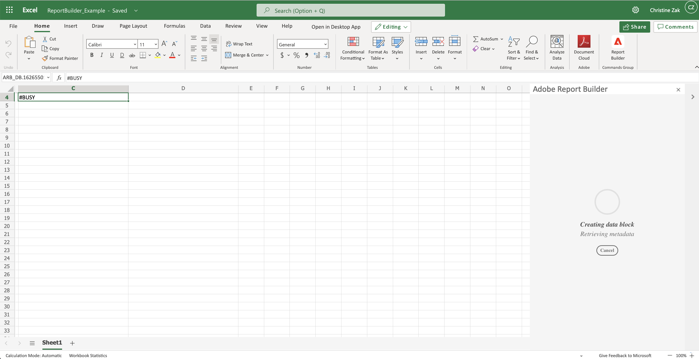
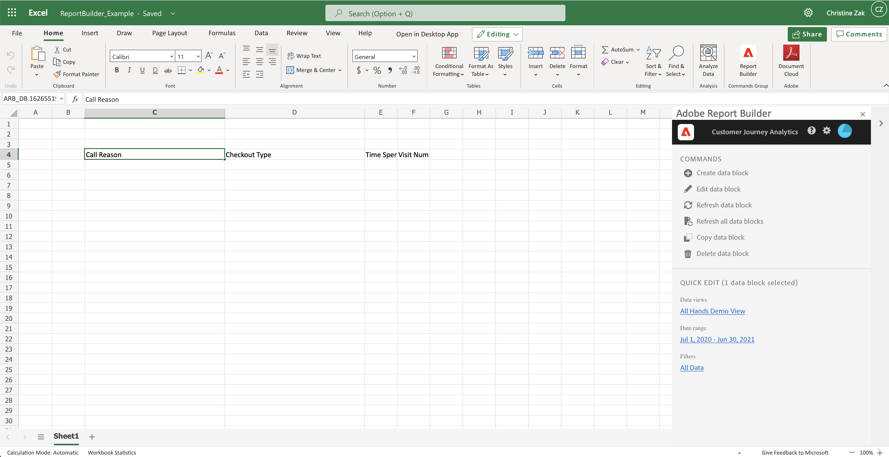

# Create a Data Block

Use the Report Builder hub to create a data block and configure data block parameters.

1.  Click **Create a data block**.

   

1.  Select a **Data Block location**, **Data view**, and a **Date range**.

   

## Data Block location

   The Data Block location defines where in the Excel worksheet to add your report.

    To specify the data block location, select a single cell in the worksheet or enter a cell address such as a3, \$a3, a\$3 or sheet1!a2. The cell specified is the upper-left corner of the data block when the data is retrieved.

## Data view

    The Data view allows you to choose a data view from a predefined list of data views or from a data view in a cell location.

## Date range

   The Date Range section allows you to choose a date range from a calendar control, from predefined or customized rolling date expression, or from date range located in cell values. For additional information about the data range, see \<\< link to date range section>\>.

1. Click **Next**.

1. Add Dimensions, Metrics, Filters.

   Use the Search field to locate a component name. You can double-click the name in the Search field to add the component to the pivot table. You can also drag and drop the component from the component list to the pivot table.

   Filters can be applied to the Filters pane or dropped on top of one of the metrics.

   You can reorder components within each Table pane using drag and drop to move a component.

   

1. Arrange the items in the pivot table to customize the layout of your data block.

   The Report Builder pivot table feature allows you to drag and drop components to group them in a meaningful way.

1. Click **Finish**.

   A processing message is displayed while the analytics data is retrieved.

   

   The Data Block is retrieved and displayed in the spreadsheet.

   The Report Builder Commands and Quick Edit panels are updated to reflect the current selected cells.

   
