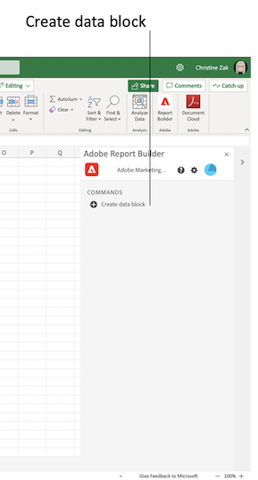
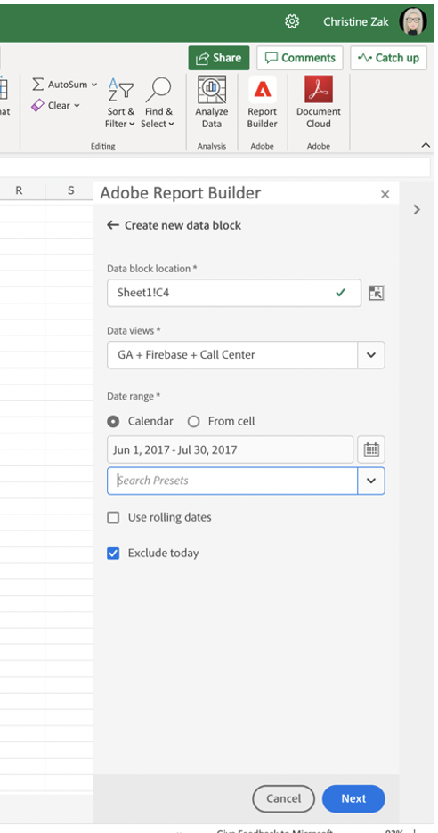
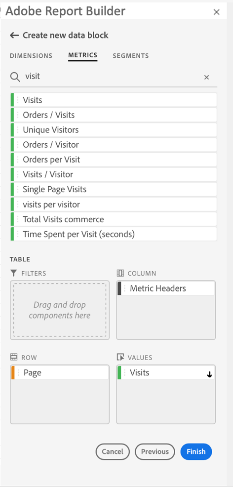

# Create a Data Block

A *data block* is the table of data created by a single data request. A
Report Builder workbook can contain multiple data blocks.

## Configure the data block

Configure the initial data block parameters for the Data block
location, Data views, and a Date range.

To create a data block

1.  Click **Create data block**.

    

1.  Set the **Data block location**.

    The data block location option defines the worksheet location where report builder adds the data to your worksheet.

    To specify the data block location, select a single cell in the worksheet or enter a cell address such as a3, \\\$a3, a\\\$3 or sheet1!a2. The cell specified will be the upper-left corner of the data block when the data is retrieved.

1.  Choose the **Data views**.

    The Data views option allows you to choose a data view from a drop-down menu or to reference a data view from a cell location.

1.  Set the **Date range**.

    The Date range option allows you to choose a date range. Date ranges may be fixed or rolling. For additional information about data range options, see << link to date range section >>.

1.  Click **Next**.

    

    After you configure the data block, you can select dimensions, metrics, and filters to build your data block. The Dimensions, Metrics, and Filters tabs are displayed above the Table builder pane.
<!--
    
  -->

## Build the data block

After you configure the initial data block parameters, select report
components, and then customize the layout to build the data block.

1.  Add Dimensions, Metrics, and Filters.

    Scroll the component lists or use the **search** field to locate components. Drag and drop components to the Table pane or double-click a component name in the list to automatically add the component to the Table pane.

    Double-click a component to add it to a default section of the table.

    - Dimension components are added to the Row section or to the Column\
        section if you have a dimension already in the columns.
    - Date components are added to the Column section.
    - Filter components are added to the Filters section.

1.  Arrange the items in the Table pane to customize the layout of your
    data block.

    Drag and drop components in the Table pane to reorder components or right-click a component name and select from the options menu.

    When you add components to the table, a preview of the data block is displayed at the Data block location in the worksheet. The layout of the data block preview automatically updates as you add, move, or remove items in the table.

    

1.  Click **Finish**.

    A processing message is displayed while the analytics data is retrieved.

    

    Report Builder retrieves the data and displays the completed data  block in the worksheet.

    
