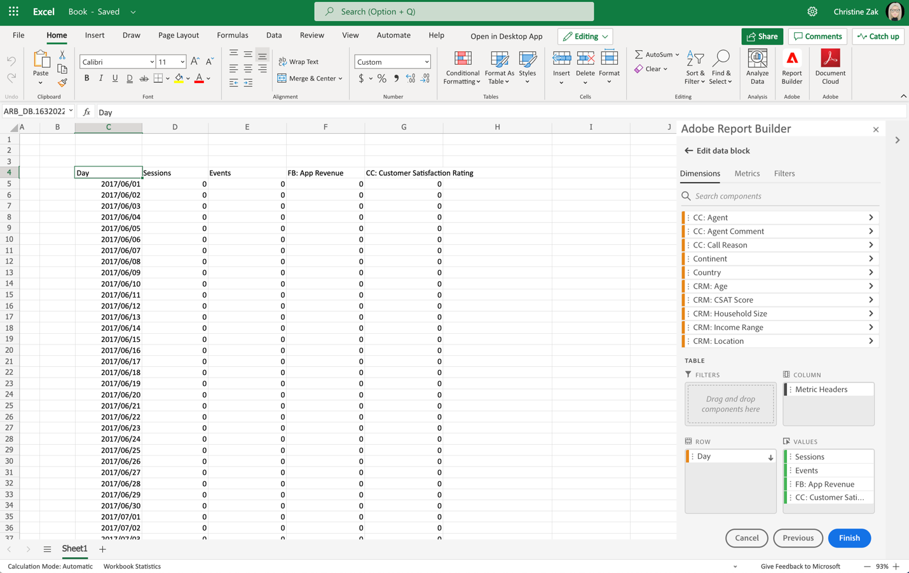
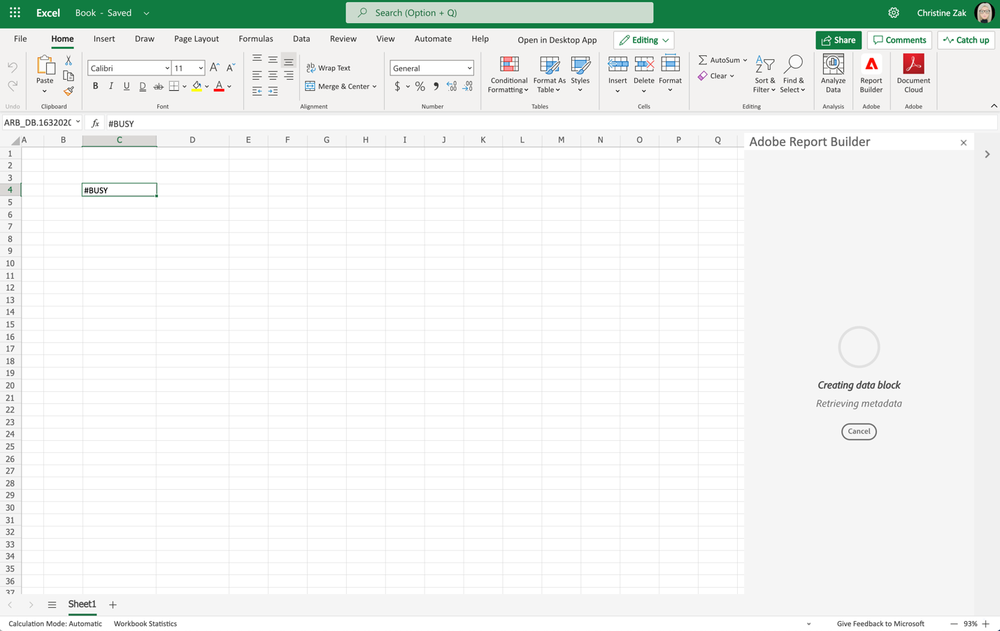
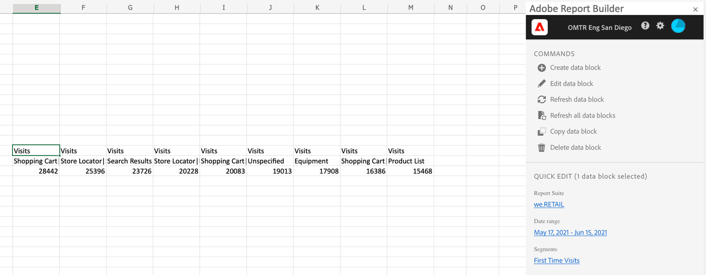

# Create a data block

A *data block* is the table of data created by a single data request. A Report Builder workbook can contain multiple data blocks. When you create a data block, first configure the data block and then build the data block.

## Configure the data block

Configure the initial data block parameters for the Data block location, Data views, and a Date range.

1. Select  **[!UICONTROL Create]**.

   {zoomable="yes"}

1. Set the **[!UICONTROL Data block location]**.

    The data block location option defines the worksheet location where Report Builder adds the data to your worksheet.

    To specify the data block location, select a single cell in the worksheet or enter a cell address, such as `a3`, `\\\$a3`, `a\\\$3` or `sheet1!a2`. The cell specified becomes the upper-left corner of the data block when the data is retrieved.

    Use  to pick a data block location from the current selected cell in the sheet.

1. Choose the **[!UICONTROL Data views]**.

    The Data views option allows you to choose a data view from a drop-down menu or to reference a data view from a cell location.

    Select  to create a data view from a cell.

1. Set the **[!UICONTROL Date range]**.

    The **[!UICONTROL Date range]** option allows you to choose a date range. Date ranges may be fixed or rolling. 

    Select **[!UICONTROL Calendar]** to pick a data range using  or enter a date range manually. Optionally, you can pick a preset from the **[!UICONTROL _Search Presets_]** drop-down menu.

    Select **[!UICONTROL From cell]** to define a start and end data based on a cell in the current sheet.

    For information about date range options, see [Select a date range](select-date-range.md).

1. Select **[!UICONTROL Next]**.

    

    After you configure the data block, you can select dimensions, metrics, and segments to build your data block. The **[!UICONTROL Dimensions]**, **[!UICONTROL Metrics]**, and **[!UICONTROL Segments]** tabs are displayed above the **[!UICONTROL Table]** pane.

## Build the data block

To build the data block, select report components, and then customize the layout.

1. Add **[!UICONTROL Dimensions]**, **[!UICONTROL Metrics]**, and **[!UICONTROL Segments]** components.

    Scroll the component lists or use the  **[!UICONTROL _Search components_]** field to locate components. Drag and drop components to the [!UICONTROL Table] pane or Double select a component name in the list to add the component to the [!UICONTROL Table] pane.

    Double select a component to add the component to a default section of the table.

    - Dimension components are added to the  **[!UICONTROL Row]** section or to the  **[!UICONTROL Column]** section if you have a dimension already in the columns.
    - Date components are added to the  **[!UICONTROL Column]** section.
    - Segment components are added to the  **[!UICONTROL Segments]** section.
    - Metrics components are added to the  **[!UICONTROL Values]** section.

1. Arrange the items in the Table pane to customize the layout of your data block.

    Drag and drop components within each list in the Table pane to reorder components or select  and select  Move up,  Move down, and more to move components within a list.

    When you add components to the table, a preview of the data block is displayed at the Data block location in the worksheet. The layout of the data block preview automatically updates as you add, move, or remove items in the table.

    

1. Optionally set the **[!UICONTROL Start date]** as a dimension to identify the start date of your data block. Adding the start data as a dimension is helpful if you have a regularly scheduled report that has a rolling date range. Or if you have an unconventional date range and you need to be explicit about the start date.

   

1. Optionally, display or hide row and column headers. To do so:

   1. Select the **[!UICONTROL Table]** settings icon.

      

   1. Check or uncheck the option to **[!UICONTROL Display row and column headers]**. The headers are displayed by default.

1. Optionally, you can also hide or show dimension labels and metric headers. To do so:

   1. Select  on the dimension label or the column header to display the context menu.

      

   1. Select  **[!UICONTROL Hide]** or  **[!UICONTROL Show]** to toggle the dimension label or column header. All labels are displayed by default.

1. Select **[!UICONTROL Finish]** to finish the configuration of your data block.

1. A processing message **[!UICONTROL #BUSY]** is displayed while the analytics data is retrieved.

   

1. Report Builder retrieves the data and displays the completed data block in the worksheet.

   

>[!MORELIKETHIS]
>
>[Select a data view](select-data-view.md)
>[Select a date range](select-date-range.md)
>[Filter dimensions](filter-dimensions.md)
>[Work with segments](work-with-filters.md)
>
