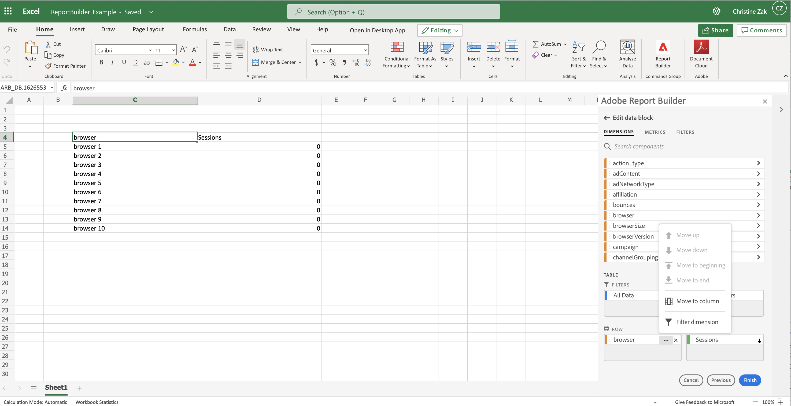
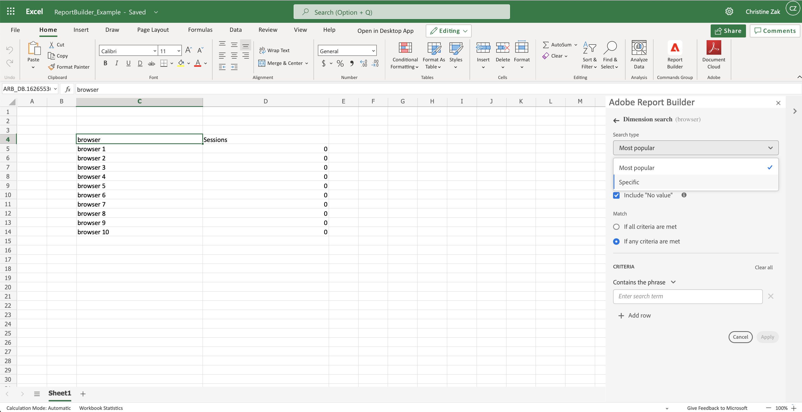
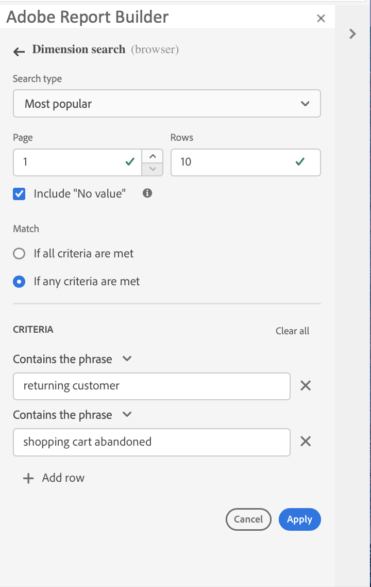
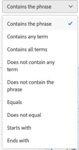
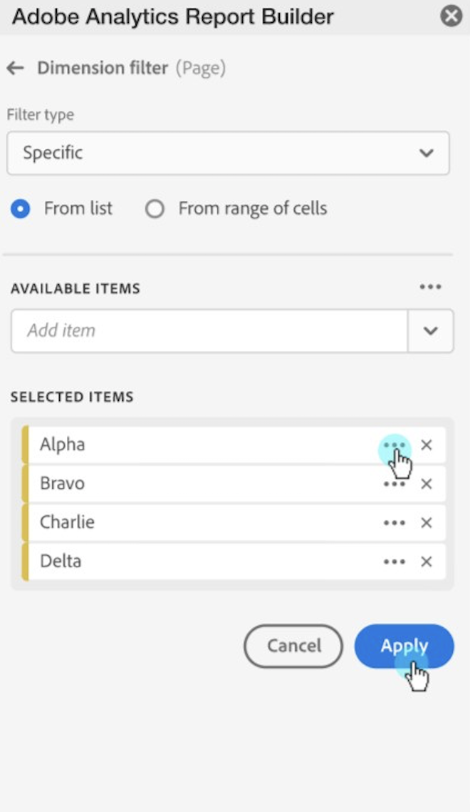

# Dimension Search

Dimension search allows you to search for any dimension included in a data block except for the date unit dimension. You can also specify the number of items to return for each dimension. The dimension search operators match the search filters used in Adobe Analytics Workspace. You can enter search terms directly or they can be referenced as cell values.

You can search for data using the following filter types:

- Most Popular
- Specific

To display the filter icon, click **...** in the Pivot table next to a component name.

To set dimension search operators

1.  Click **...** in the Pivot table next to a component name.

   

1. Select **Filter dimension** in the pop-up menu to display the Dimension search pane.

1. Select the **Most popular** or **Specific** option.

   

1. Select appropriate options based on the filter type chosen.

1. Click **Apply** to add the filter.

A notification is shown to indicate that the filter has been added.

Hovering above the row section displays a dimension with an applied filter.

## Most Popular Filtering

When you choose the Most Popular Filter option, you can retrieve data that matches any or all criteria that you specify.

{ width=50% height=50% }

### Page and Rows Options

Use the Page number and Rows fields to filter specific pages and rows.

Default values

- Starting page: 1
- Number of rows: 10

Minimum and maximum values

- Starting page: Min = 1, Max: 50 million
- Number of rows: Min = 1, Max: 50,000

### Include \"No Value\"

In Customer Journey Analytics, some dimensions collect a "no value" entry. This filter allows you to exclude these two values from reports. For example, you can create a classification such as the Product Name classification based on the Product SKU key. If a specific product SKU has not been set up with its specific Product Name classification, its Product Name value is set to "no value".

You can select the Include "no value" option. You can also match the value if any or all criteria are met. The default value is **If any criteria are met**.

### Match criteria

You can set match criteria for phrases, terms, equals or doesn't equal, or starts and ends with values.

To set up match criteria

1.  Select a match operator from the drop-down list.

   

1. Enter a value into the search term field.

1. Click Add row to add another search operator and value.

1. Click the delete icon to remove the term.

You can include up to 10 search criteria components.

## Specific Filtering

Use the Specific filtering type to filter by an exact value. The items can be retrieved from a list or from a range of cells.

{ width=50% height=50% }

### From list

1. Select the From list option to search for a specific item and choose from the available items list.

 When you select the From list option, the list is populated with the most popular dimension items for that dimension, for the last 90 complete days.

 

 The Available Items list is ordered by popularity from the most popular to the least popular.

1. Enter a search term in the Add item field to search the full list.

1. Click **Show Items for the last 6 months** to display a list of items from the past six months.

  

 After data from the past six months is loaded, the link is updated to Show Items for last 18 months

 When you select an item in the list, it's automatically displayed in the top of the Selected Items Category.

 

1. To delete an item from the list, click the delete icon to remove the item from the list.

1. To move an item in the list, click \... to display the move menu.

 

1. Apply your changes

 When you add an item to the list or when you delete an item, click Apply to apply your changes.

### From range of cells

Select the From range of cells option to choose a range of cell that contain the list of dimensions items to match.

{ width=50% height=50% }

When you select a range of cells, consider the following restrictions:

- The range must have at least one cell
- The range cannot have more than 50,000 cells
- The range must be in a single uninterrupted row, or column:

Your selection can contain empty cells or cells with values that don't match with a specific dimension item.

### Specific filtering to dimension types

In addition to using the Specific Filter from List option, you can also filter groups of Dimension items.

From the Dimension tab, click the chevron icon next to a dimension name to reveal the list of dimension items. You can drag and drop items into the Pivot table or double-click and item name to add it to the Pivot Table. Filters applied to the main dimension type in the Pivot Table are also applied to the dimension items.
