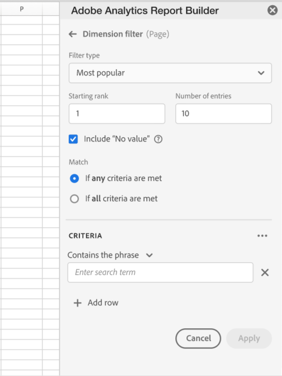
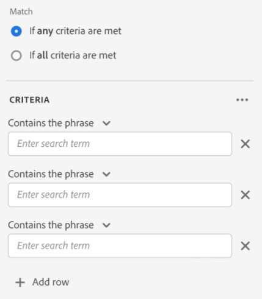
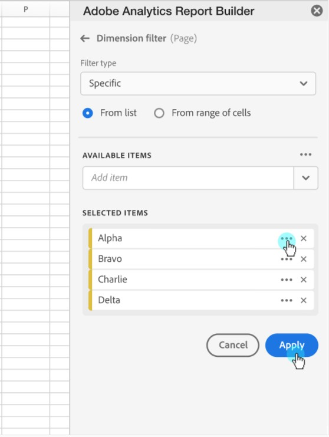

# Dimension Search

Dimension search allows you to search for any dimension included in a data block except for the date unit dimension. You can also specify the number of items to return for each dimension. The dimension search operators match the search filters used in Adobe Analytics Workspace. You can enter search terms directly, or they can be referenced as cell values.

You can search for data using the following types:

- Most Popular \<\<may be renamed to dimension search>\>

- Specific

The search icon is displayed in the Pivot table next to a dimension name.

To set dimension search operators

1.  Click the filter icon.

 NEED Image

1. Click the **Filter type** drop down menu to navigate to the Specific Filtering type.

1. Select the **Most popular** or **Specific** option.

1. Choose the **From list** or the **From range of cells** option.

1. Select items from the Available Items list or select a range of cells.

1. Click **Apply** to add the filter.

A notification is shown to indicate that the filter has been added.

Hovering above the row section displays a dimension with an applied filter.

 NEED Image>

## Most Popular Filtering

\<\< need description >\>

### Page Number and Number of entries

Use the Page Number and Number of entries fields to enter positive and numerical (non floating point) values for filtering.

Default values

- Starting rank: 1
- Number of Entries: 10

Mininmum and maximum values

- Starting Rank: Min = 1, Max: 50 million
- Number of Entries: Min = 1, Max: 50,000

### Include \"No Value\"

In Customer Journey Analytics, some dimensions collect a "no value" entry. This filter allows you to exclude these two values from reports. For example, a common example would be to create a classification such as the Product Name classification based on the Product SKU key. If a specific product sku has not been set up with its specific Product Name classification, its Product Name value is set to "no value".

You can select the Include "no value" option. You can also match the value if any or all criteria are met. The default value is **If any criteria are met**.

This option is always visible but only enabled for a subset of dimensions.

### Match criteria

You can set match criteria for phrases, terms, equals or doesn't equal, or starts and ends with values.

To set up match criteria

1.  Select a match operator from the drop-down list.

 

1. Enter a value into the search term field.

1. Click Add row to add another search operator and value.

1. Click the delete icon to remove the term.

You can include up to 10 search criteria components.

## Specific Filtering

Use the Specific filtering type to choose an exact value dimension item. The items can be retrieved from a list or from a range of cells.

### From list

1. Select the From list option to search for a specific item and choose from the available items list.

 When you select the From list option, the list is populated with the most popular dimension items for that dimension, for the last 90 complete days.

 

 The Available Items list is ordered by popularity from the most popular to the least popular.

1. Enter a search term in the Add item field to search the full list.

1. Click **Show Items for the last 6 months** to display a list of items from the past six months.

  

 After data from the past six months is loaded, the link is updated to Show Items for last 18 months

 When you select an item in the list, it's automatically displayed in the top of the Selected Items Category.

 

1. To delete an item from the list, click the delete icon to remove the item from the list.

1. To move an item in the list, click \... to display the move menu.

 

1. Apply your changes

 When you add an item to the list or when you delete an item, click Apply to apply your changes.

### From range of cells

Select the From range of cells option to choose a range of cell that contain the list of dimensions items to match.

When you select a range of cells, consider the following restrictions:

- The range must have at least one cell
- The range cannot have more than 50,000 cells
- The range has to to be in a single uninterrupted row, or column:

 NEED Image

- A1:A100 => 1 column, 100 rows > valid
- A1:B100 => 2 columns, 100 rows > invalid
- A1: AA1 => 26 columns, 1 row > valid
- A1: AA3 => 26 columns, 3 rows > invalid
- A1:A10; A11:A20 => 1 column, 20 rows, but broken down into 2
  distinct ranges > invalid

Your selection can contain empty cells or cells with values that don't match with a specific dimension item.

### Specific Filtering outside of the Dimension Filtering Panel

In addition to using the Specific Filter from List option, you can also \<\<specify Dimensions using the \_\_\_\_\_.\>\>

From the Component's Dimension tab, you can click a Dimension \"right chevron\" icon to reveal the list of dimension items. Drag and drop these items into the Pivot table.\<\< It should add a Dimension entity of the same type to which a Dimension filter from list will be configured with the dropped items.\>\>

You can continue to drag and drop items to the Pivot table or click the Filter icon to further edit the list using the Dimension Filter From List option.
