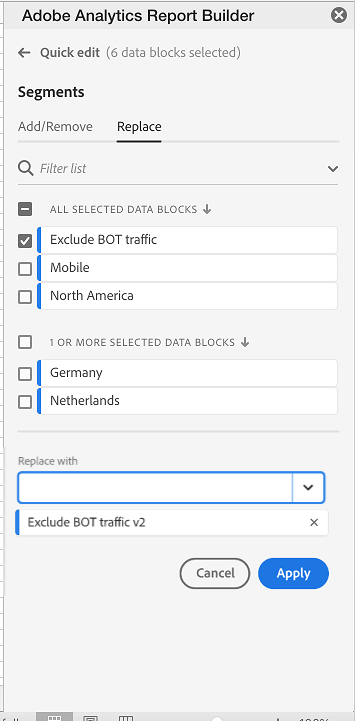
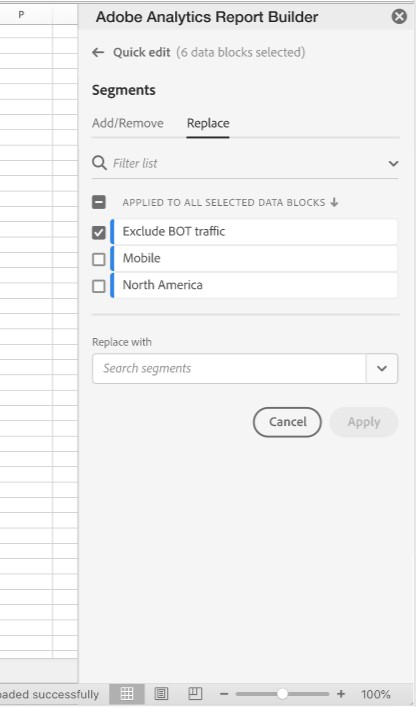
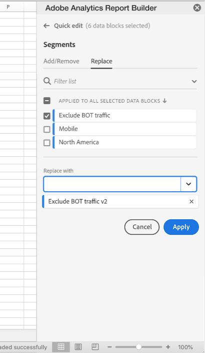
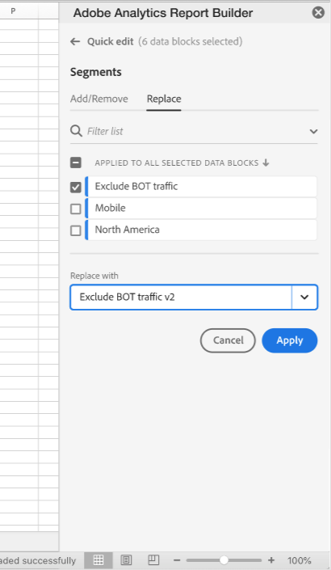
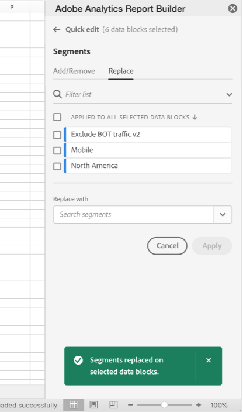
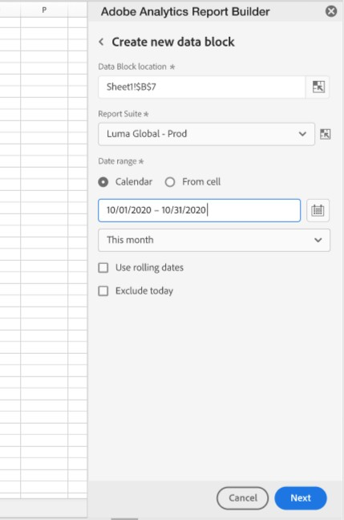
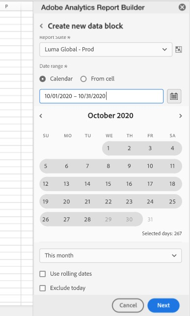

# Filter dimensions

By default, each dimension item in the table returns the top 10 items for that dimension.

To change the dimension items returned for each dimension:

1. Select a cell in the data block.

1. Select  **[!UICONTROL Edit data block]** in the **[!UICONTROL Commands]** panel.

1. Select **[!UICONTROL Next]** to display the **[!UICONTROL Dimensions]** tab.

1. Select  next to a component name in the table.

    {zoomable="yes"}

1. Select **[!UICONTROL Filter dimension]** in the pop-up menu to display the **[!UICONTROL Filter dimension]** pane.

1. Select **Most popular** or **Specific** as the **[!UICONTROL Type]**.

    {zoomable="yes"}

1. Select appropriate options based on the [filter type](#filter-type) chosen.

1. Select **[!UICONTROL Apply]** to add the filter.

1. Report Builder displays a notification to confirm the added filter.

To display applied filters, hover over a dimension. Dimensions with applied filters display a  filter icon next to the dimension name.

## Change the filter and sort order

A  or  appears next to the metric used to filter and sort the data block. The direction of the arrow indicates whether the metric is sorted in ascending or descending order.

To change the sort order:

- Select  or  next to the metric to toggle the sort order.

To change the metric used to filter and sort the data block:

1. Hover over the desired metric component in the Table builder to display additional options.

2. Select  for the preferred metric.

   {zoomable="yes"}

## Filter type

There are two ways to filter dimension items: [Most popular](#most-popular) and [Specific](#specific-filtering)

### **[!UICONTROL Most popular]**

The **[!UICONTROL Most popular]** option allows you to dynamically filter dimension items based on metric values. Most popular returns the highest ranked dimension items based on metric values. By default, the first 10 dimensions items are listed, sorted by the first metric added to the data block.

 {zoomable="yes"}

#### Page and Rows options

Use the **[!UICONTROL Page]** and **[!UICONTROL Rows]** fields to divide data into sequential groups or pages. This feature allows you to pull ranked row values other than the top-most values into your report. And is especially useful for pulling data beyond the 50,000 row limit.

The default for Page is `1` and for Rows is `10`. These defaults imply that each page has 10 rows of data. Page 1 returns the top 10 items, page 2 returns the next 10 items, and so on.

The table below lists examples of page and row values and the resulting output.

| Page | Row    | Output               |
|------|--------|----------------------|
| 1    | 10     | Top 10 items         |
| 2    | 10     | Items 11-20          |
| 1    | 100    | Top 100 items        |
| 2    | 100    | Items 101-200        |
| 2    | 50,000 | Items 50,001-100,000 |

The table below lists minimum and maximum values for page and rows.

|       | Minimum values | Maximum values |
|-------|---------------:|---------------:|
| Starting page | 1| 50 million |
| Number of rows| 1| 50,000|

#### Include "No value"

In Customer Journey Analytics, some dimensions collect a *No value* entry. The **[!UICONTROL Include "No value"]** setting allows you to exclude these values from reports. For example, you can create a classification such as the Product Name classification based on the Product SKU key. If a specific product SKU has not been set up with its specific Product Name classification, its Product Name value is set to *No value*.

**[!UICONTROL Include "No value"]** is selected by default. Deselect this option to exclude entries with no value.

#### Filter by Criteria

You can filter dimension items based on whether all criteria are met or if any criteria are met.

To set filtering criteria:

1. Select an operator from the operator drop-down menu. By default **[!UICONTROL Contains the phrase]** is selected

    {zoomable="yes"}

1. Enter a search term.

1. Select  **[!UICONTROL Add row]** to confirm the selection and add another criteria item.

1. Select  to remove a criteria item.

You can include up to 10 criteria items.

### **[!UICONTROL  Specific]**

The **[!UICONTROL Specific]** option allows you to create a fixed list of dimension items for each dimension. Use the **[!UICONTROL Specific]** filtering type to specify the exact dimension items to include in your filter. You can select items from a list or from a range of cells.

{zoomable="yes"}

#### From list

1. Select the **[!UICONTROL From list]** option to search for and select dimension items.

    When you select the **From list** option, the **[!UICONTROL Dimension items]** list is populated with dimension items ordered by number of events.

    {zoomable="yes"}

1. Enter a search term in the  **[!UICONTROL _Add item_]** to search the list.

1. To search for an item not included in the last 90 days of data, select **[!UICONTROL Show items for the last 6 months]** to extend the search. After data from the past 6 months loads, Report Builder updates the link to **[!UICONTROL Show items for last 18 months]**.

1. To delete an item from the **[!UICONTROL Selected items]** list, select .

1. To move an item in the **[!UICONTROL Selected items]** list, drag and drop the item or select  to display the context menu and select from the move options.

1. Select **[!UICONTROL Apply]**.

Report Builder updates the list to show the specific filtering you applied.

#### From range of cells

Select the **From range of cells** option to choose a range of cell that contains the list of dimensions items to match.

 {zoomable="yes"}

When you select a range of cells, consider the following restrictions:

- The range must have at least one cell.
- The range can't have more than 50,000 cells.
- The range must be in a single uninterrupted row, or column.

Your selection can contain empty cells or cells with values that don't match with a specific dimension item.

### Quickly filter a dimension

To filter a dimension for which currently no filter is applied:

1. Select  for a dimension. For example, **[!UICONTROL Interaction channel]**.

1. Double select a dimension items to add to the filter. Alternatively, select one or more dimension items and drag and drop the selection onto the  **[!UICONTROL Row]** section.

   {zoomable="yes"}

