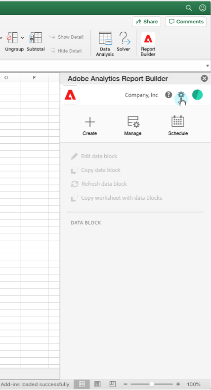
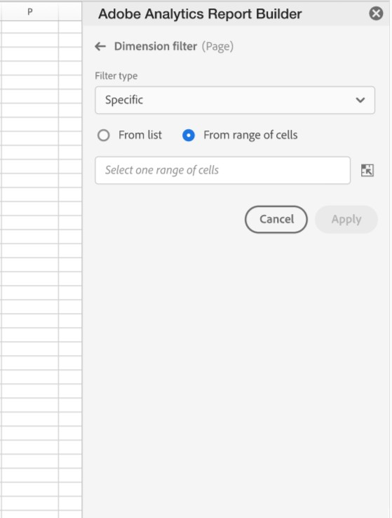
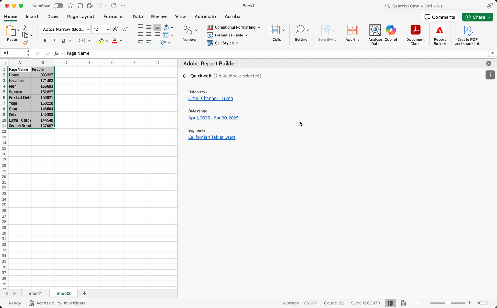
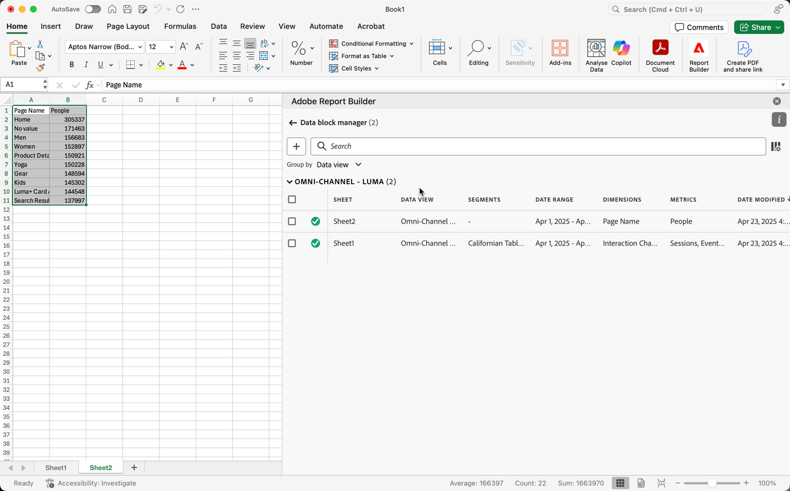

# Manage data blocks

You can view and manage all data blocks in a workbook using the [!UICONTROL Data block manager]. The [!UICONTROL Data block manager] provides search, filter, and sort capabilities that allow you to locate specific data blocks. After selecting one or more data blocks, you can edit, delete, or refresh the selected data blocks.

## View data blocks

To view a table that lists all data blocks in a workbook, select  **[!UICONTROL Manage]**.

   {zoomable="yes"}

The **[!UICONTROL Data block manager]** shows a table with all data blocks present in a workbook.

{zoomable="yes"}

You can use  to select which columns you want to display.

## Sort data blocks

You can sort the data block table by a displayed column. For example, you can sort data blocks by data views, segments, date range, and other variables.

To sort the data block table, select a column heading. Select the same column heading to reverse the sort order.

## Search data blocks

Use the  **[!UICONTROL _Search_]** field to locate anything in the data block table. For example, you could search for metrics contained in the data blocks or data view. You can also search for dates appearing in the date range, date modified, or last run date columns.

## Edit data blocks

You can edit data views and date ranges for data blocks. Or the segments applied to data blocks.

For example, you can replace an existing segment with a new segment in one or more data blocks.

1. Select the data blocks that you want to update. You can select the top-level check box to select all data blocks or you can select individual data blocks.

   {zoomable="yes"}

1. Select  to display the **[!UICONTROL Quick edit]** window.

   {zoomable="yes"}

1. Select a link to update data views, date ranges, or segments. In **[!UICONTROL Quick Edit]** - **[!UICONTROL Segments]** you can add, remove or update the segments for the selected data blocks.

   {zoomable="yes"}

## Refresh data blocks

Select  to refresh the data blocks table.

To verify if a data block is refreshed, view the refresh status icon: 

- A successfully refreshed data block displays a .

- A data block that has failed to refresh displays a .

## Delete data blocks

To delete one or more data blocks:

1. Select one or more data blocks.
1. Select . 
1. Select **[!UICONTROL Delete]** in the **[!UICONTROL Delete data block]** dialog or **[!UICONTROL Cancel]** to cancel the deletion.

## Group data blocks

You can group data blocks using the **[!UICONTROL Group by]** drop-down menu or you can select a column title. 

To sort data blocks by column, select the column title. To group data blocks by groups, select a group name from the **[!UICONTROL Group by]** drop-down menu. For example, the screenshot below shows data blocks grouped by Data view. 

You can use grouping to select quickly data blocks for which you want to modify a common element, like segment.

{zoomable="yes"}

