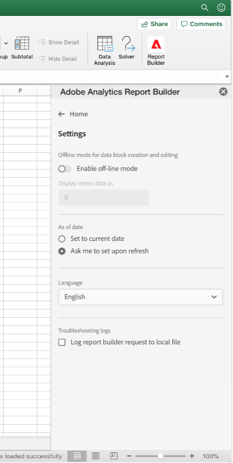
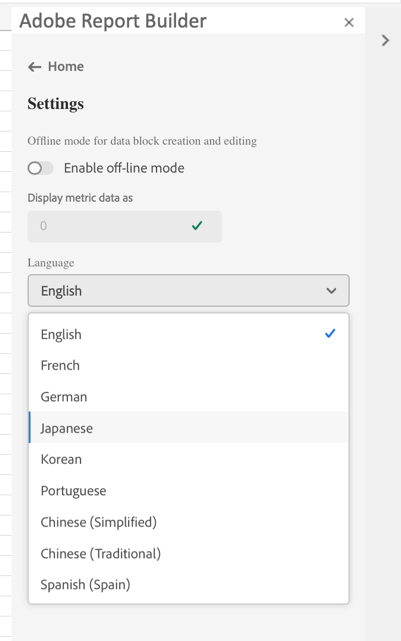

# Manage Data Blocks in Report Builder

You can view and manage all data blocks in a workbook using the Data Block Manager. The Data Block Manager provides search, filter, and sort capabilities that allow you to quickly locate specific data blocks. After selecting one or more data blocks, you can edit, delete, or refresh the selected data blocks.

## View Data Blocks

Click **Manage** to view a list of all data blocks in a workbook.

The Data Block Manager lists all data blocks present in a workbook. 

## Sort the Data Blocks list

You can sort the data block list by a displayed column. For example, you can sort the data block list by Report Suites, Filters, Date Range, and other variables.

To sort the data block list, click a column heading.

## Search the Data Block list

Use the Search field to locate anything in the data block table. For example, you could search for metrics contained in the data blocks or report suite. You can also search for dates appearing in the date range, date modified, or last run date columns.

## Edit Data Blocks

You can edit the data view, date range, or the filters applied to one or more data blocks.

For example, you can replace an existing filter with a new filter in one or more data blocks.

1.  Select the data blocks that you want to update.

 You can select the top-level check box to select all data blocks or you can select individual data blocks.

 

1.  Click the edit icon to display the Quick edit window.

 

1.  Select a filter link to update data views, date ranges, or filters.

 

## Refresh Data Blocks

Click the refresh icon to refresh the data blocks in the list.

To verify if a data block is refreshed, view the refresh status icon. A checkmark in a green circle  indicates that the data block refresh was successful. A data block that has failed to refresh will display a warning icon .  This makes it easy to identify if any data blocks have errors.

## Delete a Data Block

Click the trash can icon to delete a selected data block.

## Group Data Blocks

Click the column titles to group data blocks or select a column name from the **Group by** *Name* list.

## Modify the Data Block Manager view

You can modify which columns are visible in the Data Block Manager window.

Click the column list  icon to select which columns are listed in the Data Block Manager. Select a column name to display the column. Deselect the column name to remove the column from view.

