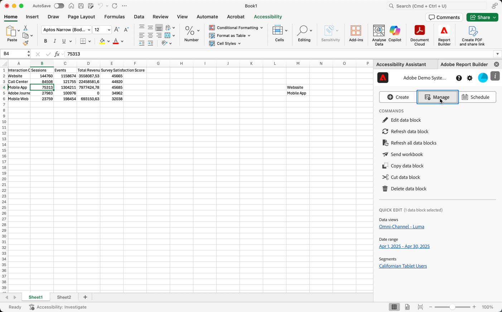

# Report Builder Settings

The Settings pane allows you to configure application-level settings such as the language displayed by the UI or whether or not to work in off-line mode. The settings are applied immediately and they are set for all future sessions until they are changed.

To change Report Builder settings

1.  Click the Settings icon.

 Need image

1. Make changes for off-line mode, as-of date, the language, or troubleshooting settings.

1. Click Home to return to the Report Builder hub.

 

 

## Off-line mode

When creating and editing a data block in off-line mode, data is not retrieved. Instead, simulation data is used so that you can quickly create and edit a data block using data that isn't real. When you work in online mode again, the *Refresh data block* command or *Refresh all data blocks* command will refresh the data blocks that you created with actual data.

Off-line mode is available when you create or edit a data block.

To turn off-line mode on

1.  Click the Settings icon.

1.  Select **Enable off-line mode**.

 NEED Image

1. Enter a positive integer in the **Display metric data as** field.

## As of date

The As of date setting allows you to choose the date reference for Data Blocks with rolling dates.

- Set to current date—When Data Blocks are refreshed and if any of the Data Blocks have rolling date ranges, the date ranges are set with today as the date reference.

- Ask me upon refresh—When Data Blocks are refreshed and if any of the Data Blocks have rolling date ranges, you can choose a new date reference for today.

## Language

You can choose the language for the Report Builder UI. All supported Adobe Analytics languages are available.

Choose a language from the drop-down menu to set the language displayed in the Report Builder hub.

## Troubleshooting

Use the Troubleshooting setting to log all client/server data to local file. This option can help to resolve support tickets.

To turn on troubleshooting and send date to a log file, click **Log report builder request to local file**.
