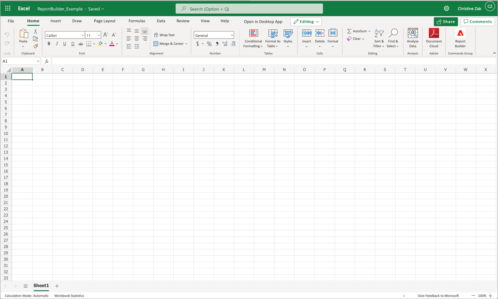
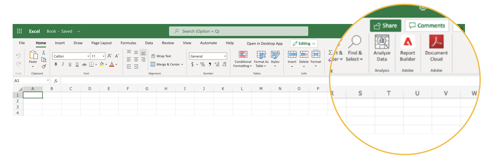
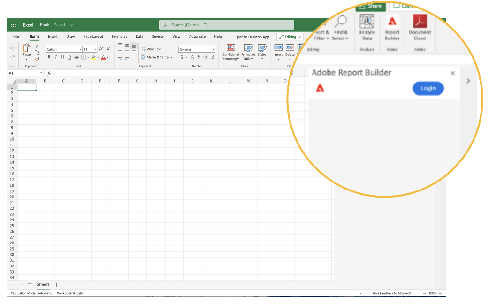
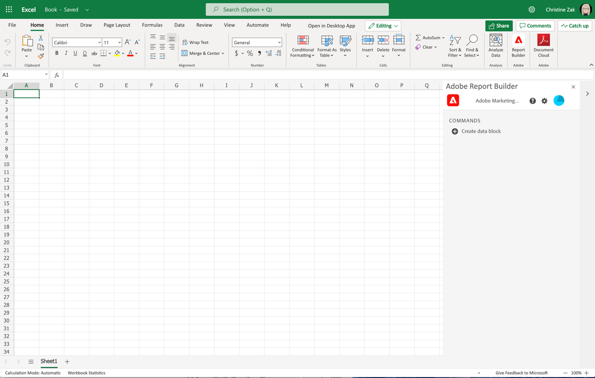
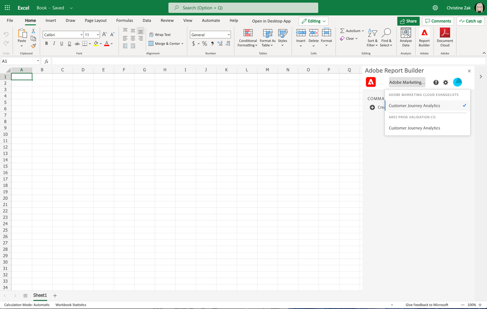
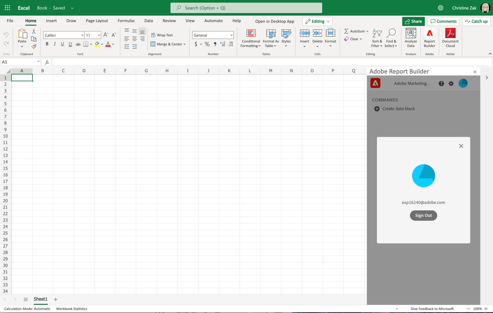

# Report Builder set up

This article outlines the requirements to use Report Builder for Customer Journey Analytics in Microsoft Excel. And how to install and set up the add-in.

## Requirements

Report Builder for Customer Journey Analytics is supported on the following operating systems and Web browsers.

### macOS

- macOS Version 10.x or later
- All Excel Versions

### Windows

- Windows 10, version 1904 or later
- Excel Version 2106 or later

  All Windows desktop Excel users must install Microsoft Edge Webview2 to use the add-in. To install:

  1. Go to <https://developer.microsoft.com/en-us/microsoft-edge/webview2/>.
  1. Select and download the appropriate version of the **[!UICONTROL Evergreen Standalone Installer]** for your platform.
  1. Run the installer and follow the installation prompts.

### Web Office

- Supports all browsers and versions.

## Report Builder Excel add-in

Install the Report Builder Excel add-in to use Report Builder for Customer Journey Analytics. Once you install the Report Builder Excel add-in, you can access Report Builder from within an open Excel workbook.

### Download and install the Report Builder Add-in

To download and install the Report Builder Add-in

1. Launch Excel and open a new workbook.

1. Select **[!UICONTROL Insert]** > **[!UICONTROL Add-ins]** >  **[!UICONTROL Get Add-ins]** from the main menu.

1. In the Office Add-ins dialog, select the **[!UICONTROL Store]** tab.

1. Search for `Report Builder` and select **[!UICONTROL Add]**.

1. In the License terms and privacy policy dialog box, select **[!UICONTROL Continue]**.

If the **[!UICONTROL Store]** tab isn't displayed:

1. In Excel, select **[!UICONTROL File]** > **[!UICONTROL Account]** > **[!UICONTROL Manage Settings]** from the main menu.

1. Check the box next to **[!UICONTROL Enable optional connected experiences]**.

1. Restart Excel.

If your organization blocks access to the Microsoft Store:

- Reach out to your IT or security team to request approval for the Report Builder add-in. After approval is granted, in the Office **[!UICONTROL Add-ins]** dialog, select the **[!UICONTROL Admin Managed]** tab.

  {zoomable="yes"}

After installing the Report Builder add-in, the  **[!UICONTROL Report Builder]** icon is displayed in the Excel ribbon under the **[!UICONTROL Home]** tab.

{zoomable="yes"}

## Log in to Report Builder

After you have installed the Report Builder for Excel add-in for your operating platform or browser, follow these steps to log in to Report Builder.

1. Open an Excel workbook.

1. Select  **[!UICONTROL Report Builder]** to launch Report Builder.

1. From the Adobe Report Builder toolbar, select **[!UICONTROL Login]**.

    {zoomable="yes"}

1. Enter your Adobe account information. Your account information should match your Customer Journey Analytics credentials.

    {zoomable="yes"}

After you log in, your login icon and organization will appear at the top of the panel

## Switch organizations

When you first log in, you are logged in to the default organization assigned to your profile or to the organization you have selected as part of the login flow.

1. Select the name of the organization that is displayed when you log in.

1. Select an organization from the list of available organizations. Only organizations that you have access to are listed.

    {zoomable="yes"}

## Sign out

To sign out from Report Builder:

1. Save changes to any open workbooks.

1. Select the avatar icon to display your user profile.

    {zoomable="yes"}

1. Select **[!UICONTROL Sign Out]**.
