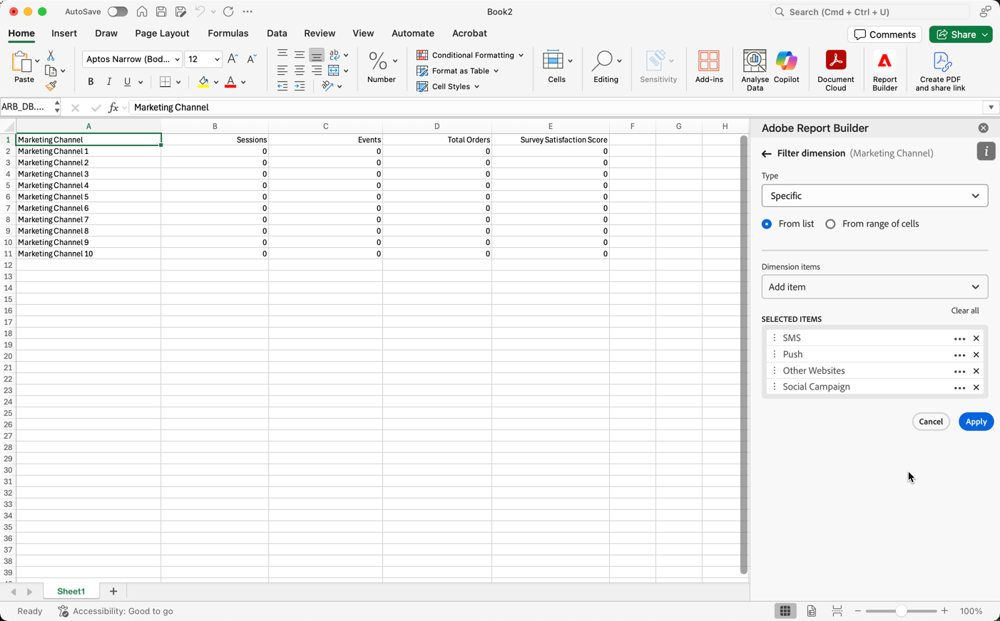

# About Report Builder for Customer Journey Analytics

Report Builder is a Microsoft Excel Add-in that allows you to easily
create, edit, and refresh custom reports using Customer Journey
Analytics data. With Report Builder and Excel, you can use the simple
but flexible drag-and-drop UI to easily build complex data requests.

With Report Builder for Customer Journey Analytics, you can:

 - Reference existing worksheet cells to get the perfect row order, date range, or filter

 - Create custom dates using calendar, cell references, or date math

 - Design your tables and visualizations with familiar Excel formatting tools

Report Builder for Customer Journey Analytics is available for Excel on
the following platforms:

 - macOS
 - Windows
 - Web browsers

**NOTE**

This documentation is for Report Builder for Customer Journey Analytics.
For information about Report Builder for Analytics on Windows,
see [Report Builder for Adobe
Analytics](https://experienceleague.adobe.com/docs/analytics/analyze/report-builder/home.html?lang=en).

You can download Report Builder for Customer Journey Analytics from the
[Microsoft Store](https://www.microsoft.com/en-us/store/apps/windows)

## Report Builder Set Up

You can quickly access Report Builder using the Excel Add-in menu.

## Requirements

Report Builder for Customer Journey Analytics is supported on the
following operating systems and web browsers.

### macOS

 - macOS Version 10.x or later

### Windows

 - Windows 10, version 1903 or later

For Windows, version 1903, you must install Microsoft Edge Webview2. To
install the controller:

1.  Go to <http://aka.ms/webview2installer>.

1.  Select and download the Evergreen Standalone Installer.

1.  Follow the installation prompts.

### Browsers

 - Chrome Version ___

 - Firefox Version ___

 - Safari Version ___

### Excel

 - Excel Version ___

## Report Builder Excel Add-in

You must install the Report Builder Excel Add-in to use Report Builder
for Customer Journey Analytics. Once you install the Report Builder
Excel Add-in, you can access Report Builder from within an open Excel
workbook.

### Download and install the Report Builder Add-in

To download and install the Report Builder Add-in

1.  Launch Excel and open a new workbook.

1.  Select Insert > Get Add-ins.

1.  In the Office Add-ins dialog, select the Store tab.

1.  Search for "Report Builder" and click Add.

1.  In the License terms and privacy policy dialog box, click Continue.

**If the Store tab isn't displayed**

1.  In Excel, select File > Account >Manage Settings.

1.  Check the box next to "Enable optional connected experiences"

1.  Restart Excel.

**If your organization blocks access to the Microsoft Store**

Reach out to your IT or security team to request approval for the Report Builder Add-in. After approval is granted, in the Office Add-ins dialog, select the Admin Managed tab.


After installing the Report Builder Add-in, the Report Builder icon is
displayed in the Excel ribbon under the Home tab.


## Log in to Report Builder

After you install the Report Builder for Excel Add-in for your operating
platform or browser, follow these steps to log in to Report Builder.

1.  Open an Excel workbook.

1.  Click the Report Builder icon to launch Report Builder.

1.  From the Adobe Report Builder toolbar, click **Login**.

 

1.  Enter your Adobe Experience ID account information. Your account
    information should match your Customer Journey Analytics
    credentials.

 

### Switch organizations

When you first log in, you are logged in to the default organization
assigned to your profile.

To switch organizations:

1.  Click the name of the organization that is displayed when you log in.

1.  Select an organization from the list of available organizations. Only organizations that you have access to are listed.

 

### Sign out

You can sign out from Report Builder from the user profile.

1.  Save changes to any open workbooks.

1.  Click the avatar icon to display your user profile.

 

1.  Click **Sign Out**.

## Create a Data Block

A *data block* is the table of data created by a single data request. A
Report Builder workbook can contain multiple data blocks.

## Configure the data block

Configure the initial data block parameters for the Data block
location, Data views, and a Date range.

To create a data block

1.  Click **Create data block**.

 

1.  Set the **Data block location**.

 The data block location option defines the worksheet location where report builder adds the data to your worksheet.

 To specify the data block location, select a single cell in the worksheet or enter a cell address such as a3, \\\$a3, a\\\$3 or sheet1!a2. The cell specified will be the upper-left corner of the data block when the data is retrieved.

1.  Choose the **Data view**.

 The Data views option allows you to choose a data view from a drop-down menu or to reference a data view from a cell location.

1.  Set the **Date range**.

 The Date range option allows you to choose a date range. Date ranges may be fixed or rolling. For additional information about data range options, see << link to date range section >>.

 

1.  Click **Next**.

 

The Dimensions, Metrics, and Filters tabs are displayed above the Table builder pane.

## Build the data block

After you configure the initial data block parameters, select report
components, and then customize the layout to build the data block.

1.  Add Dimensions, Metrics, and Filters.

 Scroll the component lists or use the **search** field to locate components. Drag and drop components to the Table pane or double-click a component name in the list to automatically add the component to the Table pane.

 Double-click a component to add it to a default section of the table.

 - Dimension components are added to the Row section or to the Column\
    section if you have a dimension already in the columns.

 - Date components are added to the Column section.

 - Filter components are added to the Filters section.

1.  Arrange the items in the Table pane to customize the layout of your
    data block.

 Drag and drop components in the Table pane to reorder components or right-click a component name and select from the options menu.

 When you add components to the table, a preview of the data block is displayed at the Data block location in the worksheet. The layout of the data block preview automatically updates as you add, move, or remove items in the table.

 

3.  Click **Finish**.

 A processing message is displayed while the analytics data is retrieved.

 

 Report Builder retrieves the data and displays the completed data  block in the worksheet.

 

## Report Builder Hub

Use the Report Builder hub to create, update, or delete data blocks.

The Report Builder hub contains the COMMANDS and QUICK EDIT panels.


## COMMANDS panel

Use the COMMANDS panel to access commands that are compatible with the
selected cells or a previous action.


### Commands

| Commands displayed      | Available when…   | Purpose          |
|------|------------------|--------|
| Create data block       | One or more cells is selected in the workbook.                                                                  | Used to create a data block                     |
| Edit data block         | The selected cell or cells range is part of one data block only.                                                | Used to edit a data block                       |
| Refresh data block      | The selection contains at least one data block. The command will refresh only the data blocks in the selection. | Used to refresh one or more data blocks         |
| Refresh all data blocks | The workbook contains one or more data blocks.                                                                  | Used to refresh ALL data blocks in the workbook |
| Copy data block         | The selected cell or cell range is part of one or more data blocks.                                             | Used to copy a data block                       |
| Delete data block       | The selected cell or cells range is part of one data block only.                                                | Used to delete a data block                     |

## QUICK EDIT panel

When you select one or more data blocks in a spreadsheet, Report Builder
displays the QUICK EDIT panel. You can use the QUICK EDIT panel to
change parameters in a single data block or to change parameters in
multiple data blocks at the same time.


The changes made using the Quick Edit sections apply to all data blocks
that are present in the selected ranges.

### Data views

Data blocks pull data from a selected Data view. If multiple data blocks
are selected in a worksheet and they don't pull data from the same data
view, the **Data views** link displays *Multiple*.

When you change the data view, all data blocks in the selection adopt
the new data view. Components in the data block are matched to the new
data view based on ID, for example, matching ```evars```). If a component isn't found in a data block, a warning message is displayed and the component is removed from the data block.

To change the data view, select a new data view from the drop-down menu.


### Date range

**Data range** shows the date range for the selected data blocks. If
multiple data blocks are selected with multiple date ranges, the **Data range** link displays *Multiple*.

### Filters

The **Filters** link displays a summary list of the filters used by the
selected data blocks. If multiple data blocks are selected with multiple
filters applied, the **Filters** link displays *Multiple*.

## Select a Date Range

To change the date range of an existing data block, select Edit a data
block or use the QUICK EDIT panel.

Use the following options to change a date range for a data block.

  -   **Calendar**

 The Calendar allows you to create static or rolling
    dates using the following options:

   -   Date range field

   -   Calendar

   -   Preset drop-down menu

   -   Rolling date mode

   -   Customize expressions

  -   **From cell**

   The From cell option allows you to reference dates
    entered in worksheet cells.

You have the option to exclude today on any selected date range.


## Use the Calendar

When you use the **Calendar**, the date range field displays the current date range for the data block request. You can enter dates directly into the
date range field or use a data range selection option.

### Date range field

To enter dates directly into the date range field

1.  Click the date range field next to the calendar icon.

1.  Enter start and end dates for your date range.

### Calendar

To select dates using the calendar.

1.  Click the calendar icon to display a monthly calendar.

1.  Click a start date.

1.  Click an end date.

To set a date range in reverse, click the end date first and then click
the start date.


### Preset drop down menu

The preset drop-down menu includes a standard set of preset date ranges
and date range components for a data view that you saved or a data view
that was shared with you.

### Rolling dates

The rolling dates option allows you to select a date range using rolling
dates.

1.  Select **Use rolling dates**.

1.  Select a rolling expression for your start and or end date.

 

 **Start of** — Allows you to select the beginning of a day, week, month, quarter, or year.

 **End of** — Allows you to select the end of a day, week, month, quarter, or year.

 **Fixed day** — Allows you to fix a start or end date while the other date is rolling.

1.  Choose day, week, month, quarter, or year as the rolling period.

 

1.  Add or subtract days, weeks, months, quarters, or years from your
    rolling date.

 

1.  Click Next to define the data range.

Use the date preview to confirm the resulting date range is the desired
range.

### Custom expressions

The custom expression option allows you to change the date range by
building a custom expression or you can enter an arithmetic formula.

1.  Select **Use rolling dates**.

1.  Select **Use custom expression**.

 When you select the **Use custom expression** option, the standard rolling date range controls are disabled.

 

1.  Enter a custom expression.

 For a sample list of custom expressions, see [link to expression list tables]()

1.  Use the date preview to verify the resulting date range is the
    desired range.

#### Create a custom expression

1.  Enter a **Date reference**.

1.  Add **Date operators** to move the date to the past or future.

You can enter a custom date expression that includes multiple operators,
such as ```tm-11m-1d```.

#### Date references

The following table lists date reference examples.

| Date Reference | Type         | Description                |
|----------------|--------------|----------------------------|
| 1/1/10         | Static Date  | Entered in ISO Date format |
| td             | Rolling Date | Start of current day       |
| tw             | Rolling Date | Start of current week      |
| tm             | Rolling Date | Start of current month     |
| tq             | Rolling Date | Start of current quarter   |
| ty             | Rolling Date | Start of current year      |

#### Date operators

The following table lists date operator examples.

| Date Operators | Unit    | Description   |
|----------------|---------|--------------------|
| +6d            | Day     | Add 6 days to the Date Reference |
| +1w            | Week    | Add one full week to the Date Reference |
| -2m            | Month   | Subtract 2 full months to the Date Reference |
| -4q            | Quarter | Subtract 4 quarters to the Date Reference |
| -1y            | Year    | Subtract one year to the Date Reference |

#### Date expressions

The following table lists date expression examples.

| Date Expression | Meaning                              |
|-----------------|--------------------------------------|
| td-1w           | First day of last week               |
| tm-1d           | Last day of previous month           |
| td-52w          | Same day, 52 weeks ago               |
| tm-11m-1d       | Last day of the same month last year |
| “2020-09-06”    | Sept 9th, 2020                       |

## Date range from cell

The date range can be specified in worksheet cells. Use the **Date range
from cell** option to choose the data block start and end date from
selected cells. When you select the **From cell** option, the panel
displays **From** and **To** fields where you can enter a cell location.


## Exclude today

Choose the **Exclude today** option to exclude today from a selected date range. Choosing to include today may pull incomplete data for today.

When selected, the **Exclude today** option excludes the current day
from all date range modes including calendar, rolling dates, or custom
expressions.

## Valid date ranges

The following list describe valid date range formats.

 -   The start and end dates must be in the following format: YYYY-MM-DD

 -   The start date must be earlier to or equal to the end date. Both
    dates can be set to the future.

 -   When using rolling dates, the start date must be today or in the
    past. It must be in the past if **Exclude today** is checked.

 -   You can create a static date range set for the future. For example,
    you may need to set a future date for a marketing campaign launch
    next week. This option creates a workbook monitoring for a campaign
    ahead of time.

## Change the date range

You can edit the date range of an existing data block by selecting Edit
data block in the COMMANDS panel or by selecting the date range link in
the QUICK EDIT panel.

**Edit data block** — Allows you to edit multiple data block
parameters, including date range, for a single data block.

**Quick Edit: Date range** — Allows you to edit the date range of one
or more data blocks.

To edit the date range from the QUICK EDIT panel

1.  Select cells within one or more data blocks in a worksheet.

1.  Click the **Date range** link in the QUICK EDIT panel.

1.  Select the date range using any of the date selection options.

1.  Click **Apply**.

Report Builder applies the new date range to all data blocks in the
selection.

## Work with Filters

You can apply Filters when you create a new data block or when you
select the **Edit data block** option from the COMMANDS panel.

### Apply filters to a data block

To apply a filter to the entire data block, double-click a filter or
drag and drop filters from the components list into the Filters section
of the Table.

### Apply filters to individual metrics

To apply filters to individual metrics, drag and drop a filter onto a metric in the table. You can also click the **...** icon to the right of a metric in the Table pane and then select **Filter metric**. To view applied filters, hover over or select a metric in the Table pane. Metrics with applied filters display a filter icon.


## Quick edit filters

You can use the Quick edit panel to add, remove, or replace filters for existing data blocks.

When you select a range of cells in the spreadsheet, the **Filters**
link in the Quick edit panel displays a summary list of the filters used by the data blocks in that selection.

To edit filters in the Quick edit panel

1.  Select a range of cells from one or multiple data blocks.

 

1.  Click the Filters link to launch the Quick edit - Filters panel.

 

### Add or remove a filter

1.  Select the **Add/Remove** tab in the Quick edit-filters panel.

 All filters applied to the selected data blocks are listed in the Quick Edit-filters panel. Filters applied to all data blocks in the selection are listed under the **Applied to all selected data blocks** heading. Filters applied to some but not all data blocks are listed under the **Applied to 1 or more selected data blocks** heading.

 When multiple filters are present in the selected data blocks, you can search for specific filters using the **Filter list** search bar.

1.  Add filters by selecting filters from the **Add filter** drop down
    menu.

 The list of searchable filters includes all filters accessible to the data views that are present in one or more of the selected data blocks as well as all the filters that are available globally in the organization.

 Adding a filter applies the filter to all data blocks in the selection.

1.  To remove filters, click the delete icon **x** to the right of filters in the **Filters applied** list.

1.  Click **Apply** to save changes and return to the hub panel.

Report Builder displays a  message to confirm the applied filter changes.

### Replace a filter

1.  Select the **Replace** tab in the Quick edit-filters panel.

1.  Use the **Search list** search field to locate specific filters.

1.  Choose one or more filters that you want to replace.

1.  Search for one or more filters in the Replace with field.

 Selecting a filter adds it to the **Replace with**... list.

1.  Click **Apply**.

 Report Builder updates the list of filters to reflect the replacement.

## Filter Dimensions

By default, each dimension item in the table returns the top 10 items
for that dimension.

To change the dimension items returned for each dimension

1.  Select a data block and click Edit data block in the COMMANDS panel.

1.  Click Next to display the Dimensions tab.

1.  Click the **...** icon next to a component name in the table.

 

1.  Select **Filter dimension** in the pop-up menu to display the
    **Filter dimension** pane.

1.  Select **Most popular** or **Specific**.

 

1.  Select appropriate options based on the filter type chosen.

1.  Click **Apply** to add the filter.

Report Builder displays a notification to confirm the added filter.

To display applied filters, hover over a dimension. Dimensions with applied filters display a filter icon
to the right of the Dimension name.

## Filter type

There are two ways to filter dimension items: Most popular and Specific.

### Most popular

The Most popular option allows you to dynamically filter dimension items
based on metric values. Most popular filtering returns the highest
ranked dimension items based on metric values. By default, the first 10
dimensions items are listed, sorted by the first metric added to the
data block.

 

###  Specific

The Specific option allows you to create a fixed list of dimension items for each dimension.

### Change the filter and sort order

An arrow appears next to the metric used to filter and sort the data
block. The direction of the arrow indicates whether the metric is sorted
greatest to least or least to greatest.

To change the sort direction, click the arrow next to the metric. 

To change the metric used to filter and sort the data block,

1. Hover over the desired metric component in the Table builder to
display additional options.

2. Click the arrow on the preferred metric. 

 

### Page and Rows options

Use the **Page** and **Rows** fields to divide data into sequential groups or pages. This allows you to pull ranked row values other than the top-most values into your report. This feature is especially useful for pulling data beyond the 50,000 row limit.

#### Page and Rows defaults

 -   Page = 1
 -   Rows = 10

The Page and Rows default settings identify that each page has 10 rows
of data. Page 1 returns the top 10 items, page 2 returns the next 10
items, and so on.

The table below lists examples of page and row values and the resulting
output.

| Page | Row    | Output               |
|------|--------|----------------------|
| 1    | 10     | Top 10 items         |
| 2    | 10     | Items 11-20          |
| 1    | 100    | Top 100 items        |
| 2    | 100    | Items 101-200        |
| 2    | 50,000 | Items 50,001-100,000 |

#### Minimum and maximum values

 -  Starting page: Min = 1, Max: 50 million
 -  Number of rows: Min = 1, Max: 50,000

### Include "No value"

In Customer Journey Analytics, some dimensions collect a "no value"
entry. This filter allows you to exclude these values from reports. For
example, you can create a classification such as the Product Name
classification based on the Product SKU key. If a specific product SKU
has not been set up with its specific Product Name classification, its
Product Name value is set to "no value".

Include "**No value**" is selected by default. Deselect this option to
exclude entries with no value.

### Filter by Criteria

You can filter dimension items based on whether all criteria are met or
if any criteria are met.

To set filtering criteria

1.  Select an operator from the drop-down list.

 

1.  Enter a value into the search field.

1.  Click Add row to confirm the selection and add another criteria
    item.

1.  Click the delete icon to remove a criteria item.

You can include up to 10 criteria items.

## Specific filtering

Use the **Specific** filtering type to specify the exact dimension items
to include in your filter. You can select items from a list or from a
range of cells.

 

### From list

1.  Select the **From list** option to search for and select dimension
 items.

 When you select the **From list** option, the list is populated with dimension items with the most events first.

 

 The **Available items** list is ordered from dimension items with the most events to those with the least.

1.  Enter a search term in the **Add item** field to search the list.

1.  To search for an item not included in the last 90 days of data,
    click **Show items for the last 6 months** to extend the search.

 

 After data from the past six months loads, Report Builder updates the link to **Show items for last 18 months**.

1.  Select a dimension item.

 Selected dimension items are automatically added to the **Selected items** list.

 

 To delete an item from the list, click the delete icon to remove the  item from the list.

 To move an item in the list, drag and drop the item or click ... to display the move menu.

 

1.  Click **Apply**

### From range of cells

Select the **From range of cells** option to choose a range of cell that
contain the list of dimensions items to match.

 

When you select a range of cells, consider the following restrictions:

 - The range must have at least one cell.
 - The range can't have more than 50,000 cells.
 - The range must be in a single uninterrupted row, or column.

Your selection can contain empty cells or cells with values that don't
match with a specific dimension item.

### From the Dimensions tab in the Table builder

From the **Dimensions** tab, click the chevron icon next to a dimension
name to view the list of dimension items. You can drag and drop items
onto the **Table** or double-click an item name to add it to the
**Table** builder.

## Report Builder Settings

Use the **Settings** pane to configure application-level settings such
as the language displayed by the UI or whether or not to work in
off-line mode. The settings are applied immediately and they are set for
all future sessions until they're changed.

To change Report Builder settings

1.  Click the **Settings** icon.

1.  Make changes to Enable off-line mode, select a Language, or enable Troubleshooting log settings.

1.  Click **Apply**.

 

## Off-line mode

When creating and editing a data block in off-line mode, data is not
retrieved. Instead, simulation data is used so that you can quickly
create and edit a data block without waiting for the request to run.
When you are back online, the *Refresh data block* command or *Refresh
all data blocks* command refreshes the data blocks that you created with
actual data.

To enable off-line mode

1.  Click the **Settings** icon.

1.  Select **Enable off-line mode**.

1.  Enter a positive integer in the **Display metric data as** field.

1.  Click **Apply**.

## Language

You can choose the language for the Report Builder UI. All supported
Adobe Analytics languages are available.

To select the language used in the Report Builder UI

 1.  Click Settings.

 1.  Select a language from the **Language** drop down menu.

  

 1.  Click **Apply.**

## Troubleshooting

Use the Troubleshooting setting to log all client/server data to a local
file. Use this option to help resolve support tickets.
