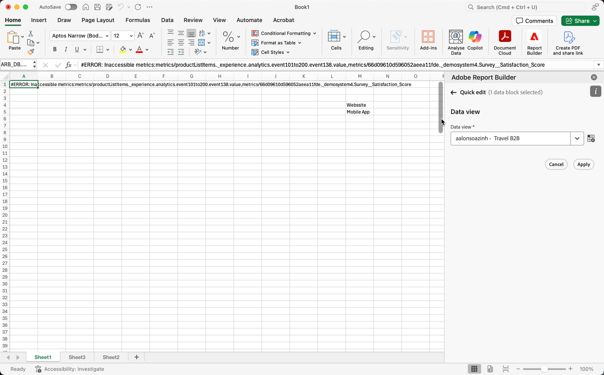

# About Report Builder for Customer Journey Analytics

Report Builder is a Microsoft Excel add-in that allows you to easily create, edit, and refresh custom reports using Customer Journey Analytics data. With Report Builder and Excel, you can use the simple but flexible drag-and-drop UI to easily build complex data requests.

Use Report Builder customizations to:

- Reference existing worksheet cells to get the perfect row order, date range, or filter

- Create custom dates using calendar, cell references, or date math

- Design your tables, visualizations, and drop-down menus with familiar Excel formatting tools

Report Builder for Customer Journey Analytics is available for Excel on the following platforms:

- macOS
- Windows
- Web browsers

>[!NOTE]
>
>This documentation is for Report Builder for Customer Journey Analytics. For information about Report Builder for Analytics on Windows, see [link to RB for Analytics]

You can download Report Builder for Customer Journey Analytics from the Microsoft AppSource Store. [Link]

__Report Builder Set Up

You can quickly access Report Builder using the Excel Add-in menu.

## Requirements

Report Builder for Customer Journey Analytics is supported on the following operating systems and web browsers.

### macOS

- macOS Version 10.x or later

### Windows

- Windows 10

### Browsers

- Chrome Version \_\_\_

- Firefox Version \_\_\_

- Safari Version \_\_\_\_

## Excel Add-in

You must install the Excel add-in to use Report Builder for Customer Journey Analytics. You can obtain the Report Builder add-in for Excel at the following sites. Once you install the add-in, you can access Report Builder from within an open Excel workbook.

### Download and install the Report Builder add-in

**\<\< NEED to revisit this workflow when the process is established
\>\>**

1.  Download the add-in for your system and save the manifest.xml file   to a local directory.

- macOS \<\< Add-in Name >\> the App Store

- Windows \<\<Add-in Name>\> the Microsoft AppSource

- Browser \<\<Add-in Name>\> \_\_\_\_\_\_\_\_\_

1.  Launch Excel.

1.  From the Insert menu, select Office Add-ins.

1.  Follow the instructions to upload and install the manifest.xml file.

After installing the Report Builder add-in, the Report Builder icon is displayed in the Excel ribbon.

{ width=50% height=50% }

## Log in to Report Builder

Be sure you installed the \<Report Builder for Excel add-in for your operating platform or browser.

1.  Open an Excel workbook.

 Need image

1.  Click the Report Builder icon to launch Report Builder.

 

1.  From the Adobe Report Builder toolbar, click **Login**.

 

1.  Enter your Adobe Experience ID account information. Your account   information should match your Customer Journey Analytics credentials.

 When you log in, you are logged in to the default organization defined for your profile. For information about changing to another organization, see [link].

 

### Sign out

You can sign out from Report Builder from the user profile pop-up.

1.  Save changes to any open workbooks.

2.  Click the avatar icon to display your user profile.

 

1.  Click Sign Out.

### Switch organizations

When you are logged in to Report Builder, you can switch between organizations.

1.  Click the name of the organization that is displayed when you log in.

 

1.  Select an organization from the list of available organizations. Only organizations that you have access to are listed.

__Create a Data Block

Use the Report Builder hub to create a data block and configure its parameters.

1.  Click **Create a data block**.

 

1.  Select a **Data Block location**, **Data view**, and a **Date range**.

 

## Data Block location

The Data Block location defines where in the Excel worksheet to add your report.

 To specify the data block location, select a single cell in the worksheet or enter a cell address such as a3, \$a3, a\$3 or sheet1!a2. The cell specified is the upper-left corner of the data block when the data is retrieved.

## Data view

 The Data view allows you to choose a data view from a predefined list of data views or from a data view in a cell location.

## Date range

 The Date Range section allows you to choose a date range from a calendar control, from predefined or customized rolling date expression, or from date range located in cell values. For additional information about the data range, see \<\< link to date range section>\>.

1.  Click **Next**.

 Need image

1. Add Dimentions, Metrics, Filters.

 Use the Search field to locate a component name. You can double-click the name in the Search field to add the component to the pivot table. You can also drag and drop the component from the component list to the pivot table.

 Filters can be applied to the Filters pane or dropped on top of one of the metrics.

 You can reorder components within each Table pane using drag and drop to move a component.

 

1. Arrange the items in the pivot table to customize the layout of your data block.

 The Report Builder pivot table feature allows you to drag and drop components to group them in a meaningful way.

 **\<\< NEED: screen shot showing layout with Page in the Row, Metrics Header in the column and Visit in the Metric section \>\>**

 

1. Click **Finish**.

 A processing message is displayed while the analytics data is retrieved.

 

The Data Block is retrieved and displayed in the spreadsheet.

The Report Builder Commands and Quick Edit panels are updated to reflect the current selected cells.

__Report Builder Hub

The Report Builder hub is shown when you successfully log in to Report
Builder. The hub is displayed on the right-side panel of the Excel
window.

**\<\< NEED: full spreadsheet screen shot \>\>**

Use the Report Builder hub to create, update, or delete data blocks. 

### Commands panel

After you create a data block, the Report Builder hub displays the Command panel and the Quick Edit panel.

The Commands panel is used to access commands that are compatible with the selected cells or the previous action.

You can select several distinct cell ranges by using the Ctrl key
(Windows) or the Command key (macOS) as you click and drag. The changes
made using the Command panel apply to all the data blocks that are
included in all the selected ranges.

**\<\< NEED -- screenshot that shows part of the worksheet with one data
block in the cell selection \>\>**

Commands are displayed based on the content of the selected cells.

| Commands displayed      | Available when… | Purpose |
| ------------------ | ------------------ | ------------------ |
| Create data block  | One or more cells is selected in the workbook. | Used to create a data block |
| Edit data block | The selected cell or cells range is part of one data block only. | Used to edit a data block |
| Refresh data block | The selection contains at least one datablock. The command will refresh only the datablocks in the selection. | Used to refresh one or more data blocks |
| Refresh all data blocks | The workbook contains one or more datablocks. | Used to refresh ALL datablocks in the workbook. |
| Copy data block | The selected cell or cells range is part of one or more datablocks.| Used to copy a data block |
| Paste data blocks | The previous action taken in Report Builder was Cut Data Block(s) or Copy Data Block(s) AND if the selected location has enough cell- area to paste the copied data blocks without overlapping with pre-existing data blocks | Used to paste a copied or cut data block |

### Quick Edit panel

When you select one or more data blocks in a spreadsheet, the Quick Edit panel is displayed. You can use the Quick Edit panel to change parameters across all the selected data blocks.

You can select several distinct cell ranges by using the Ctrl key (Windows) or the Command key (macOS) as you click and drag. The changes made using the Quick Edit sections apply to all data blocks that are present in the selected ranges. 

#### Data View

If multiple data blocks are selected and they are not assigned to the same data view, the Data View link display shows *Multiple*.

When you change the data view, all data blocks in the selection adopt the new data view.

You can choose a data view from a list of available data views.

The list displayed depends on whether you are creating a new data block, editing an existing data block, or editing multiple data blocks.

#### Date Range

If multiple data blocks are selected and they are not assigned to the same date range, the Date Range link displays *Multiple*.

#### Filters

The Filters link displays a summary list of the filters used by the selected data blocks.

If multiple data blocks are selected and that are not assigned dto the same filters, the Filters link displays *Multiple*.

### Components

When you create a new data block or edit an existing data block, the Components pane is displayed.

This Components tabs allows you to choose elements to include in the data block.

- Dimensions

- Metrics

- Filters

\<\< need new screen shot \>\>

When you are editing a data block, if you make changes to a component and then switch to another component without saving the change, you're prompted to save or discard the changes.

### Pivot Table

Use the Pivot Table to configure how the data block elements are organized and displayed in your report.

The pivot table allows you to easily organize data in a meaningful way:

- Drag components to the pivot tables
- Display components in rows and columns
- Reuse the same metric multiple times
- Move components to order them within pivot table lists

Double click an item in the Components pane to add it to the
Pivot table at its preferred section.

- A Dimension component is moved to the Row section or to the Column
  section if you have a dimension already in the columns.
- A Date component is moved to the Column section.
- A Filter component is moved to the Filters section.

### Data Block Output

When you add, move, or remove items in the Pivot Table, the data block is pasted in the spreadsheet at the selected Data Block anchor location.

The list of available metrics, dimensions, and filters is dependent on the selected data view. Each time a new data view is selected, the Component tabs are updated to reflect the new list of available items.

__Work with Filters

You can add filters when you use the Create a new data block option or when you use the Quick Edit panel. For information about adding filters when you create a new data block, see \<\<link to Create a Data Block section>\>.

After a data block is created, you can use the Quick Edit panel to modify, remove, or replace filters.

Using the Quick Edit panel, you can also substitue filters. Select one or several data blocks in the worksheet to substitute or modify filters.

When you select a range of cells in the spreadsheet, the Quick Edit panel Filter link is updated with the list of filters present in the data blocks that are included in the selection.

## Modify segments applied to selected data blocks

Click the Segment link to launch the Quick Edit - Segment Panel.

 \<\< we should get a current shot of data with both hub screen shots as shown below \>\>*

Use the Quick Edit Segment Panel to complete the following tasks:

- Add or remove a segment
- Replace a segment

## Add or Remove a Segment from a Data Block

You can add or remove segments to selected data blocks using the Quick Edit mode.

1.  Select a range of cells that intersects several data blocks.

 

1. Click Edit data block.

 The Segment Panel is displayed.

 

 

1. Search for the segments that you want to add or remove.

 You can use the Add/Remove search field to search for a specific segment or enter a search term to conduct a broader search. The list of searchable segments is all segments accessible to your user account or segments that are present in one or more data blocks.

 You can conduct the following searches:

- Search All the segments that are present in all the data blocks.
- Search for segments in one or more data blocks.

 

 In the screenshot above, \"USA\", \"Canada\" **and** \"Brazil\" segments were **all present** in **each** of the data blocks listed in the Quick edit mode.

 In the screenshot above, Mexico and Chile are present in some of the data blocks but they are not common all data blocks. Mexico and Chile maybe or may not be present in the same data block.

1. Verify the list of data blocks where the segment will be added to.

1. To remove Click the delete icon \< x > to the right of a data block name to remove the data block.

1. Click Apply to add or remove one or more segments to either list.

You can apply your changes when at least one segment is added to all the data blocks or at least one segment is removed from either list.

Click Cancel to revert and cancel out of adding or removing any selected segments.

## Replace a Segment

Use the Replace tab panel to replace one segment with another segment.

1.  Click the Replace tab.

 Need image

1. Choose one or more segments that you want to replace. If multiple   segments are selected, all segments must be present in a given data block for the replacement to occur.

 

1. Search for one or more segments that will replace the selected segments.

 

 The segment is added to the Replace with... list.

 

 In the screenshot above, \"Exclude BOT Traffic\", \"Mobile\" **and** \"North America\" segments were **all present** in **each** of the data blocks being edited.

1. Click apply.

 The list of segments is updated to reflect the substitution/replacement.

 

__Select a Date Range

\<\< ADD introductory statement indicating where Date Range can be changed in the user interface -- both in Create new data block and in Quick Edit panel \>\>

You can choose a date or date range for the data block using the following formats:

- Static dates
- Rolling dates using a date expression or a formula such as td
- Using dates entered in the worksheet cells

You have the option to exclude today on any selected date ranges.

1.  Use the Create new data block panel or the Quick Edit panel to select a date range.

 

1. Change the date using the following:

- The Calendar field
- The preset drop down menu
- The rolling date mode
- The customize expression mode

  

  

## Use the Calendar

When you create a new data block, you select the date range using the calendar.

1.  Select Calendar.

  NEED Image

1. Click the calendar icon to display a monthly calendar.

1. Select the date range or enter the dates in the date field.

1. Click Next.

 

 

 When you already have data blocks created, you can also reset the date range using the Date Range link in the Quick Edit menu.

1.  Click the Date Range link to display the Calendar pane.

 NEED Image

1. Click the calendar icon to display a monthly calendar or enter a date range start and end period in the format: YYYY-MM-DD~~.~~

1. Click Apply.

 

## Use Rolling Dates

The rolling dates option allows you to select a date range using rolling dates. This includes rolling dates on a daily, weekly, quarterly, or yearly basis.

When you create a new data block,

1.  Select Use rolling dates.

 NEED Image

1. Set the rolling dates using the following parameters:

- Rolling yearly
- Rolling daily
- Start
- End

1. Click Next.

 

## Use Custom Expressions

The custom expression option allows you to change the date range by building a custom expression or you can enter an arithmetic formula.

1.  Click Use rolling dates

 NEED Image

1. Click Use custom expression.

 When the Use custom Express option is selected, the standard Rolling Date Range controls are disabled.

 

1. Enter a custom expression.

 For a sample list of custom expressions, see \<\< link to expression list tables \>\>

1. Click Next.

To create a custom formula,

1. Enter a Date Reference.

1. Add Date Operators to move the date to the past or future.

 You can enter a custom date expression that includes multiple operators, such as tm-11m-1d.

### Date References

The following table lists several date reference examples.

  | Date Reference | Type         | Description                |
  | -------------- | ------------ | -------------------------- |
  | 1/1/10         | Static Date  | Entered in ISO Date format |
  | td             | Rolling Date | Start of current day    |
  | tw             | Rolling Date | Start of current week     |
  | tm             | Rolling Date | Start of current month     |
  | tq             | Rolling Date | Start of current quarter   |
  | ty             | Rolling Date | Start of current year      |

### Date Operators

The following table lists several date operator examples.

  | Date Operators | Unit     | Description                                  |
  | -------------- | -------- | -------------------------------------------- |
  | +6d            | Day      | Add 6 days to the Date Reference             |
  | +1w            | Week     | Add one full week to the Date Reference      |
  | \-2m           | Month    | Subtract 2 full months to the Date Reference |
  | \-4q           | Quart er | Subtract4 quarters to the Date Reference     |
  | \-1y           | Year     | Subtract one year to the Date Reference      |

### Date Expressions

The following tables lists several date expression examples.

  | Date Expression | Meaning                              |
  | --------------- | ------------------------------------ |
  | td-1w           | First day of last week               |
  | tm-1d           | Last day of previous month           |
  | td-52w          | Same day, 52 weeks ago               |
  | tm-11m-1d       | Last day of the same month last year |
  | "2020-09-06"    | Sept 9th, 2020                       |

## Exclude Today

Choose the **Exclude today** option to exclude today from a selected date range. Choosing to include today may pull incomplete data for today.

When selected, the Exclude Today option excludes the current day from all date range modes (calendar, rolling dates, or custom expressions).

## Valid date ranges

The following date range requirements apply:

- The start and end dates must be in the following format: YYYY-MM-DD

- The start date must be earlier to or equal to the end date. Both dates can be set to the future.

- When using rolling dates, the start date must be today or in the past. It must be in the past if Exclude today is checked.

- You can create a static date range that is set for the future. For example, you may need to set a future date for a marketing campaign launch next week. This would create a workbook monitoring for the campaign ahead of time.

- Date formats

## Use Date Range From Cell

The date range can be specified in cells in the spreadsheet. The *Date range From cell* option lets you choose the data block start and end date from selected cells. When you select the From cell option, the Calendar Panel displays From and To fields.

__Dimension Search

Dimension search allows you to search for any dimension included in a data block except for the date unit dimension. You can also specify the number of items to return for each dimension. The dimension search operators match the search filters used in Adobe Analytics Workspace. You can enter search terms directly, or they can be referenced as cell values.

You can search for data using the following types:

- Most Popular \<\<may be renamed to dimension search>\>

- Specific

The search icon is displayed in the Pivot table next to a dimension name.

To set dimension search operators

1.  Click the filter icon.

 NEED Image

1. Click the **Filter type** drop down menu to navigate to the Specific Filtering type.

1. Select the **Most popular** or **Specific** option.

1. Choose the **From list** or the **From range of cells** option.

1. Select items from the Available Items list or select a range of cells.

1. Click **Apply** to add the filter.

A notification is shown to indicate that the filter has been added.

Hovering above the row section displays a dimension with an applied filter.

 NEED Image>

## Most Popular Filtering

\<\< need description >\>

### Page Number and Number of entries

Use the Page Number and Number of entries fields to enter positive and numerical (non floating point) values for filtering.

Default values

- Starting rank: 1
- Number of Entries: 10

Mininmum and maximum values

- Starting Rank: Min = 1, Max: 50 million
- Number of Entries: Min = 1, Max: 50,000

### Include \"No Value\"

In Customer Journey Analytics, some dimensions collect a "no value" entry. This filter allows you to exclude these two values from reports. For example, a common example would be to create a classification such as the Product Name classification based on the Product SKU key. If a specific product sku has not been set up with its specific Product Name classification, its Product Name value is set to "no value".

You can select the Include "no value" option. You can also match the value if any or all criteria are met. The default value is **If any criteria are met**.

This option is always visible but only enabled for a subset of dimensions.

### Match criteria

You can set match criteria for phrases, terms, equals or doesn't equal, or starts and ends with values.

To set up match criteria

1.  Select a match operator from the drop-down list.

 

1. Enter a value into the search term field.

1. Click Add row to add another search operator and value.

1. Click the delete icon to remove the term.

You can include up to 10 search criteria components.

## Specific Filtering

Use the Specific filtering type to choose an exact value dimension item. The items can be retrieved from a list or from a range of cells.

### From list

1. Select the From list option to search for a specific item and choose from the available items list.

 When you select the From list option, the list is populated with the most popular dimension items for that dimension, for the last 90 complete days.

 

 The Available Items list is ordered by popularity from the most popular to the least popular.

1. Enter a search term in the Add item field to search the full list.

1. Click **Show Items for the last 6 months** to display a list of items from the past six months.

  

 After data from the past six months is loaded, the link is updated to Show Items for last 18 months

 When you select an item in the list, it's automatically displayed in the top of the Selected Items Category.

 

1. To delete an item from the list, click the delete icon to remove the item from the list.

1. To move an item in the list, click \... to display the move menu.

 

1. Apply your changes

 When you add an item to the list or when you delete an item, click Apply to apply your changes.

### From range of cells

Select the From range of cells option to choose a range of cell that contain the list of dimensions items to match.

When you select a range of cells, consider the following restrictions:

- The range must have at least one cell
- The range cannot have more than 50,000 cells
- The range has to to be in a single uninterrupted row, or column:

 NEED Image

- A1:A100 => 1 column, 100 rows > valid
- A1:B100 => 2 columns, 100 rows > invalid
- A1: AA1 => 26 columns, 1 row > valid
- A1: AA3 => 26 columns, 3 rows > invalid
- A1:A10; A11:A20 => 1 column, 20 rows, but broken down into 2
  distinct ranges > invalid

Your selection can contain empty cells or cells with values that don't match with a specific dimension item.

### Specific Filtering outside of the Dimension Filtering Panel

In addition to using the Specific Filter from List option, you can also \<\<specify Dimensions using the \_\_\_\_\_.\>\>

From the Component's Dimension tab, you can click a Dimension \"right chevron\" icon to reveal the list of dimension items. Drag and drop these items into the Pivot table.\<\< It should add a Dimension entity of the same type to which a Dimension filter from list will be configured with the dropped items.\>\>

You can continue to drag and drop items to the Pivot table or click the Filter icon to further edit the list using the Dimension Filter From List option.

__Report Builder Settings

The Settings pane allows you to configure application-level settings such as the language displayed by the UI or whether or not to work in off-line mode. The settings are applied immediately and they are set for all future sessions until they are changed.

To change Report Builder settings

1.  Click the Settings icon.

 Need image

1. Make changes for off-line mode, as-of date, the language, or troubleshooting settings.

1. Click Home to return to the Report Builder hub.

 

 

## Off-line mode

When creating and editing a data block in off-line mode, data is not retrieved. Instead, simulation data is used so that you can quickly create and edit a data block using data that isn't real. When you work in online mode again, the *Refresh data block* command or *Refresh all data blocks* command will refresh the data blocks that you created with actual data.

Off-line mode is available when you create or edit a data block.

To turn off-line mode on

1.  Click the Settings icon.

1.  Select **Enable off-line mode**.

 NEED Image

1. Enter a positive integer in the **Display metric data as** field.

## As of date

The As of date setting allows you to choose the date reference for Data Blocks with rolling dates.

- Set to current date—When Data Blocks are refreshed and if any of the Data Blocks have rolling date ranges, the date ranges are set with today as the date reference.

- Ask me upon refresh—When Data Blocks are refreshed and if any of the Data Blocks have rolling date ranges, you can choose a new date reference for today.

## Language

You can choose the language for the Report Builder UI. All supported Adobe Analytics languages are available.

Choose a language from the drop-down menu to set the language displayed in the Report Builder hub.

## Troubleshooting

Use the Troubleshooting setting to log all client/server data to local file. This option can help to resolve support tickets.

To turn on troubleshooting and send date to a log file, click **Log report builder request to local file**.
