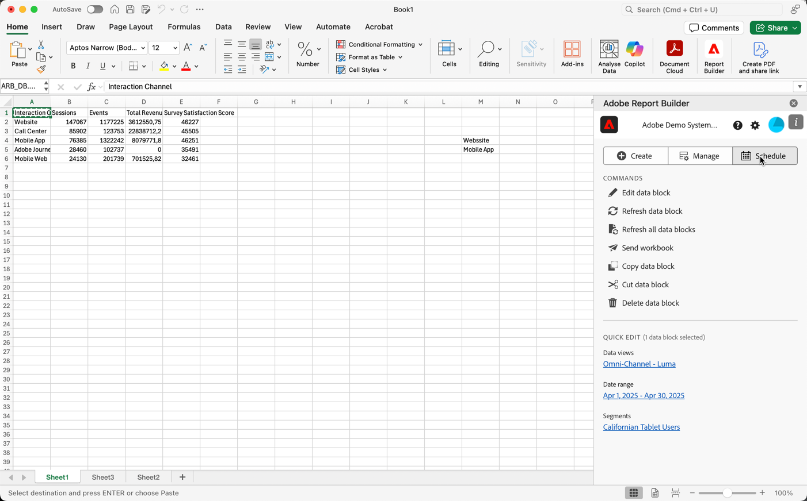
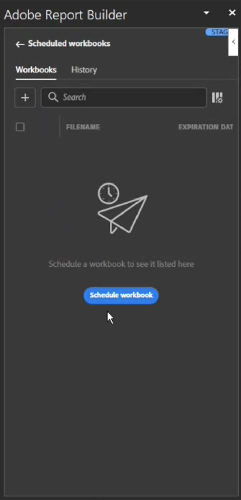
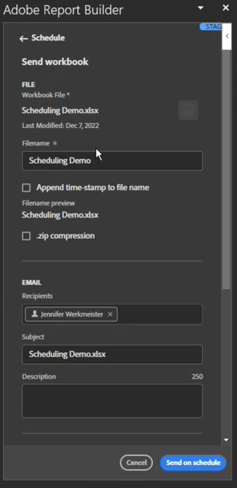
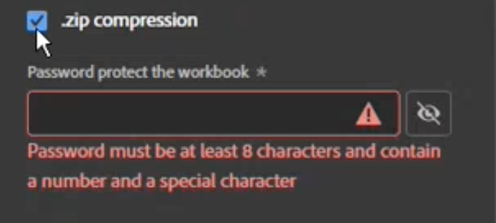
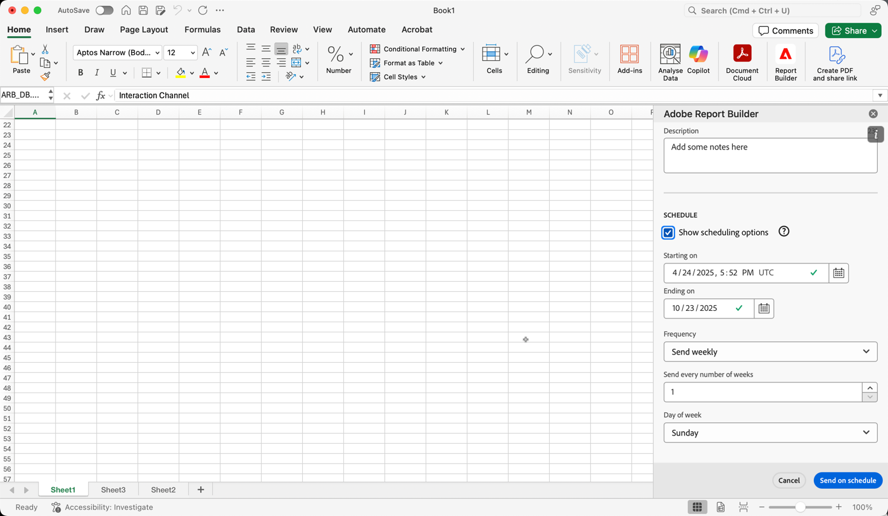

# Schedule Workbooks

After you saved your workbook and completed your analysis, you can easily share your workbook with others on your team using the scheduling feature. The schedule feature allows you to create a schedule that automatically refreshes the data in the workbook and emails the Excel workbook file as an attachment to your specified audience at a specific date and time. Setting up a schedule provides recipients with regular updates automatically. You can also use the schedule feature to send out the workbook once without scheduling automatic updates.

You can create multiple schedules for a single workbook. For example, you can send a workbook to your team on a daily basis and you can send the workbook to your manager once a week by creating two different schedules.

The schedule feature also allows you to set up password protection for a workbook and edit previously scheduled workbooks.

>[!BEGINSHADEBOX]

See  [Schedule Workbooks](https://video.tv.adobe.com/v/3413079/?quality=12&learn=on){target="_blank"} for a demo video.

>[!ENDSHADEBOX]

## Schedule a workbook

To schedule a workbook:

1. Select **[!UICONTROL Schedule]** in the Report Builder hub to create a schedule so that you can automatically distribute a workbook Excel file (.xlsx) to an individual or a group.

   

1. Select **[!UICONTROL Schedule Workbook]** or  to create a new scheduled workbook.

    

    The scheduling pane displays some pre-defined information about the workbook such as the workbook name and the last date that the workbook was modified.

### File

In the **[!UICONTROL File]** section you provide details of the file type, name and a password to protect the file.

1. Use  to select the current workbook, if not already selected.

1. (Optional) Enter a **[!UICONTROL File name]**.

    The workbook file name defaults to the name of the workbook but you can change this if you want.

1. Select a **[!UICONTROL File type]**.

   * **[!UICONTROL Excel]**
   * **[!UICONTROL PDF]**
   * **[!UICONTROL CSV]**

   When you select **[!UICONTROL CSV]**, be aware that the scheduled workbook is sent as a zip attachment. Some corporate email administrations may block email with zip attachments. You see a warning accordingly.

1. (Optional) Select **[!UICONTROL Append time-stamp to file name]**.

    You can append a timestamp to the file name to identify the date the workbook was updated. This is helpful to see which version of a workbook was sent on a specific date. When selected, you can choose between:

    * **[!UICONTROL ISO Date format]**, which results in `YYYY-MM-DD` being appended to the filename.
    * **[!UICONTROL ISO Date format + time stamp]**, which results in `YYYY-MM-DD_HH-MM-SS` being appended to the filename.

<!-- Does no longer seem to be an option? 
1. (Optional) Select **.zip compression** to compress the file and set up password protection on the file.

    When you make this selection, you're prompted to enter a password to open the file. This is helpful if you have concerns about data security and you want to password protect the workbook. Protecting the file with a password requires you to select **.zip compression**. The password must be at least 8 characters and contain a number and a special character.

    {width="55%"}
-->

1. Enter a password in **[!UICONTROL Password protect the workbook]**. A valid password requires at least 8 characters, a number, and a special character. Select  to display the password and  to hide the password (default).

### Email

In the **[!UICONTROL Email]** section you provide recipients, subject and description of the email.

1. Enter **Recipients**. You can enter the name of a person that is recognized in your organization, or you can enter an email address of a person or outside of your organization.

1. Enter the **Subject** of the email and a description for your recipients. The subject defaults to the workbook file name but you can modify the subject if needed. You can add details in the description section.

### Schedule

In the **[!UICONTROL Schedule]** section you can define the schedule to send the emails with the workbook to your recipients.

1. Select **[!UICONTROL Show scheduling options]** to define a schedule.

1. Enter a start date in **[!UICONTROL Starting on]**. Alternatively, select  to pick a start date from the calendar.
   
1. Enter an end date in **[!UICONTROL Ending on]**. Alternatively, select  to pick an end date from the calendar.

1. Select a **[!UICONTROL Frequency]**. Depending on the frequency selected, you do have additional options. See table below.

   | Frequency | Options |
   |---|---|
   | **[!UICONTROL Send hourly]** | Enter a value for **[!UICONTROL Send every number of hours]**. |
   | **[!UICONTROL Send daily]** | Select a **[!UICONTROL Daily frequency]**: **[!UICONTROL Send every day]**, **[!UICONTROL Send every weekday]**, or **[!UICONTROL Custom frequency]**. If you select **[!UICONTROL Custom frequency]**, enter a value for **[!UICONTROL Send every number of days]**. |
   | **[!UICONTROL Send weekly]** | Enter a value for **[!UICONTROL Send every number of weeks]**. And select a **[!UICONTROL Day of week]**. |
   | **[!UICONTROL Send monthly by day of the week]** | Select a **[!UICONTROL Day of week]** and a **[!UICONTROL Week of month]**. |
   | **[!UICONTROL Send monhtly by day of the month]** | Select a value from **[!UICONTROL Send on this day of the month]**. |
   | **[!UICONTROL Send yearly by day of the month]** | Select a **[!UICONTROL Day of week]**, select a **[!UICONTROL Week of month]**, and select a **[!UICONTROL Monthy of year]**. |
   | **[!UICONTROL Send yearly by specific date]** | Select a **[!UICONTROL Month of year]** and select a value from **[!UICONTROL Send on this day of the month]**. |

### Send

To send the workbook:

* If you have not defined a schedule using **[!UICONTROL Show scheduling options]**, select **[!UICONTROL Send now]** to send the workbook by email immediately.
* If you have defined a schedule using **[!UICONTROL Show scheduling options]**, select **[!UICONTROL Send on schedule]** to send the workbook by email using the schedule you defined.

In both cases, you will see a confirmation toast at the bottom of the Report Bulder hub.

To cancel sending the workbook, select **[!UICONTROL Cancel]**.

## View and edit scheduled workbooks

You can view and manage all scheduled workbooks in the **[!UICONTROL Workbooks]** tab.

1. Select **[!UICONTROL Schedule]** in the Report Builder hub 

1. Select the **[!UICONTROL Workbooks]** tab. You see a list of all scheduled workbooks.

   

   You can hover over the icon to see the status of a scheduled workbook.

   Use  to search for specific scheduled workbooks.
   Use  to define which columns to show.

1. Select one or more workbooks.

   
   
   The following options are available:

   | Option | Description |
   |---|---|
   |  | Edit the schedule for a selected workbook. |
   |  | Show the history of selected workbooks. |
   |  | Pause the schedule of selected workbooks. |
   |  | Resume the schedule of selected workbooks. |
   |  | Download the selected workbook into a new workbook. |
   |  | Delete the schedule of selected workbooks. |
 

## Review history and status

You can view the history and status of scheduled workbooks in the **[!UICONTROL History]** tab.

1. Select **[!UICONTROL Schedule]** in the Report Builder hub.

1. Select the **[!UICONTROL History]** tab. You see a list of all scheduled workbooks.

   

   Use  to search for specific workbooks in the list.
   Use  to define which columns to show.

   The **[!UICONTROL History]** tab allows you to review the status of each scheduled task. A separate row documents the status change for each scheduled task.

   * A green  indicates that the workbook was sent successfully. 
   * A  indicates that an error occurred.

Alternatively, you can select  for one or more selected workbooks in the **[!UICONTROL Workbooks]** tab. This action will show the **[!UICONTROL History]** tab with a list filtered by your selection. Select  to remove a filter.
