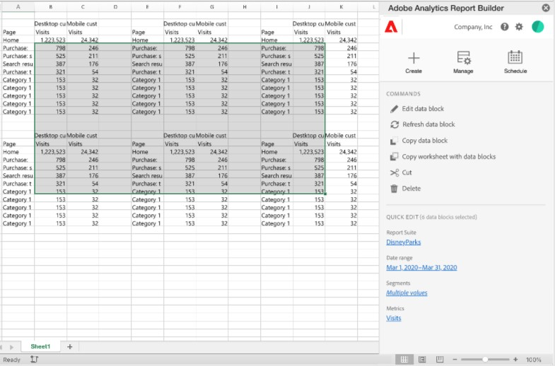
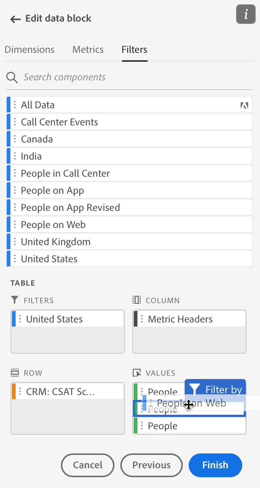
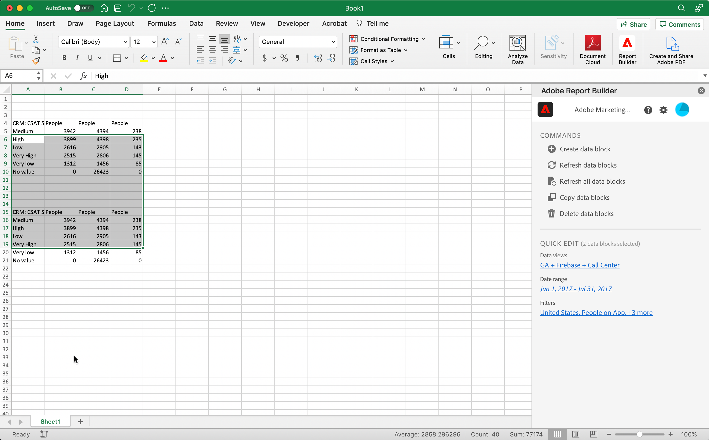
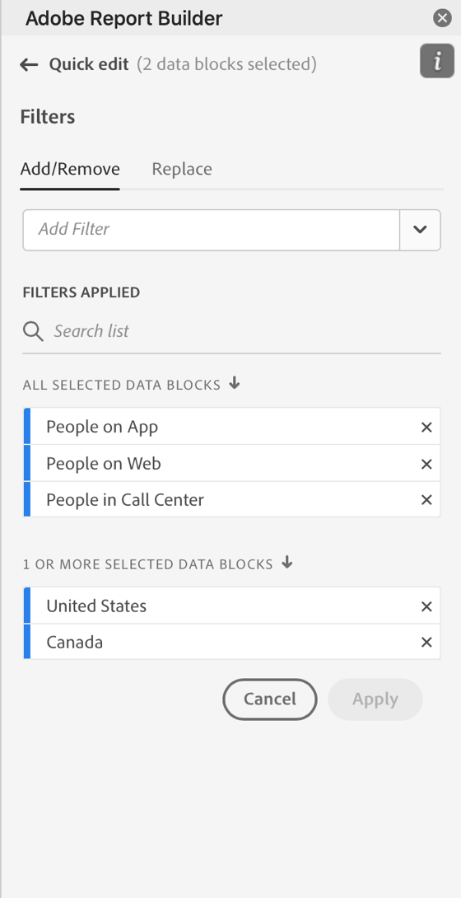
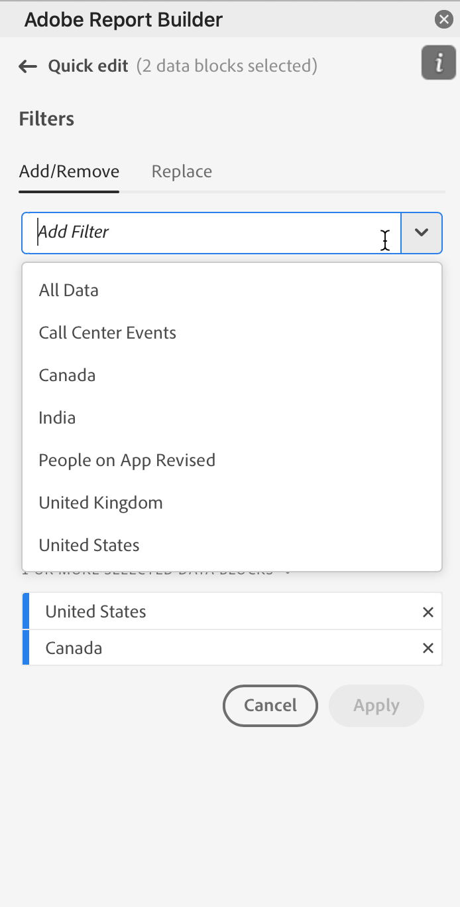
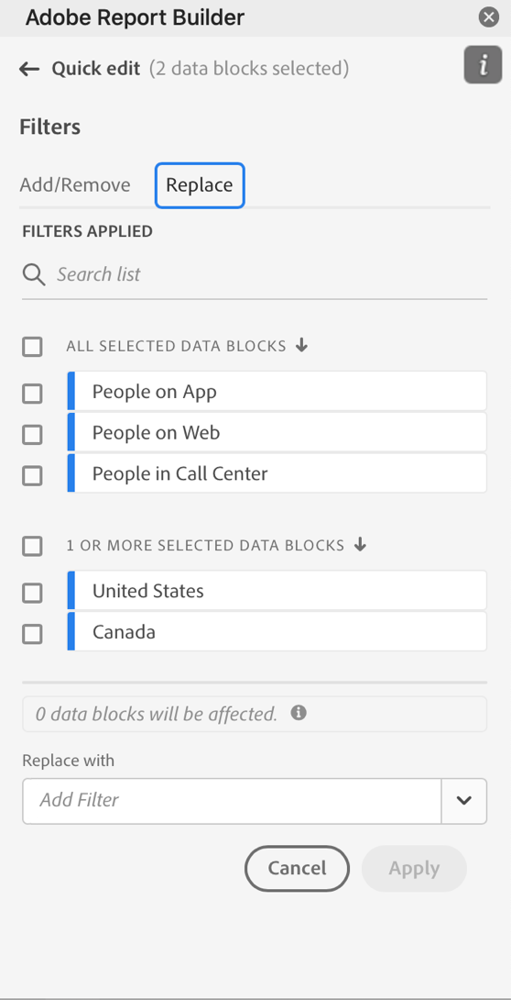
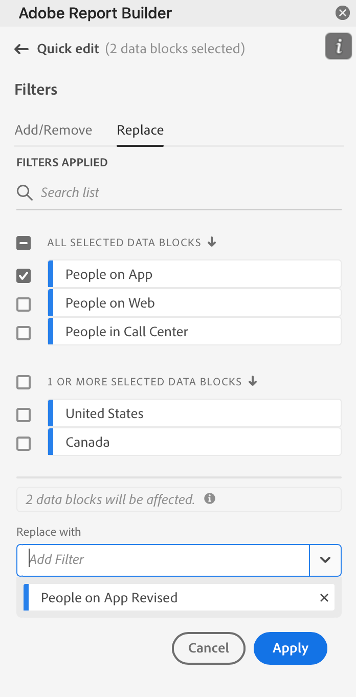

# Work with Filters in Report Builder

You can apply Filters when you create a new data block or when you select the **Edit data block** option from the COMMANDS panel.

## Apply filters to a data block

To apply a filter to the entire data block, double-click a filter or drag and drop filters from the components list into the Filters section of the Table.

## Apply filters to individual metrics

To apply filters to individual metrics, drag and drop a filter onto a metric in the table. You can also click the **...** icon to the right of a metric in the Table pane and then select **Filter metric**. To view applied filters, hover over or select a metric in the Table pane. Metrics with applied filters display a filter icon.

<!--  -->

## Quick edit filters

You can use the Quick edit panel to add, remove, or replace filters for existing data blocks.

When you select a range of cells in the spreadsheet, the **Filters** link in the Quick edit panel displays a summary list of the filters used by the data blocks in that selection.

To edit filters using the Quick edit panel

1.  Select a range of cells from one or multiple data blocks.

    

1.  Click the Filters link to launch the Quick edit - Filters panel.

    

### Add or remove a filter

You can add or remove filters using the Add/Remove options.

1.  Select the **Add/Remove** tab in the Quick edit-filters panel.

    All filters applied to the selected data blocks are listed in the Quick Edit-filters panel. Filters applied to all data blocks in the selection are listed under the **Applied to all selected data blocks** heading. Filters applied to some but not all data blocks are listed under the **Applied to 1 or more selected data blocks** heading.

    When multiple filters are present in the selected data blocks, you can search for specific filters using the **Add Filter** search field.

    

1.  Add filters by selecting filters from the **Add filter** drop down menu.

    The list of searchable filters includes all filters accessible to the data views that are present in one or more of the selected data blocks as well as all the filters that are available globally in the organization.

    Adding a filter applies the filter to all data blocks in the selection.

1.  To remove filters, click the delete icon **x** to the right of filters in the **Filters applied** list.

1.  Click **Apply** to save changes and return to the hub panel.

    Report Builder displays a message to confirm the applied filter changes.

### Replace a filter

You can replace an existing filter with another filter to change how the data is filtered.

1.  Select the **Replace** tab in the Quick edit-filters panel.

    

1.  Use the **Search list** search field to locate specific filters.

1.  Choose one or more filters that you want to replace.

1.  Search for one or more filters in the Replace with field.

    Selecting a filter adds it to the **Replace with**... list.

    

1.  Click **Apply**.

    Report Builder updates the list of filters to reflect the replacement.

### Change filters for multiple data blocks from the cell

If you have multiple data blocks in your report, you can apply the same filters defined in the cell to multiple data blocks.

1.	Create a data block and define a data view from a cell. See [Create a Data Block](./create-a-data-block.md).
1.	Create another data block if one doesn’t exist and click **Filters** to define filters.
1.	Click **Create filter from cell** and choose the cell previously defined with the filters you want to apply. 
1.	Click **Apply** to apply the filter to one or more data blocks.

