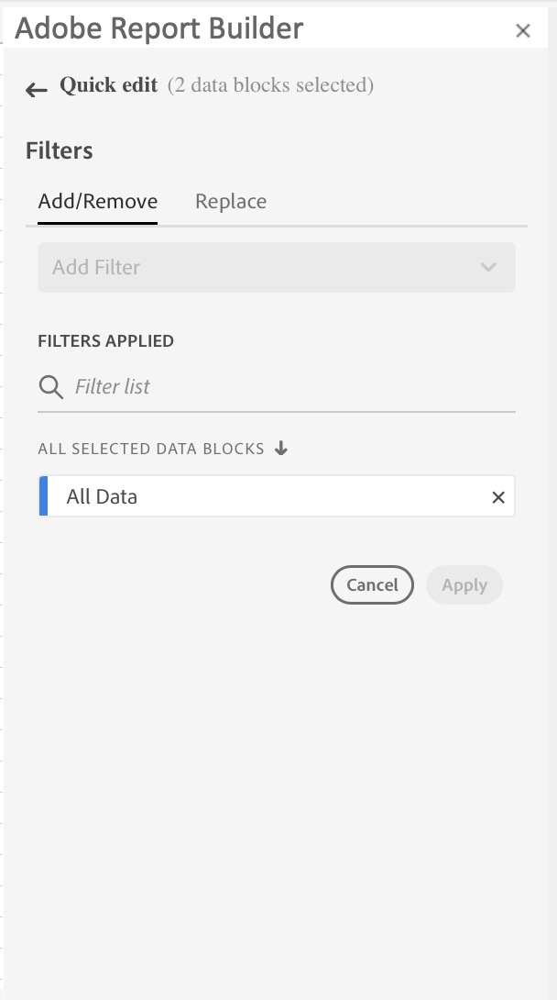
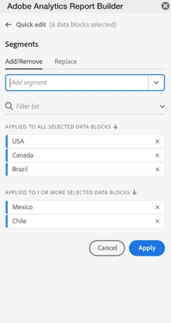
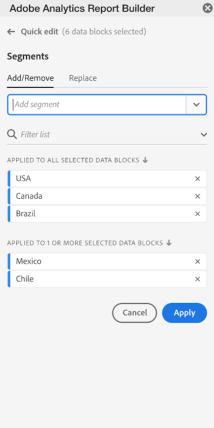
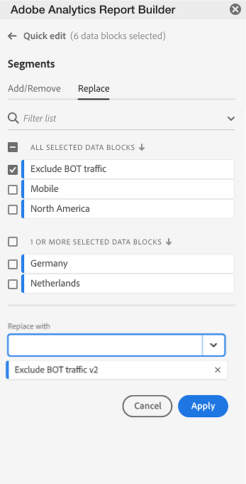
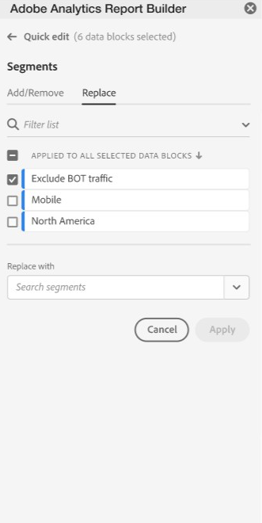
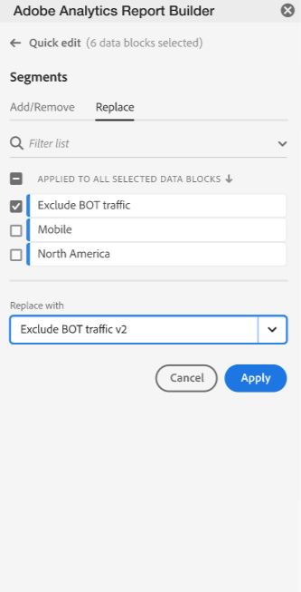
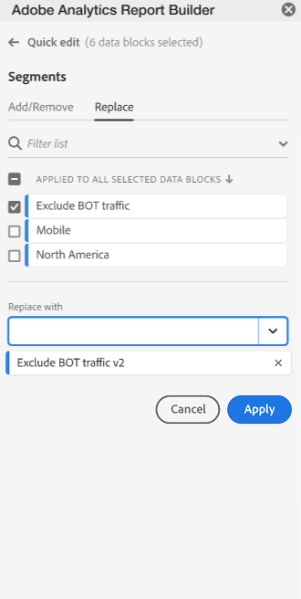
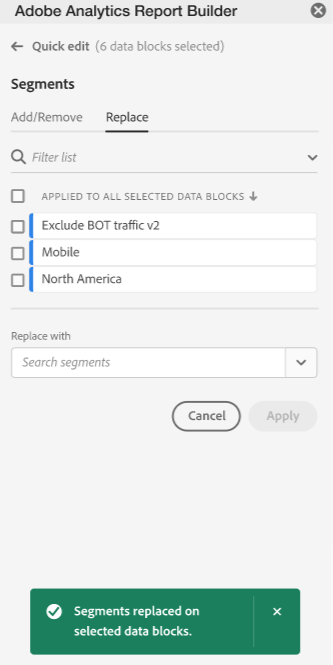

# Work with Filters in Report Builder

You can add filters when you use the Create new data block option or when you use the Quick Edit panel. For information about adding filters when you create a new data block, see [Create a Data Block](./create-a-data-block.md).

After a data block is created, you can use the Quick Edit panel to modify, remove, or replace filters. When you use the Quick Edit panel, you can also substitue filters. Select one or several data blocks in the worksheet to substitute or modify filters.

When you select a range of cells in the spreadsheet, the Quick Edit panel Filter link is updated with the list of filters present in the data blocks that are included in the selection.

## Modify filters applied to selected data blocks

Click the filter link to launch the Quick Edit - filter Panel.

 \<\< Need a current shot showing data with both hub screen shots as shown below \>\>*

Use the Quick Edit Filter panel to complete the following tasks:

- Add or remove a filter
- Replace a filter

## Add or Remove a Filter from a Data Block

You can add or remove filters to selected data blocks using the Quick Edit mode.

1.  Select a range of cells that intersects several data blocks.

 

1. Click Edit data block.

 The filter Panel is displayed.

 

 

1. Search for the filters that you want to add or remove.

 You can use the Add/Remove search field to search for a specific filter or enter a search term to conduct a broader search. The list of searchable filters is all filters accessible to your user account or filters that are present in one or more data blocks.

 You can conduct the following searches:

- Search All the filters that are present in all the data blocks.
- Search for filters in one or more data blocks.

 

 In the screenshot above, \"USA\", \"Canada\" **and** \"Brazil\" filters were **all present** in **each** of the data blocks listed in the Quick edit mode.

 In the screenshot above, Mexico and Chile are present in some of the data blocks but they are not common all data blocks. Mexico and Chile maybe or may not be present in the same data block.

1. Verify the list of data blocks where the filter will be added to.

1. To remove Click the delete icon \< x > to the right of a data block name to remove the data block.

1. Click Apply to add or remove one or more filters to either list.

You can apply your changes when at least one filter is added to all the data blocks or at least one filter is removed from either list.

Click Cancel to revert and cancel out of adding or removing any selected filters.

## Replace a filter

Use the Replace tab panel to replace one filter with another filter.

1.  Click the Replace tab.

   

1. Choose one or more filters that you want to replace. If multiple   filters are selected, all filters must be present in a given data block for the replacement to occur.

   

1. Search for one or more filters that will replace the selected filters.

   

   The filter is added to the Replace with... list.

   

 In the screenshot above, \"Exclude BOT Traffic\", \"Mobile\" **and** \"North America\" filters were **all present** in **each** of the data blocks being edited.

1. Click apply.

   The list of filters is updated to reflect the substitution/replacement.

   
