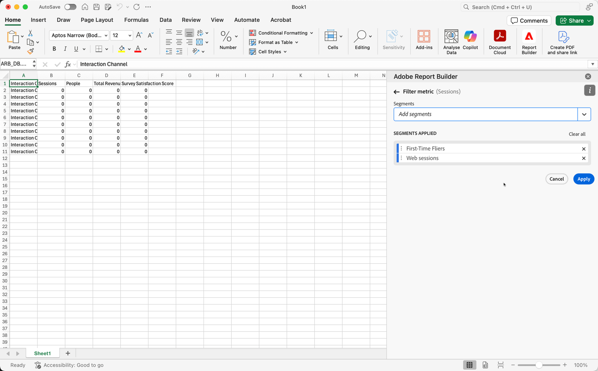

# Work with segments

You can apply segments when you create a new data block or when you select **[!UICONTROL Edit data block]** from the **[!UICONTROL Commands]** panel.

## Apply segments to a data block

To apply a segment to the entire data block, Double select a segment or drag and drop segments from the components list into the segments section of the Table.

## Apply filters to individual metrics

To apply filters using segments to individual metrics:

* Drag and drop one or more segments from **[!UICONTROL Segments]** onto a metric in the table. 
   
* Alternatively:

  1. Select  for a specific metric in the **[!UICONTROL Table]** pane and then select **[!UICONTROL Filter metric]**. 

     {zoomable="yes"}

  1. Select one or more segments from **[!UICONTROL Segments]** drop-down menu. The segments are added to the **[!UICONTROL Segments applied]** list.

     
  1. Select  to remove a segment from the **[!UICONTROL Segment applied]** list. Or select **[!UICONTROL Clear all]** to remove all segments from the **[!UICONTROL Segment applied]** list.
  1. Select **[!UICONTROL Apply]**.

To view applied filters, hover over or select a metric in the Table pane. Metrics with applied segments display a segment icon.

## Quick edit segments

You can use the **[!UICONTROL Quick edit]** panel to add, remove, or replace segments for existing data blocks.

When you select a range of cells in the spreadsheet, the **[!UICONTROL Segments]** link in the **[!UICONTROL Quick edit]** panel displays a summary list of the segments used by the data blocks in that selection.

To edit segments using the **[!UICONTROL Quick edit]** panel:

1. Select a range of cells from one or multiple data blocks.

1. Select the **[!UICONTROL Segments]** link to launch the **[!UICONTROL Quick edit]** **[!UICONTROL Segments]** panel.

### Add or remove segments

You can add or remove segments using the Add/Remove options.

1. Select the **[!UICONTROL Add/Remove]** tab in the **[!UICONTROL Quick edit]** **[!UICONTROL Segments]** panel.

    
   1. Select one or more segments from **[!UICONTROL Segments]** drop-down menu. The segments are added to the **[!UICONTROL Segments applied]** list.
   1. Select  to remove a segment from the **[!UICONTROL Segment applied]** list.
   1. Select **[!UICONTROL Apply]**.

Report Builder displays a message to confirm the applied segment changes.

### Replace segments

You can replace an existing segment with another segment to change how the data is segmented.

1. Select the **[!UICONTROL Replace]** tab in the **[!UICONTROL Quick edit]** **[!UICONTROL Segments]** panel.

1. Use the **Search list** search field to locate specific segments.

1. Select one or more segments that you want to replace.

1. Search for one or more segments from the Replace with drop-down menu to add the segment to the **[!UICONTROL Replace with]** list.

1. Select **[!UICONTROL Apply]**.

Report Builder updates the list of segments to reflect the replacement.

## Define data block segments from cell

Data blocks can reference segments from a cell. Multiple data blocks can reference the same cell for segments, allowing you to switch segments easily for multiple data blocks at a time.

To apply segments from a cell:

1. [Create a new data block](create-a-data-block.md#create-a-data-block) or edit an existing data block.
1. Select the **[!UICONTROL Segments]** tab to define segments.
1. Select .
   
   {zoomable="yes"}

1. Select the cell from which you want the data blocks to reference a segment.
   
1. Double select to add a segment to the cell. Alternatively, drag and drop one or more segments into the **[!UICONTROL Segments included]** section. 

1. Select **[!UICONTROL Apply]** to create the reference cell.

1. From the **Segments** tab, add the newly created reference cell segment to your data block.

    {zoomable="yes"}

1. Select **[!UICONTROL Finish]**.

To apply the reference cell as a segment to other data blocks, use the cell reference as one of the segments in the **[!UICONTROL Segments]** list in the **[!UICONTROL Table]** tab. 

### Use a reference cell to change data block segments

1. Select the reference cell in your spreadsheet.

1. Select the link under **[!UICONTROL Segments from cell]** in the **[!UICONTROL Quick Edit]** menu.

    {zoomable="yes"}

1. Select your segment from the drop-down menu.

1. Select **[!UICONTROL Apply]**.
