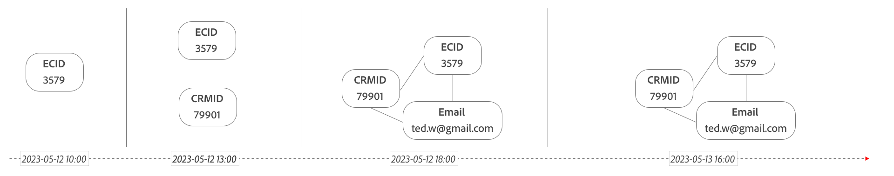

# Stitching

>[!NOTE]
>
>You must have the **Select** package or higher (for field-based stitching) or **Prime** package or higher (for graph-based stitching) to use the functionality described in this section. Contact your administrator if you're unsure which Customer Journey Analytics package you have.

Identity stitching (or simply, stitching) is a powerful feature that elevates an event dataset's suitability for cross-channel analysis. Cross-channel analysis is a main use case that Customer Journey Analytics can handle, allowing you to combine and run reports seamlessly on multiple datasets from different channels, based on a common identifier (person ID).

When you combine datasets with similar person IDs, attribution is carried over across devices and channels. For example, a user first visits your site through an advertisement on their desktop computer. That user encounters an issue with their order, then gives your customer service team a call to help resolve it. With cross-channel analysis, you can attribute call center events to the ad that they originally clicked.

Unfortunately, not all event-based datasets that are part of your connection in Customer Journey Analytics are sufficiently populated with data to support this attribution out of the box. Especially, web-based or mobile-based experience datasets often don't have an actual person ID information available on all events.

Stitching allows rekeying identities within one dataset's rows, making sure the person ID (stitched ID) is available on each event. Stitching looks at user data from both authenticated and unauthenticated sessions to determine the common transient ID (person ID) value that can be used as stitched ID. This rekeying allows for resolving disparate records to a single stitched ID for analysis at the person level, rather than at the device or cookie level.

Customer Journey Analytics supports two types of stitching: field-based stitching and graph-based stitching.

## Prerequisites

>[!IMPORTANT]
>
>Failure to meet all prerequisites can result in the inability to conduct cross-channel analysis properly.

Before using stitching, make sure that your organization is prepared with the following:

- Stitching includes merging authenticated and unauthenticated user data. Ensure that you comply with applicable laws and regulations, including obtaining necessary end-user permissions, before activating stitching on an event dataset. See [Define identity fields in the UI](https://experienceleague.adobe.com/en/docs/experience-platform/xdm/ui/fields/identity) for more information.

- Import the desired data into Adobe Experience Platform:
  
  - For Adobe Analytics data, see [Utilizing Adobe Analytics report suite data in Customer Journey Analytics](/help/getting-started/aa-vs-cja/aa-data-in-cja.md). 
  - For other types of data, see [Create a schema](https://experienceleague.adobe.com/en/docs/experience-platform/xdm/tutorials/create-schema-ui) and [Ingest data](https://experienceleague.adobe.com/en/docs/experience-platform/ingestion/home) in the Adobe Experience Platform documentation.

You benefit from cross-channel analysis if you combine one or more of your stitched datasets with other datasets, such as call center data, as part of defining your Customer Journey Analytics connection. This connection configuration assumes that those other datasets already contain a person ID on every row, similar to the stitched ID.

## Limitations

>[!IMPORTANT]
>
>- No support for using `identityMap` as the persistent ID. You have to define a specific identifier in the dataset (for example, `ECID`) as the persistent ID.
>
>- Apply any change that you make to the source event dataset schema also to the new stitched dataset schema, otherwise it breaks the stitched dataset.
>
>- If you remove the source dataset, the stitched dataset stops processing and gets removed by the system.
>
>- Data usage labels are not automatically propagated to the stitched dataset schema. If you have data usage labels applied to the source dataset schema, you need to apply these data usage labels manually to the stitched dataset schema. See [Managing data usage labels in Experience Platform](https://experienceleague.adobe.com/en/docs/experience-platform/data-governance/labels/overview) for more information.

Stitching is a groundbreaking and robust feature, but has limitations on how it can be used. 

- Only event datasets are supported. Other datasets, such as lookup datasets, are not supported.
- Stitching does not transform the field used for stitching in any manner. Stitching uses the value in the specified field as it exists in the unstitched dataset within the data lake. 
- The stitching process is case-sensitive. For example, if sometimes the word 'Bob' appears in the field, and sometimes the word 'BOB' appears, these ids are treated as two separate people.

Ensure you do not confuse stitching with:

- The merge of two or more datasets. Stitching applies to one dataset only. Merging of datasets occurs as a result of setting up a Customer Journey Analytics connection and selecting the same person ID across the selected datasets in the connection.

- The join of two datasets. In Customer Journey Analytics, a join is often used for lookups or classifications in Analysis Workspace. Although stitching uses join functionality, the process itself involves more than joins.

## Field-based stitching

You specify an event dataset as well as the persistent ID (cookie) and transient ID (person ID) for that dataset. Field-based stitching creates a new stitched ID column in the new stitched dataset and updates this stitched ID column based on rows that have a transient ID for that specific persistent ID.  You can use field-based stitching when using Customer Journey Analytics as a standalone solution (not having access to the Experience Platform Identity Service and associated identity graph). Or, when you do not want to use the available identity graph.

### How field-based stitching works

Stitching makes a minimum of two passes on data in a given dataset.

- **Live stitching**: attempts to stitch each hit (event) as it comes in. Hits from devices that are "new" to the dataset (have never authenticated) are typically not stitched at this level. Hits from devices already recognized are stitched immediately.

- **Replay stitching**: "replays" data based on unique identifiers (transient IDs) it has learned. This stage is where hits from previously unknown devices (persistent IDs) become stitched (to transient IDs). Adobe offers two replay intervals:
    - **Daily**: Data replays every day with a 24-hour lookback window. This option holds an advantage that replays are much more frequent, but unauthenticated visitors must authenticate the same day that they visit your site.
    - **Weekly**: Data replays once a week with your selected lookback window (see [options](#options)). This option holds an advantage that allows unauthenticated sessions a much more lenient time to authenticate. However, unstitched data less than a week old is not reprocessed until the next weekly replay.

- **Privacy**: When privacy-related requests are received, in addition to removing the requested identity, any stitching of that identity across unauthenticated events must be undone.

Data beyond the lookback window is not replayed. A visitor must authenticate within a given lookback window for an unauthenticated visit and an authenticated visit to be identified together. Once a device is recognized, it is live stitched from that point forward.

#### Step 1: Live stitching

Live stitching attempts to stitch each event upon collection to known devices and channels. 

+++ Details

Consider the following example, where Bob records different events as part of an event dataset. 

*Data as it appeared the day it is collected:*

| Event | Timestamp | Persistent ID (Cookie ID) | Transient ID (Login ID) | Stitched ID (after live stitch) | 
|---|---|---|---|---|
| 1 | 2023-05-12 12:01 | `246` | - | **`246`** |
| 2 | 2023-05-12 12:02 | `246` | `Bob`  | `Bob` |
| 3 | 2023-05-12 12:03 | `246` | `Bob` | `Bob`  | 
| 4 | 2023-05-12 12:04 | `246` | - | **`Bob`**|
| 5 | 2023-05-12 12:05 | `246` | `Bob`  | `Bob`  |
| 6 | 2023-05-12 12:06 | `246` | - | **`Bob`**| 
| 7 | 2023-05-12 12:07 | `246` | `Bob`  | `Bob` | 
| 8 | 2023-05-12 12:03 | `3579` | - | **`3579`** |
| 9 | 2023-05-12 12:09 | `3579`  | - | **`3579`** |
| 10 | 2023-05-12 12:02 | `81911`  | - | **`81911`** |
| 11 | 2023-05-12 12:05 | `81911` | `Bob`  | `Bob` |
| 12 | 2023-05-12 12:12 | `81911` | - | **`Bob`** |
| | | **3 devices** | | **4 people**: `246`, `Bob`, `3579`, `81911` |

Both unauthenticated and authenticated events on new devices are counted as separate people (temporarily). Unauthenticated events on recognized devices are live stitched.

Attribution works when the identifying custom variable is tied to a device. In the example above, all events except events 1, 8, 9 and 10 are live stitched (they all use the `Bob` identifier). Live stitching 'resolves' the stitched ID for event 4, 6 and 12.

Delayed data (data with a timestamp over 24 hours old) is handled on a 'best effort' basis, while prioritizing the stitching of current data for the highest quality.

+++ 

#### Step 2: Replay stitching

At regular intervals (once a week or once a day, depending on the chosen lookback window), replay stitching recalculates historical data based on devices it now recognizes. If a device initially sends data while not authenticated and then logs in, replay stitching ties those unauthenticated events to the correct person. 

+++ Details

The following table represents the same data as above, but shows different numbers based on replaying the data.

*The same data after replay:*

| Event | Timestamp | Persistent ID (Cookie ID) | Transient ID (Login ID) | Stitched ID (after live stitch) | Stitched ID (after replay) |
|---|---|---|---|---|---|
| 1 | 2023-05-12 12:01 | `246` | - | `246` | **`Bob`** |
| 2 | 2023-05-12 12:02 | `246` | `Bob`  | `Bob` | `Bob`  |
| 3 | 2023-05-12 12:03 | `246` | `Bob` | `Bob`  | `Bob` |
| 4 | 2023-05-12 12:04 | `246` | - | **`Bob`**| `Bob` |
| 5 | 2023-05-12 12:05 | `246` | `Bob`  | `Bob`  | `Bob` |
| 6 | 2023-05-12 12:06 | `246` | - | **`Bob`**| `Bob` | 
| 7 | 2023-05-12 12:07 | `246` | `Bob`  | `Bob` | `Bob` |
| 8 | 2023-05-12 12:03 | `3579`  | - | **`3579`** | **`3579`** |
| 9 | 2023-05-12 12:09 | `3579`  | - | **`3579`** | **`3579`** |
| 10 | 2023-05-12 12:02 | `81911` | - | `81911` | **`Bob`** | 
| 11 | 2023-05-12 12:05 | `81911` | `Bob`  | `Bob` | `Bob`  | 
| 12 | 2023-05-12 12:12 | `81911` | - | **`Bob`** | `Bob` | 
| | | **3 devices** | | **4 people**: `246`, `Bob`, `3579`, `81911` | **2 people**: `Bob`, `3579` | 

{style="table-layout:auto"}

Attribution works when the identifying custom variable is tied to a device. In the example above, event 1 and 10 are stitched as a result from the replay, leaving only event 8, and 9 unstitched. And reducing the people metric (cumulative) to 2.

+++ 

#### Step 3: Privacy Request

When you receive a privacy request, the stitched id is deleted in all records for the user subject of the privacy request. 

+++ Details

The following table represents the same data as above, but shows the effect that a privacy request for Bob has on the data after processing it. The rows where Bob is authenticated are removed (2, 3, 5, 7, and 11) along with removing Bob as a transient ID for other rows.

*The same data after a privacy request for Bob:*

| Event | Timestamp | Persistent ID (Cookie ID) | Transient ID (Login ID) | Stitched ID (after live stitch) | Stitched ID (after replay) | Transient ID (Login ID) | Stitched ID (after privacy request) |
|---|---|---|---|---|---|---|---|
| 1 | 2023-05-12 12:01 | `246` | - | `246` | **`Bob`** | - | `246` |
| 2 | 2023-05-12 12:02 | `246` | Bob  | `Bob` | `Bob`  |  | `246` |
| 3 | 2023-05-12 12:03 | `246` | Bob | `Bob`  | `Bob` |  | `246` |
| 4 | 2023-05-12 12:04 | `246` | - | **`Bob`**| `Bob` | - | `246` |
| 5 | 2023-05-12 12:05 | `246` | Bob  | `Bob`  | `Bob` |  | `246` |
| 6 | 2023-05-12 12:06 | `246` | - | **`Bob`**| `Bob` | - | `246` | 
| 7 | 2023-05-12 12:07 | `246` | `Bob`  | `Bob` | `Bob` |  | `246` |
| 8 | 2023-05-12 12:03 | `3579`  | - | **`3579`** | **`3579`** | - | `3579` | 
| 9 | 2023-05-12 12:09 | `3579`  | - | **`3579`** | **`3579`** | - | `3579` |
| 10 | 2023-05-12 12:02 | `81911` | - | `81911` | **`Bob`** | - | `81911` |
| 11 | 2023-05-12 12:05 | `81911` | `Bob`  | `Bob` | `Bob`  |  | `81911` |
| 12 | 2023-05-12 12:12 | `81911` | - | **`Bob`** | `Bob` | - | `81911` |
| | | **3 devices** | | **4 people**: 246, `Bob`, `3579`, `81911` | **2 people**: Bob, `3579` |  | **3 people**: `246`, `3579`, `81911` |

+++ 

### Prerequisites

The following prerequisites apply specifically to field-based stitching:

- The event dataset in Adobe Experience Platform, to which you want to apply stitching, must have two columns that help identify visitors:
  
  - A **persistent ID**, an identifier available on every row. For example, a visitor ID generated by an Adobe Analytics AppMeasurement library or an ECID generated by the Adobe Experience Platform Identity Service.
  - A **transient ID**, an identifier available on only some rows. For example, a hashed username or email address once a visitor authenticates. You can use virtually any identifier that you like. Stitching considers this field to hold the actual person ID info. For best stitching results, a transient ID should be sent within the dataset's events at least once for each persistent ID. If you plan to include this dataset within a Customer Journey Analytics connection, it is preferable that the other datasets also have a similar common identifier.

- Both columns (persistent ID and transient ID) must be defined as an identity field with an identity namespace in the schema for the dataset you want to stitch. When using identity stitching in Real-time Customer Data Platform, using the [`identityMap` field group](https://experienceleague.adobe.com/en/docs/experience-platform/xdm/schema/composition#identity), you still need to add identity fields with an identity namespace. This identification of identity fields is required as Customer Journey Analytics stitching does not support the `identityMap` field group. When adding an identity field in the schema, while also using the `identityMap` field group, do not set the additional identity field as a primary identity. Setting an additional identity field as primary identity interferes with the `identityMap` field group used for Real-time Customer Data Platform.

### Limitations

The following limitations apply specifically to field-based stitching:

- Current rekeying capabilities are limited to one step (persistent ID to transient ID). Multiple-step rekeying (for example, persistent ID to a transient ID, then to another transient ID) is not supported.
- If a device is shared by multiple people and the total number of transitions between users exceeds 50,000, Customer Journey Analytics stops stitching data for that device.
- Custom ID maps used in your organization are not supported.
- Stitching is case-sensitive. For datasets generated through the Analytics source connector, Adobe recommends reviewing any VISTA rules or processing rules that apply to the transient ID field. This review ensures that none of these rules are introducing new forms of the same ID. For example, you should ensure that no VISTA or processing rules are introducing lowercasing to the transient ID field on only a portion of the events.
- Stitching does not combine or concatenate fields. 
- The transient ID field should contain a single type of ID (IDs from a single namespace). For instance, the transient ID field should not contain a combination of login IDs and email IDs.
- If multiple events occur with the same timestamp for the same persistent ID, but with different values in the transient ID field, stitching selects the ID based on alphabetical order. So, if persistent ID A has two events with the same timestamp and one of the events specifies Bob and the other specifies Ann, stitching selects Ann.
- Be cautious of scenarios where the transient IDs contain placeholder values, for example `Undefined`. See the [FAQ](faq.md) for more information.

## Graph-based stitching

You specify an event dataset as well as the persistent ID (cookie) and the namespace of the transient ID (person ID) for that dataset. Graph-based stitching creates a new column for the stitched ID in the new stitched dataset. And then uses the persistent ID to query the identity graph from the Experience Platform Identity Service, using the namespace specified, to update the stitched ID.

### How graph-based stitching works

Stitching makes a minimum of two passes on data in a given dataset.

- **Live stitching**: attempts to stitch each hit (event) as it comes in, using the persistent ID to look up the transient id for the selected namespace by querying the identity graph. If the transient id is available from the lookup, this transient id is immediately stitched.

- **Replay stitching**: "replays" data based on updated identities from the identity graph. This stage is where hits from previously unknown devices (persistent IDs) become stitched as the identity graph has resolved the identity for a namespace. Adobe offers two replay intervals:
    - **Daily**: Data replays every day with a 24-hour lookback window. This option holds an advantage that replays are much more frequent, but unauthenticated visitors must authenticate the same day that they visit your site.
    - **Weekly**: Data replays once a week with the lookback window (see [options](#options)). This option holds an advantage that allows unauthenticated sessions a much more lenient time to authenticate. However, unstitched data less than a week old is not reprocessed until the next weekly replay.

- **Privacy**: When privacy-related requests are received, in addition to removing the requested identity from the source dataset, any stitching of that identity across unauthenticated events must be undone. Also, the identity must be removed from the identity graph to prevent future graph-based stitching for that specific identity.

Data beyond the lookback window is not replayed. A visitor must authenticate within a given lookback window for an unauthenticated visit and an authenticated visit to be identified together. Once a device is recognized, it is live stitched from that point forward.

Consider the following two identity graphs for persistent id `246` and `3579`, how these identity graphs are updated over time, and how these updates impact the steps in graph-based stitching.

You can view an identity graph over time for a specific profile using the [Identity Graph Viewer](https://experienceleague.adobe.com/en/docs/experience-platform/identity/features/identity-graph-viewer). See also [Identity Service linking logic](https://experienceleague.adobe.com/en/docs/experience-platform/identity/features/identity-linking-logic) to get a better understanding of the logic used when linking identities.

#### Step 1: Live stitching

Live stitching attempts to stitch each event, upon collection, to known information at that time from the identity graph. 

+++ Details

| | Time | Persistent ID `ECID` | Namespace `Email`  | Stitched ID (after live stitch) | 
|--:|---|---|---|---|
| 1 | 2023-05-12 11:00   | `246` |  `246`  *undefined* | `246` |
| 2 | 2023-05-12 14:00  | `246` | `246`  `bob.a@gmail.com` | `bob.a@gmail.com` | 
| 3 | 2023-05-12 15:00  | `246` | `246`  `bob.a@gmail.com` | `bob.a@gmail.com`   | 
| 4 | 2023-05-12 17:00  | `3579` | `3579`  *undefined* | `3579` |
| 5 | 2023-05-12 19:00  | `3579` | `3579`  `ted.w@gmail.com` | `ted.w@gmail.com` |
| 6 | 2023-05-13 15:00 |  `246` | `246`  `bob.a@gmail.com` | `bob.a@gmail.com` |
| 7 |2023-05-13 16:30 |  `246` | `246`  `a.b@yahoo.co.uk` `246`  `bob.ab@gmail.com` | `a.b@yahoo.co.uk` |

{style="table-layout:auto"}

You can see how for each event the stitched id is resolved. Based on the time, the persistent id, and the lookup of the identity graph for the specified namespace (at that same time). 
When the lookup resolves to more than one stitched id (like for event 7), the lexicographic first id returned by the identity graph is selected (`a.b@yahoo.co.uk` in the example).

+++

#### Step 2: Replay stitching

At regular intervals (depending on the chosen lookback window), replay stitching recalculates historical data based on the most recent version of the identity graph, at the time of the interval. 

+++ Details

With a replay stitching happening at 2023-05-13 16:30, with a 24-hour lookback window configuration, some events from the sample are re-stitched (indicated by ).

| | Time | Persistent ID `ECID` | Namespace `Email`  | Stitched ID (after live stitch) | Stitched ID (after replay 24 hours) | 
|---|---|---|---|---|---|
| 2 | 2023-05-12 14:00  | `246` | `246`  `bob.a@gmail.com` |  `bob.a@gmail.com` | `bob.a@gmail.com` |
| 3 | 2023-05-12 15:00  | `246` | `246`  `bob.a@gmail.com` |  `bob.a@gmail.com` | `bob.a@gmail.com` |
|  4 | 2023-05-12 17:00  | `3579` | `3579`  `ted.w@gmail.com` | `3579` | `ted.w@gmail.com`| 
|  5 | 2023-05-12 19:00  | `3579` | `3579`  `ted.w@gmail.com` |  `ted.w@gmail.com` | `ted.w@gmail.com` |
|  6 | 2023-05-13 15:00 |  `246` | `246`  `a.b@yahoo.co.uk` |  `bob.a@gmail.com` | `a.b@yahoo.co.uk` |
|  7 |2023-05-13 16:30 |  `246` | `246`  `a.b@yahoo.co.uk` `246`  `bob.ab@gmail.com`|  `a.b@yahoo.co.uk`  | `a.b@yahoo.co.uk` |

{style="table-layout:auto"}

With replay stitching happening at 2023-05-13 16:30, with a 7-day lookback window configuration, all events from the sample are re-stitched.

| | Time | Persistent ID `ECID` | Namespace `Email`  | Stitched ID (after live stitch) | Stitched ID (after replay 7 days) | 
|---|---|---|---|---|---|
|  1 | 2023-05-12 11:00   | `246` | `246`  *undefined* | `246` | `a.b@yahoo.co.uk` | 
|  2 | 2023-05-12 14:00  | `246` | `246`  `bob.a@gmail.com` |  `bob.a@gmail.com` | `a.b@yahoo.co.uk` |
|  3 | 2023-05-12 15:00  | `246` | `246`  `bob.a@gmail.com` |  `bob.a@gmail.com` | `a.b@yahoo.co.uk` |
|  4 | 2023-05-12 17:00  | `3579` | `3579`  `ted.w@gmail.com` | `3579` | `ted.w@gmail.com`| 
|  5 | 2023-05-12 19:00  | `3579` | `3579`  `ted.w@gmail.com` |  `ted.w@gmail.com` | `ted.w@gmail.com` |
|  6 | 2023-05-13 15:00 |  `246` | `246`  `a.b@yahoo.co.uk` |  `bob.a@gmail.com` | `a.b@yahoo.co.uk` |
|  7 |2023-05-13 16:30 |  `246` | `246`  `a.b@yahoo.co.uk` `246`  `bob.ab@gmail.com` |  `a.b@yahoo.co.uk`  | `a.b@yahoo.co.uk` |

{style="table-layout:auto"}

+++

#### Step 3: Privacy Request

When you receive a privacy request, the stitched id is deleted in all records for the user subject of the privacy request.

+++ Details

The following table represents the same data as above, but shows the effect that a privacy request (for example at 2023-05-13 18:00) has for the sample events.

| | Time | Persistent ID `ECID` | Namespace `Email`  | Stitched ID (after privacy request) | 
|--:|---|---|---|---|
|  1 | 2023-05-12 11:00   | `246` | `246`   `a.b@yahoo.co.uk` | `246` |
|  2 | 2023-05-12 14:00  | `246` | `246`   `a.b@yahoo.co.uk` | `246` |
|  3 | 2023-05-12 15:00  | `246` | `246`   `a.b@yahoo.co.uk` | `246` |
|  4 | 2023-05-12 17:00  | `3579` | `3579`  `ted.w@gmail.com` | `3579` |
|  5 | 2023-05-12 19:00  | `3579` | `3579`  `ted.w@gmail.com` | `3579` |
|  6 | 2023-05-13 15:00 |  `246` | `246`  `a.b@yahoo.co.uk` | `246` |
|  7 |2023-05-13 16:30 |  `246` | `246`  `a.b@yahoo.co.uk` `246`  `bob.ab@gmail.com` | `246` |

{style="table-layout:auto"}

+++

### Prerequisites

The following prerequisites apply specifically to graph-based stitching:

- The event dataset in Adobe Experience Platform, to which you want to apply stitching, must have one column that identifies a visitor on every row, the **persistent ID**. For example, a visitor ID generated by an Adobe Analytics AppMeasurement library or an ECID generated by the Adobe Experience Platform Identity Service.
- The identity graph from Experience Platform Identity Service must have a namespace (for example `Email`, or `Phone`) you want to use during stitching to resolve the **transient ID**. See [Experience Platform Identity Service](https://experienceleague.adobe.com/en/docs/experience-platform/identity/home) for more information.

>[!NOTE]
>
>You do **not** require a Real-time Customer Data Platform license for graph-based stitching. The **Prime** package or higher of Customer Journey Analytics includes the required Experience Platform Identity Service entitlements.

### Limitations

The following limitations apply specifically to graph-based stitching:

- Timestamps are not taken into account when querying for the transient id using the specified namespace. So, it is possible that a persistent ID is stitched with a transient ID from a record that has an earlier timestamp.
- No shared device support. When multiple identities are returned, by querying the identity graph using a namespace, the first lexicographic identity is used.
- There is a hard limit of three months of backfilling identities into the identity graph. You would use backfilling identities in case you are not using an Experience Platform application, like Real-time Customer Data Platform, to populate the identity graph.
- The [Identity Service guardrails](https://experienceleague.adobe.com/en/docs/experience-platform/identity/guardrails) apply. See, for example, the following [static limits](https://experienceleague.adobe.com/en/docs/experience-platform/identity/guardrails#static-limits):
  - Maximum number of identities in a graph: 50.
  - Maximum number of links to an identity for a single batch ingestion: 50. 
  - Maximum number of identities in an XDM record for graph ingestion: 20.
  - Minimum number of identities in an XDM record for graph ingestion: 2.

## Use stitching

Once your organization meets all [prerequisites](#prerequisites) and understands common [limitations](#limitations) and stitching method specific ([field-based](#limitations-1) and [graph-based](#limitations-2)) limitations, you can follow these steps to start using stitching in Customer Journey Analytics.

### Select options

The Customer Journey Analytics package you are entitled to determines the available stitching methods, options for the initial backfill duration, lookback window, replay frequency, and maximum number of datasets permitted for stitching. See the [Customer Journey Analytics product description](https://helpx.adobe.com/legal/product-descriptions/customer-journey-analytics.html) for more details. Decide on the available options before requesting support.

| | Customer Journey Analytics Select | Customer Journey Analytics Prime | Customer Journey Analytics Ultimate |
|---|---|---|---|
| Available stitching methods | <li>Field-based stitching</li> | <li>Field-based stitching</li><li>Graph-based stitching</li> | <li>Field-based stitching</li><li>Graph-based stitching</li> | 
| One-time stitching backfill duration | 13 months | 13 months | 25 months | 
| Lookback window and replay frequency |<li>1 day, every day</li><li>up to 7 days, weekly</li> | <li>1 day, every day</li><li>up to 14 days, weekly</li>| <li>1 day, every day</li><li>up to 30 days, weekly</li> | 
| Maximum number of datasets permitted for stitching | 5 | 10 | 50 | 

### Request support 

1. Contact Adobe Customer Support with the following information:

   - A request to enable stitching.
   - The dataset ID for the dataset that you want to rekey.
   - The column name (identity path and namespace) of the persistent ID for the desired dataset (the identifier that appears on every row).
   - For field-based stitching, the column name of the transient ID for the desired dataset (the person identifier, which also acts as a link between datasets in the context of a connection). For graph-based stitching, the identity namespace to use for querying the identity graph.
   - Your preference of lookback window and replay frequency. See your Customer Journey Analytics package for the [options](#options) available.
   - Sandbox name.

2. The Adobe Customer Support works with Adobe engineering to enable stitching upon receiving your request. Once enabled, a new rekeyed dataset that contains a new stitched ID column appears in Adobe Experience Platform. Adobe Customer Support can provide the new dataset's ID.
   
3. When first turned on, Adobe provides a backfill of stitched data. See your Customer Journey Analytics package for the [option](#options) available.
   
4. If you want to use the new stitched dataset in a cross-channel analysis, you need to add the new stitched dataset to a [connection](../connections/overview.md) in Customer Journey Analytics. Then add any other datasets required for cross-channel analysis, and select the correct person ID for each dataset.
   
5. [Create a data view](/help/data-views/create-dataview.md) based on the connection.

<!-- To do: Paragraph on backfill once product and marketing determine the best way forward. -->

Once the data view is set up, you can run your Customer Journey Analytics reporting analysis across channels and devices.

<!-- Uncomment once stitching UI is available (for limited testing)..

### Do It Yourself

|Positive|[!BADGE New Feature]{type=Positive before-title="false"}|

{{release-limited-testing-section}}

Alternatively, you can set up and use stitching through the Customer Journey Analytics user interface:

1. Go to the [Create and manage stitched datasets](stitching-ui.md) and follow steps to rekey your dataset.

2. [Create a connection](/help/connections/create-connection.md) in Customer Journey Analytics using the newly generated dataset and any other datasets that you want to include. Choose the correct person ID for each dataset.

3. [Create a connection](/help/connections/create-connection.md) in Customer Journey Analytics using the newly generated dataset and any other datasets that you want to include. Choose the correct person ID for each dataset.
   
4. [Create a data view](/help/data-views/create-dataview.md) based on the connection.

Once the data view is set up, the cross-channel analysis in Customer Journey Analytics is just like any other analysis in Customer Journey Analytics, except now the data operates across channels and devices.

-->

