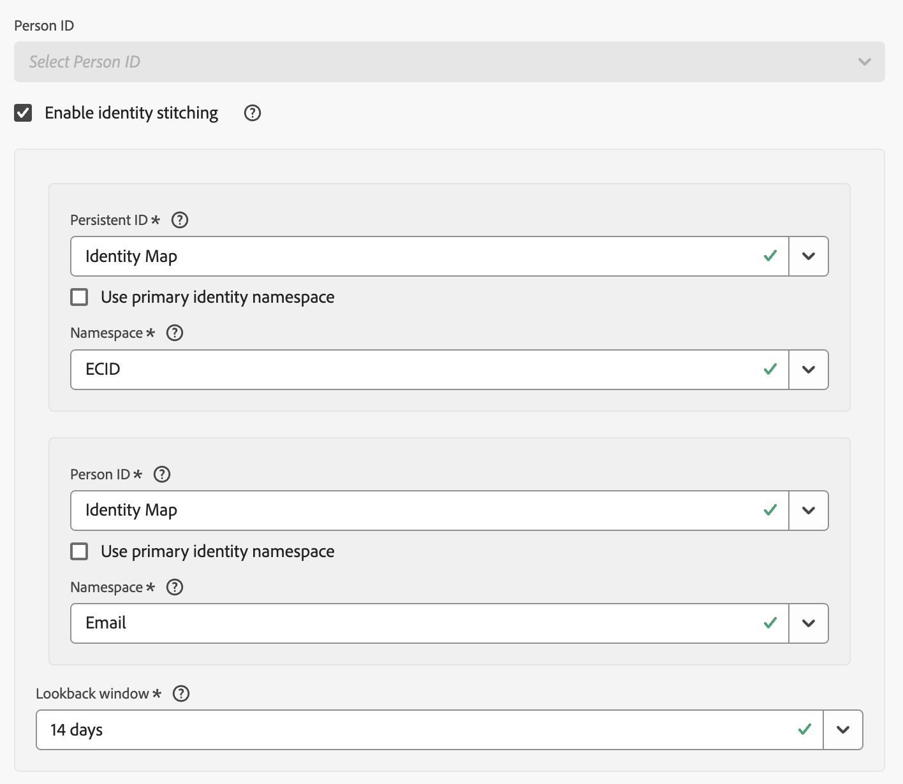

# Enable stitching

You can enable stitching on one or more event datasets you have configured as part of your connection. The Customer Journey Analytics package that you have licensed determines the number of event datasets you can enable for stitching .

You enable stitching as part of the [dataset settings](/help/connections/create-connection.md#dataset-settings) for an event dataset when you [create a connection](/help/connections/create-connection.md) or when you [edit a connection](/help/connections/manage-connections.md#edit-a-connection).

## Prerequisites

You need to check and meet the prerequisites for the stitching method you specify: [field-based stitching](fbs.md#prerequisites) or [graph-based stitching](gbs.md#prerequisites).


## Preflight checks

If you meet the prerequisites, you might want to perform some preflight checks on the data in the event dataset before you enable identity stitching:

* If you are going to use XDM schema fields for persistent ID or person ID, ensure that identities are marked properly in the schema for the event dataset. [See Identity namespace overview](https://experienceleague.adobe.com/en/docs/experience-platform/identity/features/namespaces).
* Verify identity coverage for both persistent ID and person ID:
  
  * **Persistent ID**
  
    Query 7 days of data where your persistent ID field is not null and divide by a query of 7 days of data for all events in your dataset. This percentage should be above 95%.

    Example of a query you could use for verification:

    ```sql
    SELECT
      COUNT(*) AS total_events,
      COUNT({PERSISTENT_ID_FIELD}) AS events_with_persistentid,
      ROUND(COUNT({PERSISTENT_ID_FIELD}) / COUNT(*), 2) AS percent_with_persistentid_not_null
    FROM 
      {DATASET_TABLE_NAME}
    WHERE
      TO_TIMESTAMP(timestamp, '{FORMAT_STRING}') >= TIMESTAMP '{START_DATE}'
      AND TO_TIMESTAMP(timestamp, 'FORMAT_STRING') < TIMESTAMP '{END_DATE}';
    ```

    Where:

    * `{PERSISTENT_ID_FIELD}` is the field for the persistent ID. For example: `identityMap.ecid[0]`.
    * `{DATASET_TABLE_NAME}` is the table name for the event dataset.
    * `{FORMAT_STRING}` is the format string for the timestamp field. For example: `MM/DD/YY HH12:MI AM`.
    * `{START_DATE} `is the start date. For example: `2024-01-01 00:00:00`.
    * `{END_DATE}` is the end date in standard format. For example: `2024-01-08 00:00:00`.
  

  * **Person ID**
    * For graph-based stitching, ensure that the identity graph contains fragments that link ID values from your chosen persistent ID namespace and person ID namespace. You could run a test by going to the [Experience Platform Identity graph viewer](https://experienceleague.adobe.com/en/docs/experience-platform/identity/features/identity-graph-viewer){target="_blank"} and query the graph by some test persistent ID values. Verify to see if these persistent ID values are linked to person ID values in the graph.
    * For field-based stitching, query 7 days of data where your person ID field is not null and divide by a query of 7 days of data for all events in your dataset. This percentage should ideally above 5%.

      Example of a query you could use for verification:

      ```sql
      SELECT
        COUNT(*) AS total_events,
        COUNT({PERSON_ID_FIELD}) AS events_with_personid,
        ROUND(COUNT({PERSON_ID_FIELD}) / COUNT(*), 2) AS percent_with_personid_not_null
      FROM 
        {DATASET_TABLE_NAME}
      WHERE
        TO_TIMESTAMP(timestamp, '{FORMAT_STRING}') >= TIMESTAMP '{START_DATE}'
        AND TO_TIMESTAMP(timestamp, 'FORMAT_STRING') < TIMESTAMP '{END_DATE}';
      ```

      Where:

      * `{PERSON_ID_FIELD}` is the field for the person ID. For example: `identityMap.crmId[0]`.
      * `{DATASET_TABLE_NAME}` is the table name for the event dataset.
      * `{FORMAT_STRING}` is the format string for the timestamp field. For example: `MM/DD/YY HH12:MI AM`.
      * `{START_DATE}` is the start date. For example: `2024-01-01 00:00:00`.
      * `{END_DATE}` is the end date in standard format. For example: `2024-01-08 00:00:00`.
  


## Enable identity stitching {#enable-identity-stitching}

>[!CONTEXTUALHELP]
>id="connection_changeto_identitygraph"
>title="Change to identity graph"
>abstract="Ensure you have finished the setup of the identity graph before you use the identity graph for stitching."
>additional-url="https://experienceleague.adobe.com/en/docs/analytics-platform/using/stitching/gbs" text="Graph-based stitching"

>[!CONTEXTUALHELP]
>id="connection_stitching_personid"
>title="Person ID"
>abstract="Select a person ID (the unique identifier for a person) from the available identities. In case you want to use graph-based stitching, select **[!UICONTROL Identity Graph]**."

To enable stitching, in the event dataset section of the **[!UICONTROL Add datasets]** or **[!UICONTROL Edit dataset]** dialog: 



1. Select **[!UICONTROL Enable identity stitching]**.
   
   If you enable or disable stitching for a saved event dataset in the connection, the **[!UICONTROL Change Person ID]** dialog displays the implications of a change of the person ID. Select **[!UICONTROL Continue]** to continue.

   The **[!UICONTROL Enable identity stitching]** dialog summarizes the consequences of stitching identities. Select **[!UICONTROL Continue]** to continue.

1. Select a persistent ID from the **[!UICONTROL Persistent ID]** drop-down menu.

   If you select **[!UICONTROL Identity Map]** for the persistent ID, you have to select a namespace . You have two options:

   * Select **[!UICONTROL Use primary identity namespace]** to use the primary identity namespace.
   * Select a namespace from the **[!UICONTROL Namespace]** drop-down menu.

1. Select a person ID from the **[!UICONTROL Person ID]** drop-down menu.

   If you select **[!UICONTROL Identity Map]** for the person ID, you have to select a namespace. You have two options:

   * Select **[!UICONTROL Use primary identity namespace]** to use the primary identity namespace.
   * Select a namespace from the **[!UICONTROL Namespace]** drop-down menu.
 

   If you select **[!UICONTROL Identity Graph]** for the person ID (to use [graph-based stitching](/help/stitching/gbs.md)), you have to select a namespace. 
   
   >[!NOTE]
   >
   >Ensure that you are entitled to use the identity graph.
   >

   Before that, a **[!UICONTROL Change to identity graph]** dialog is displayed to ensure you have finished the setup of the identity graph for the dataset as part of the [graph-based prerequisites](/help/stitching/gbs.md#prerequisites) before you use the identity graph for stitching. Select **[!UICONTROL Continue]** to continue.

   * Select a namespace from the **[!UICONTROL Namespace]** drop-down menu.


1. Select a replay window from the **[!UICONTROL Replay window]** drop-down menu. The available options are  dependent on the Customer Journey Analytics package that you are entitled to.

Once you save a connection, the stitching process for datasets that are enabled for stitching kicks when the ingestion of data for these datasets starts.

>[!CAUTION]
>
>For datasets that are enabled for stitching in the Connections interface, the backfill status is immediately and incorrectly reported as &nbsp;**[!UICONTROL _x_ backfills completed]** for the number of backfills completed. Use other ways to verify whether data from the stitched dataset is backfilled.
>


## Limitations

On top of the [field-based stitching limitations](/help/stitching/fbs.md#limitations) and [graph-based stitching limitations](/help/stitching/gbs.md#limitations), the following limitations apply when you enable stitching in the Connections interface:

* You can only stitch an event dataset once as part of a single connection. You cannot define the same event dataset more than once and use a separate stitching configuration for each instance. If you want to apply different stitching configurations on the same dataset, use a separate connection for each configuration.


## Migration

Stitching enabled in the Connections interface can coexist without any issues with request based stitching. 

For example, you have web-based stitched datasets in the data lake as a result of earlier or current stitching requests. You can add stitched data from a call-center dataset using the Connections interface to combine that data with the web-based data. 

Eventually, Adobe will migrate your request based stitched datasets to the new stitching in connections experience.
