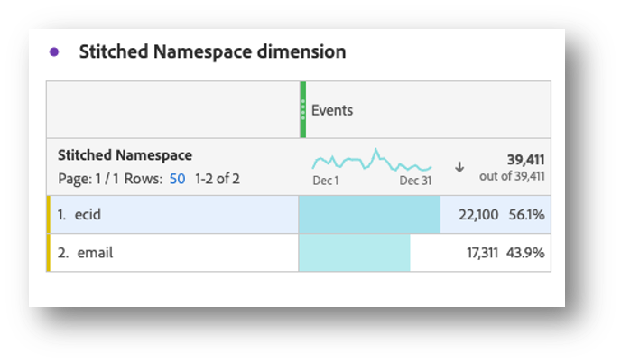
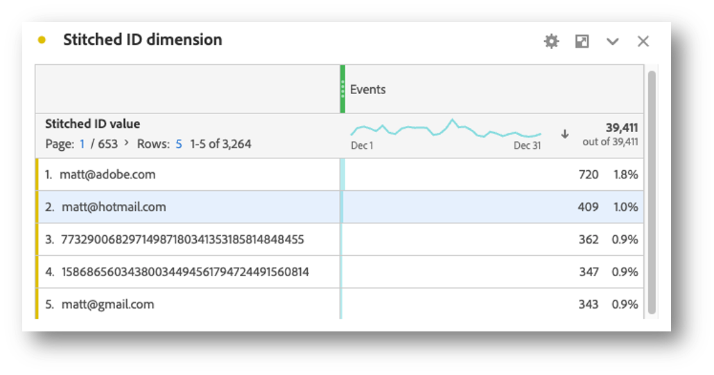
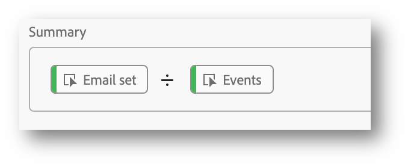
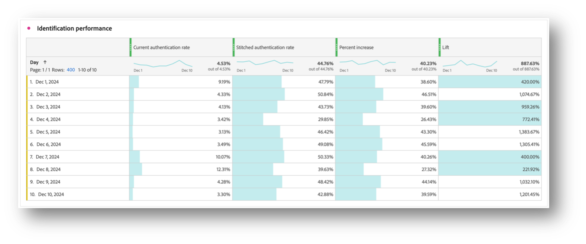

# Validate stitching

The goal of [identity stitching](/help/stitching/overview.md) (or simply, stitching) is to elevate the suitability of an event dataset for cross-channel analysis. This elevation is achieved when all rows of data i the dataset contain the desired highest order of identity that is available. This elevation allows you then to:

* Create person-centric reports, while not missing out on anonymous people.
* Connect multiple devices to a single person.
* Connect a person across channels.

This article outlines analysis methods to measure the elevation on the newly created stitched dataset(s) and to provide confidence that stitching is delivering these benefits. 

The analysis methods involve Data View settings that are typically accessible to admins and those who work in an Analysis Workspace project to calculated metrics and visualizations. While these analysis methods can be used for both Field-based stitching (FBS) and Graph-based stitching (GBS), some elements may not be present in the dataset especially in the GBS scenario. These missing elemement can make it difficult to calculate lift directly in Analysis Workspace.

This article does not capture the value of a Customer Journey Analytics configuration that has all datasets in AEP aligned to the same identity namespace, has all datasets joined together, and enables users of Customer Journey Analytics to perform analysis across an entire customer journey.

## Data view prerequisites

For the stitching validation measurement plan you need to ensure you have all required dimensions and metrics from your stitched dataset defined in a Data view. You need to verify that both stitchedID and stitchedNamespace are added as dimensions. While the stitched dataset is an exact copy of the original dataset, the stitching process adds two new columns (dimensions):

* `stitchedNamespace`, which contains one of two values, the namespace of the identity that the row was elevated to, for example `Email`, `Phone`. Or the namespace the stitching process fallbacks to, such as `ECID`. 
* `stitchedID`, which contains the raw value of the identity, i.e. hashed email, hashed phone, ECID. This value is used in conjunction with `stitchedNamespace`.

<!--The screenshot below displays these field paths and friendly names as dimensions in the Data View administration "Components" section.-->

Furthermore, you need to add two stitching metrics that are based on the presence of values in a dimension. To add these metrics, use the Data view Included components definition:

1. Drag the Custom Conversion variable (eVar) or corresponding XDM field containing the Person ID from the stitched dataset onto the Metrics list within Component and provide a friendly Component Name. Add this Person ID even if you're using Graph-based stitching as the Person ID helps to establish a baseline. In case the Person ID is not contained within the dataset, your baseline is 0%. In the example below, email address serves as the identity. 
1. In a similar way, add the previously created Stitched Namespace dimension as a metric, provide a name. Additionaly specify an include filter to only consider values of the namespace you are trying to elevate rows of data to.  In the example, since events are being elevated to the Email namespace, specify Equals email.

## Stitched dimensions

With both of these dimensions added to the Data View, use a Freeform table in Analysis Workspace to check the data that each dimension has.
 
For the Stitched Namespace dimension, you will typically see two rows for each dataset, one row represents when the stitching process had to use the fallback method (ECID) while the other row shows events associated with the desired identity namespace (Email).

For the Stitched ID dimension, you see  raw values that are coming from the events. In this table you  see values oscillate between the persistent id and the desired person id.

## Device or Person-Centric Reporting

When you create a Connection, you have to define what field or identity is used for my person Id. For instance, on a web dataset, if you choose a device id as the Person ID, then you are creating device centric reports and lose the ability to join this data with other offline channels. If you select a cross-channel field or identity, for example email, you will lose out on any unauthenticated events. To understand this impact, it is important to understand how much of your traffic is unauthenticated and how much of it is authenticated.

1. Create a calculated metric **[!UICONTROL Unauthenticated events over total]** defined in the rule builder like below:

   

1. Use the **[!UICONTROL Unauthenticated events over total]** calculated metric, together with the metric you created from a dimension in the [Data view Prerequisites](#data-view-prerequisites) section, To create a summary visualizations that show the number of events in the dataset that are unauthenticated and are authenticated.

## Stitching identification rates

You want to measure the identification performance before and after stitching. To do this, create four calculated metrics:

1. A calculated metric that calculates the number of events that have an identity over the total number of events.
   

1. A calculated metric that calculates the number of events where the Stitched Namespace is set to the desired identity over the total number of events. When you set up our Data View, you created a metric from the  Stitched Namespace dimension. To this metric you added a filter to only count when an event is set with email. In your example the namespace you use to elevate rows of data to. Our calculated metric provides an idnciation of what percentage of the data has the desired identity.
   

1. A calculated metric that calculates the raw percentage change between the current identification rate and the stitched one.
   

1. A calculated metric that calculates the lift between the current identification rate and the stitched identification rate.
   

## Conclusion

If you combine all data in an Analysis Workspace Freeform table you can start to see the impact and value that Stitching provides inclusive of:

* Current authentication rate: The baseline of the number of events that already had the correct person id over the total number of events.
* Stitched authentication rate: The new number of events that have the correct person id over the total number of events.
* Percent increase: The raw percentage increase from the stitched authentication rate minus the baseline Current authentication rate.
* Lift: The percent change over the baseline Current authentication rate.

The key takeaways from this analysis:

* Provides a comprehensive custom view of authentication effectiveness by comparing current versus stitched rates.
* Enables clear measurement of the improvement through percentage increases and lift metrics.
* Helps identify the true impact of implementing stitching on user authentication.
* Creates a standardized way to communicate authentication performance across teams.
* Allows for data-driven decisions about authentication strategy and optimization.

These metrics together give stakeholders a complete picture of how Customer Journey Analytics stitching affects authentication success rates and overall person identification performance.
