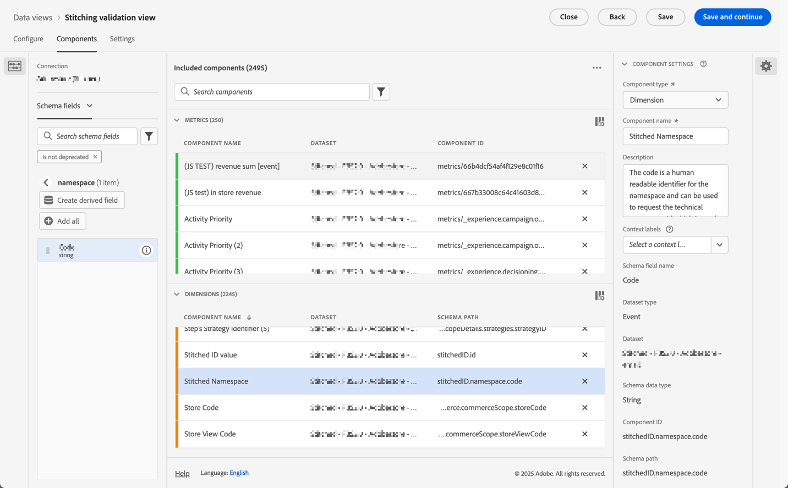
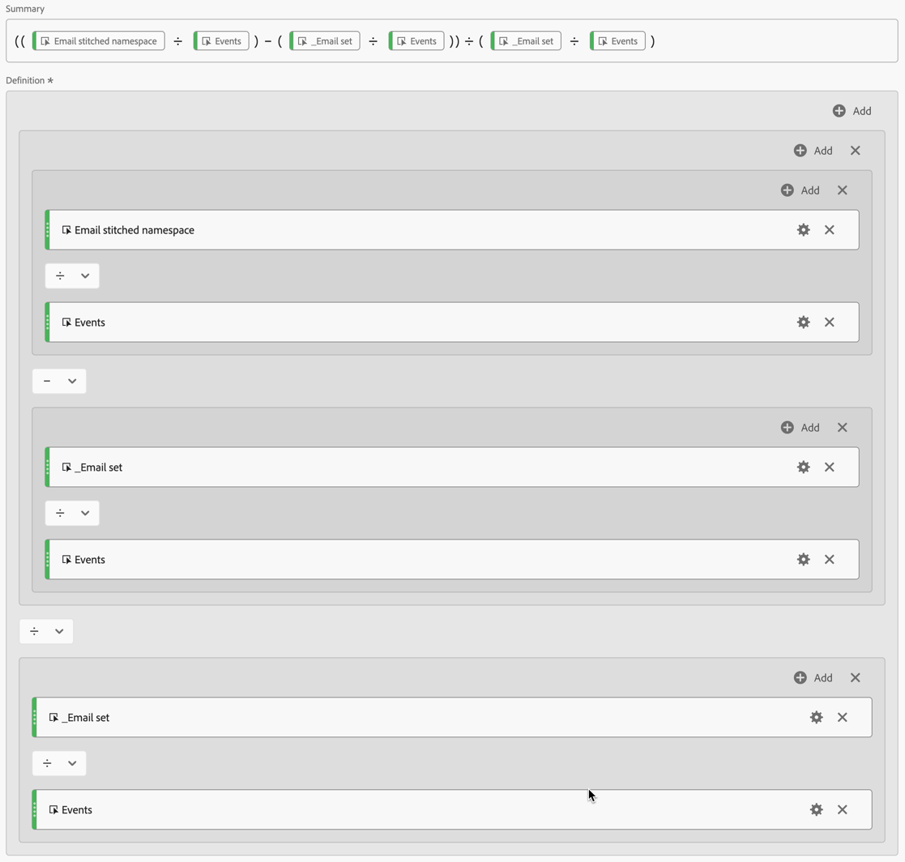

# Validate stitching

The goal of [identity stitching](/help/stitching/overview.md) (or simply, stitching) is to elevate the suitability of an event dataset for cross-channel analysis. This elevation is achieved when all rows of data in the dataset contain the desired highest order of identity that is available. This elevation allows you then to:

* Create person-centric reports, while not leaving out anonymous people.
* Connect multiple devices to a single person.
* Connect a person across channels.

This article outlines analysis methods to measure the elevation on one or more newly created stitched datasets and to provide confidence that stitching is delivering these benefits. 

The analysis methods involve [Data view component settings](/help/data-views/component-settings/overview.md) that are typically accessible to admins. The methods also require analysts, who work in an Analysis Workspace project, to create calculated metrics and visualizations. 

While these analysis methods can be used for both field-based stitching and graph-based stitching, some elements may not be present in the dataset, especially in a graph-based stitching scenario. These missing elements can make it difficult to calculate lift directly in Analysis Workspace.

>[!NOTE]
>
>The (validation of) stitching of one or more datasets contributes ultimately to better analysis and insights. However, this article does not discuss the overall value of a Customer Journey Analytics configuration that has all datasets in Experience Platform aligned to the same identity namespace. And that all these datasets are nicely joined together to perform analysis across an entire customer journey. 

>[!BEGINSHADEBOX]

See  [Stitching enablement and validation](https://video.tv.adobe.com/v/3478120?quality=12&learn=on){target="_blank"} for a demo video.

>[!ENDSHADEBOX]

>[!IMPORTANT]
>
>This article describes how to validate stitching that is [requested through Adobe](/help/stitching/use-stitching.md) and is implemented using a stitched identity column added to a duplicate stitched dataset. The article is planned to be updated soon with details on how to validate stitching that is [enabled through the Connections UI](/help/stitching/use-stitching-ui.md).

## Data view prerequisites

For the stitching validation measurement plan, you need to ensure you have all the required dimensions and metrics from your stitched dataset defined in a data view. You need to verify that both `stitchedID.id` and `stitchedId.namespace.code` fields are added as dimensions. While the stitched dataset is an exact copy of the original dataset, the stitching process adds these two new columns to the dataset:

* Use `stitchedID.namespace.code` to define a **[!UICONTROL Stitched Namespace]** dimension. This dimension contains the namespace of the identity that the row was elevated to, for example `Email`, `Phone`. Or the namespace the stitching process fallbacks to, such as `ECID`. 
  

* Use `stitchedID.id` to define a **[!UICONTROL Stitched ID value]** dimension. This dimension contains the raw value of the identity. For example: hashed email, hashed phone, ECID. This value is used with **[!UICONTROL Stitched Namespace]**.
  

Furthermore, you need to add two stitching metrics that are based on the presence of values in a dimension.

1. Use the field that contains the person ID from the stitched dataset to configure a metric that defines whether a person ID is set. Add this person ID even if you are using graph-based stitching as the person ID helps to establish a baseline. In case the person ID is not contained within the dataset, your baseline is 0%. 
   
   In the example below, `personalEmail.address` serves as the identity and is used to create the **[!UICONTROL _Email set]** metric.
   

1. Use `stitchedID.namespae.code` field to create an **[!UICONTROL Email stitched namespace]** dimension. Ensure you specify [Include Exclude values in component settings](/help/data-views/component-settings/include-exclude-values.md), so you only consider values of the namespace you are trying to elevate rows of data to. 
   1. Select **[!UICONTROL Set include/exclude values]**.
   1. Select **[!UICONTROL If all criteria are met]** as the **[!UICONTROL Match]**.
   1. Specify **[!UICONTROL Equals]** `email` as the **[!UICONTROL Criteria]** to select events that have been elevated to the Email namespace.

   

## Stitched dimensions

With both of these dimensions added to the data view, use [Freeform tables](/help/analysis-workspace/visualizations/freeform-table/freeform-table.md) in Analysis Workspace to check the data that each dimension has.
 
In the **[!UICONTROL Stitched Namespace dimension**] table, you typically see two rows for each dataset. One row that represents when the stitching process had to use the fallback method (ECID). The other row shows events associated with the desired identity namespace (email).

For the **[!UICONTROL Stitched ID dimension**] table, you see the raw values that are coming from the events. In this table, you see that values oscillate between the persistent id and the desired person ID.

## Device-centric or Person-centric reporting

When you create a connection, you have to define what field or identity is used for the person ID. For instance, on a web dataset, if you choose a device id as the person ID, then you create device centric reports and lose the ability to join this data with other offline channels. If you select a cross-channel field or identity, for example email, you lose out on any unauthenticated events. To understand this impact, you need to figure out how much of the traffic is unauthenticated and how much of the traffic is authenticated.

1. Create a calculated metric **[!UICONTROL Unauthenticated events over total]**. Define the rule in the rule builder like below:
   

1. Create a calculated metric **[!UICONTROL Email authentication rate]**, based on the **[!UICONTROL _Email set]** metric that you defined earlier. Define the rule in the rule builder like below:
   

1. Use the **[!UICONTROL Unauthenticated events over total]** calculated metric, together with the **[!UICONTROL Email authentication rate]** calculated metric, to create a [Donut](/help/analysis-workspace/visualizations/donut.md) visualization. The visualization shows the number of events in the dataset that are unauthenticated and are authenticated.

   

## Stitching identification rates

You want to measure the identification performance before and after stitching. To do so, create three additional calculated metrics:

1. A **[!UICONTROL Stitched authentication rate]** calculated metric that calculates the number of events where the stitched namespace is set to the desired identity over the total number of events. When you set up the data view, you created an **[!UICONTROL Email stitched namespace]** metric that included a filter to count only when an event has a namespace set to email. The calculated metric uses this **[!UICONTROL Email stitched namespace]** metric to provide an indication of what percentage of the data has the desired identity.
   

1. A **[!UICONTROL Percent increase]** calculated metric that calculates the raw percentage change between the current identification rate and the stitched one.
   

1. A **[!UICONTROL Lift]** calculated metric that calculates the lift between the current identification rate and the stitched identification rate.
   

## Conclusion

If you combine all data in an Analysis Workspace Freeform table you can start to see the impact and value that stitching provides, inclusive of:

* Current authentication rate: The baseline of the number of events that already had the correct person ID over the total number of events.
* Stitched authentication rate: The new number of events that have the correct person ID over the total number of events.
* Percent increase: The raw percentage increase from the stitched authentication rate minus the baseline current authentication rate.
* Lift: The percent change over the baseline current authentication rate.

The key takeaway from this article is that this type of stitching validation and analysis supports you to:

* Provide a comprehensive custom view of authentication effectiveness by comparing current versus stitched rates.
* Enable clear measurement of the improvement through percentage increases and lift metrics.
* Help identify the true impact of implementing stitching on user authentication.
* Create a standardized way to communicate authentication performance across teams.
* Allow for data-driven decisions about authentication strategy and optimization.

These metrics together give stakeholders a complete picture of how Customer Journey Analytics stitching affects authentication success rates and overall person identification performance.

## Connection recommendations

To validate stitching that you enabled in the Connections UI, select a short and representative period for Dataset backfill. For example, one week.

In the example below, you want to stitch the event dataset Luma - Store Interaction. You have setup a test connection in which you configure a Luma - Store interaction event dataset. For that dataset, you define the ECID namespace as the persistent ID and the Email namespace as the person ID. To validate this stitching, you define a backfill of data for a small time window (January 25th, 2026 - January 31, 2026). You use that small window to validate whether stitching does work as intendend.

## Data view prerequisites

For the stitching validation, you need to ensure you have all the required dimensions and metrics from your stitched dataset defined in a data view. To do this, create a data view based on the connection you defined earlier. In the Components step of 

* Add **[!UICONTROL Identity Namespace]** from **[!UICONTROL Metrics & Dimensions]** as a dimension to the **[!UICONTROL Dimensions]** list. 

  

* Add the email **[!UICONTROL Identifier]** you have defined for you events from **[!UICONTROL Schema fields]**, both as a dimension to the **[!UICONTROL Dimensions]** list and as a metric to the **[!UICONTROL Metrics]** list. Modify the name for the metric to `Has email set.`

  

Ensure you save the data view.

## Workspace

