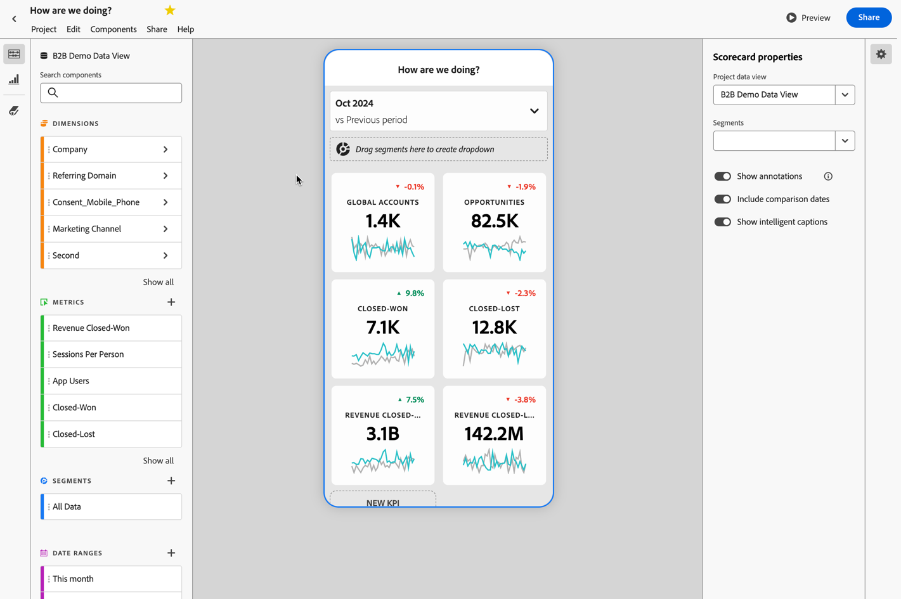

# Build product value

{{draft-b2b}}

You want to deliver B2B product value insights to product managers and CMO or CEOs. For example, through a data driven churn analysis or predications. And make these insights digestible through mobile dashboards.

Customer Journey Analytics B2B Edition can support you to deliver product value insights. See the following sections for examples.

## Reduce churn

You want to identify accounts with low product usage, low brand engagement, and other key factors that indicate a high churn potential. This early identification allows you to develop account activation strategies.

The [Active growth](/help/guided-analysis/types/active-growth.md) guided analysis can help you to determine how to:

* Derive insights about the growth and acquisition of accounts, opportunities, and users over a specific period.
* Spot dormant accounts, with no recent engagement. So you can determine a strategy for renewal or upsell.
* Partner with your customer success or sales organization to re-enage dormant accounts. You can investigate low usage, and plan product enhancements to address churn and overcome slow or stalled adoption.

### Example

You want to see the net active growth  across you new, repeat, return, and dormant accounts.

1. [Create and configure an Active growth](/help/guided-analysis/types/active-growth.md) guided analysis.
1. Select **[!UICONTROL Accounts]** as **[!UICONTROL Counted as]**.
1. Select the preferred **[!UICONTROL Chart settings]**. For example:  **[!UICONTROL Stacked bar]**.
1. Select the preferred  **[!UICONTROL Interval]** and **[!UICONTROL Date range]**.

## Democratize insights

You want to democratize key insights for CMOs and CEOs, so they can, for example, at a glance inspect account data and product usage from their mobile device.

A [Mobile scorecard](/help/mobile-app/home.md) can help to provide these insights.

### Example

You want to create a mobile scorecard that combines details about accounts, opportunities, closed won and lost opportunities and the revenue associated with those opportunities.

1. [Create a mobile scorecard](/help/mobile-app/create-scorecard.md).
1. Define the period on which you want to report. For example **[!UICONTROL October 2024 vs Previous Period]**.
1. Drag and drop the relevant metrics onto the app canvas. For example: **[!UICONTROL Global accounts]**, **[!UICONTROL Opportunities]**, **[!UICONTROL Closed-Won]**, **[!UICONTROL Closed-Lost]**, **[!UICONTROL Revenue Closed-Won]**, and **[!UICONTROL Revenue-Closed-Lost]**.

   

1. Use **[!UICONTROL Preview]** to preview the dashboard. The dashboard is now available from the Adobe Analytics dashboard app, available from the [App Store](https://apps.apple.com/us/app/adobe-analytics-dashboards/id1509062264) or [Google Play](https://play.google.com/store/apps/details?id=com.adobe.analyticsdashboards).

   
