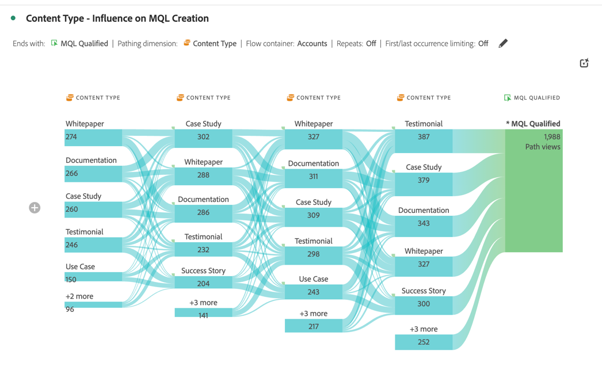

# Optimize account marketing

{{draft-b2b}}

Effective account based marketing requires a deep understanding of the buying journey at the account level. So, you can determine the most impactful marketing activities to drive deal close.

For this understanding you want to analyze and explore:

* Marketing impact:
   
  * Across campaigns, channels, and content. 
  * On buying groups within accounts, 
   
* Sales pipeline progression.
* Upsell- and cross-sell opportunities.
* Customer account health.

Customer Journey Analytics B2B Edition can support you in the optimization of account marketing. See the following sections for examples.

## Account based marketing engagement

You want to identify which experiences, both online and offline, are most impactful in driving closed opportunities.

Use the [Journey canvas](/help/analysis-workspace/visualizations/journey-canvas/journey-canvas.md) visualization to map every interaction across accounts, opportunities, buying groups, campaigns, and channels for insights in what is working in your account marketing and where you can improve.

A journey canvas visualization helps you to:

* See the full story. For example, you can show a detailed path of a *specific* high-value account or buying group that includes all known online and offline interactions.
* Contextualize key moments that lead up to or follow critical milestones (for example: a marketing qualified lead trigger, or opportunity creation).
* Supports sales staff through the visualization's interaction history on specific accounts. Such a visualization enables relevant conversations.

### Example

You want to visualize the journey from a lead form to a closed won.

1. [Create and configure a Journey canvas](/help/analysis-workspace/visualizations/journey-canvas/configure-journey-canvas.md) visualization.
1. Configure **[!UICONTROL Account]** as the **[!UICONTROL Primary metric]**.
1. Ensure you select **[!UICONTROL Account]** as the **[!UICONTROL Journey canvas container]**.

   

1. Select **[!UICONTROL Build]**.
1. Drag and drop nodes on the canvas and connect the nodes to illustrate the account journey. For example: from **[!UICONTROL Lead Form: Step 1]** form to **[!UICONTROL Opp. Created]**.

   

## Cohort segmentation

You want to identify key group of buyers so you activate these buyer groups for other channels, like paid media, email, social.

Use the [Cohort table](/help/analysis-workspace/visualizations/cohort-table/cohort-analysis.md) visualization to group B2B entities (accounts, opportunities, buying groups) based on a shared starting point (like a market qualification (MQL) lead date). And track the progress of each of these entities over time at subsequent stages or milestones.

A cohort table visualization helps you to:

* Analyze how quickly cohorts of accounts or opportunities reach key milestones (for example: from a marketing qualified lead to a sales qualified lead) over weeks or months.
* Identify whether certain cohorts (by segment, campaign source, buying group type) move faster through the sales cycle than other cohorts.
* Assess whether strategic initiatives (for example: marketing campaigns) correlate with shorter progression timelines for subsequent cohorts.

### Example

You want to see monthly cohorts of closed opportunities.

1. [Create and configure a Cohort table](/help/analysis-workspace/visualizations/cohort-table/t-cohort.md) visualization.
1. Use **[!UICONTROL Opportunity Created]** as the **[!UICONTROL Inclusion criteria]** metric. Select **[!UICONTROL >=]** as the operator and enter value `1`.
1. Use **[!UICONTROL Closed-Won]** as the **[!UICONTROL Return criteria]** metric. Select **[!UICONTROL >=]** as the operator and enter value `1`.
1. Select **[!UICONTROL Opportunity]** as the container.

   

1. Select **[!UICONTROL Build]**. See below for an example cohort table.

   

## In-person events

You want to report on engaged account and viewing activity across multiple in-person events. So, you can analyze and optimize the impact of in-person event attendance.

A [flow](/help/analysis-workspace/visualizations/c-flow/flow.md) visualization lets you visualize the paths users, but now also accounts or buying group, take between interactions or stages over time.

A flow visualization helps you to:

* Identify the most frequent sequences of touchpoints traversed by B2B entities (for example: from *Site Visit* to *Whitepaper Download* to *Demo Request*).
* Visualize how accounts or buying groups navigate non-linearly (for example: loop back, skip stages, or take unexpected routes).
* Focus on the flow before or after a critical interaction (for example: a demo request) to understand what factors contribute to or what actions follow after the interaction.

### Example

You want to visualize the influence on the generation of MQLs (marketing qualified leads).

1. [Create and configure a Flow](/help/analysis-workspace/visualizations/c-flow/create-flow.md) visualization.
1. Select **[!UICONTROL MQL Qualified]** for **[!UICONTROL End with]**.
1. Select **[!UICONTROL Content Type]** for **[!UICONTROL Pathing dimension]**.
1. Select **[!UICONTROL Show advanced settings]**.
1. Enter `5` for **[!UICONTROL Number of columns]**.
1. Select **[!UICONTROL Account]** for the **[!UICONTROL Flow container]**.

   

1. Select **[!UICONTROL Build]**.

   
