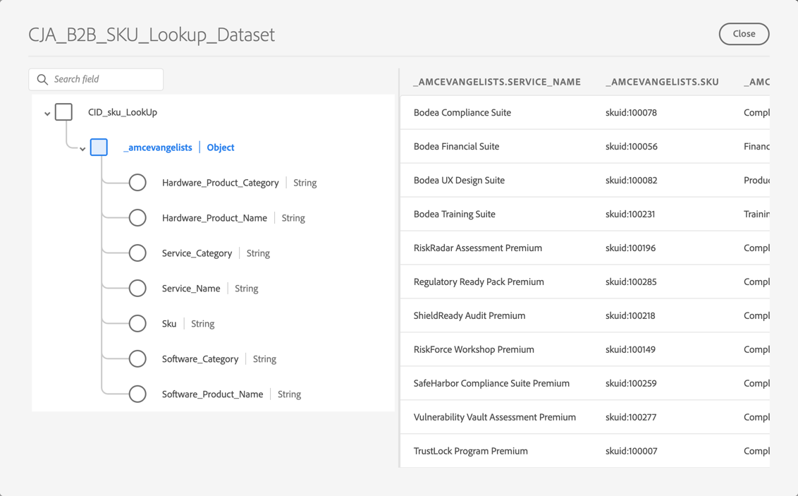
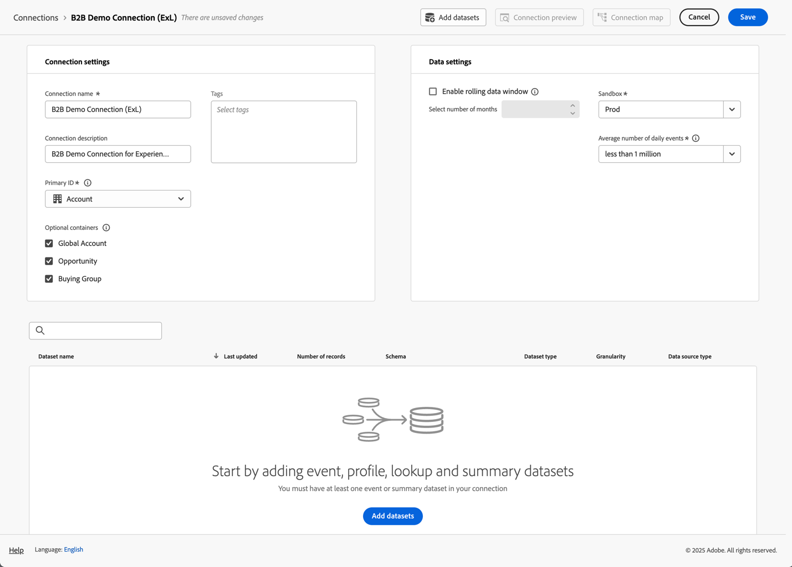

# Setup for B2B Edition use cases

This article covers a typical setup of the Customer Journey Analytics B2B Edition to support the following uses cases:

* [Optimize account marketing](optimize-account-marketing.md)
* [Grow key accounts](grow-key-accounts.md)
* [Build product value](build-product-value.md)

>[!NOTE]
>
>The demo data and screenshots that are used in these use cases are for illustration purposes only and do not reflect real world data.

## Solution design reference

Before you set up Customer Journey Analytics B2B Edition, ensure you have a proper solution design reference in place that documents each of the fields you collect.

An example solution design reference could look like:

+++ Event dimensions

| Dimension  name |
|---|
| Account ID |
| Account Name |
| Buying Group ID |
| Call Center |
| Call Center Representative ID |
| Call ID |
| Campaign Tracking Code |
| Content ID |
| Content Type |
| Data Source |
| Device Type |
| Event Details |
| Event Name |
| Funnel |
| Interaction Channel |
| Lead ID |
| Marketing Channel |
| Marketing Event ID |
| Marketing Event Type |
| Opportunity ID |
| Page |
| Page Details |
| Referring Domain |
| Sales Representative ID |
| Sales Stage Name |
| Sales Stage Number |
| Site Section |
| SKU |
| Subsidiary Account ID |
| Survey ID |
| Survey Satisfaction Score |
| Survey Type |
| User ID |

+++

+++ Event metrics

| Metric name | Event type |
|---|---|
| Account Creation: Complete | Counter | 
| Account Creation: Start | Counter | 
| Call Cost | Currency | 
| Call Length | Counter | 
| Call Satisfaction Score |  Numeric | 
| Call Surveys Completed |  Counter | 
| Calls | Counter | 
| Closed-Lost | Counter | 
| Closed-Won | Counter | 
| Content Views | Counter | 
| Deal Size Currency Display Click-throughs | Counter | 
| Display Impressions | Counter | 
| Email Bounced | Counter | 
| Email Clicked | Counter | 
| Email Delivered | Counter | 
| Email Opened | Counter | 
| Email Sent | Counter | 
| Event Attendance | Counter | 
| Event Registration: Complete | Counter | 
| Event Registration: Step 1 | Counter | 
| Event Registration: Step 2 | Counter | 
| Event Registration: Step 3 | Counter | 
| Global Satisfaction Score Numeric Inbound Call | Counter | 
| Lead Form: Complete | Counter | 
| Lead Form: Step 1 | Counter | 
| Lead Form: Step 2 | Counter | 
| Lead Generated | Counter | 
| Lead Qualification | Counter | 
| Meetings | Counter | 
| MQL Disqualified | Counter | 
| MQL Qualified | Counter | 
| Needs Assessment | Counter | 
| Negotiation | Counter | 
| Objection Handling | Counter | 
| Opportunities | Counter | 
| Opportunity Creation | Counter | 
| Orders | Counter | 
| Outbound Call | Counter | 
| Post-Sales Follow-Up | Counter | 
| Proposal Submission | Counter | 
| Revenue Closed-Lost | Currency |
| Revenue Closed-Won | Currency |
| Sales Contact Calls | Counter |
| Sales Stage Started | Counter |
| SMS Click-throughs | Counter |
| SMS Sent | Counter |
| Social Click-throughs | Counter |
| Social Impressions | Counter |
| Solution Presentation | Counter |
| SQL Disqualified | Counter |
| SQL Qualified|  Counter |
| Units (do not expose) | Counter |
| VoC Survey Satisfaction Score | Numeric |
| VoC Surveys Completed | Counter |

+++

+++ Person records

| Data view field name | Field type |
|---|---|
| Age | Metric | 
| Age Group | Dimension | 
| Category 1 Affinity Level | Dimension | 
| Category 1 Affinity Score | Metric | 
| Category 2 Affinity Level | Dimension | 
| Category 2 Affinity Score | Metric | 
| Category 3 Affinity Level | Dimension | 
| Category 3 Affinity Score | Metric | 
| Category 4 Affinity Level | Dimension | 
| Category 4 Affinity Score | Metric | 
| Category 5 Affinity Level | Dimension | 
| Category 5 Affinity Score | Metric | 
| Consent Advertising | Dimension | 
| Consent All Communications | Dimension | 
| Consent Direct Mail | Dimension | 
| Consent Email | Dimension | 
| Consent Mobile Phone | Dimension | 
| Consent Personalization | Dimension | 
| Consent Share Data | Dimension | 
| Consent SMS | Dimension | 
| Email | Dimension | 
| First Name | Dimension | 
| Gender | Dimension | 
| Individual City | Dimension | 
| Individual CLTV Level | Dimension | 
| Individual CLTV Score | Metric |
| Individual Country |  Dimension |
| Individual Phone | Dimension |
| Individual Postal Code | Dimension |
| Individual Propensity to Buy Level | Dimension |
| Individual Propensity to Buy Score | Metric |
| Individual Propensity to Churn Level | Dimension |
| Individual Propensity to Churn Score | Metric |
| Individual Propensity to Upgrade Level | Dimension |
| Individual Propensity to Upgrade Score | Metric |
| Individual State | Dimension |
| Individual Street Address | Dimension |
| Job Title | Dimension |
| Last Name | Dimension |
| Net Promoter Score | Metric |
| Net Promoter Status | Dimension |
| Role Type | Dimension |

+++

+++ Account records

| Data view field name | Field type |
|---|---|
| Annual Revenue | Metric | 
| Company City | Dimension | 
| Company CLTV Level | Dimension | 
| Company CLTV Score | Metric | 
| Company Country | Dimension | 
| Company Name | Dimension | 
| Company Phone | Dimension |
| Company Postal Code | Dimension |
| Company Propensity to Buy Level | Dimension | 
| Company Propensity to Buy Score | Metric | 
| Company Propensity to Churn Level | Dimension | 
| Company Propensity to Churn Score | Metric | 
| Company Propensity to Upgrade Level | Dimension | 
| Company Propensity to Upgrade Score | Metric | 
| Company Size | Dimension | 
| Company State | Dimension | 
| Company Street Address | Dimension | 
| Industry | Dimension | 
| Number of Employees | Metric | 
| Partner Audience - Hardware Shoppers | Dimension | 
| Partner Audience - Rapid Growth | Dimension | 
| Partner Audience - Services Needed | Dimension | 
| Partner Audience - Software Shoppers | Dimension | 
| Revenue Range | Dimension | 
| Website | Dimension |

+++

+++ SKU records

| Data view field name | Field type |
|---|---|
| Hardware Product Category | Dimension |
| Hardware Product Name | Dimension |
| Service Category | Dimension |
| Service Name | Dimension |
| Software Product Category | Dimension |
| Software Product Name | Dimension |

+++

## Schemas and datasets

The data that supports the solution design reference is structured using the following schemas and datasets.

### Event data

The event dimensions and metrics are supported through a time-series (event) based schema and one or more datasets that contain event data. 

<!--For example: the Account ID field is mapped to **[!UICONTROL Account ID]**. See below for a preview of the data typically available in such a dataset.

-->

### Person data

The person records are supported through a record (profile) based schema and one or more datasets that contain person data. See below for an example of person data (based on the example solution design reference) typically available in such a dataset. 

### Account data

The account records are supported through a record (lookup) record based schema and one or more datasets that contain account data. See below for an example of account data (based on the example solution design reference) typically available in such a dataset. 

### SKU data

The SKU records are supported through a record (lookup) based schema and one or more datasets that contain SKU data. See below for an example of SKU data (based on the example solution design reference) typically available in such a dataset. 

## Connection

Define an account-based connection in Customer Journey Analytics to ingest and join records from the event, account, person and SKU datasets.

1. [Create a new connection](/help/connections/create-connection.md) in Customer Journey Analytics.
1. Enter a descriptive name and description for the connection.
1. Select  **[!UICONTROL Account]** as the **[!UICONTROL Primary ID]**.
1. Select all **[!UICONTROL Optional containers]**.
1. Select your preferred sandbox and estimate the average number of daily events.

   

1. Select **[!UICONTROL Add datasets]** and add the B2B datasets that contain the data for events, accounts, persons and SKUs.

   

1. Select **[!UICONTROL Next]** to configure the settings for each of the selected datasets.
1. For the event dataset, ensure you select the appropriate eVars that correspond to the identities for **[!UICONTROL Account ID]**, **[!UICONTROL Global Account ID]**, **[!UICONTROL Opportunity ID]**, **[!UICONTROL Buying Group ID]** and **[!UICONTROL Person ID]**.

   . 

1. Scroll down to configure the account records dataset. Ensure you select the correct identifier (**[!UICONTROL Account_ID]**) to match the account by the **[!UICONTROL Global Account]** container. Select the correct identifier (**[!UICONTROL Account_ID]**) as the **[!UICONTROL Global Account field]**.

   

1. Scroll down to configure the person records dataset. Ensure you select the correct key (**[!UICONTROL Person_ID]**) to match the person by the **[!UICONTROL Person]** container. Select the appropriate identity (**[!UICONTROL Profile_Account_ID_Individual]**) to match the **[!UICONTROL Global Account]** field.

   

1. Scroll down to configure the SKU records dataset. Ensure you select the correct key (**[!UICONTROL Sku]**). Select **[!UICONTROL Match by field]** because no container is configured or available for this data. Select the SKU field in the event dataset(**[!UICONTROL SKU (event datasets)]**) as the matching key.

   

1. Select **[!UICONTROL Add datasets]** to save the datasets and their configured settings.

1. Select **[!UICONTROL Save]** to save the connection. 

## Data view

After data is ingested in Customer Journey Analytics, you want to create a data view that includes all the components you have defined in your solution design reference. 

### Configure

1. [Create a new data view](/help/data-views/data-views.md) in Customer Journey Analytics.
1. Select the connection you previously created (for example: **[!UICONTROL B2B Demo Connection (ExL)]**).
1. Provide a name for the data view. For example: `B2B Demo Data view (ExL)` and optionally a description.
1. Optionally, rename the containers. Or stick with the default container names.

   
1. Select **[!UICONTROL Save and continue]**.

### Components

By default, all [standard components](/help/data-views/component-reference.md) are already included in your data view. These standard components include the B2B specific metrics for Accounts, Buying Groups, Global Accounts, and Opportunities.

1. Add all event dimensions that you have defined in the [solution design reference](#solution-design-reference), to the dimension components in your data view. For example, the field **[!UICONTROL Event Name]**, which represents the **[!UICONTROL Event Name]** dimension. Ensure you configure the dimension component through the available [Component settings](/help/data-views/component-settings/overview.md).

   

1. Add all event metrics that you have defined in the [solution design reference](#solution-design-reference) to the metrics components in your data view. For example, the field **[!UICONTROL SQL Qualified]**, which represents the **[!UICONTROL SQL Qualified]** metric. Ensure you configure the dimension component through the available [Component settings](/help/data-views/component-settings/overview.md).

   

1. Add all account dimensions that you have defined in the [solution design reference](#solution-design-reference) to the dimension components in your data view. For example, the field **[!UICONTROL Industry]**, which represents the **[!UICONTROL Industry]** dimension. Ensure you configure the dimension component through the available [Component settings](/help/data-views/component-settings/overview.md).

   

1. Add all account metrics that you have defined in the [solution design reference](#solution-design-reference) to the metrics components in your data view. For example, the field **[!UICONTROL Number_of_Employees]**, which represents the **[!UICONTROL Number_of_Employees]** metric. Ensure you configure the dimension component through the available [Component settings](/help/data-views/component-settings/overview.md).

   

1. Add all person dimensions that you have defined in the [solution design reference](#solution-design-reference) to the dimension components in your data view. For example, the field **[!UICONTROL Category_1_Affinity_Level]**, which represents the **[!UICONTROL Category_1_Affinity_Level]** dimension. Ensure you configure the dimension component through the available [Component settings](/help/data-views/component-settings/overview.md).

   

1. Add all person metrics that you have defined in the [solution design reference](#solution-design-reference) to the metrics components in your data view. For example, the field **[!UICONTROL Category_1_Affinity_Score]**, which represents the **[!UICONTROL Category_1_Affinity_Score]** metric. Ensure you configure the dimension component through the available [Component settings](/help/data-views/component-settings/overview.md).

   

1. Add all SKU dimensions that you have defined in the [solution design reference](#solution-design-reference) to the dimension components in your data view. For example, the field **[!UICONTROL Service Category]**, which represents the **[!UICONTROL Service Category]** dimension. Ensure you configure the dimension component through the available [Component settings](/help/data-views/component-settings/overview.md).

   

1. Select **[!UICONTROL Save and Continue]**.

### Settings

1. You can optionally define specific [settings](/help/data-views/create-dataview.md#settings-1) for the data view:

   * Add segments to the data view.
   * Use a (calculated) metric to define session settings.

1. Select **[!UICONTROL Save and continue]**.

## Segments

You can prepare one or more B2B specific container-based segments that you can use in your Workspace project.

For example: 

* Accounts with event registration segment.

  

* US accounts with Buying Groups and stage 5 opportunities segment.

  

## Other

You can optionally define other components for your use cases, like [calculated metrics](/help/components/calc-metrics/calc-metr-overview.md), [date ranges](/help/components/date-ranges/overview.md), or [alerts]((/help/components/c-intelligent-alerts/intelligent-alerts.md).
