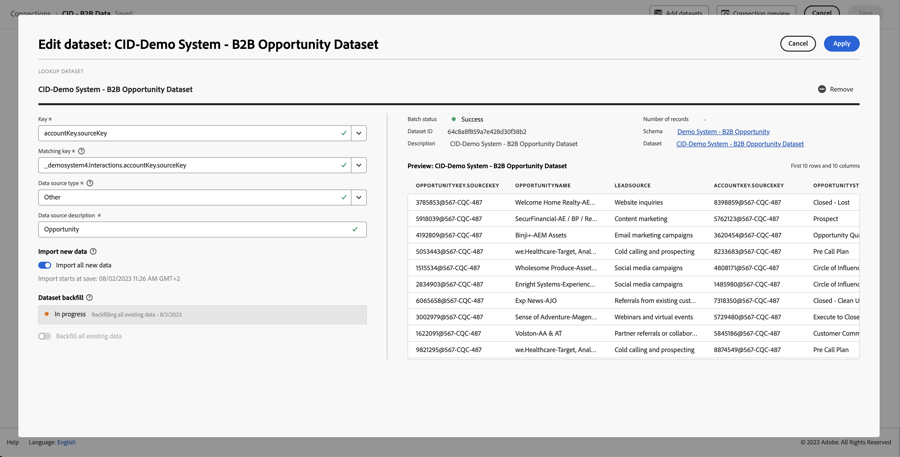

# An example B2B project

This article explains, through examples, how to set up, configure and report on B2B data in Customer Journey Analytics.

## Connection

Define your connection to include all relevant B2B datasets from Experience Platform. This includes the important lookup datasets required in a typical B2B setup within Experience Platform. See [Add account-level data as a lookup dataset](b2b.md) for more information.

Datasets you can consider to add to your connection:

| Dataset | Schema | Schema type | Base class | Description |
|---|---|---|---|---|
| B2B Activity Dataset | B2B Activity Schema | Event | XDM ExperienceEvent | An ExperienceEvent is a fact record of what occurred, including the point in time and identity of the individual involved. ExperienceEvents can be either explicit (directly observable human actions) or implicit (raised without a direct human action) and are recorded without aggregation or interpretation. They are critical for time-domain analytics as they allow for observation and analysis of changes that occur in a given window of time and the comparison between multiple windows of time to track trends. |
| B2B Person Dataset | B2B Person Schema | Profile | XDM Individual Profile | An XDM Individual Profile forms a singular representation of the attributes and interests of both identified and partially identified individuals. Less-identified profiles may contain only anonymous behavioral signals, such as browser cookies, while highly identified profiles may contain detailed personal information such as name, date of birth, location, and email address. As a profile grows, it becomes a robust repository of personal information, identification information, contact details, and communication preferences for an individual. |
| B2B Campaign Member Dataset | B2B Campaign Member Schema | Lookup | XDM Business Campaign Members | XDM Business Campaign Members is a standard Experience Data Model (XDM) class that describes a contact or lead associated with a business campaign. |
| B2B Account Dataset | B2B Account Schema | Lookup | XDM Business Account | XDM Business Account is a standard Experience Data Model (XDM) class that captures the minimum required properties of a business account.  |
| B2B Account Person Relation Dataset | B2B Account Person Relation Schema | Lookup | XDM Business Account Person Relation | XDM Business Account Person Relation is a standard Experience Data Model (XDM) class that captures the minimum required properties of a person that is associated with a business account.  |
| B2B Opportunity Dataset | B2B Opportunity Schema | Lookup | XDM Business Opportunity | XDM Business Opportunity is a standard Experience Data Model (XDM) class that captures the minimum required properties of a business opportunity.  |
| B2B Opportunity Person Relation Dataset | B2B Opportunity Person  Relation Schema | Lookup | XDM Business Opportunity Person Relation | XDM Business Opportunity Person Relation is a standard Experience Data Model (XDM) class that captures the minimum required properties of a person that is associated with a business opportunity.  |
| B2B Campaign Dataset | B2B Campaign Schema | Lookup | XDM Business Campaign | XDM Business Campaign is a standard Experience Data Model (XDM) class that captures the minimum required properties of a business campaign.  |
| B2B Marketing List Dataset | B2B Marketing List Schema | Lookup | XDM Marketing List | XDM Business Marketing List is a standard Experience Data Model (XDM) class that captures the minimum required properties of a marketing list. Marketing lists allow you to prioritize on prospect clients who are most likely to buy your product.  |
| B2B Marketing List Members Dataset | B2B Marketing List Members Schema | Lookup | XDM Marketing List Members | XDM Business Marketing List Members is a standard Experience Data Model (XDM) class that describes members, persons, or contacts associated with a marketing list. |

The relationship between the lookup schemas, profile schema, and event schema is defined in the B2B setup within Experience Platform. See Schemas in [Real-Time Customer Data Platform B2B Edition](https://experienceleague.adobe.com/docs/experience-platform/rtcdp/schemas/b2b.html?lang=en) and [Define a many-to-one relationship between two schemas in Real-Time Customer Data Platform B2B Edition](https://experienceleague.adobe.com/docs/experience-platform/xdm/tutorials/relationship-b2b.html?lang=en) for more details. 

For each lookup dataset that you add to your connection, you must explicitly define the relationship to an event dataset using Key and Matching key in the Edit dataset dialog. For example:

The table below provides an example overview of the [!UICONTROL Person ID], [!UICONTROL Key], and [!UICONTROL Matching key] values for each of the datasets.

| Dataset | Person ID | Key | Matching key (in event dataset) |
|---|---|---|---|
| B2B Activity Dataset | `personKey.sourceKey` | | |
| B2B Person Dataset | `b2b.personKey.sourceKey` | | |
| B2B Account Dataset | | `accountKey.sourceKey` | *_organizationID*`.interactions.accountKey.sourceKey` |
| B2B Opportunity Dataset | | `accountKey.sourceKey` | *_organizationID*`.interactions.accountKey.sourceKey` |
| B2B Campaign Dataset | | `campaignKey.sourceKey` |  *_organizationID*`.interactions.campaignKey.sourceKey` |
| B2B Marketing List Dataset | | `listKey.sourceKey` | `listOperations.listKey.sourceKey` |

{style="table-layout:auto"}

In the table *_organizationID*`.interaction.*`, refers to the custom field group that you have added to the B2B Activity schema to define the relationship with  the B2B Account and B2B Opportunity schema. The `listOperations.listKey.sourceKey` refers to the Add To List field group added to the B2B Activity schema to track when a person is added to a specific list.

See [Add and configure datasets](../../connections/create-connection.md) for more information on how to configure settings for a dataset.

## Data view

To have access to relevant B2B dimensions and metrics when building your Workspace project, you must define your data view accordingly. 

This section provides recommendations and suggestions on what dimensions and metrics to include when defining the [components](../../data-views/create-dataview.md#components) for B2B datasets in your data view.

For each component, the name, schema type, schema path, and (when applicable) details about the configuration are provided.

+++ B2B Activity dataset

### Metrics

| Component Name | Schema data type | Schema path | Configuration |
|---|---|---|---|
| Add To Campaign | String | `eventType` | **[!UICONTROL Set include/exclude values]** **[!UICONTROL Case sensitive]** Match: **[!UICONTROL If all criteria are met]** Criteria: **[!UICONTROL Equals]** `leadOperation.addToCampaign` |
| Add To Opportunity | String | `eventType` | **[!UICONTROL Set include/exclude values]** **[!UICONTROL Case sensitive]** Match: **[!UICONTROL If all criteria are met]** Criteria: **[!UICONTROL Equals]** `opportunityEvent.addToOpportunity` |
| Application Closed | String | `eventType` | **[!UICONTROL Set include/exclude values]** **[!UICONTROL Case sensitive]** Match: **[!UICONTROL If all criteria are met]** Criteria: **[!UICONTROL Equals]** `application.close` |
| Application Launch | String | `eventType` | **[!UICONTROL Set include/exclude values]** **[!UICONTROL Case sensitive]** Match: **[!UICONTROL If all criteria are met]** Criteria: **[!UICONTROL Equals]** `application.launch` |
| Campaign Stream | String | `eventType` | **[!UICONTROL Set include/exclude values]** **[!UICONTROL Case sensitive]** Match: **[!UICONTROL If all criteria are met]** Criteria: **[!UICONTROL Equals]** ` leadOperation.changeCampaignStream` |
| Checkout | String | `eventType` | **[!UICONTROL Set include/exclude values]** **[!UICONTROL Case sensitive]** Match: **[!UICONTROL If all criteria are met]** Criteria: **[!UICONTROL Equals]** `commerce.checkouts` |
| Convert Lead | String | `eventType` | **[!UICONTROL Set include/exclude values]** **[!UICONTROL Case sensitive]** Match: **[!UICONTROL If all criteria are met]** Criteria: **[!UICONTROL Equals]** `leadOperation.convertLead` |
| Email Clicked | String | `eventType` | **[!UICONTROL Set include/exclude values]** **[!UICONTROL Case sensitive]** Match: **[!UICONTROL If all criteria are met]** Criteria: **[!UICONTROL Equals]** `directMarketing.emailClicked` |
| Email Delivered | String | `eventType` | **[!UICONTROL Set include/exclude values]** **[!UICONTROL Case sensitive]** Match: **[!UICONTROL If all criteria are met]** Criteria: **[!UICONTROL Equals]** `directMarketing.emailDelivered` |
| Email Opened | String | `eventType` | **[!UICONTROL Set include/exclude values]** **[!UICONTROL Case sensitive]** Match: **[!UICONTROL If all criteria are met]** Criteria: **[!UICONTROL Equals]** `directMarketing.emailOpened` |
| Email Sent | String | eventType | **[!UICONTROL Set include/exclude values]** **[!UICONTROL Case sensitive]** Match: **[!UICONTROL If all criteria are met]** Criteria: **[!UICONTROL Equals]** `directMarketing.emailSent` |
| Email Unsubscribed | String | `eventType` | **[!UICONTROL Set include/exclude values]** **[!UICONTROL Case sensitive]** Match: **[!UICONTROL If all criteria are met]** Criteria: **[!UICONTROL Equals]** `directMarketing.emailUnsubscribed` |
| Form Filled Out | String | `eventType` | **[!UICONTROL Set include/exclude values]** **[!UICONTROL Case sensitive]** Match: **[!UICONTROL If all criteria are met]** Criteria: **[!UICONTROL Equals]** `web.formFilledOut` |
| Form Started | String | `web.fillOutForm.webFormName` | |
| Leads | String | eventType | **[!UICONTROL Set include/exclude values]** **[!UICONTROL Case sensitive]** Match: **[!UICONTROL If all criteria are met]** Criteria: **[!UICONTROL Equals]** `leadOperation.newLead` |
| Opportunity Updated | String | `eventType` | **[!UICONTROL Set include/exclude values]** **[!UICONTROL Case sensitive]** Match: **[!UICONTROL If all criteria are met]** Criteria: **[!UICONTROL Equals]** `opportunityEvent.opportunityUpdated` |
| Price | Double | *_organizationID*`.interactions.products.price` |  |
| Priority | Integer | `leadOperation.changeScore.priority` |  |
| Prod List Add | String | `eventType` |  **[!UICONTROL Set include/exclude values]** **[!UICONTROL Case sensitive]** Match: **[!UICONTROL If all criteria are met]** Criteria: **[!UICONTROL Equals]** `commerce.productListAdds.value` |
| Prod List Open | String | `eventType` |  **[!UICONTROL Set include/exclude values]** **[!UICONTROL Case sensitive]** Match: **[!UICONTROL If all criteria are met]** Criteria: **[!UICONTROL Equals]** `commerce.productListOpens.value` |
| Prod View | String | `eventType` |  **[!UICONTROL Set include/exclude values]** **[!UICONTROL Case sensitive]** Match: **[!UICONTROL If all criteria are met]** Criteria: **[!UICONTROL Equals]** `commerce.productViews.value` |
| Purchases | String | `eventType` |  **[!UICONTROL Set include/exclude values]** **[!UICONTROL Case sensitive]** Match: **[!UICONTROL If all criteria are met]** Criteria: **[!UICONTROL Equals]** `commerce.purchases.value` |
| Remove From Opportunity | String | `eventType` |  **[!UICONTROL Set include/exclude values]** **[!UICONTROL Case sensitive]** Match: **[!UICONTROL If all criteria are met]** Criteria: **[!UICONTROL Equals]** `opportunityEvent.removeFromOpportunity` |
| Save for Laters | String | eventType |  **[!UICONTROL Set include/exclude values]** **[!UICONTROL Case sensitive]** Match: **[!UICONTROL If all criteria are met]** Criteria: **[!UICONTROL Equals]** `commerce.productViews.value` |

{style="table-layout:auto"}

### Dimensions

| Component Name | Schema data type | Schema path | Configuration |
|---|---|---|---|
| Account Key (Source Key) | String | *_organizationID*`.Interactions.accountKey.sourceKey` | |
| Converted Status | String | `leadOperation.convertLead.convertedStatus` | |
| Event Type | String | `eventType` | |
| Form Name | String | `leadOperation.newLead.formName` | |
| Identifier | String | `_id` | |
| Is Sent Notification | Boolean | `leadOperation.convertLead.isSentNotificationEmail` | |
| Keywords | String | `search.keywords` | |
| List ID | String | `listOperations.listID` | |
| List Name | String | `leadOperation.newLead.listName` | |
| Page Name | String | `web.webPageDetails.name` | |
| Person Key (Source Key) | String | `personKey.sourceKey` | |
| Produced By | String | producedBy | |
| Product Name | String | *_organizationID*`.Interactions.products.name` | |
| Role | String | `opportunityEvent.role` | | 
| Timestamp | Date-time | `timestamp` | Date-Time format: **[!UICONTROL Day]** |
| URL | String | `web.webPageDetails.URL` | |
| Web Form Name | String | `web.fillOutForm.webFormName` | |
| Product URL | String | *_organizationID*`.Interactions.products.url` | |

{style="table-layout:auto"}

+++

+++ B2B Person dataset

### Metrics

No metric components are defined as part of this dataset.

### Dimensions

| Component Name | Schema data type | Schema path | Configuration |
|---|---|---|---|
| Last Activity Date | Date-time | `extSourceSystemAudit.lastActivityDate` | Date-Time format: **[!UICONTROL Day]** |
| Person ID | String | `personID` | |

{style="table-layout:auto"}

+++

+++  B2B Opportunity dataset

### Metrics

| Component Name | Schema data type | Schema path | Configuration |
|---|---|---|---|
| Expected Revenue | Double | `expectedRevenue.amount` | Behavior: **[!UICONTROL Count values]** |
| Opportunity Amount | Double | `opportunityAmount.amount` | Behavior: **[!UICONTROL Count values]** |
| Opportunity Stage - Closed Book | String | `opportunityStage` | **[!UICONTROL Set include/exclude values]** **[!UICONTROL Case sensitive]** Match: **[!UICONTROL If all criteria are met]** Criteria: **[!UICONTROL Equals]** `Closed - Booked` |
| Opportunity Stage - Prospect | String | `opportunityStage` | **[!UICONTROL Set include/exclude values]** **[!UICONTROL Case sensitive]** Match: **[!UICONTROL If all criteria are met]** Criteria: **[!UICONTROL Equals]** `Prospect` |
| Opportunity Stage - Qualification | String | `opportunityStage` | **[!UICONTROL Set include/exclude values]** **[!UICONTROL Case sensitive]** Match: **[!UICONTROL If all criteria are met]** Criteria: **[!UICONTROL Equals]** `Opportunity Qualification` |
| Opportunity Stage - Solution Definition | String | `opportunityStage` | **[!UICONTROL Set include/exclude values]** **[!UICONTROL Case sensitive]** Match: **[!UICONTROL If all criteria are met]** Criteria: **[!UICONTROL Equals]** `Solution Definition and Validation` |

{style="table-layout:auto"}

### Dimensions

| Component Name | Schema data type | Schema path | Configuration |
|---|---|---|---|
| Closed Flag | Boolean | `isClosed` | |
| Company ID | String | `opportunityID` | |
| Forecast Category | String | `forecastCategoryName` | |
| Last Activity Date | Date-time | `lastActivityDate` | Date-time format: **[!UICONTROL Day]** |
| Lead Source | String | `leadSource` | |
| Opportunity Name | String | `opportunityName` | | 
| Opportunity Status | String | `opportunityStage` | |
| Won Flag | Boolean | `isWon` | |

{style="table-layout:auto"}

+++

+++ B2B Campaign dataset

### Metrics

| Component Name | Schema data type | Schema path | Configuration |
|---|---|---|---|
| Campaign Cost | Double | `actualCost.amount` | |

{style="table-layout:auto"}

### Dimensions

| Component Name | Schema data type | Schema path | Configuration |
|---|---|---|---|
| Campaign ID | String | `campaignID` | |
| Campaign Name | String | `campaignName` | |
| Campaign Start Date | Date-time | `campaignStartDate` | Date-time format: **[!UICONTROL Day]** |
| Channel Name | String | `channelName` | |
| Parent Campaign ID | String | `parentCampaignID` | |

{style="table-layout:auto"}

+++

+++ B2B Account dataset

### Metrics

| Component Name | Schema data type | Schema path | Configuration |
|---|---|---|---|
| Annual Revenue | Double | `accountOrganization.annualRevenue.amount` | |
| Number of employees | Integer | `accountOrganization.numberOfEmployees` | |

{style="table-layout:auto"}

### Dimensions

| Component Name | Schema data type | Schema path | Configuration |
|---|---|---|---|
| Account Identifier | String | `accountID` | |
| Account Type | String | `accountType` | |
| City | String | `accountBillingAddress.city` | |
| Country | String | `accountBillingAddress.country` | |
| Industry | String | `accountOrganization.industry` | |
| Region | String | `accountBillingAddress.region` | |
| Source ID | String | `accountKey.sourceID` | |
| Source Instance ID | String | `accountKey.sourceInstanceID` | |
| Source Key | String | `accountKey.sourceKey` | |
| Source Type | String | `accountKey.sourceType` | |

{style="table-layout:auto"}

+++

+++ B2B Campaign Member dataset

### Metrics

| Component Name | Schema data type | Schema path | Configuration |
|---|---|---|---|
| Bounced | Long | *_organizationID*`.campaignBounced` | Behavior: **[!UICONTROL Count values]** |
| Clicked | Long | *_organizationID*`.campaignClicked` | Behavior: **[!UICONTROL Count values]** |
| Opened | Long | *_organizationID*`.CampaignOpened` | Behavior: **[!UICONTROL Count values]** |
| Sent | Long | *_organizationID*`.campaignSent` | Behavior: **[!UICONTROL Count values]** |
| Subscribed | Long | *_organizationID*`.campaignSubscribed` | Behavior: **[!UICONTROL Count values]** |
| Webinar Registrations | Long | *_organizationID*`.Registrations` | Behavior: **[!UICONTROL Count values]** |

{style="table-layout:auto"}

### Dimensions

| Component Name | Schema data type | Schema path | Configuration |
|---|---|---|---|
| Campaign ID | String | `campaignID` | |
| Campaign Member ID | String | `campaignMemberID` | |
| Campaign Member Status | String | `memberStatus` | |
| Campaign Member Status Reason | String | `memberStatusReason` | |
| Created Date | Date-time | `extSourceSystemAudit.createdDate` | Date-time format: **[!UICONTROL Day]** |
| First Responded Date | String | `firstRespondedDate` | Date-time format: **[!UICONTROL Day]** |
| Has Reached Success | Boolean | `hasReachedSuccess` | |
| Has Responded | Boolean | `hasResponded` | |
| Last Status | String | `lastStatus` | |
| Last Updated Date | Date-time | `extSourceSystemAudit.lastUpdatedDate` | Date-time format: **[!UICONTROL Day]** |
| Membership Date | Date-time | `membershipDate` | Date-time format: **[!UICONTROL Day]** |
| Nurture Cadence | String | `nurtureCadence` | |
| Nurture Track Name | String | `nurtureTrackName` | |
| Person ID | String | `personID` | |
| Reached Success Date | Date-time | `reachedSuccessDate` | Date-time format: **[!UICONTROL Day]** |
| Webinar Registration ID | String | `webinarRegistrationID` | |
| Webinar Registration URL | String | `webinarConfirmationUrl` | |
| isExhausted | Boolean | isExhausted | |

{style="table-layout:auto"}

+++

<!--
### B2B Marketing List Member dataset

The B2B Marketing List Member dataset contains member of marketing lists.

-->

## Workspace

With your components properly defined, you can now build specific B2B visualizations in your Workspace project.

Below is an example project that relies on the connection and data view described above. See the descriptions for each visualization for more details.

+++ Example project

+++
