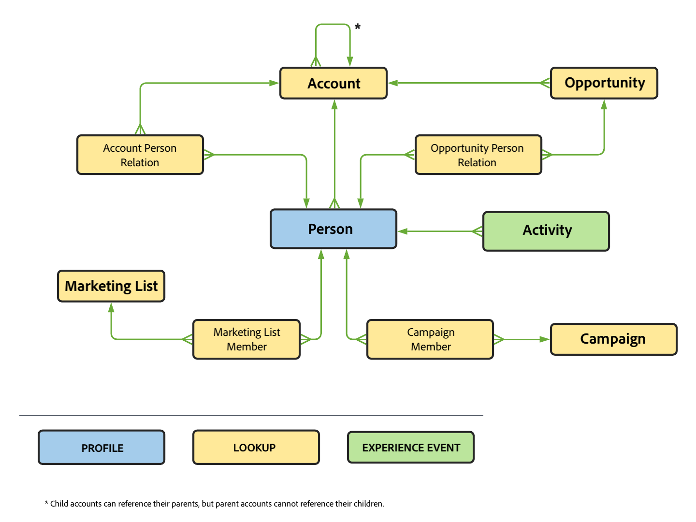

# An example B2B project

This article explains how to setup, configure and report on B2B data in Customer Journey Analytics.

## Connection

Define your connection to include all relevant B2B datasets from Experience Platform. This includes the important lookup datasets required in a typical B2B setup within Experience Platform. See [Add account-level data as a lookup dataset](b2b.md) for more information.

Datasets you can consider to add to your connection:

| Dataset | Schema | Schema type | Base class | Description |
|---|---|---|---|---|
| B2B Activity Dataset | B2B Activity Schema | Event | XDM ExperienceEvent | An ExperienceEvent is a fact record of what occurred, including the point in time and identity of the individual involved. ExperienceEvents can be either explicit (directly observable human actions) or implicit (raised without a direct human action) and are recorded without aggregation or interpretation. They are critical for time-domain analytics as they allow for observation and analysis of changes that occur in a given window of time and the comparison between multiple windows of time to track trends. |
| B2B Person Dataset | B2B Person Schema | Profile | XDM Individual Profile | An XDM Individual Profile forms a singular representation of the attributes and interests of both identified and partially-identified individuals. Less-identified profiles may contain only anonymous behavioral signals, such as browser cookies, while highly-identified profiles may contain detailed personal information such as name, date of birth, location, and email address. As a profile grows, it becomes a robust repository of personal information, identification information, contact details, and communication preferences for an individual. |
| B2B Campaign Member Dataset | B2B Campaign Member Schema | Lookup | XDM Business Campaign Members | XDM Business Campaign Members is a standard Experience Data Model (XDM) class that describes a contact or lead associated with a business campaign. |
| B2B Account Dataset | B2B Account Schema | Lookup | XDM Business Account | XDM Business Account is a standard Experience Data Model (XDM) class that captures the minimum required properties of a business account.  |
| B2B Account Person Relation Dataset | B2B Account Person Relation Schema | Lookup | XDM Business Acount Person Relation | XDM Business Account Person Relation is a standard Experience Data Model (XDM) class that captures the minimum required properties of a person that is associated with a business account.  |
| B2B Opportunity Dataset | B2B Opportunity Schema | Lookup | XDM Business Opportunity | XDM Business Opportunity is a standard Experience Data Model (XDM) class that captures the minimum required properties of a business opportunity.  |
| B2B Opportuniy Person Relation Dataset | B2B Opportunity Person  Relation Schema | Lookup | XDM Business Opportunity Person Relation | XDM Business Opportunity Person Relation is a standard Experience Data Model (XDM) class that captures the minimum required properties of a person that is associated with a business opportunity.  |
| B2B Campaign Dataset | B2B Campaign Schema | Lookup | XDM Business Campaign | XDM Business Campaign is a standard Experience Data Model (XDM) class that captures the minimum required properties of a business campaign.  |
| B2B Marketing List Dataset | B2B Marketing List Schema | Lookup | XDM Marketing List | XDM Business Marketing List is a standard Experience Data Model (XDM) class that captures the minimum required properties of a marketing list. Marketing lists allow you to prioritize on prospect clients who are most likely to buy your product.  |
| B2B Marketing List Members Dataset | B2B Marketing List Members Schema | Lookup | XDM Marketing List Members | XDM Business Marketing List Members is a standard Experience Data Model (XDM) class that describes members, persons, or contacts associated with a marketing list. |

The relationship between the lookup schemas, profile schema and event schema is defined in the B2B setup within Experience Platform. See [Define a many-to-one relationship between two schemas in Real-Time Customer Data Platform B2B Edition](https://experienceleague.adobe.com/docs/experience-platform/xdm/tutorials/relationship-b2b.html?lang=en) for much more details

For the lookup datasets you add to your connection, you need to explicitly define for each dataset this relation using Key and Matching key in the Edit dataset dialog. For example:

The table provides an overview of the list of Person ID, Keys and Matching keys you want to use for each of the datasets.

| Dataset | Person ID | Key | Matching key (in event dataset) |
|---|---|---|---|
| B2B Activity Dataset | personKey.sourceKey | | |
| B2B Person Dataset | b2b.personKey.sourceKey | | |
| B2B Account Dataset | | accountKey.sourceKey | *organizationid*.interactions.accountKey.sourceKey |
| B2B Opportunity Dataset | | accountKey.sourceKey | *organizationid*.interactions.accountKey.sourceKey |
| B2B Campaign Dataset | | campaignKey.sourceKey |  *organizationid*.interactions.campaignKey.sourceKey |
| B2B Marketing List Dataset | | listKey.sourceKey | listOperations.listKey.sourceKey |

In the table *organizationid*.interaction refers to the custom field group you have added to the B2B Activity schema to define the relationship with  the B2B Account and B2B Opportunity schema. The listOperations.listKey.sourceKey refers to the Add To List fieldgroup added to the B2B Activity schema to track when a person is added to a specific list.

See [Add and configure datasets](../../connections/create-connection.md) for more information on how to configure Dataset settings as part of creating a connection.

## Data views

