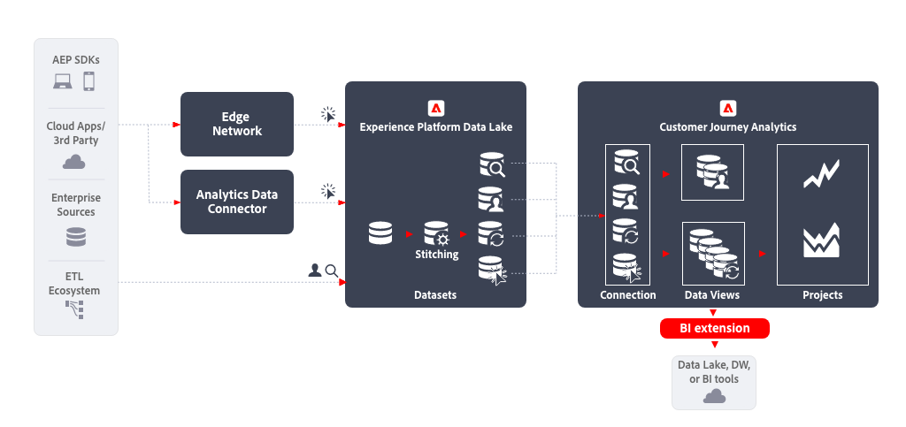

# BI extension

This article outlines how the [!DNL Customer Journey Analytics BI extension] can be used to implement the following [data export use case](overview.md):

- Data Lake, Data Warehouse or BI tools

## Introduction

Exporting data using the [!DNL Customer Journey Analytics BI extension] allows you to export data from your Customer Journey Analytics data views.

## More information

The [!DNL Customer Journey Analytics BI extension] enables SQL access to the [data views](/help/data-views/data-views.md) that you have defined in Customer Journey Analytics. Your data engineers and analysts might be more familiar with Power BI, Tableau, or other business intelligence and visualization tools (further referred to as BI tools). They can now create reporting and dashboards based on the same data views that Customer Journey Analytics users are using when creating their Analysis Workspace projects.

For more information, see the detailed documentation on the [BI extension](../../data-views/bi-extension.md).
