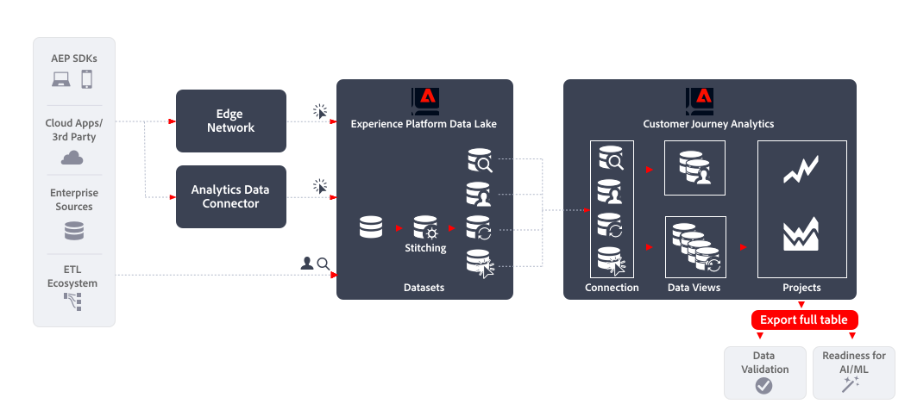

# Export full table

This article outlines how the [!DNL Customer Journey Analytics BI extension] can be used to implement the following [data export use case](overview.md):

- Data Validation
- Readiness for AI / ML

## Introduction

Exporting data using [!DNL Customer Journey Analytics Full Table Export] allows you to export data from your freeform tables in Customer Journey Analytics Analysis Workspace.

## More information

You can directly export the full content of any freeform table you create in Analysis Workspace to designated cloud destinations using the Export full table functionality. 

For more information, see the detailed documentation on [Export Customer Journey Analytics reports to the cloud](/help/analysis-workspace/export/export-cloud.md).
