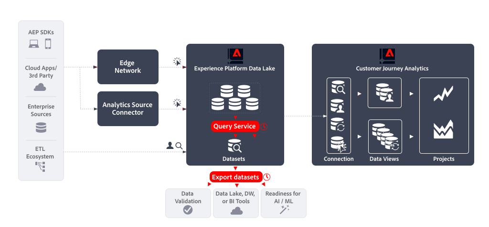

# Query Service (Data Distiller) & Export datasets

This article outlines how the combination of Experience Platform Query Service (Data Distiller) and Dataset export can be used to implement the following [data export use cases](overview.md):

- Data Validation
- Data Lake, Data Warehouse of BI tools
- Readiness for Artificial Intelligent and Machine Learning.


Adobe Analytics can implement these use cases using its [Data Feeds](https://experienceleague.adobe.com/en/docs/analytics/export/analytics-data-feed/data-feed-overview) functionality. Data feeds are a powerful way to get raw data out of Adobe Analytics. This article describes how to get similar type of raw data out of Experience Platform, so you can implement the above mentioned use cases. Where applicable the functionalities described in this article are compared with Adobe Analytics Data Feeds to clarify differences in data and process.

## Introduction

Exporting data using Query Service (Data Distiller) and Dataset export consists of:

- defining a **scheduled query** that generates the data for your data feed as an output dataset , using **Query Service**.
- defining a **scheduled dataset export** that exports the output dataset to a cloud storage destination, using **Dataset export**.




## Prerequisites

Make sure that you meet all the following requirements before using the functionality described in this use case:

- A working implementation that collects data into Experience Platform's data lake.
- Access to the Data Distiller add-on to ensure you are entitled to execute batch queries. See [Query Service packaging](https://experienceleague.adobe.com/en/docs/experience-platform/query/packaging) for more information.
- Access to Export datasets functionality, available when you have purchased the Real-Time CDP Prime or Ultimate package, Adobe Journey Optimizer, or Customer Journey Analytics. See [Export datasets to cloud storage destinations](https://experienceleague.adobe.com/en/docs/experience-platform/destinations/ui/activate/export-datasets) for more information.
- One or more configured destinations (for example: Amazon S3, Google Cloud Storage) to where you can export the raw data of your data feed.


## Query service

Experience Platform Query Service allows you to query and join any dataset in the Experience Platform data lake as if it is a database table. You then can capture the results as a new dataset for further use in reporting or for export.

You can use the Query Service [user interface](https://experienceleague.adobe.com/en/docs/experience-platform/query/ui/overview), a [client connected through the PostgresQL protocol](https://experienceleague.adobe.com/en/docs/experience-platform/query/clients/overview), or [RESTful APIs](https://experienceleague.adobe.com/en/docs/experience-platform/query/api/getting-started) to create and schedule queries that collect the data for your data feed. 

### Create Query

You can use all the functionality of standard ANSI SQL for SELECT statements and other limited commands to create and execute queries that generate the data for your data feed. See [SQL syntax](https://experienceleague.adobe.com/en/docs/experience-platform/query/sql/syntax) for more information. Beyond this SQL syntax, Adobe supports:

- prebuilt [Adobe-defined functions (ADF)](https://experienceleague.adobe.com/en/docs/experience-platform/query/sql/adobe-defined-functions) that help perform common business-related tasks on event data stored in the Experience Platform data lake, including functions for [Sessionization](https://experienceleague.adobe.com/en/docs/analytics/components/virtual-report-suites/vrs-mobile-visit-processing) and [Attribution](https://experienceleague.adobe.com/en/docs/analytics/analyze/analysis-workspace/attribution/overview),
- several built-in [Spark SQL functions](https://experienceleague.adobe.com/en/docs/experience-platform/query/sql/spark-sql-functions),
- [metadata PostgreSQL commands](https://experienceleague.adobe.com/en/docs/experience-platform/query/sql/metadata),
- [prepared statements](https://experienceleague.adobe.com/en/docs/experience-platform/query/sql/prepared-statements).

#### Data feed columns

The XDM fields that you can use in your query depend on the schema definition on which your datasets are based. Ensure you do understand the schema underlying the dataset. See for more information the [Datasets UI guide](https://experienceleague.adobe.com/en/docs/experience-platform/catalog/datasets/user-guide).

To help you to define the mapping between the Data Feed columns and XDM fields, see [Analytics field mapping](https://experienceleague.adobe.com/en/docs/experience-platform/sources/connectors/adobe-applications/mapping/analytics). See also the [Schemas UI overview](https://experienceleague.adobe.com/en/docs/experience-platform/xdm/ui/overview#defining-xdm-fields) for more information on how to manage XDM resources, including schemas, classes, field groups, and data types.

For example, in case you want to use *page name* as part of your data feed: 

- In Adobe Analytics Data Feed's UI, you would select **[!UICONTROL pagename]** as the column to add to your data feed definition. 
- In Query Service, you include `web.webPageDetails.name` from the `sample_event_dataset_for_website_global_v1_1` dataset (based on the **Sample Event Schema for Website (Global v1.1)** experience event schema) in your query. See the [Web Details schema field group](https://experienceleague.adobe.com/en/docs/experience-platform/xdm/field-groups/event/web-details) for more information.


#### Identities

In Experience Platform, various identities are available. When creating your queries, ensure you are querying identities correctly.


Often you find identities in a separate field group. In an implementation ECID (`ecid`) can be defined as part of a field group with a `core` object, which itself is part of an `identification` object (for example: `_sampleorg.identification.core.ecid`). The ECIDs might be organized differently in your schemas.

Alternatively, you can use `identityMap` to query for identities. The `identityMap` is of type `Map` and uses a [nested data structure](#nested-data-structure). 

See [Define identity fields in the UI](https://experienceleague.adobe.com/en/docs/experience-platform/xdm/ui/fields/identity) for more information on how to define identity fields in Experience Platform. 

Refer to [Primary identifiers in Analytics data](https://experienceleague.adobe.com/en/docs/experience-platform/sources/connectors/adobe-applications/analytics#primary-identifiers-in-analytics-data) for an understanding how Adobe Analytics identities are mapped to Experience Platform identities when using the Analytics source connector. This mapping might serve as guidance for setting up your identities, even when not using the Analytics source connector.


#### Hit level data and identification

Based on the implementation, hit level data traditionally collected in Adobe Analytics is now stored as timestamped event data in Experience Platform. The following table is extracted from [Analytics field mapping](https://experienceleague.adobe.com/en/docs/experience-platform/sources/connectors/adobe-applications/mapping/analytics#generated-mapping-fields) and shows examples how to map hit level-specific Adobe Analytics Data Feed columns with corresponding XDM fields in your queries. The table also shows examples of how hits, visits, and visitors are identified using XDM fields.

| Data feed column | XDM field | Type | Description |
|---|---|---|---|
| `hitid_high` + `hitid_low` | `_id` | string | A unique identifier to identify a hit. |
| `hitid_low` | `_id` | string | Used with `hitid_high` to identify a hit uniquely. |
| `hitid_high` | `_id` | string | Used with `hitid_high` to identify a hit uniquely. |
| `hit_time_gmt` | `receivedTimestamp` | string | The timestamp of the hit, based in UNIX&reg; time. |
| `cust_hit_time_gmt` | `timestamp` | string | This timestamp is only used in timestamp-enabled datasets. This timestamp is sent with the hit, based on UNIX&reg; time. |
| `visid_high` + `visid_low` | `identityMap` | object | A unique identifier for a visit. |
| `visid_high` + `visid_low` | `endUserIDs._experience.aaid.id` | string | A unique identifier for a visit. |
| `visid_high` | `endUserIDs._experience.aaid.primary` | boolean | Used with `visid_low` to identify a visit uniquely. |
| `visid_high` | `endUserIDs._experience.aaid.namespace.code` | string | Used with `visid_low` to identify a visit uniquely. |
| `visid_low` | `identityMap` | object | Used with `visid_high` to identify a visit uniquely. |
| `cust_visid` | `identityMap` | object | The customer visitor ID. |
| `cust_visid` | `endUserIDs._experience.aacustomid.id` | object | The customer visitor ID. |
| `cust_visid` | `endUserIDs._experience.aacustomid.primary` | boolean | The customer visitor ID namespace code. |
| `cust_visid` | `endUserIDs._experience.aacustomid.namespace.code` | string | Used with `visid_low` to identify the customer visitor id uniquely. |
| `geo\_*` | `placeContext.geo.* `| string, number | Geolocation data, like country, region, city, and others |
| `event_list` | `commerce.purchases`, `commerce.productViews`, `commerce.productListOpens`, `commerce.checkouts`, `commerce.productListAdds`, `commerce.productListRemovals`, `commerce.productListViews`, `_experience.analytics.event101to200.*`, ..., `_experience.analytics.event901_1000.*` | string | Standard commerce and custom events triggered on the hit. |
| `page_event` | `web.webInteraction.type` | string | The type of hit that is sent in the image request (standard hit, download link, exit link, or custom link clicked). |
| `page_event` | `web.webInteraction.linkClicks.value` | number | The type of hit that is sent in the image request (standard hit, download link, exit link, or custom link clicked). |
| `page_event_var_1` | `web.webInteraction.URL` | string | A variable that is only used in link tracking image requests. This variable contains the URL of the download link, exit link, or custom link clicked. |
| `page_event_var_2` | `web.webInteraction.name` | string | A variable that is only used in link tracking image requests. This lists the custom name of the link, if it is specified. |
| `paid_search` | `search.isPaid` | boolean | A flag that is set if the hit matches paid search detection. |
| `ref_type` | `web.webReferrertype` | string | A numeric ID representing the type of referral for the hit. |

#### Post columns

Adobe Analytics Data Feeds use the concept of columns with a `post_` prefix, which are columns containing data after processing. See [Data feeds FAQ](https://experienceleague.adobe.com/en/docs/analytics/export/analytics-data-feed/df-faq#post) for more information.

Data collected in datasets through the Experience Platform Edge Network (Web SDK, Mobile SDK, Server API) has no concept of `post_` fields. As a result, `post_` prefixed and *non*-`post_` prefixed data feed columns map to the same XDM fields. For example, both `page_url` and `post_page_url` data feed columns map to the same `web.webPageDetails.URL` XDM field. 

See [Compare data processing across Adobe Analytics and Customer Journey Analytics](https://experienceleague.adobe.com/en/docs/analytics-platform/using/compare-aa-cja/cja-aa-comparison/data-processing-comparisons) for an overview of the difference in processing of data.

The `post_` prefix column type of data, when collected in Experience Platform data lake, does however require advanced transformations before it can successfully be used in a data feed use case. Performing these advanced transformations in your queries involves the use of [Adobe-defined functions](https://experienceleague.adobe.com/en/docs/experience-platform/query/sql/adobe-defined-functions) for sessionization, attribution, and deduplication. See [Examples](#examples) on how to use these functions.

#### Lookups

To look up data from other datasets, you use standard SQL functionality (`WHERE` clause, `INNER JOIN`, `OUTER JOIN`, and others).

#### Calculations

To perform calculations on fields (columns), use the standard SQL functions (for example `COUNT(*)`), or the [math and statistical operators and functions](https://experienceleague.adobe.com/en/docs/experience-platform/query/sql/spark-sql-functions#math) part of Spark SQL. Also, [window functions](https://experienceleague.adobe.com/en/docs/experience-platform/query/sql/adobe-defined-functions#window-functions) provide support to update aggregations and return single items for each row in an ordered subset. See [Examples](#examples) on how to use these functions.

#### Nested data structure

The schemas on which the datasets are based often contain complex data types, including nested data structures. Previously mentioned `identityMap` is an example of a nested data structure. See below for an example of `identityMap` data.

```json
{
   "identityMap":{
      "FPID":[
         {
            "id":"55613368189701342632255821452918751312",
            "authenticatedState":"ambiguous"
         }
      ],
      "CRM":[
         {
            "id":"2394509340-30453470347",
            "authenticatedState":"authenticated"
         }
      ]
   }
}
```

You can use the [`explode()` or other Arrays functions](https://experienceleague.adobe.com/en/docs/experience-platform/query/sql/spark-sql-functions#arrays) from Spark SQL to get to the data inside a nested data structure, for example:

```sql
select explode(identityMap) from demosys_cja_ee_v1_website_global_v1_1 limit 15;
```

Alternatively you can refer to individual elements using dot notation. For example:

```sql
select identityMap.ecid from demosys_cja_ee_v1_website_global_v1_1 limit 15;
```

See [Working with nested data structures in Query Service](https://experienceleague.adobe.com/en/docs/experience-platform/query/key-concepts/nested-data-structures) for more information.


#### Examples

For queries: 

- that use data from datasets in the Experience Platform data lake, 
- are tapping on the additional capabilities of Adobe Defined Functions and/or Spark SQL, and 
- which would deliver similar results to an equivalent Adobe Analytics data feed, 
 
see:

- [abandoned browse](https://experienceleague.adobe.com/en/docs/experience-platform/query/use-cases/abandoned-browse) 
- [attribution analysis](https://experienceleague.adobe.com/en/docs/experience-platform/query/use-cases/attribution-analysis) 
- [bot filtering](https://experienceleague.adobe.com/en/docs/experience-platform/query/use-cases/bot-filtering)
- and other [supported use cases in the Query Service guide](https://experienceleague.adobe.com/en/docs/experience-platform/query/use-cases/overview).

Below is an example to properly apply attribution across sessions and that illustrates  how to

- use the last 90 days as a lookback, 
- apply window functions like sessionization and / or attribution, and 
- restrict the output based on the `ingest_time`.

  +++ Details
  
  To do this, you have to...

  - Use a processing status table, `checkpoint_log`, to keep track of the current versus the last ingest time. See [this guide](https://experienceleague.adobe.com/en/docs/experience-platform/query/key-concepts/incremental-load) for more information.
  - disable dropping system columns, so you can use `_acp_system_metadata.ingestTime`.
  - Use an inner most `SELECT` to grab the fields you want to use and restrict the events to your lookback period for sessionization and / or attribution calculations. For example, 90 days.
  - Use a next level `SELECT` to apply you sessionization and / or attribution window functions and other calculations.
  - Use `INSERT INTO` in your output table to restrict te lookback to just the events that have arrived since your last processing time. You do this by filtering on `_acp_system_metadata.ingestTime `versus the time last stored in your processing status table.

   **Sessionization window functions example**

   ```sql
   $$ BEGIN
      -- Disable dropping system columns
      set drop_system_columns=false; 

      -- Initialize variables
      SET @last_updated_timestamp = SELECT CURRENT_TIMESTAMP;
   
      -- Get the last processed batch ingestion time
      SET @from_batch_ingestion_time = SELECT coalesce(last_batch_ingestion_time, 'HEAD') 
         FROM checkpoint_log a 
         JOIN (
               SELECT MAX(process_timestamp) AS process_timestamp 
               FROM checkpoint_log
               WHERE process_name = 'data_feed' 
               AND process_status = 'SUCCESSFUL'
         ) b
         ON a.process_timestamp = b.process_timestamp;

      -- Get the last batch ingestion time
      SET @to_batch_ingestion_time = SELECT MAX(_acp_system_metadata.ingestTime) 
         FROM events_dataset;

      -- Sessionize the data and insert into data_feed.
      INSERT INTO data_feed
      SELECT *
      FROM (
         SELECT
               userIdentity,
               timestamp,
               SESS_TIMEOUT(timestamp, 60 * 30) OVER (
                  PARTITION BY userIdentity
                  ORDER BY timestamp
                  ROWS BETWEEN UNBOUNDED PRECEDING AND CURRENT ROW
               ) AS session_data,
               page_name,
               ingest_time
         FROM (
               SELECT
                  userIdentity,
                  timestamp,
                  web.webPageDetails.name AS page_name,
                  _acp_system_metadata.ingestTime AS ingest_time
               FROM events_dataset
               WHERE timestamp >= current_date - 90
         ) AS a
         ORDER BY userIdentity, timestamp ASC
      ) AS b
      WHERE b.ingest_time >= @from_batch_ingestion_time;

      -- Update the checkpoint_log table
      INSERT INTO checkpoint_log
      SELECT
         'data_feed' process_name,
         'SUCCESSFUL' process_status,
         cast(@to_batch_ingestion_time AS string) last_batch_ingestion_time,
         cast(@last_updated_timestamp AS TIMESTAMP) process_timestamp
   END
   $$;
   ```

   **Attribution window functions example**

   ```sql
   $$ BEGIN
    SET drop_system_columns=false;

   -- Initialize variables
    SET @last_updated_timestamp = SELECT CURRENT_TIMESTAMP;
  
   -- Get the last processed batch ingestion time 1718755872325
    SET @from_batch_ingestion_time =
        SELECT coalesce(last_snapshot_id, 'HEAD')
        FROM checkpoint_log a
        JOIN (
            SELECT MAX(process_timestamp) AS process_timestamp
            FROM checkpoint_log
            WHERE process_name = 'data_feed'
            AND process_status = 'SUCCESSFUL'
        ) b
        ON a.process_timestamp = b.process_timestamp;

    -- Get the last batch ingestion time 1718758687865
    SET @to_batch_ingestion_time =
        SELECT MAX(_acp_system_metadata.ingestTime)
        FROM demo_data_trey_mcintyre_midvalues;

    -- Sessionize the data and insert into new_sessionized_data
    INSERT INTO new_sessionized_data
    SELECT *
    FROM (
        SELECT
            _id,
            timestamp,
            struct(User_Identity,
            cast(SESS_TIMEOUT(timestamp, 60 * 30) OVER (
                PARTITION BY User_Identity
                ORDER BY timestamp
                ROWS BETWEEN UNBOUNDED PRECEDING AND CURRENT ROW
            ) as string) AS SessionData,
            to_timestamp(from_unixtime(ingest_time/1000, 'yyyy-MM-dd HH:mm:ss')) AS IngestTime,      
            PageName,
            first_url,
            first_channel_type
              ) as _demosystem5
        FROM (
            SELECT
                _id,
                ENDUSERIDS._EXPERIENCE.MCID.ID as User_Identity,
                timestamp,
                web.webPageDetails.name AS PageName,
               attribution_first_touch(timestamp, '', web.webReferrer.url) OVER (PARTITION BY ENDUSERIDS._EXPERIENCE.MCID.ID ORDER BY timestamp ASC ROWS BETWEEN UNBOUNDED PRECEDING AND UNBOUNDED FOLLOWING).value AS first_url,
               attribution_first_touch(timestamp, '',channel.typeAtSource) OVER (PARTITION BY ENDUSERIDS._EXPERIENCE.MCID.ID ORDER BY timestamp ASC ROWS BETWEEN UNBOUNDED PRECEDING AND UNBOUNDED FOLLOWING).value AS first_channel_type,
                _acp_system_metadata.ingestTime AS ingest_time
            FROM demo_data_trey_mcintyre_midvalues
            WHERE timestamp >= current_date - 90
        )
        ORDER BY User_Identity, timestamp ASC    
    )
    WHERE _demosystem5.IngestTime >= to_timestamp(from_unixtime(@from_batch_ingestion_time/1000, 'yyyy-MM-dd HH:mm:ss'));
    
   -- Update the checkpoint_log table
   INSERT INTO checkpoint_log
   SELECT
      'data_feed' as process_name,
      'SUCCESSFUL' as process_status,
      cast(@to_batch_ingestion_time AS string) as last_snapshot_id,
      cast(@last_updated_timestamp AS timestamp) as process_timestamp;

   END
   $$;
   ```

   +++


### Schedule Query

You schedule the query to ensure that the query is executed and that the results are generated at your preferred interval.

#### Using Query Editor

You can schedule a query using the Query Editor. When scheduling the query, you define an output dataset. See [Query schedules](https://experienceleague.adobe.com/en/docs/experience-platform/query/ui/query-schedules) for more information.


#### Using Query Service API

Alternatively you can use the RESTful APIs to define a query and schedule for the query. See the [Query Service API guide](https://experienceleague.adobe.com/en/docs/experience-platform/query/api/getting-started) for more information.
Ensure you define the output dataset as part of the optional `ctasParameters` property when creating the query ([Create a query](https://developer.adobe.com/experience-platform-apis/references/query-service/#tag/Queries/operation/createQuery)) or when creating the schedule for a query ([Create a scheduled query](https://developer.adobe.com/experience-platform-apis/references/query-service/#tag/Schedules/operation/createSchedule)).


## Export datasets

Once you have created and scheduled your query, and verified the results, you can then export the raw datasets to cloud storage destinations. This export is in Experience Platform Destinations terminology referred to as Dataset export destinations. See [Export datasets to cloud storage destinations](https://experienceleague.adobe.com/en/docs/experience-platform/destinations/ui/activate/export-datasets) for an overview.

The following cloud storage destinations are supported:

- [Azure Data Lake Storage Gen2](https://experienceleague.adobe.com/en/docs/experience-platform/destinations/catalog/cloud-storage/adls-gen2)
- [Data Landing Zone](https://experienceleague.adobe.com/en/docs/experience-platform/destinations/catalog/cloud-storage/data-landing-zone)
- [Google Cloud Storage](https://experienceleague.adobe.com/en/docs/experience-platform/destinations/catalog/cloud-storage/google-cloud-storage)
- [Amazon S3](https://experienceleague.adobe.com/en/docs/experience-platform/destinations/catalog/cloud-storage/amazon-s3)
- [Azure Blob](https://experienceleague.adobe.com/en/docs/experience-platform/destinations/catalog/cloud-storage/azure-blob)
- [SFTP](https://experienceleague.adobe.com/en/docs/experience-platform/destinations/catalog/cloud-storage/sftp)


### Experience Platform UI

You can export and schedule the export of your output datasets through the Experience Platform UI. This section describes the steps involved.

#### Select destination

When you have determined which cloud storage destination you want to export the output dataset to, [select the destination](https://experienceleague.adobe.com/en/docs/experience-platform/destinations/ui/activate/export-datasets#select-destination). When you have not yet configured a destination for your preferred cloud storage, you must [create a new destination connection](https://experienceleague.adobe.com/en/docs/experience-platform/destinations/ui/connect-destination). 

As part of configuring a destination, you can 

- define the file type (JSON or Parquet), 
- whether the resulting file should be compressed or not, and 
- whether a manifest file should be included or not.


#### Select dataset

When you have selected the destination, in the next **[!UICONTROL Select datasets]** step you have to select your output dataset from the list of datasets. If you have create multiple scheduled queries, and you want the output datasets to send to the same cloud storage destination, you can select the corresponding output datasets. See [Select your datasets](https://experienceleague.adobe.com/en/docs/experience-platform/destinations/ui/activate/export-datasets#select-datasets) for more information.

#### Schedule dataset export

Finally, you want to schedule your dataset export as part of the **[!UICONTROL Scheduling]** step. In that step you can define the schedule and whether the output dataset export should be incremental or not. See [Schedule dataset export](https://experienceleague.adobe.com/en/docs/experience-platform/destinations/ui/activate/export-datasets#scheduling) for more information.


#### Final steps

[Review](https://experienceleague.adobe.com/en/docs/experience-platform/destinations/ui/activate/export-datasets#review) your selection, and when correct, start exporting your output dataset to the cloud storage destination.

You must [verify](https://experienceleague.adobe.com/en/docs/experience-platform/destinations/ui/activate/export-datasets#verify) a successful data export. When exporting datasets, Experience Platform creates one or multiple `.json` or `.parquet` files in the storage location defined in your destination. Expect new files to be deposited in your storage location according to the export schedule you set up. Experience Platform creates a folder structure in the storage location that you specified as part of the selected destination, where it deposits the exported files. A new folder is created for each export time, following the pattern: `folder-name-you-provided/datasetID/exportTime=YYYYMMDDHHMM`. The default file name is randomly generated and ensures that exported file names are unique.

### Flow Service API

Alternatively, you can export and schedule the export of output datasets using APIs. The steps involved are documented in [Export datasets by using the Flow Service API](https://experienceleague.adobe.com/en/docs/experience-platform/destinations/api/export-datasets).

#### Get started

To export datasets, ensure you have the [required permissions](https://experienceleague.adobe.com/en/docs/experience-platform/destinations/api/export-datasets#permissions). Also verify that the destination to where you want to send your output dataset supports exporting datasets. You then must [gather the values for required and optional headers](https://experienceleague.adobe.com/en/docs/experience-platform/destinations/api/export-datasets#gather-values-headers) that you use in the API calls. You also need to [identify the connection spec and flow spec IDs of the destination](https://experienceleague.adobe.com/en/docs/experience-platform/destinations/api/export-datasets#gather-connection-spec-flow-spec) you are intending to export datasets to.

#### Retrieve eligible datasets

You can [retrieve a list of eligible datasets](https://experienceleague.adobe.com/en/docs/experience-platform/destinations/api/export-datasets#retrieve-list-of-available-datasets) for export and verify whether your output dataset is part of that list using the [`GET /connectionSpecs/{id}/configs`](https://developer.adobe.com/experience-platform-apis/references/destinations/#tag/Configurations/operation/getDatasets) API. 


#### Create source connection

Next you must [create a source connection](https://experienceleague.adobe.com/en/docs/experience-platform/destinations/api/export-datasets#create-source-connection) for the output dataset, using its unique ID, that you want to export to the cloud storage destination. You use the [`POST /sourceConnections`](https://developer.adobe.com/experience-platform-apis/references/destinations/#tag/Source-connections/operation/postSourceConnection) API.

#### Authenticate to destination (create base connection)

You now must [create a base connection](https://experienceleague.adobe.com/en/docs/experience-platform/destinations/api/export-datasets#create-base-connection) to authenticate and securely store the credentials to your cloud storage destination using the [`POST /targetConection`](https://developer.adobe.com/experience-platform-apis/references/destinations/#tag/Target-connections/operation/postTargetConnection) API.


#### Provide export parameters

Next, you must [create an additional target connection that stores the export parameters](https://experienceleague.adobe.com/en/docs/experience-platform/destinations/api/export-datasets#create-target-connection) for your output dataset using, once more, the [`POST /targetConection`](https://developer.adobe.com/experience-platform-apis/references/destinations/#tag/Target-connections/operation/postTargetConnection) API. These export parameters include location, file format, compression, and more.

#### Set up dataflow

Finally, you [set up the dataflow](https://experienceleague.adobe.com/en/docs/experience-platform/destinations/api/export-datasets#create-dataflow) to ensure that your output dataset is exported to your cloud storage destination using the [`POST /flows`](https://developer.adobe.com/experience-platform-apis/references/destinations/#tag/Dataflows/operation/postFlow) API. In this step, you can define the schedule for the export, using the `scheduleParams` parameter.

#### Validate dataflow

To [check successful executions of your dataflow](https://experienceleague.adobe.com/en/docs/experience-platform/destinations/api/export-datasets#get-dataflow-runs), use the [`GET /runs`](https://developer.adobe.com/experience-platform-apis/references/destinations/#tag/Dataflow-runs/operation/getFlowRuns) API, specifying the dataflow ID as query parameter. This dataflow ID is an identifier returned when you set up the dataflow.

[Verify](https://experienceleague.adobe.com/en/docs/experience-platform/destinations/ui/activate/export-datasets#verify) a successful data export. When exporting datasets, Experience Platform creates one or multiple `.json` or `.parquet` files in the storage location defined in your destination. Expect new files to be deposited in your storage location according to the export schedule you set up. Experience Platform creates a folder structure in the storage location that you specified as part of the selected destination, where it deposits the exported files. A new folder is created for each export time, following the pattern: `folder-name-you-provided/datasetID/exportTime=YYYYMMDDHHMM`. The default file name is randomly generated and ensures that exported file names are unique.

## Conclusion

In short, emulating the Adobe Analytics Data Feed functionality implies setting up scheduled queries using Query Service and using the results of these queries in scheduled Dataset exports.

>[!IMPORTANT]
>
>Two schedulers are involved in this use case. To guarantee a proper working of the emulated data feed functionality, ensure that the schedules configured in Query Service and Data exports do not interfere.
