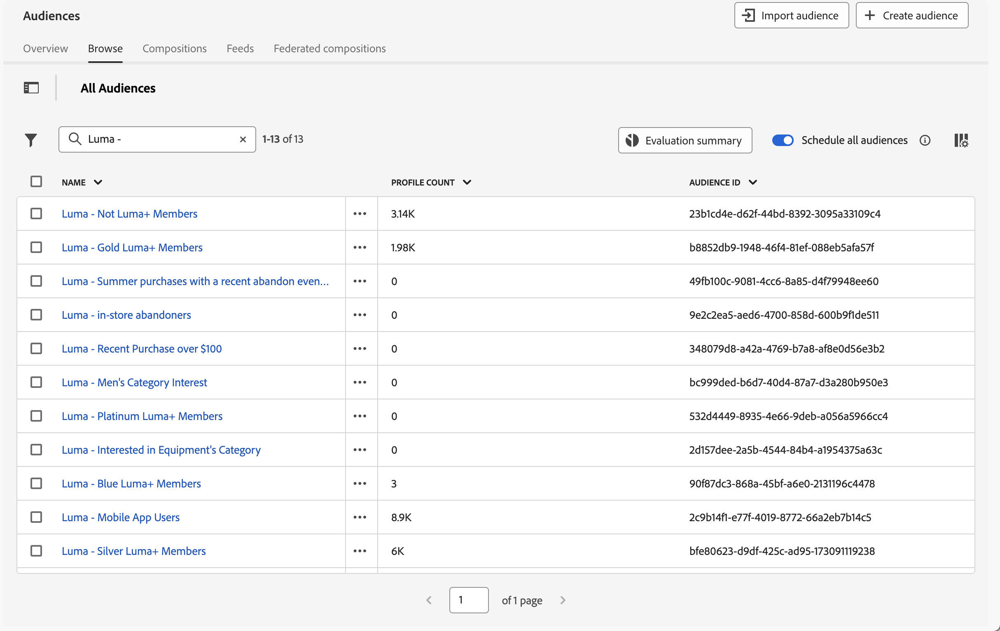
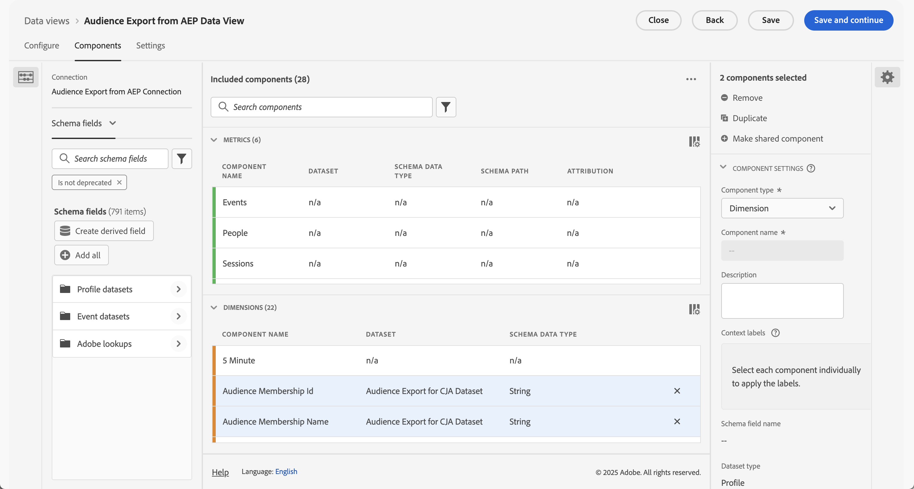

# Ingest and use Experience Platform audiences

This use case explores an interim solution to ingest Experience Platform audiences into Customer Journey Analytics. These audiences might have been created in the Experience Platform Segment Builder, or Adobe Audience Manager, or other tools, and are stored in Real-time Customer Profile. The audiences consist of a set of Profile IDs, along with any applicable attributes, events, and more. You want to bring that audience data into Customer Journey Analytics for further analysis.

## Prerequisites

* Access to [Experience Platform](https://experienceleague.adobe.com/en/docs/experience-platform/access-control/home), specifically Real-time Customer Profile.
* Access to create and manage Experience Platform [schemas](https://experienceleague.adobe.com/en/docs/experience-platform/xdm/home) and [datasets](https://experienceleague.adobe.com/en/docs/experience-platform/catalog/datasets/overview).
* Access to [Experience Platform Query Service](https://experienceleague.adobe.com/en/docs/experience-platform/query/home) (and the ability to write SQL).
* Access to a tool that can perform some transformations of data.
* Access to Customer Journey Analytics. You need to be a [Customer Journey Analytics product admin](/help/technotes/access-control.md) to create and modify Customer Journey Analytics connections and data views.
* [Authenticate and access to Experience Platform APIs (Catalog Service API and Segmentation Service API)](https://experienceleague.adobe.com/en/docs/experience-platform/landing/platform-apis/api-authentication). You need to create a project in the Developer console of the organization and sandbox and ensure you have the information that is required to successfully submit API calls.

## Steps

The interim solution involves the following steps:

1. [Select audiences (Experience Platform UI)](#select-audiences).
1. [Create a profile-enabled dataset (Experience Platform API)](#create-a-profile-enabled-dataset).
1. [Export audiences (Experience Platform API)](#export-audiences).
1. [Transform the output (Experience Platform UI and more)](#transform-the-output).
1. [Create a schema and dataset (Experience Platform UI)](#create-a-schema-and-dataset).
1. [Add or edit a connection (Customer Journey Analytics UI)](#add-or-edit-a-connection).
1. [Configure a data view (Customer Journey Analytics UI)](#configure-a-data-view).
1. [Report and analyze (Customer Journey Analytics UI)](#report-and-analyze).


### Select audiences

The solution start with the identification of audiences you want to ingest in Customer Journey Analytics. 

+++ Identify audiences

In the Experience Platform UI:

1. Select **[!UICONTROL Customer]** >  **[!UICONTROL Audiences]**.
1. Select **[!UICONTROL Browse]** and search for the audiences that you want to ingest and use in Customer Journey Analytics. Note the **[!UICONTROL Audience Id]** for each of the audiences for later use.

   

+++

### Create a profile-enabled dataset

You need to create a dataset based on the core-based **[!UICONTROL XDM Individual Profile]** schema. You cannot select that core based XDM Individual Profile as the schema when you create a dataset in the Experience Platform UI. Instead, use the [Catalog Service API to create a dataset](https://experienceleague.adobe.com/en/docs/experience-platform/catalog/datasets/create#create-a-dataset) based on the `_xdm.context.profile__union` schema.

+++ Create dataset request

#### Request

```shell
curl -X POST \
  'https://platform.adobe.io/data/foundation/catalog/dataSets?requestDataSource=true' \
  -H 'Authorization: Bearer {ACCESS_TOKEN}' \
  -H 'Content-Type: application/json' \
  -H 'x-api-key: {API_KEY}' \
  -H 'x-gw-ims-org-id: {ORG_ID}' \
  -H 'x-sandbox-name: {SANDBOX_NAME}' \
  -d '{
   "name": "{DATASET_NAME}",
   "schemaRef": {
      "id": "_xdm.context.profile__union",
      "contentType": "application/vnd.adobe.xed+json;version=1"
   },
   "fileDescription": {
      "persistet": true,
      "containerFormat": "parquet",
      "format": "parquet"
   }
}'
```

Where:

* `DATASET_NAME` is the friendly name of the dataset. For example, `Segment Export Job Dataset for CJA`.

#### Response

```json
["@/dataSets/{DATASET_ID}"]
```

Where:

* `DATASET_ID` is the dataset identifier for the created dataset.

+++

### Export audiences

Export the selected audiences into the dataset you just created. Use the [Segmentation Service API to create an export job](https://experienceleague.adobe.com/en/docs/experience-platform/segmentation/api/export-jobs#create) that sends the audiences into the dataset.

+++ Export job request

```shell
curl -X POST https://platform.adobe.io/data/core/ups/export/jobs \
 -H 'Authorization: Bearer {ACCESS_TOKEN}' \
 -H 'Content-Type: application/json' \
 -H 'x-gw-ims-org-id: {ORG_ID}' \
 -H 'x-api-key: {API_KEY}' \
 -H 'x-sandbox-name: {SANDBOX_NAME}' \
 -d '{
    "fields": "{COMMA_SEPARATED_LIST_OF_FULLY_QUALIFIED_FIELD_NAMES}",
    "filter": {
        "segments": [
            {
                "segmentId": "{AUDIENCE_ID_1}",
                "segmentNs": "ups",
                "status": [
                    "realized"
                ],
                "segmentId": "{AUDIENCE_ID_2}",
                "segmentNs": "ups",
                "status": [
                    "realized"
                ],
                "segmentId": "{AUDIENCE_ID_3}",
                "segmentNs": "ups",
                "status": [
                    "realized"
                ]             
             }
        ]
    },
    "destination":{
        "datasetId": "{DATASET_ID}",
        "segmentPerBatch": false
    },
    "schema":{
        "name": "_xdm.context.profile"
    }
}'
```

Where

* `COMMA_SEPARATED_LIST_OF_FULLY_QUALIFIED_FIELD_NAMES` could be something like `_demoemea.identification.core.ecid, _demoemea.identification.core.email, _demoemea.identification.core.phoneNumber, person.gender, person.name.firstName, person.name.lastName`. Ensure you include at least the relevant fields (like the personID (email)) that you want to use in your Customer Journey Analysis.
* `AUDIENCE_ID_x` are the audience identifiers of the audiences that you want to export.
* `DATASET_ID` is the dataset that you created.


### Response

```json
{
  "..."
  "id": "{EXPORT_JOB_ID}",
  "..."
}
```

Where

* `EXPORT_JOB_ID` is the identifier of the export job.


+++

Use the [Segmentation Service API to check the status of the export job](https://experienceleague.adobe.com/en/docs/experience-platform/segmentation/api/export-jobs#get).

+++ Retrieve a specific export job request

#### Request

```shell
curl -X GET https://platform.adobe.io/data/core/ups/export/jobs/{EXPORT_JOB_ID} \
 -H 'Authorization: Bearer {ACCESS_TOKEN}' \
 -H 'x-gw-ims-org-id: {ORG_ID}' \
 -H 'x-api-key: {API_KEY}' \
 -H 'x-sandbox-name: {SANDBOX_NAME}'
```

#### Response

```json
{
  "..."
  "id": "{EXPORT_JOB_ID}",
  "..."
  "status": "SUCCEEDED",
  "..."
}
```

+++

After the export job has succeeded, verify whether the dataset contains successfully ingested batches. 

+++ Check ingestion status

In the Experience Platform UI:

1. Select **[!UICONTROL Data Management]** >  **[!UICONTROL Datasets]**.
1. Select the dataset that you created, for example: **[!UICONTROL Segment Export Job Dataset for CJA]**.

   

1. Verify the ingested batches. If the dataset contains failed batches, use **[!UICONTROL Data Management]** >  **[!UICONTROL Monitoring]** to see what is the reason. For example, you used a field name that does not exist in the schema.
1. Copy the **[!UICONTROL Table name]** of the dataset. For example: **[!UICONTROL segment_export_job_dataset_for_cja]**.  You use that name in the next step.

+++


### Transform the output

The data in the dataset is not in the correct format for Customer Journey Analytics. To transform the data, use the Experience Platform Query Service to fetch the data.

+++ SQL to fetch exported audience data

Use a PSQL client that connects to Experience Platform Query Service. 

In the Experience Platform UI:

1. Select **[!UICONTROL Data Management]** >  **[!UICONTROL Queries]**.
1. Select  **[!UICONTROL Credentials]**.

Use the credentials to configure your PSQL client to connect to Customer Journey Analytics Query Service.

#### Query

```sql
SELECT ROW_NUMBER() OVER (ORDER BY key)::text as _id, personID, key as audienceMembershipId
FROM (
   SELECT {IDENTITY_TO_USE_AS_PERSON_ID} AS personID, explode(segmentMembership.ups)
   FROM {DATASET_TABLE_NAME}
)
WHERE value.status = 'realized' AND (key = '{AUDIENCE_ID_1}' OR key = 'AUDIENCE_ID_2' OR key = 'AUDIENCE_ID_3')
```

Where:

* `IDENTITY_TO_USE_AS_PERSON_ID` is one of the fields you defined as part of the export job. For example: `_demoemea.identification.core.email`.
* `AUDIENCE_ID_x` are the audiences you defined as part of the export job. You need to specify these audiences once more as the specification in the export job is a row-level filter. That row-level return profiles for the specified segments but also all segment memberships for each of the profiles.


#### Results

The result of the query, in JSON format, should look like:

```json
[
   {
      "_id": "1",
      "personID": "{PERSON_ID_x}",
      "audienceMembershipId": "{AUDIENCE_ID_x}"
   },
   {
      "_id": "2",
      "personID": "PERSON_ID_y",
      "audienceMembershipId": "{AUDIENCE_ID_x}"
   }

]
```

Where:

* `PERSON_ID_x` are the identifier values for the identifier you want to use as the person ID. For example, `john.doe@gmail.com` when you use email. 
* `AUDIENCE_ID_x` are the audience identifiers.
  
+++

You need to transform this JSON data to add the tenant name of the environment and to provide a more user-friendly name to the audience.

+++ Transform JSON

The final JSON should look like:

```json
[
   {
      "_id": "1",
      "personID": "{PERSON_ID_x}",
      "{TENANT_NAME}": {
         "audienceMembershipId": "{AUDIENCE_ID_x}",
         "audienceMembershipName": "{AUDIENCE_FRIENDLY_NAME_x}"
      }
  },
  {
      "_id": "2",
      "personID": "{PERSON_ID_y}",
      "{TENANT_NAME}": {
         "audienceMembershipId": "{AUDIENCE_ID_y}",
         "audienceMembershipName": "{AUDIENCE_FRIENDLY_NAME_y}"
      }
    }
  }

]
```

Where:

* `TENANT_NAME` is the name of the tenant. For example: `_demoemea`.
* `PERSON_ID_x` are the identifier values for the identifier that you want to use as the person ID. For example, `john.doe@gmail.com` when you use email. 
* `AUDIENCE_ID_x` are the audience identifiers.
* `AUDIENCE_FRIENDLY_NAME_x` are friendly audience names for the audience ids. For example: `Luma - Blue+ Members`.
  
Use your favorite tool to transform the original JSON to this format.

+++


### Create a schema and dataset

To use the transformed JSON as exported audience in Customer Journey Analytics, you need to create a dedicated schema.

+++ Create schema

To create the schema:

In the Experience Platform UI:

1. Select **[!UICONTROL Data Management]** >  **[!UICONTROL Schemas]**.
1. Select  **[!UICONTROL Create schema]**. Select **[!UICONTROL Standard]** from the drop-down menu.
1. Select **[!UICONTROL Manual]** in the **[!UICONTROL Create a schema]** dialog and use **[!UICONTROL Select]** to continue.
1. In the **[!UICONTROL Create schema]** wizard, in the **[!UICONTROL Select a class]** step:
   1. Select **[!UICONTROL Individual Profile]**.
   1. Select **[!UICONTROL Next]**.
1. In the **[!UICONTROL Create schema]** wizard, in the **[!UICONTROL Name and review]** step:
   1. Enter a **[!UICONTROL Schema display name]**. For example: `Audience Export for CJA Schema`.
   1. (optional) Enter a **[!UICONTROL Description]**.
   1. Select **[!UICONTROL Finish]**.
1. Set up your schema to contain a custom field group (named, for example,  **[!UICONTROL Audience Membership]**) that contains two fields named **[!UICONTROL audienceMembershipId]** and **[!UICONTROL audienceMembershipName]**.
1. Ensure that the **[!UICONTROL personID]** field is an **[!UICONTROL Identity]**, **[!UICONTROL Primary Identity]** and has **[!UICONTROL Email]** as the I**[!UICONTROL dentity namespace]**.

   

1. **[!UICONTROL Apply]** all changes. Select **[!UICONTROL Save]** to save the schema.

+++

Create a dataset and use that dataset to ingest the transformed JSON data.

+++ Create dataset and ingest data

In the Experience Platform UI:

1. Select **[!UICONTROL Data Management]** >  **[!UICONTROL Datasets]**.
1. Select  **[!UICONTROL Create dataset]**.
1. Select **[!UICONTROL Create dataset from schema]**.
1. In the **[!UICONTROL Create dataset from schema]** wizard, in the **[!UICONTROL Select schema]** step:
   1. Select the schema you just created. For example: **[!UICONTROL Audience Export for CJA Schema]**.
   1. Select **[!UICONTROL Next]**.
1. In the **[!UICONTROL Create dataset from schema]** wizard, in the **[!UICONTROL Configure dataset]** step:
   1. Enter a **[!UICONTROL Name]** for the dataset.
   1. (optional) Enter a **[!UICONTROL Description]** for the dataset.
   1. Select **[!UICONTROL Finish]**.
1. In the **[!UICONTROL Datasets]** > **[!UICONTROL _name of the dataset_]**, drag the transformed JSON data file and drop the file onto **[!UICONTROL Drag and drop files]**. This action starts the ingestion of the exported JSON data into the dataset.
1. Verify the ingested batches. If the dataset contains failed batches, use **[!UICONTROL Data Management]** >  **[!UICONTROL Monitoring]** to see what is the reason. For example, you defined a field name in the JSON that does not exist in the schema.


+++

### Add or edit a connection

Once the transformed JSON data that contains the audience data from Experience Platform is successfully ingested, you can add the dataset to a new or existing connection in Customer Journey Analytics.

+++ Add dataset to connection

In the Customer Journey Analytics UI:

1. Select **[!UICONTROL Data Management]** > **[!UICONTROL Connections]**.
1. Create a new connection/ Define **[!UICONTROL Connection settings]** and **[!UICONTROL Data settings]**. Or select an existing connection and use  **[!UICONTROL Edit Connection]** to edit the connection.
1. Select  **[!UICONTROL Add datasets]**.
1. Select the dataset that you created and in which you ingested the transformed JSON data.
1. Configure the dataset. For example:

   

1. **[!UICONTROL Save]** the connection.

+++

### Configure a data view

Configure a data view for the connection you just created or edited. 

+++ Define audience components

1. Select **[!UICONTROL Data Management]** > **[!UICONTROL Data views]**.
1. Edit an existing data view or create a new data view.
1. In the **[!UICONTROL Components]** tab of the data view, ensure **[!UICONTROL Audience Membership Id]** and **[!UICONTROL Audience Membership Name]** are added as dimension components.

   
   
1. Select **[!UICONTROL Save and Continue]** to save the data view.

+++

### Report and analyze.

Finally, use Analysis Workspace to report on Experience Platform audience data in one or more panels that use the data view with the audience membership components.


<!--

## Step 1: Select audiences in Real-time Customer Profile {#audience}

Experience Platform [Real-time Customer Profile](https://experienceleague.adobe.com/docs/experience-platform/profile/home.html) lets you see a holistic view of each individual customer by combining data from multiple channels, including online, offline, CRM, and third party. 

You likely already have audiences in RTCP that may have come from various sources. Select one or more audiences to ingest into Customer Journey Analytics. For example, WKND Fly Platinum and Gold Fly Club Members.


## Step 2: Create a Profile Union dataset for the export

In order to export the audience to a dataset that you can ingest in Customer Journey Analytics as profiles, create a dataset whose schema is a Profile [Union schema](https://experienceleague.adobe.com/docs/experience-platform/profile/union-schemas/union-schema.html#understanding-union-schemas).

Union schemas are composed of multiple schemas that share the same class and have been enabled for Profile. The union schema enables you to see an amalgamation of all of the fields contained within schemas sharing the same class. Real-time Customer Profile uses the union schema to create a holistic view of each individual customer.

## Step 3: Export an audience to the Profile Union dataset via API call {#export}

Before you can bring an audience into Customer Journey Analytics, you need to export it to an Adobe Experience Platform dataset. This can only be done using the Segmentation API, and specifically the [Export Jobs API Endpoint](https://experienceleague.adobe.com/docs/experience-platform/segmentation/api/export-jobs.html). 

You can create an export job using the audience ID of your choice, and put the results in the Profile Union Adobe Experience Platform dataset you created in Step 2. Although you can export various attributes/events for the audience, you only need to export the specific profile ID field that matches the person ID field used in the Customer Journey Analytics connection you will be leveraging (see below in Step 5).

## Step 4: Edit the export output 

The results of the export job need to be transformed into a separate Profile dataset in order to be ingested into Customer Journey Analytics.  This transformation can be done with [Adobe Experience Platform Query Service](https://experienceleague.adobe.com/docs/experience-platform/query/home.html), or another transformation tool of your choice. We only need the Profile ID (that will match the Person ID in Customer Journey Analytics) and one or more audience ID(s) to do the reporting in Customer Journey Analytics.

The standard export job, however, contains more data and so we need to edit this output to remove extraneous data, as well as move some things around.  Also, you need to create a schema/dataset first before you add the transformed data to it.

Here is an example of the export output in the Profile union dataset, **before** any editing:


Note the following:

* The audience ID is contained under `segmentmembership.ups.xxxxxxxx-xxxx-xxxx-xxxx-xxxxxxxxxxxx.status`.
* The status has to be "realized", or "entered", but not "exited".

This is the format of the Profile dataset that you can send into Customer Journey Analytics.


Here are the data elements that need to be present:

* `_aresprodvalidation` string field: Refers to your Organization ID. Yours will be different.
* `personID` string field: This is the standard XDM schema field on Profile datasets to identity the person. Use the Profile ID from the export.
* `audienceMembershipId` string field: The audience ID from the export.  NOTE: This field can be named whatever you want (from your own schema).
* Add a friendly name for the audience (`audienceMembershipIdName`), such as

   
   
* Add other audience metadata if you desire.

## Step 5: Add this Profile dataset to an existing connection in Customer Journey Analytics

You could [create a new connection](/help/connections/create-connection.md), but most customers will want to add the Profile dataset to an existing connection. The audience IDs "enrich" the existing data in Customer Journey Analytics.

## Step 6: Modify existing (or create new) Customer Journey Analytics data view

Add `audienceMembershipId`, `audienceMembershipIdName` and `personID` to the data view.

## Step 7: Report in Workspace

You can now report on `audienceMembershipId`, `audienceMembershipIdName` and `personID` in Workspace.

## Additional notes

* You should  perform this process on a regular cadence, so that audience data is constantly refreshed within Customer Journey Analytics.
* You can import multiple audiences within a single Customer Journey Analytics connection. This adds additional complexity to the process, but it is possible. For this to work, you need to make a few modifications to the above process:
   1. Perform this process for each desired audience in your audience collection within RTCP.
   1. Customer Journey Analytics supports arrays/object arrays in profile datasets. Using an [array of objects](https://experienceleague.adobe.com/docs/analytics-platform/using/cja-usecases/complex-data/object-arrays.html) for the audienceMembershipId or audienceMembershipIdName is the best option. 
   1. In your data view, create a new dimension using the Substring transformation on the `audienceMembershipId` field to convert the comma-separated values string to an array. NOTE: there is currently a limit of 10 values in the array.
   1. You can now report on this new dimension `audienceMembershipIds` within Customer Journey Analytics Workspace.

-->