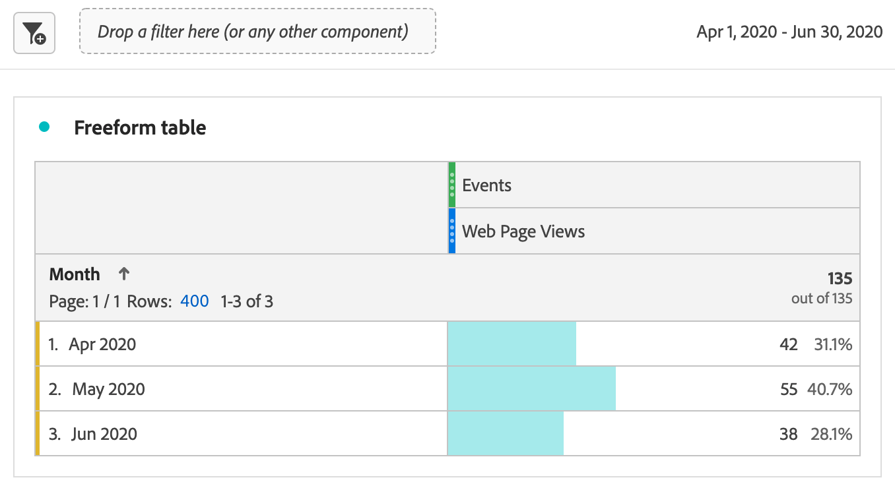

# Report on Marketo Engage data

You can leverage available Marketo Engage datasets in Experience Platform to provide valuable analytics and reporting solutions to B2B marketers. Then report on these datasets in Customer Journey Analytics.

Be aware that:

* Marketo Engage reporting is best for measuring and optimizing marketing programs directly in Marketo, and is fast, prescriptive, and marketer-friendly. 
* Customer Journey Analytic provides a much broader, customizable analytics solution for customer journeys that span multiple channels, products, and business units, including, but not limited to, Marketo data.

See [reporting comparison](#reporting-comparison) for more details.

>[!NOTE]
>
>You might consider the [Customer Journey Analytics B2B Edition](/help/getting-started/cja-b2b-edition.md) to get much more value from Marketo Engage data. You can combine Marketo Engage datasets with account and lookup datasets. And report on account and opportunity level in Customer Journey Analytics B2B Edition.
>

To report on Marketo Engage data in Customer Journey Analytics, follow these steps:

+++Select ID strategy

If you want to ingest Marketo activity data into Customer Journey Analytics you need to select an appropriate ID strategy to ensure Marketo data can be linked to Customer Journey Analytics data.

Marketo data does not natively contain an ECID, but the ECID field can be added as a custom field that is collected with the `munchkin.js` library. This addition does create a shared identifier between Marketo and existing Customer Journey Anaytics web data.

To link Marketo and Customer Journey Analytics data, use [graph-based stitching](/help/stitching/gbs.md) on the relevant datasets. You can use several available IDs, based on your implementation:

* ECID, provided by the Eperience Platform Identity Service
* Email
* Munchkin ID, provided by Marketo Engage
* Reseller ID
* Dunn & Bradstreet Duns\#
* Demandbase ID
* (potentially others)

Graph-based stitching helps in the following ways:

* Keeps a persistend ID on web events.
* Uses the identity graph to resolve known identities (like email) when possible.
* If no deterministic match exists, graph-based stitching falls back to the persistent ID, instead of dropping the event.

Graph-based stitching is a viable solution to link Marketo and Customer Journey Analytics data because:

* Web event data has a persistent ID on every row (for example, ECID).
* Marketo data has reliable IDs in the data with Munckin ID, ECID, and email.
* Graph-based stitching deterministically bridges ECID to Munchkin ID, email or any other ID available in the Marketo data.
* Graph based stitching uses the explicitly configured Identity Graph linking rules and namespaces. 

To verify this ID strategy, you should run a controlled graph-based pilot.

1. Add ECID as a custom field in Marketo and add the custom field to the munckin.js client-side JavaScript code for Marketo Engage data collection.
1. Set up a temporary Customer Journey connection that includes both at least a Marketo dataset and a web event dataset.
1. Define a narrow data range to bring in a limited but representable amount of data.
1. Verify the stitching through the setup of a data view and reports in Workspace. See steps below for more information.

+++

+++Map Marketo source data fields to their XDM targets

Map the [Persons](https://experienceleague.adobe.com/en/docs/experience-platform/sources/connectors/adobe-applications/mapping/marketo) and [Activities](https://experienceleague.adobe.com/en/docs/experience-platform/sources/connectors/adobe-applications/mapping/marketo) objects to their respective XDM schema target fields.

+++

+++Ingest Marketo data into Adobe Experience Platform

Use the [Marketo Engage connector](https://experienceleague.adobe.com/en/docs/experience-platform/sources/connectors/adobe-applications/marketo/marketo) to bring data from Marketo to Experience Platform and keep this data up to date using Experience Patform applications.

+++

+++ Set up a connection to this dataset in Customer Journey Analytics

To report on Experience Platform datasets, you first have to establish a connection between datasets in Experience Platform and Customer Journey Analytics. See [Create or edit a connection](https://experienceleague.adobe.com/en/docs/analytics-platform/using/cja-connections/create-connection).

+++

+++Create one or more data views

A [data view](/help/data-views/data-views.md) is a container specific to Customer Journey Analytics that lets you determine how to interpret data from a connection. It specifies all dimensions and metrics available in Analysis Workspace - in this case, metrics and dimensions specific to Marketo. It also specifies which columns those dimensions and metrics obtain their data from. Data views are defined in preparation for reporting in Analysis Workspace. 

+++ 

+++Report in Analysis Workspace

One use case you might explore is: How many web page visits by leads did you have in April-June 2020?

1. Open [Analytics Workspace](/help/analysis-workspace/home.md) and create a new project. 
   Customers with B2B/B2P CDP can conduct B2C-style analysis in Customer Journey Analytics. B2B objects are not yet available.

1. Create a [segment](/help/components/segments/seg-create.md) for web page views as follows - Event Type = web.webpagedetails.pageViews : 

   

1. Pull in the segment that you created into the Freeform table - Web Page Views, then pull in the Month date range. This action gives you Web page visits by leads each month:

   

1. Or pull in the following dimensions: Person Key or Work Email Address. This action gives you the Web page visits by each lead:

   

Marketo Engage data in Customer Journey Analytics can differ from what you see in the reports found in Marketo Engage.

+++

## Reporting comparison

The following comparison between reporting in Customer Journey Analytics and Marketo Engage details some important differences in analytics capabilities, flexibility, sources of truth, and use cases.

### Customer Journey Analytics

Customer Journey Analytics is an advanced, cross-channel analytics tool built on Adobe Experience Platform. Customer Journey Analytics is designed for enterprise teams that need powerful, flexible, and customizable reporting across digital and offline data sources.

#### Key Capabilities

* **Data sources**: Can combine multiple datasets (web, CRM, email, call center, offline, Marketo, etc.) for 360° customer journey reporting.
* **Self-service analysis**: Drag-and-drop workspace with highly interactive, customizable dashboards and visualizations.
* **Advanced attribution**: Supports complex, multi-touch and custom attribution models across all connected data, not just marketing programs.
* **Audience & pathing analysis**: Deep segmentation, cohort, and pathing analysis across buyer journeys.
* **Actionable insights**: Enables data-driven orchestration (for example, send insights back to marketing or personalization engines).
* **Enterprise scale**: Suited for organizations needing enterprise governance, multiple brands, and high data volume.

#### Typical Customer Journey Analytics use cases

* Advanced customer journey mapping across multiple channels and touchpoints.
* Complex segmentation and blending of online and offline data.
* Custom KPI dashboards for executive-level and operational reporting.
* Holistic attribution modeling (beyond just digital or email).

### Marketo Engage

Marketo Engage offers in-app reporting focused on marketing automation KPIs, program and campaign measurement, and marketing impact analytics. All this reporting is directly tied to activity within Marketo.

#### Key Capabilities

* **Native marketing analytics**: Standard reports for email, landing pages, campaigns, leads, opportunities, pipeline, and revenue attribution (first, last, multi-touch).
* **Advanced BI analytics (add-on)**: Drag & drop, point-and-click custom report builder for analyzing program/account/lead data (see recent Advanced BI Analytics Overview).
* **Prebuilt dashboards**: For campaign performance, channel effectiveness, pipeline/revenue contribution.
* **Program and channel analysis**: Attribution and ROI specific to Marketo-managed journeys.
* **Marketing-centric**: Focused on users who need transparency into the marketing funnel: email stats, forms, smart campaigns, and revenue impact.
  
  
#### Typical Marketo Engage use cases

* Track and optimize email, program, and campaign performance.
* Attribute leads and pipeline to marketing tactics.
* Monitor engagement trends and score leads.
* Share insights with sales/marketing teams without data engineering resources.
* Access ready-to-go, marketer-friendly reports.

See below for a quick comparison table on reporting features between Marketo Engage and Customer Journey Analytics:

| Feature | Marketo Engage | Customer Journey Analytics |
|---|---|---|
|**Primary focus**  |  Marketing program and campaign-centric reporting.  |  Holistic, omni-channel journey and behavioral analytics and reporting. |
| **Data sources**  |  Data generated in and through Marketo Engage.  |  Combines data from any Experience Platform-enabled data, including Marketo, website, mobile app, offline channels, and more. |
| **Attribution**  |  Single and multi-touch attribution on Marketo data.  |  Custom, cross-channel attribution on any data available within the solution. |
| **Custom reporting and flexibility** |   Advanced BI (add-on) for program and account deep dives.  |  Highly flexible in how you build custom workspaces, dashboards, or reports using all available data. |
| **Audience analysis** |   Filter and segment program lists, engagement, and smart lists.  |  Rich persona and journey visualizations, audience pathing, and segment overlap analysis. |
| **Intended users**  |  Marketers, marketing operators, demand generation workers, revenue officers.  |  Analysts, data scientists, marketing strategists, customer experience professionals. |
| **Metric deduplication** | For email performance reports, metrics are deduplicated automatically by lead id, campaign id, and email asset id. If multiple emails are created from the same email asset are sent to the same lead from the same program, these emails will only be counted as one. | Without additional filters and metrics applied, the email reporting data is reported as a total count of email performance without [metric deduplication](/help/data-views/component-settings/metric-deduplication.md).  |

{style="table-layout:fixed"}
