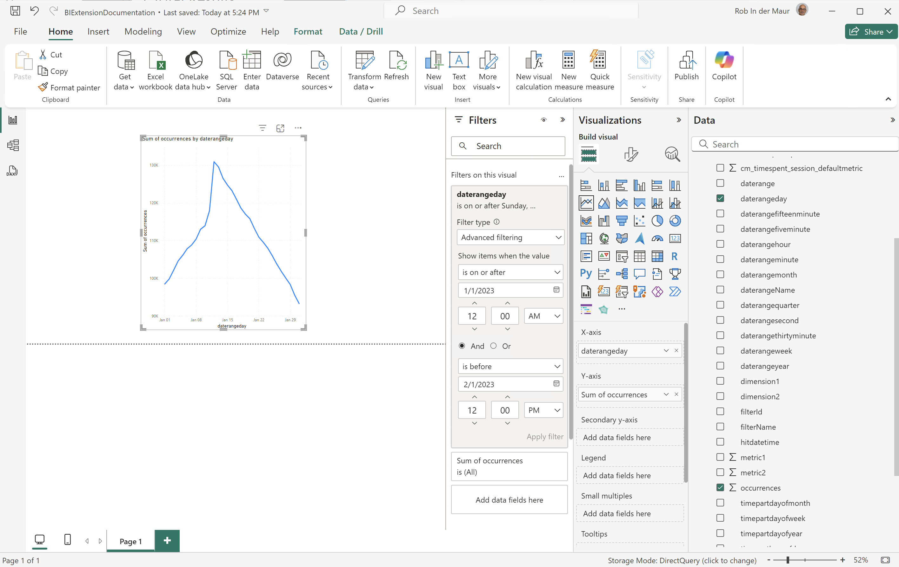

# BI extension use cases

This article provides a number of use cases that illustrate how to use the functionality of the BI extension across different BI tools. 

The following use cases are documented:

1. [Connect and list data views](#connect-and-list-data-views).
1. [Daily trend](#daily-trend).
1. [Hourly trend](#hourly-trend).
1. [Monthly trend](#monthly-trend).
1. [Single dimension ranked](#single-dimension-ranked).
1. [Multiple dimension ranked](#multiple-dimension-ranked).
1. [Count distinct dimension values](#count-distinct-dimension-values).
1. [Use date range names to filter](#use-date-range-names-to-filter).
1. [Use filter names to filter](#use-filter-names-to-filter).
1. [Use dimension values to filter](#use-dimension-values-to-filter).
1. [Sort](#sort).
1. [Limits](#limits).
1. [To FLATTEN or not](#to-flatten-or-not).
1. [Dimension and metric transformations](#dimension-and-metric-transformations).
1. [Visualizations and interactions](#visualizations-and-interactions).

For each use case, instructions are available for the following BI tools within the **Details** section:

* Power BI Desktop (version 2.136.1478.0 64-bit (September 2024))
* Tableau Desktop (version 2024.1.5 (20241.24.0705.0334) 64-bit)

The instructions refer to an example data view named **[!UICONTROL public.cc_data_view]**, two example dimensions (**[!UICONTROL Product Name]** and **[!UICONTROL Product Category]**) and two example metrics (**[!UICONTROL Purchases]** and **[!UICONTROL Purchase Revenue]**). When you go through the instructions, modify these example objects for your specific environment where appropriate.

## Connect and list data views

This use case sets up the connection from the BI tool to Customer Journey Analytics and lists the available data views to test the connection successfully.

+++ Details

>[!BEGINTABS]

>[!TAB Power BI Desktop] 

1. Access the required credentials and parameters from the Experience Platform Query Service UI.

   1. Navigate to your Experience Platform sandbox.
   1. Select  **[!UICONTROL Queries]** from the left rail.
   1. Select **[!UICONTROL Credentials]** tab in the **[!UICONTROL Queries]** interface.
   1. Select `prod:cja` from the **[!UICONTROL Database]** dropdown menu.

      

1. Open Power BI Desktop.
1. From the main interface, select **[!UICONTROL Get data from other sources]**.
1. In the **[!UICONTROL Get Data]** dialog:
   
   1. Search for and select **[!UICONTROL PostgreSQL database]**.
   1. Select **[!UICONTROL Connect]**.
1. In the **[!UICONTROL PostgreSQL database]** dialog:
   
   1. Use  to copy and paste the **[!UICONTROL Host]** and **[!UICONTROL Port]** values from the Experience Platform **[!UICONTROL Query]** **[!UICONTROL Expiring Credentials]**, separated by `:` as the value for **[!UICONTROL Server]**. For example: `examplecompany.platform-query.adobe.io:80`.
   1. Use  to copy and paste the **[!UICONTROL Database]** value from the Experience Platform **[!UICONTROL Query]** **[!UICONTROL Expiring Credentials]**. Add `?FLATTEN` to the value that you paste. For example, `prod:cja?FLATTEN`.
   1. Select **[!UICONTROL DirectQuery]** as the [!UICONTROL Data connectivity mode].
   1. Select **[!UICONTROL OK]**.
1. In the **[!UICONTROL PostgreSQL database]** - **[!UICONTROL Database]** dialog:
   
   1. Use  to copy the **[!UICONTROL Username]** and **[!UICONTROL Password]** values from the Experience Platform **[!UICONTROL Query]** **[!UICONTROL Expiring Credentials]** panel in the **[!UICONTROL User name]** and **[!UICONTROL Password]** fields. If you are using a [non-expiring credential](https://experienceleague.adobe.com/en/docs/experience-platform/query/ui/credentials?lang=en#use-credential-to-connect), use the password of your non-expiring credential.
   1. Ensure that the dropdown menu for **[!UICONTROL Select which level to apply these settings to]** is set to the **[!UICONTROL Server]** that you have defined earlier.
   1. Select **[!UICONTROL Connect]**.
1. In the **[!UICONTROL Navigator]** dialog, the data views are retrieved. This retrieval can take some time. Once retrieved:
   
   1. Select **[!UICONTROL public.cc_data_view]** from the list in the left panel.
   1. Select **[!UICONTROL Load]**.
1. After a while, the available metrics and dimensions are displayed in the **[!UICONTROL Data]** pane.
   
   

>[!TAB Tableau Desktop] 

1. Access the required credentials and parameters from the Experience Platform Query Service UI.

   1. Navigate to your Experience Platform sandbox.
   1. Select  **[!UICONTROL Queries]** from the left rail.
   1. Select **[!UICONTROL Credentials]** tab in the **[!UICONTROL Queries]** interface.
   1. Select `prod:cja` from the **[!UICONTROL Database]** dropdown menu.

      

1. Open Tableau.
1. Select **[!UICONTROL PostgreSQL]** from the left rail underneath **[!UICONTROL To a Server]**. If not available, select **[!UICONTROL More...]** and select **[!UICONTROL PostgreSQL]** from the **[!UICONTROL Installed Connectors]**.
   
1. In the **[!UICONTROL PostgreSQL]** dialog, in the **[!UICONTROL General]** tab:
   
   1. Use  to copy and paste the **[!UICONTROL Host]** from the Experience Platform **[!UICONTROL Query]** **[!UICONTROL Expiring Credentials]** to the **[!UICONTROL Server]**.
   1. Use  to copy and paste the **[!UICONTROL Port]** from the Experience Platform **[!UICONTROL Query]** **[!UICONTROL Expiring Credentials]** to the **[!UICONTROL Port]**.
   1. Use  to copy and paste the **[!UICONTROL Database]** from the Experience Platform **[!UICONTROL Query]** **[!UICONTROL Expiring Credentials]** to the **[!UICONTROL Database]**. Add `%3FFLATTEN` to the value that you paste. For example: `prod:cja%3FFLATTEN`.  
   1. Select **[!UICONTROL Username and Password]** from the **[!UICONTROL Authentication]** dropdown menu.
   1. Use  to copy and paste the **[!UICONTROL Username]** from the Experience Platform **[!UICONTROL Query]** **[!UICONTROL Expiring Credentials]** to the **[!UICONTROL Username]**.
   1. Use  to copy and paste the **[!UICONTROL Password]** from the Experience Platform **[!UICONTROL Query]** **[!UICONTROL Expiring Credentials]** to the **[!UICONTROL Password]**. If you are using a [non-expiring credential](https://experienceleague.adobe.com/en/docs/experience-platform/query/ui/credentials?lang=en#use-credential-to-connect), use the password of your non-expiring credential.
   1. Ensure that **[!UICONTROL Require SSL]** is checked.
   1. Select **[!UICONTROL Sign In]**.
   
   You see a **[!UICONTROL Progressing Request]** dialog while Tableau Desktop validates the connection.
1. In the main window, you see in the Data Source view, in the left pane:
   * The name of the connection, underneath **[!UICONTROL Connections]**.
   * The name of the database, underneath **[!UICONTROL Database]**.
   * A list of tables, underneath **[!UICONTROL Table]**.
   
   1. Drag the **[!UICONTROL cc_data_view]** entry and drop the entry on the main view that reads **[!UICONTROL Drag tables]** here.
1. The main window now displays details of the **[!UICONTROL cc_data_view]** data view.
   
      
>[!ENDTABS]

+++

## Daily trend

In this use case, you want to display a table and simple line visualization that shows a daily trend of occurrences from January 1, 2023 up until January 31, 2023.

+++ Details

>[!BEGINTABS]

>[!TAB Power BI Desktop] 

1. In the **[!UICONTROL Data]** pane:
   1. Select the **[!UICONTROL daterangeday]** dimension.
   1. Select the **[!UICONTROL occurrences]** metric.
   
   You see a table displaying the occurrences for the current month. For better visibility, enlarge the table visualization.

1. In the **[!UICONTROL Filters]** pane:

   1. Select the **[!UICONTROL daterangeday is (All)]** from **[!UICONTROL Filters on this visual]**.
   1. Select **[!UICONTROL Advanced filtering]** as the **[!UICONTROL Filter type]**.
   1. Define the filter to **[!UICONTROL Show items when the value]** **[!UICONTROL is on or after]** `1/1/2023` **[!UICONTROL And]** **[!UICONTROL is before]** `1/2/2023.` You can use the calendar icon to pick and select dates.
   1. Select **[!UICONTROL Apply filter]**.
   
   You see the table updated with the applied **[!UICONTROL daterangeday]** filter.

1. In the **[!UICONTROL Visualizations]** pane:

   1. Select the **[!UICONTROL Line chart]** visualization.

   A line chart visualization replaces the table while using the same data as the table.

   

1. On the Line chart visualization:

   1. Select .
   1. From the context menu, select **[!UICONTROL Show as a table]**.

   The main view is updated to show both a line visualization and a table.

   

>[!TAB Tableau Desktop] 

1. Select the **[!UICONTROL Sheet 1]** tab at the bottom to switch from **[!UICONTROL Data source]**. In the **[!UICONTROL Sheet 1]** view:
   1. Drag the **[!UICONTROL Daterange]** entry from the **[!UICONTROL Tables]** list in the **[!UICONTROL Data]** pane and drop the entry onto the **[!UICONTROL Filters]** shelf.
   1. In the **[!UICONTROL Filters Field \[Daterange\]]** dialog, select **[!UICONTROL Range of Dates]** and select **[!UICONTROL Next >]**.
   1. In the **[!UICONTROL Filter \[Daterange]]** dialog, select **[!UICONTROL Range of dates]** and specify a period of `01/01/2023` - `01/02/2023`.

      

   1. Drag and drop **[!UICONTROL Daterangeday]** from the **[!UICONTROL Tables]** list in the **[!UICONTROL Data]** pane and drop the entry in the field next to **[!UICONTROL Columns]**.
      * Select **[!UICONTROL Day]** from the **[!UICONTROL Daterangeday]** dropdown menu, so that the value is updated to **[!UICONTROL DAY(Daterangeday)]**.
   1. Drag and drop **[!UICONTROL Occurrences]** from the **[!UICONTROL Tables (*Measure Names*)]** list in the **[!UICONTROL Data]** pane and drop the entry in the field next to **[!UICONTROL Rows]**.
      * The values is automatically converted to **[!UICONTROL SUM(Occurrences)]**.
   1. Modify **[!UICONTROL Standard]** to **[!UICONTROL Entire View]** from the dropdown menu in the toolbar.

      Your Sheet 1 view should look like below.

      

1. Select **[!UICONTROL Duplicate]** from the **[!UICONTROL Sheet 1]** tab context menu to create a second sheet.
1. Select **[!UICONTROL Rename]** from the **[!UICONTROL Sheet 1]** tab context menu to rename the sheet to `Graph`.
1. Select **[!UICONTROL Rename]** from the **[!UICONTROL Sheet 1 (2)]** tab context menu to rename the sheet to `Data`.
1. Ensure that the **[!UICONTROL Data]** sheet is selected. In the Data view:
   1. Select **[!UICONTROL Show me]** at the top right and select **[!UICONTROL Text table]** (upper left top visualization) to modify the content of the Data view to a table.
   1. Drag **[!UICONTROL DAY(Daterangeday)]** from **[!UICONTROL Columns]** to **[!UICONTROL Rows]**.
   1. Modify **[!UICONTROL Standard]** to **[!UICONTROL Entire View]** from the dropdown menu in the toolbar.

      Your **[!UICONTROL Day]** view should look like below.

      

1. Select **[!UICONTROL Dashboard]** tab to create a new **[!UICONTROL Dashboard 1]** view. In the **[!UICONTROL Dashboard 1]** view:
   1. Drag and drop the **[!UICONTROL Graph]** sheet from the **[!UICONTROL Sheets]** shelf onto the **[!UICONTROL Dashboard 1]** view that reads *Drop sheets here*.
   1. Drag and drop the **[!UICONTROL Data]** sheet from the **[!UICONTROL Sheets]** shelf below the **[!UICONTROL Graph]** sheet onto the **[!UICONTROL Dashboard 1]** view.
   1. Select the **[!UICONTROL Data]** sheet in the view and modify **[!UICONTROL Entire View]** to **[!UICONTROL Fix Width]**.

      Your **[!UICONTROL Dashboard 1]** view should look like below.

      

>[!ENDTABS]

+++

## Hourly trend

Synopsis of use case

+++ Details

>[!BEGINTABS]

>[!TAB Power BI Desktop] 

Steps

>[!TAB Tableau Desktop] 

Steps

>[!ENDTABS]

+++

## Monthly trend

Synopsis of use case

+++ Details

>[!BEGINTABS]

>[!TAB Power BI Desktop] 

Steps

>[!TAB Tableau Desktop] 

Steps

>[!ENDTABS]

+++

## Single dimension ranked

Synopsis of use case

+++ Details

>[!BEGINTABS]

>[!TAB Power BI Desktop] 

Steps

>[!TAB Tableau Desktop] 

Steps

>[!ENDTABS]

+++

## Multiple dimension ranked

Synopsis of use case

+++ Details

>[!BEGINTABS]

>[!TAB Power BI Desktop] 

Steps

>[!TAB Tableau Desktop] 

Steps

>[!ENDTABS]

+++

## Count distinct dimension values

Synopsis of use case

+++ Details

>[!BEGINTABS]

>[!TAB Power BI Desktop] 

Steps

>[!TAB Tableau Desktop] 

Steps

>[!ENDTABS]

+++

## Use date range names to filter

Synopsis of use case

+++ Details

>[!BEGINTABS]

>[!TAB Power BI Desktop] 

Steps

>[!TAB Tableau Desktop] 

Steps

>[!ENDTABS]

+++

## Use filter names to filter

Synopsis of use case

+++ Details

>[!BEGINTABS]

>[!TAB Power BI Desktop] 

Steps

>[!TAB Tableau Desktop] 

Steps

>[!ENDTABS]

+++

## Use dimension values to filter

Synopsis of use case

+++ Details

>[!BEGINTABS]

>[!TAB Power BI Desktop] 

Steps

>[!TAB Tableau Desktop] 

Steps

>[!ENDTABS]

+++

## Sort

Synopsis of use case

+++ Details

>[!BEGINTABS]

>[!TAB Power BI Desktop] 

Steps

>[!TAB Tableau Desktop] 

Steps

>[!ENDTABS]

+++

## Limits

Synopsis of use case

+++ Details

>[!BEGINTABS]

>[!TAB Power BI Desktop] 

Steps

>[!TAB Tableau Desktop] 

Steps

>[!ENDTABS]

+++

## To FLATTEN or not

Synopsis of use case

+++ Details

>[!BEGINTABS]

>[!TAB Power BI Desktop] 

Steps

>[!TAB Tableau Desktop] 

Steps

>[!ENDTABS]

+++

## Dimension and metric transformations

Synopsis of use case

+++ Details

>[!BEGINTABS]

>[!TAB Power BI Desktop] 

Steps

>[!TAB Tableau Desktop] 

Steps

>[!ENDTABS]

+++

## Visualizations and interactions

Synopsis of use case

+++ Details

>[!BEGINTABS]

>[!TAB Power BI Desktop] 

Steps

>[!TAB Tableau Desktop] 

Steps

>[!ENDTABS]

+++

