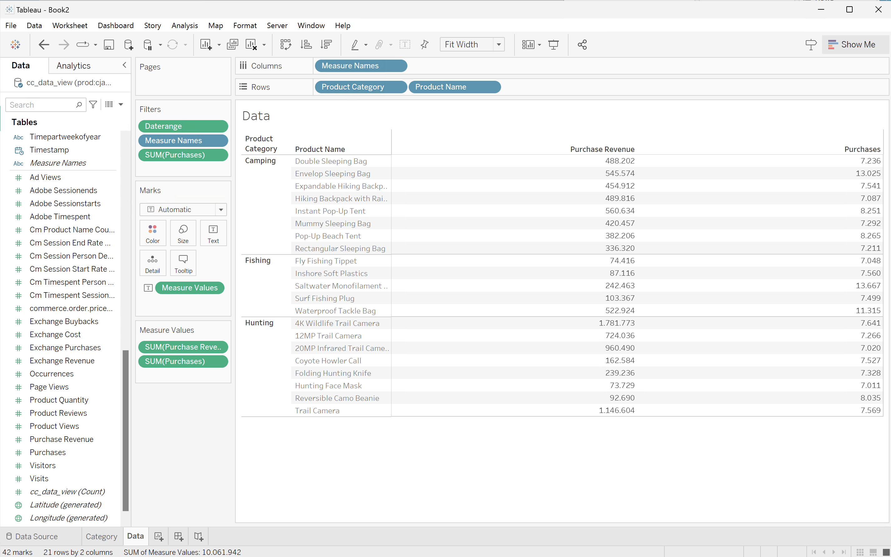

# BI extension use cases

This article provides a number of use cases that illustrate how to use the functionality of the BI extension across different BI tools. 

The following use cases are documented:

1. [Connect and list data views](#connect-and-list-data-views).
1. [Daily trend](#daily-trend).
1. [Hourly trend](#hourly-trend).
1. [Monthly trend](#monthly-trend).
1. [Single dimension ranked](#single-dimension-ranked).
1. [Multiple dimension ranked](#multiple-dimension-ranked).
1. [Count distinct dimension values](#count-distinct-dimension-values).
1. [Use date range names to filter](#use-date-range-names-to-filter).
1. [Use filter names to filter](#use-filter-names-to-filter).
1. [Use dimension values to filter](#use-dimension-values-to-filter).
1. [Sort](#sort).
1. [Limits](#limits).
1. [To FLATTEN or not](#to-flatten-or-not).
1. [Transformations](#object-transformations).
1. [Visualizations](#visualizations).

The first use case focuses on how to connect BI tools using the Customer Journey Analytics BI extension. For all other use cases, instructions are available on how to accomplish similar Customer Journey Analytics visualizations in the BI tools currently supported:

* Power BI Desktop. The version used is 2.137.1102.0 64-bit (October 2024).
* Tableau Desktop. The version used is 2024.1.5 (20241.24.0705.0334) 64-bit.


## Connect and list data views

This use case sets up the connection from the BI tool to Customer Journey Analytics and lists the available data views to test the connection successfully.

+++ Customer Journey Analytics

The instructions refer to an example set up with the following objects:

* Data view **[!UICONTROL C&C - Data View]** 🅐.
* Dimensions **[!UICONTROL Product Name]** 🅑 and **[!UICONTROL Product Category]** 🅒.
* Metrics **[!UICONTROL Purchase Revenue]** 🅓 and **[!UICONTROL Purchases]** 🅔.
* Filter **[!UICONTROL Fishing Products]** 🅕.


When you go through the instructions, replace these example objects with objects that are appropriate in your specific environment.

+++

+++ BI tools

>[!BEGINTABS]

>[!TAB Power BI Desktop] 

1. Access the required credentials and parameters from the Experience Platform Query Service UI.

   1. Navigate to your Experience Platform sandbox.
   1. Select  **[!UICONTROL Queries]** from the left rail.
   1. Select **[!UICONTROL Credentials]** tab in the **[!UICONTROL Queries]** interface.
   1. Select `prod:cja` from the **[!UICONTROL Database]** dropdown menu.

      

1. Start Power BI Desktop.
   1. From the main interface, select **[!UICONTROL Get data from other sources]**.
   1. In the **[!UICONTROL Get Data]** dialog:
      
      1. Search for and select **[!UICONTROL PostgreSQL database]**.
      1. Select **[!UICONTROL Connect]**.
   1. In the **[!UICONTROL PostgreSQL database]** dialog:
      
      1. Use  to copy and paste the **[!UICONTROL Host]** and **[!UICONTROL Port]** values from the Experience Platform **[!UICONTROL Query]** **[!UICONTROL Expiring Credentials]** panel, separated by `:` as the value for **[!UICONTROL Server]**. For example: `examplecompany.platform-query.adobe.io:80`.
      1. Use  to copy and paste the **[!UICONTROL Database]** value from the Experience Platform **[!UICONTROL Query]** **[!UICONTROL Expiring Credentials]** panel. Add `?FLATTEN` to the value that you paste. For example, `prod:cja?FLATTEN`.
      1. Select **[!UICONTROL DirectQuery]** as the [!UICONTROL Data connectivity mode].
      1. Select **[!UICONTROL OK]**.
   1. In the **[!UICONTROL PostgreSQL database]** - **[!UICONTROL Database]** dialog:
      
      1. Use  to copy the **[!UICONTROL Username]** and **[!UICONTROL Password]** values from the Experience Platform **[!UICONTROL Query]** **[!UICONTROL Expiring Credentials]** panel in the **[!UICONTROL User name]** and **[!UICONTROL Password]** fields. If you are using a [non-expiring credential](https://experienceleague.adobe.com/en/docs/experience-platform/query/ui/credentials?lang=en#use-credential-to-connect), use the password of your non-expiring credential.
      1. Ensure that the dropdown menu for **[!UICONTROL Select which level to apply these settings to]** is set to the **[!UICONTROL Server]** that you have defined earlier.
      1. Select **[!UICONTROL Connect]**.
   1. In the **[!UICONTROL Navigator]** dialog, the data views are retrieved. This retrieval can take some time. Once retrieved:
      
      1. Select **[!UICONTROL public.cc_data_view]** from the list in the left panel.
      1. You have two options:
         1. Select **[!UICONTROL Load]** to continue and finish the setup.
         1. Select **[!UICONTROL Transform Data]**. You see a dialog where you can optionally apply transformations as part of the configuration.
         
            * Select **[!UICONTROL Close & Apply]**.
   1. After a while, **[!UICONTROL public cc_data_view]** is displayed in the **[!UICONTROL Data]** pane. Select  to show dimensions and metrics.
      
   

>[!TAB Tableau Desktop] 

1. Access the required credentials and parameters from the Experience Platform Query Service UI.

   1. Navigate to your Experience Platform sandbox.
   1. Select  **[!UICONTROL Queries]** from the left rail.
   1. Select **[!UICONTROL Credentials]** tab in the **[!UICONTROL Queries]** interface.
   1. Select `prod:cja` from the **[!UICONTROL Database]** dropdown menu.

      

1. Start Tableau.
   1. Select **[!UICONTROL PostgreSQL]** from the left rail underneath **[!UICONTROL To a Server]**. If not available, select **[!UICONTROL More...]** and select **[!UICONTROL PostgreSQL]** from the **[!UICONTROL Installed Connectors]**.
      
   1. In the **[!UICONTROL PostgreSQL]** dialog, in the **[!UICONTROL General]** tab:
      
      1. Use  to copy and paste the **[!UICONTROL Host]** from the Experience Platform **[!UICONTROL Query]** **[!UICONTROL Expiring Credentials]** panel to the **[!UICONTROL Server]**.
      1. Use  to copy and paste the **[!UICONTROL Port]** from the Experience Platform **[!UICONTROL Query]** **[!UICONTROL Expiring Credentials]** panel to the **[!UICONTROL Port]**.
      1. Use  to copy and paste the **[!UICONTROL Database]** from the Experience Platform **[!UICONTROL Query]** **[!UICONTROL Expiring Credentials]** panel to the **[!UICONTROL Database]**. Add `%3FFLATTEN` to the value that you paste. For example: `prod:cja%3FFLATTEN`.  
      1. Select **[!UICONTROL Username and Password]** from the **[!UICONTROL Authentication]** dropdown menu.
      1. Use  to copy and paste the **[!UICONTROL Username]** from the Experience Platform **[!UICONTROL Query]** **[!UICONTROL Expiring Credentials]** panel to the **[!UICONTROL Username]**.
      1. Use  to copy and paste the **[!UICONTROL Password]** from the Experience Platform **[!UICONTROL Query]** **[!UICONTROL Expiring Credentials]** panel to the **[!UICONTROL Password]**. If you are using a [non-expiring credential](https://experienceleague.adobe.com/en/docs/experience-platform/query/ui/credentials?lang=en#use-credential-to-connect), use the password of your non-expiring credential.
      1. Ensure that **[!UICONTROL Require SSL]** is checked.
      1. Select **[!UICONTROL Sign In]**.
      
      You see a **[!UICONTROL Progressing Request]** dialog while Tableau Desktop validates the connection.
   1. In the main window, you see in the **[!UICONTROL Data Source]** page, in the left pane:
      * The name of the connection, underneath **[!UICONTROL Connections]**.
      * The name of the database, underneath **[!UICONTROL Database]**.
      * A list of tables, underneath **[!UICONTROL Table]**.
      
      1. Drag the **[!UICONTROL cc_data_view]** entry and drop the entry on the main view that reads **[!UICONTROL Drag tables]** here.
   1. The main window displays details of the **[!UICONTROL cc_data_view]** data view.
      
      
>[!ENDTABS]

+++


## Daily trend

In this use case, you want to display a table and simple line visualization that shows a daily trend of occurrences (events) from January 1, 2023 up until January 31, 2023.

+++ Customer Journey Analytics

An example **[!UICONTROL Daily Trend]** panel for the use case:


+++

+++ BI tools

>[!PREREQUISITES]
>
>Ensure you have validated a [successful connection and can list data views](#connect-and-list-data-views) for the BI tool for which you want to try out this use case. 
>

>[!BEGINTABS]

>[!TAB Power BI Desktop] 

1. In the **[!UICONTROL Data]** pane:
   1. Select **[!UICONTROL daterangeday]**.
   1. Select **[!UICONTROL ∑ occurrences]**.
   
   You see a table displaying the occurrences for the current month. For better visibility, enlarge the table visualization.

1. In the **[!UICONTROL Filters]** pane:

   1. Select the **[!UICONTROL daterangeday is (All)]** from **[!UICONTROL Filters on this visual]**.
   1. Select **[!UICONTROL Advanced filtering]** as the **[!UICONTROL Filter type]**.
   1. Define the filter to **[!UICONTROL Show items when the value]** **[!UICONTROL is on or after]** `1/1/2023` **[!UICONTROL And]** **[!UICONTROL is before]** `2/1/2023.` You can use the calendar icon to pick and select dates.
   1. Select **[!UICONTROL Apply filter]**.
   
   You see the table updated with the applied **[!UICONTROL daterangeday]** filter.

1. In the **[!UICONTROL Visualizations]** pane, select the **[!UICONTROL Line chart]** visualization.

   A line chart visualization replaces the table while using the same data as the table. Your Power BI Desktop should look like below.

   

1. On the Line chart visualization:

   1. Select .
   1. From the context menu, select **[!UICONTROL Show as a table]**.

   The main view is updated to show both a line visualization and a table. Your Power BI Desktop should look like below.

   

>[!TAB Tableau Desktop] 

1. Select the **[!UICONTROL Sheet 1]** tab at the bottom to switch from the **[!UICONTROL Data source]** view. In the **[!UICONTROL Sheet 1]** view:
   1. Drag the **[!UICONTROL Daterange]** entry from the **[!UICONTROL Tables]** list in the **[!UICONTROL Data]** pane and drop the entry onto the **[!UICONTROL Filters]** shelf.
   1. In the **[!UICONTROL Filters Field \[Daterange\]]** dialog, select **[!UICONTROL Range of Dates]** and select **[!UICONTROL Next >]**.
   1. In the **[!UICONTROL Filter \[Daterange]]** dialog, select **[!UICONTROL Range of dates]** and specify a period of `01/01/2023` - `31/01/2023`.

      

   1. Drag and drop **[!UICONTROL Daterangeday]** from the **[!UICONTROL Tables]** list in the **[!UICONTROL Data]** pane and drop the entry in the field next to **[!UICONTROL Columns]**.
      * Select **[!UICONTROL Day]** from the **[!UICONTROL Daterangeday]** dropdown menu, so that the value is updated to **[!UICONTROL DAY(Daterangeday)]**.
   1. Drag and drop **[!UICONTROL Occurrences]** from the **[!UICONTROL Tables (*Measure Names*)]** list in the **[!UICONTROL Data]** pane and drop the entry in the field next to **[!UICONTROL Rows]**.
      * The values is automatically converted to **[!UICONTROL SUM(Occurrences)]**.
   1. Modify **[!UICONTROL Standard]** to **[!UICONTROL Entire View]** from the dropdown menu in the toolbar.

      Your Tableau Desktop should look like below.

      

1. Select **[!UICONTROL Duplicate]** from the **[!UICONTROL Sheet 1]** tab context menu to create a second sheet.
1. Select **[!UICONTROL Rename]** from the **[!UICONTROL Sheet 1]** tab context menu to rename the sheet to `Graph`.
1. Select **[!UICONTROL Rename]** from the **[!UICONTROL Sheet 1 (2)]** tab context menu to rename the sheet to `Data`.
1. Ensure that the **[!UICONTROL Data]** sheet is selected. In the Data view:
   1. Select **[!UICONTROL Show me]** at the top right and select **[!UICONTROL Text table]** (upper left top visualization) to modify the content of the Data view to a table.
   1. Select **[!UICONTROL Swap Rows and Columns]** from the toolbar.
   1. Modify **[!UICONTROL Standard]** to **[!UICONTROL Entire View]** from the dropdown menu in the toolbar.

      Your Tableau Desktop should look like below.

      

1. Select the **[!UICONTROL New Dashboard]** tab button (at the bottom) to create a new **[!UICONTROL Dashboard 1]** view. In the **[!UICONTROL Dashboard 1]** view:
   1. Drag and drop the **[!UICONTROL Graph]** sheet from the **[!UICONTROL Sheets]** shelf onto the **[!UICONTROL Dashboard 1]** view that reads *Drop sheets here*.
   1. Drag and drop the **[!UICONTROL Data]** sheet from the **[!UICONTROL Sheets]** shelf below the **[!UICONTROL Graph]** sheet onto the **[!UICONTROL Dashboard 1]** view.
   1. Select the **[!UICONTROL Data]** sheet in the view and modify **[!UICONTROL Entire View]** to **[!UICONTROL Fix Width]**.

      Your Tableau Desktop should look like below.

      

>[!ENDTABS]

+++


## Hourly trend

In this use case, you want to display a table and simple line visualization that shows an hourly trend of occurrences(events) for January 1, 2023.

+++ Customer Journey Analytics

An example **[!UICONTROL Hourly Trend]** panel for the use case:


+++

+++ BI tools

>[!PREREQUISITES]
>
>Ensure you have validated a [successful connection and can list data views](#connect-and-list-data-views) for the BI tool for which you want to try out this use case. 
>

>[!BEGINTABS]

>[!TAB Power BI Desktop] 

 Power BI does **not** understand how to handle date-time columns, so dimensions like **[!UICONTROL daterangehour]** and **[!UICONTROL daterangeminute]** are not supported.

>[!TAB Tableau Desktop] 

1. Select the **[!UICONTROL Sheet 1]** tab at the bottom to switch from **[!UICONTROL Data source]**. In the **[!UICONTROL Sheet 1]** view:
   1. Drag the **[!UICONTROL Daterange]** entry from the **[!UICONTROL Tables]** list in the **[!UICONTROL Data]** pane and drop the entry onto the **[!UICONTROL Filters]** shelf.
   1. In the **[!UICONTROL Filters Field \[Daterange\]]** dialog, select **[!UICONTROL Range of Dates]** and select **[!UICONTROL Next >]**.
   1. In the **[!UICONTROL Filter \[Daterange]]** dialog, select **[!UICONTROL Range of dates]** and specify a period of `01/01/2023` - `02/01/2023`.

      

   1. Drag and drop **[!UICONTROL Daterangehour]** from the **[!UICONTROL Tables]** list in the **[!UICONTROL Data]** pane and drop the entry in the field next to **[!UICONTROL Columns]**.
      * Select **[!UICONTROL More]** > **[!UICONTROL Hours]** from the **[!UICONTROL Daterangeday]** dropdown menu, so that the value is updated to **[!UICONTROL HOUR(Daterangeday)]**.
   1. Drag and drop **[!UICONTROL Occurrences]** from the **[!UICONTROL Tables (*Measure Names*)]** list in the **[!UICONTROL Data]** pane and drop the entry in the field next to **[!UICONTROL Rows]**.
      * The values is automatically converted to **[!UICONTROL SUM(Occurrences)]**.
   1. Modify **[!UICONTROL Standard]** to **[!UICONTROL Entire View]** from the dropdown menu in the toolbar.

      Your Tableau Desktop should look like below.

      

1. Select **[!UICONTROL Duplicate]** from the **[!UICONTROL Sheet 1]** tab context menu to create a second sheet.
1. Select **[!UICONTROL Rename]** from the **[!UICONTROL Sheet 1]** tab context menu to rename the sheet to `Graph`.
1. Select **[!UICONTROL Rename]** from the **[!UICONTROL Sheet 1 (2)]** tab context menu to rename the sheet to `Data`.
1. Ensure that the **[!UICONTROL Data]** sheet is selected. In the Data view:
   1. Select **[!UICONTROL Show me]** at the top right and select **[!UICONTROL Text table]** (upper left top visualization) to modify the content of the Data view to a table.
   1. Drag **[!UICONTROL HOUR(Daterangeday)]** from **[!UICONTROL Columns]** to **[!UICONTROL Rows]**.
   1. Modify **[!UICONTROL Standard]** to **[!UICONTROL Entire View]** from the dropdown menu in the toolbar.

      Your Tableau Desktop should look like below.

      

1. Select **[!UICONTROL New Dashboard]** tab button (at the bottom) to create a new **[!UICONTROL Dashboard 1]** view. In the **[!UICONTROL Dashboard 1]** view:
   1. Drag and drop the **[!UICONTROL Graph]** sheet from the **[!UICONTROL Sheets]** shelf onto the **[!UICONTROL Dashboard 1]** view that reads *Drop sheets here*.
   1. Drag and drop the **[!UICONTROL Data]** sheet from the **[!UICONTROL Sheets]** shelf below the **[!UICONTROL Graph]** sheet onto the **[!UICONTROL Dashboard 1]** view.
   1. Select the **[!UICONTROL Data]** sheet in the view and modify **[!UICONTROL Entire View]** to **[!UICONTROL Fix Width]**.

      Your **[!UICONTROL Dashboard 1]** view should look like below.

      


>[!ENDTABS]

+++


## Monthly trend

In this use case, you want to display a table and simple line visualization that shows a monthly trend of occurrence (events) for 2023.

+++ Customer Journey Analytics

An example **[!UICONTROL Monthly Trend]** panel for the use case:


+++

+++ BI tools

>[!PREREQUISITES]
>
>Ensure you have validated a [successful connection and can list data views](#connect-and-list-data-views) for the BI tool for which you want to try out this use case. 
>

>[!BEGINTABS]

>[!TAB Power BI Desktop] 

1. In the **[!UICONTROL Data]** pane:
   1. Select **[!UICONTROL daterangemonth]**.
   1. Select **[!UICONTROL ∑ occurrences]**.
   
   You see a table displaying the occurrences for the current month. For better visibility, enlarge the table visualization.

1. In the **[!UICONTROL Filters]** pane:

   1. Select the **[!UICONTROL daterangemonth is (All)]** from **[!UICONTROL Filters on this visual]**.
   1. Select **[!UICONTROL Advanced filtering]** as the **[!UICONTROL Filter type]**.
   1. Define the filter to **[!UICONTROL Show items when the value]** **[!UICONTROL is on or after]** `1/1/2023` **[!UICONTROL And]** **[!UICONTROL is before]** `1/1/2024.` You can use the calendar icon to pick and select dates.
   1. Select **[!UICONTROL Apply filter]**.
   
   You see the table updated with the applied **[!UICONTROL daterangemonth]** filter.

1. In the **[!UICONTROL Visualizations]** pane:

   1. Select the **[!UICONTROL Line chart]** visualization.

   A line chart visualization replaces the table while using the same data as the table. Your Power BI Desktop should look like below.

   

1. On the Line chart visualization:

   1. Select .
   1. From the context menu, select **[!UICONTROL Show as a table]**.

   The main view is updated to show both a line visualization and a table. Your Power BI Desktop should look like below.

   

>[!TAB Tableau Desktop] 

1. Select the **[!UICONTROL Sheet 1]** tab at the bottom to switch from **[!UICONTROL Data source]**. In the **[!UICONTROL Sheet 1]** view:
   1. Drag the **[!UICONTROL Daterange]** entry from the **[!UICONTROL Tables]** list in the **[!UICONTROL Data]** pane and drop the entry onto the **[!UICONTROL Filters]** shelf.
   1. In the **[!UICONTROL Filters Field \[Daterange\]]** dialog, select **[!UICONTROL Range of Dates]** and select **[!UICONTROL Next >]**.
   1. In the **[!UICONTROL Filter \[Daterange]]** dialog, select **[!UICONTROL Range of dates]** and specify a period of `01/01/2023` - `01/01/2024`.

      

   1. Drag and drop **[!UICONTROL Daterangeday]** from the **[!UICONTROL Tables]** list in the **[!UICONTROL Data]** pane and drop the entry in the field next to **[!UICONTROL Columns]**.
      * Select **[!UICONTROL MONTH]** from the **[!UICONTROL Daterangeday]** dropdown menu, so that the value is updated to **[!UICONTROL MONTH(Daterangeday)]**.
   1. Drag and drop **[!UICONTROL Occurrences]** from the **[!UICONTROL Tables (*Measure Names*)]** list in the **[!UICONTROL Data]** pane and drop the entry in the field next to **[!UICONTROL Rows]**.
      * The values is automatically converted to **[!UICONTROL SUM(Occurrences)]**.
   1. Modify **[!UICONTROL Standard]** to **[!UICONTROL Entire View]** from the dropdown menu in the toolbar.

      Your Tableau Desktop should look like below.

      

1. Select **[!UICONTROL Duplicate]** from the **[!UICONTROL Sheet 1]** tab context menu to create a second sheet.
1. Select **[!UICONTROL Rename]** from the **[!UICONTROL Sheet 1]** tab context menu to rename the sheet to `Graph`.
1. Select **[!UICONTROL Rename]** from the **[!UICONTROL Sheet 1 (2)]** tab context menu to rename the sheet to `Data`.
1. Ensure that the **[!UICONTROL Data]** sheet is selected. In the Data view:
   1. Select **[!UICONTROL Show me]** at the top right and select **[!UICONTROL Text table]** (upper left top visualization) to modify the content of the Data view to a table.
   1. Drag **[!UICONTROL MONTH(Daterangeday)]** from **[!UICONTROL Columns]** to **[!UICONTROL Rows]**.
   1. Modify **[!UICONTROL Standard]** to **[!UICONTROL Entire View]** from the dropdown menu in the toolbar.

      Your Tableau Desktop should look like below.

      

1. Select **[!UICONTROL New Dashboard]** tab button (at the bottom) to create a new **[!UICONTROL Dashboard 1]** view. In the **[!UICONTROL Dashboard 1]** view:
   1. Drag and drop the **[!UICONTROL Graph]** sheet from the **[!UICONTROL Sheets]** shelf onto the **[!UICONTROL Dashboard 1]** view that reads *Drop sheets here*.
   1. Drag and drop the **[!UICONTROL Data]** sheet from the **[!UICONTROL Sheets]** shelf below the **[!UICONTROL Graph]** sheet onto the **[!UICONTROL Dashboard 1]** view.
   1. Select the **[!UICONTROL Data]** sheet in the view and modify **[!UICONTROL Entire View]** to **[!UICONTROL Fix Width]**.

      Your Tableau Desktop should look like below.

      

>[!ENDTABS]

+++


## Single dimension ranked

In this use case, you want to display a table and simple bar visualization that shows the purchases and purchases revenue for product names over 2023.

+++ Customer Journey Analytics

An example **[!UICONTROL Single Dimension Ranked]** panel for the use case:


+++

+++ BI tools

>[!PREREQUISITES]
>
>Ensure you have validated a [successful connection and can list data views](#connect-and-list-data-views) for the BI tool for which you want to try out this use case. 
>

>[!BEGINTABS]

>[!TAB Power BI Desktop] 

1. In the **[!UICONTROL Data]** pane:
   1. Select **[!UICONTROL daterange]**.
   1. Select **[!UICONTROL product_name]**.
   1. Select **[!UICONTROL ∑ purchase_revenue]**.
   1. Select **[!UICONTROL ∑ purchases]**.
   
   You see an empty table displaying only the column headers for the selected element. For better visibility, enlarge the table visualization.

1. In the **[!UICONTROL Filters]** pane:

   1. Select the **[!UICONTROL daterange is (All)]** from **[!UICONTROL Filters on this visual]**.
   1. Select **[!UICONTROL Relative date]** as the **[!UICONTROL Filter type]**.
   1. Define the filter to **[!UICONTROL Show items when the value]** **[!UICONTROL is in the last]** `1` **[!UICONTROL calendar years]**.
   1. Select **[!UICONTROL Apply filter]**.
   
   You see the table updated with the applied **[!UICONTROL daterange]** filter.

1. In the **[!UICONTROL Visualization]** pane:

   1. Use  to remove **[!UICONTROL daterange]** from **[!UICONTROL Columns]**.
   1. Drag and drop **[!UICONTROL Sum of purchases_revenue]** underneath **[!UICONTROL Sum of purchases]** in **[!UICONTROL Columns]**.

1. On the Table visualization:
   
   1. Select **[!UICONTROL Sum of purchase_revenue]** to sort the product names in descending purchase revenue order. Your Power BI Desktop should look like below.
   
   

1. In the **[!UICONTROL Filters]** pane:

   1. Select **[!UICONTROL product_name is (All)]**.
   1. Set Filter type to Top N.
   1. Define the filter to **[!UICONTROL Show items]** **[!UICONTROL Top]** `10` **[!UICONTROL By value]**.
   1. Drag and drop **[!UICONTROL purchase_revenue]** into **[!UICONTROL By value]** **[!UICONTROL Add data fields here]**.
   1. Select **[!UICONTROL Apply filter]**.

   You see the table updated with values for purchase revenue in sync with the Freeform table visualization in Analysis Workspace.

1. In the **[!UICONTROL Visualizations]** pane:

   1. Select the **[!UICONTROL Line and stacked column chart]** visualization. 

   A line and stacked column chart visualization replaces the table while using the same data as the table.

1. Drag and drop purchases onto Line y-axis in the Visualizations pane.

   The line and stacked column chart is updated. Your Power BI Desktop should look like below.

   

1. On the line and stacked column chart visualization:

   1. Select .
   1. From the context menu, select **[!UICONTROL Show as a table]**.

   The main view is updated to show both a line visualization and a table.

   

>[!TAB Tableau Desktop]

1. Select the **[!UICONTROL Sheet 1]** tab at the bottom to switch from **[!UICONTROL Data source]**. In the **[!UICONTROL Sheet 1]** view:
   1. Drag the **[!UICONTROL Daterange]** entry from the **[!UICONTROL Tables]** list in the **[!UICONTROL Data]** pane and drop the entry onto the **[!UICONTROL Filters]** shelf.
   1. In the **[!UICONTROL Filters Field \[Daterange\]]** dialog, select **[!UICONTROL Range of Dates]** and select **[!UICONTROL Next >]**.
   1. In the **[!UICONTROL Filter \[Daterange]]** dialog, select **[!UICONTROL Range of dates]** and specify a period of `01/01/2023` - `31/12/2024`. Select **[!UICONTROL Apply]** and **[!UICONTROL OK]**.

      

   1. Drag and drop **[!UICONTROL Product Name]** from the **[!UICONTROL Tables]** list in the **[!UICONTROL Data]** pane and drop the entry in the field next to **[!UICONTROL Rows]**.
   1. Drag and drop **[!UICONTROL Purchases]** from the **[!UICONTROL Tables (*Measure Names*)]** list in the **[!UICONTROL Data]** pane and drop the entry in the field next to **[!UICONTROL Rows]**.
      * The values is automatically converted to **[!UICONTROL SUM(Purchases)]**.
   1. Drag and drop **[!UICONTROL Purchase Revenue]** from the **[!UICONTROL Tables (*Measure Names*)]** list in the **[!UICONTROL Data]** pane and drop the entry in the field next to **[!UICONTROL Columns]** and left from **[!UICONTROL SUM(Purchases)]**.
      * The values is automatically converted to **[!UICONTROL SUM(Purchase Revenue)]**.
   1. To order both charts in descending purchase revenue order, hover over the Purchase Revenue title and select the sort icon.
   1. To limit the number of entries in the charts, select SUM(Purchase Revenue) in Rows and from the dropdown menu select Filter.
   1. In the **[!UICONTROL Filter \[Purchase Revenue\]]** dialog select **[!UICONTROL Range of values]** and enter appropriate values. For example: `1,000,000` - `2,000,000`. Select **[!UICONTROL Apply]** and **[!UICONTROL OK]**.
   1. To convert the two bar charts to a dual combination chart, select **[!UICONTROL SUM(Purchases)]** in **[!UICONTROL Rows]** and from the dropdown menu, select **[!UICONTROL Dual Axis]**. The bar charts transform into a scatter plot.
   1. To modify the scatter plot to a bar chart:
      1. Select **[!UICONTROL SUM(Purchases)]** in the **[!UICONTROL Marks]** area and select **[!UICONTROL Line]** from the dropdown menu.
      1. Select **[!UICONTROL SUM(Purchase Revenue)]** in the **[!UICONTROL Marks]** area and select **[!UICONTROL Bar]** from the dropdown menu.

   Your Tableau Desktop should look like below.

   

1. Select **[!UICONTROL Duplicate]** from the **[!UICONTROL Sheet 1]** tab context menu to create a second sheet.
1. Select **[!UICONTROL Rename]** from the **[!UICONTROL Sheet 1]** tab context menu to rename the sheet to `Data`.
1. Select **[!UICONTROL Rename]** from the **[!UICONTROL Sheet 1 (2)]** tab context menu to rename the sheet to `Graph`.
1. Ensure that the **[!UICONTROL Data]** sheet is selected.
   1. Select **[!UICONTROL Show me]** at the top right and select **[!UICONTROL Text table ]** (upper left top visualization) to modify the content of the two charts to a table.
   1. To order purchase revenue in descending order, hover over **[!UICONTROL Purchase Revenue]** in the table and select .
   1. Select **[!UICONTROL Entire View]** from the **[!UICONTROL Fit]** dropdown menu.

   Your Tableau Desktop should look like below.

   

1. Select **[!UICONTROL New Dashboard]** tab button (at the bottom) to create a new **[!UICONTROL Dashboard 1]** view. In the **[!UICONTROL Dashboard 1]** view:
   1. Drag and drop the **[!UICONTROL Graph]** sheet from the **[!UICONTROL Sheets]** shelf onto the **[!UICONTROL Dashboard 1]** view that reads *Drop sheets here*.
   1. Drag and drop the **[!UICONTROL Data]** sheet from the **[!UICONTROL Sheets]** shelf below the **[!UICONTROL Graph]** sheet onto the **[!UICONTROL Dashboard 1]** view.
   1. Select the **[!UICONTROL Data]** sheet in the view and modify **[!UICONTROL Entire View]** to **[!UICONTROL Fix Width]**.

   Your **[!UICONTROL Dashboard 1]** view should look like below.

   

>[!ENDTABS]

+++


## Multiple dimension ranked

In this use case, you want to display a table that breaks down the purchase revenue and purchases for product names within product categories over 2023. On top of that you want to use some visualizations to illustrate both the product category distribution and product name contributions within each product category.

+++ Customer Journey Analytics

An example **[!UICONTROL Multiple Dimension Ranked]** panel for the use case:


+++

+++ BI tools

>[!PREREQUISITES]
>
>Ensure you have validated a [successful connection and can list data views](#connect-and-list-data-views) for the BI tool for which you want to try out this use case. 
>

>[!BEGINTABS]

>[!TAB Power BI Desktop] 

1. To ensure the date range apply to all visualizations drag and drop **[!UICONTROL daterangeday]** from the **[!UICONTROL Data]** pane on to **[!UICONTROL Filters]** on this page.
   1. Select the **[!UICONTROL daterangeday is (All)]** from **[!UICONTROL Filters on this page]**.
   1. Select **[!UICONTROL Relative date]** as the **[!UICONTROL Filter type]**.
   1. Define the filter to **[!UICONTROL Show items when the value]** **[!UICONTROL is on or after]** `1/1/2023` **[!UICONTROL And]** **[!UICONTROL is before]** `2/1/2023`.
   1. Select **[!UICONTROL Apply filter]**.
   
1. In the **[!UICONTROL Data]** pane:
   1. Select **[!UICONTROL datarangeday]**.
   1. Select **[!UICONTROL ∑ cm_product_name_count_distinct]**, which is the calculated metric defined in Customer Journey Analytics.

1. To modify the vertical bar chart to a Table, ensure you have the table selected and select **[!UICONTROL Matrix]** from the **[!UICONTROL Visualizations]** pane.
   * Drag **[!UICONTROL product_name]** from **[!UICONTROL Columns]** and drop the field underneath **[!UICONTROL product_categor]**y in **[!UICONTROL Rows]** in the **[!UICONTROL Visualization]** pane.
   
1. To limit the number of displayed products within the table, select **[!UICONTROL product_name is (All)]** in the **[!UICONTROL Filters]** pane.

   1. Select **[!UICONTROL Advanced filtering]**.
   1. Select **[!UICONTROL Filter type]** **[!UICONTROL Top N]** **[!UICONTROL Show items]** **[!UICONTROL Top]** `15` **[!UICONTROL By Value]**.
   1. Drag **[!UICONTROL purchases]**e from the **[!UICONTROL Data]** pane onto the **[!UICONTROL Add data fields here]**.
   1. Select **[!UICONTROL Apply filter]**.

1. To improve readability, select **[!UICONTROL View]** from the top menu, and select **[!UICONTROL Page View]** > **[!UICONTROL Actual size]** and resize the table visualization.

1. To break down each category in the table, select the **[!UICONTROL +]** at the product category level. Your Power BI Desktop should look like below.

   

1. Select **[!UICONTROL Home]** from the top menu, and select **[!UICONTROL New visual]**. A new visual is added to your report.

1. In the **[!UICONTROL Data]** pane:
   1. Select **[!UICONTROL product_category]**.
   1. Select **[!UICONTROL product_name]**.
   1. Select **[!UICONTROL purchase_revenue]**.

1. To modify the visual, select the bar chart and select **[!UICONTROL Treemap]** from the **[!UICONTROL Visualizations]** pane.
1. Ensure that **[!UICONTROL product_category]** is listed underneath **[!UICONTROL Category]**, and **[!UICONTROL product_name]** is listed underneath **[!UICONTROL Details]** in the **[!UICONTROL Visualizations]** pane.

   Your Power BI Desktop should look like below.

   

1. Select **[!UICONTROL Home]** from the top menu, and select **[!UICONTROL New visual]**. A new visual is added to your report.

1. In the **[!UICONTROL Data]** pane:
   1. Select **[!UICONTROL product_category]**.
   1. Select **[!UICONTROL purchase_revenue]**.
   1. Select **[!UICONTROL purchase]**.

1. In the **[!UICONTROL Visualizations]** pane:
   1. to modify the visualization, select **[!UICONTROL Line and stacked column chart]**. 
   1. Drag **[!UICONTROL sum_of_purchases]** from **[!UICONTROL Column y-axis]** to **[!UICONTROL Line y-axis]**.

1. In the report, reshuffle the individual visualizations. 

    Your Power BI Desktop should look like below.

    


>[!TAB Tableau Desktop] 

1. Select the **[!UICONTROL Sheet 1]** tab at the bottom to switch from **[!UICONTROL Data source]**. In the **[!UICONTROL Sheet 1]** view:
   1. Drag the **[!UICONTROL Daterange]** entry from the **[!UICONTROL Tables]** list in the **[!UICONTROL Data]** pane and drop the entry onto the **[!UICONTROL Filters]** shelf.
   1. In the **[!UICONTROL Filters Field \[Daterange\]]** dialog, select **[!UICONTROL Range of Dates]** and select **[!UICONTROL Next >]**.
   1. In the **[!UICONTROL Filter \[Daterange]]** dialog, select **[!UICONTROL Relative dates]**, select **[!UICONTROL Years]**, and specify **[!UICONTROL Previous year]**. Select **[!UICONTROL Apply]** and **[!UICONTROL OK]**.

      Your Tableau Desktop should look like below.

      

   1. Drag **[!UICONTROL Product Category]** and drop next to **[!UICONTROL Columns]**.
   1. Drag **[!UICONTROL Purchase Revenue]** and drop next to **[!UICONTROL Rows]**. The value changes to **[!UICONTROL SUM(Purchase Revenue)]**.
   1. Drag Purchases and drop next to **[!UICONTROL Rows]**. The value changes to **[!UICONTROL SUM(Purchases)]**.
   1. Select **[!UICONTROL SUM(Purchases)]** and from the dropdown menu select **[!UICONTROL Dual Axis]**.
   1. Select **[!UICONTROL SUM(Purchases)]** in **[!UICONTROL Marks]** and select **[!UICONTROL Line]** from the dropdown menu.
   1. Select **[!UICONTROL SUM(Purchase Revenue)]** in **[!UICONTROL Marks]** and select **[!UICONTROL Bar]** from the dropdown menu.
   1. Select **[!UICONTROL Entire View]** from the **[!UICONTROL Fit]** menu.
   1. Select the **[!UICONTROL Purchase Revenue]** title in the chart and ensure that the purchase revenue is in ascending order.

      Your Tableau Desktop should look like below.

      

1. Rename the current **[!UICONTROL Sheet 1]** sheet to `Category`.
1. Select **[!UICONTROL New Worksheet]** to create a new sheet, and rename it to `Data`.

   1. Drag the **[!UICONTROL Daterange]** entry from the **[!UICONTROL Tables]** list in the **[!UICONTROL Data]** pane and drop the entry onto the **[!UICONTROL Filters]** shelf.
   1. In the **[!UICONTROL Filters Field \[Daterange\]]** dialog, select **[!UICONTROL Range of Dates]** and select **[!UICONTROL Next >]**.
   1. In the **[!UICONTROL Filter \[Daterange]]** dialog, select **[!UICONTROL Relative dates]**, select **[!UICONTROL Years]**, and specify **[!UICONTROL Previous year]**. Select **[!UICONTROL Apply]** and **[!UICONTROL OK]**.
   1. Drag **[!UICONTROL Purchase Revenue]** from **[!UICONTROL Data]** pane to **[!UICONTROL Columns]**. The value changes to **[!UICONTROL SUM(Purchase Revenue)]**.
   1. Drag **[!UICONTROL Purchase]** from **[!UICONTROL Data]** pane to **[!UICONTROL Columns]**, next to **[!UICONTROL Purchase Revenue]**. The value changes to **[!UICONTROL SUM(Purchases)]**.
   1. Drag **[!UICONTROL Product Category]** from the **[!UICONTROL Data]** pane to **[!UICONTROL Rows]**.
   1. Drag **[!UICONTROL Product Name]** from the **[!UICONTROL Data]** pane to **[!UICONTROL Rows]**, next to **[!UICONTROL Product Category]**.
   1. To change the two horizontal bars to a table, select **[!UICONTROL Text Table]** from **[!UICONTROL Show Me]**.
   1. To limit the number of products, select **[!UICONTROL Purchases]** in **[!UICONTROL Measure Values]**. From the dropdown menu, select **[!UICONTROL Filter]**.
   1. In the **[!UICONTROL Filter \[Purchases\]]** dialog, select **[!UICONTROL At least]** and enter `7000`. Select **[!UICONTROL Apply]** and **[!UICONTROL OK]**.
   1. Select **[!UICONTROL Fit Width]** from **[!UICONTROL the]** Fit dropdown menu.

      Your Tableau Desktop should look like below.

      

1. Select **[!UICONTROL New worksheet]** to create a new sheet and rename it to **[!UICONTROL Treemap]**.
   1. Drag the **[!UICONTROL Daterange]** entry from the **[!UICONTROL Tables]** list in the **[!UICONTROL Data]** pane and drop the entry onto the **[!UICONTROL Filters]** shelf.
   1. In the **[!UICONTROL Filters Field \[Daterange\]]** dialog, select **[!UICONTROL Range of Dates]** and select **[!UICONTROL Next >]**.
   1. In the **[!UICONTROL Filter \[Daterange]]** dialog, select **[!UICONTROL Relative dates]**, select **[!UICONTROL Years]**, and specify **[!UICONTROL Previous year]**. Select **[!UICONTROL Apply]** and **[!UICONTROL OK]**.
   1. Drag **[!UICONTROL Purchase Revenue]** from the **[!UICONTROL Data]** pane to **[!UICONTROL Rows]**. The values changes to **[!UICONTROL SUM(Purchase Revenue)]**.
   1. Drag **[!UICONTROL Purchase]** from the **[!UICONTROL Data]** pane to **[!UICONTROL Rows]**, next to **[!UICONTROL Purchase Revenue]**. The value changes to **[!UICONTROL SUM(Purchases)]**.
   1. Drag **[!UICONTROL Product Category]** from the **[!UICONTROL Data]** pane to **[!UICONTROL Columns]**.
   1. Drag **[!UICONTROL Product Name]** from the **[!UICONTROL Data]** pane to **[!UICONTROL Columns]**.
   1. To change the two vertical bar charts to a treemap, select **[!UICONTROL Treemap]** from **[!UICONTROL Show Me]**.
   1. To limit the number of products, select **[!UICONTROL Purchases]** in **[!UICONTROL Measure Values]**. From the dropdown menu, select **[!UICONTROL Filter]**.
   1. In the **[!UICONTROL Filter \[Purchases\]]** dialog, select **[!UICONTROL At least]** and enter `7000`. Select **[!UICONTROL Apply]** and **[!UICONTROL OK]**.
   1. Select **[!UICONTROL Fit Width]** from the **[!UICONTROL Fit]** dropdown menu.

      Your Tableau Desktop should look like below.

      

1. Select **[!UICONTROL New Dashboard]** tab button (at the bottom) to create a new **[!UICONTROL Dashboard 1]** view. In the **[!UICONTROL Dashboard 1]** view:
   1. Drag and drop the **[!UICONTROL Category]** sheet from the **[!UICONTROL Sheets]** shelf onto the **[!UICONTROL Dashboard 1]** view that reads *Drop sheets here*.
   1. Drag and drop the **[!UICONTROL Treemap]** sheet from the **[!UICONTROL Sheets]** shelf below the **[!UICONTROL Category]** sheet onto the **[!UICONTROL Dashboard 1]** view.
   1. Drag and drop the **[!UICONTROL Data]** sheet from the **[!UICONTROL Sheets]** shelf below the **[!UICONTROL Treemap]** sheet onto the **[!UICONTROL Dashboard 1]** view.
   1. Resize each of the sheets in the view.

   Your **[!UICONTROL Dashboard 1]** view should look like below.

   

>[!ENDTABS]

+++


## Count distinct dimension values

You want to get the distinct number of product names that have been reported on during January 2023.

+++ Customer Journey Analytics

To report on a distinct count of product names, you set up a calculated metric in Customer Journey Analytics, with **[!UICONTROL Title]** `Product Name (Count Distinct)` and **[!UICONTROL External Id]** `product_name_count_distinct`.


You then can use that metric in an example **[!UICONTROL Count Distinct Dimension Values]** panel for the use case:


+++

+++ BI tools

>[!PREREQUISITES]
>
>Ensure you have validated a [successful connection and can list data views](#connect-and-list-data-views) for the BI tool for which you want to try out this use case. 
>

>[!BEGINTABS]

>[!TAB Power BI Desktop] 

1. To ensure the date range apply to all visualizations, drag and drop **[!UICONTROL daterangeday]** from the **[!UICONTROL Data]** pane on to **[!UICONTROL Filters]** on this page.
   1. Select the **[!UICONTROL daterangeday is (All)]** from **[!UICONTROL Filters on this page]**.
   1. Select **[!UICONTROL RelAdvanced filtering]** as the **[!UICONTROL Filter type]**.
   1. Define the filter to **[!UICONTROL Show items when the value]** **[!UICONTROL is on or after]** `1/1/2023` **[!UICONTROL And]** **[!UICONTROL is before]** `2/1/2023`.
   1. Select **[!UICONTROL Apply filter]**.
   
1. In the **[!UICONTROL Data]** pane:
   1. Select **[!UICONTROL datarangeday]**.
   1. Select **[!UICONTROL ∑ cm_product_name_count_distinct]**, which is the calculated metric defined in Customer Journey Analytics.

1. To modify the vertical bar chart to a Table, ensure you have the chart selected and select **[!UICONTROL Table]** from the **[!UICONTROL Visualizations]** pane.
    
   Your Power BI Desktop should look like below.

   

1. Select the table visualization. From the context menu, select **[!UICONTROL Copy]** > **[!UICONTROL Copy visual]**.
1. Paste the visualization using key **[!UICONTROL ctrl-v]**. The exact copy of the visualization overlaps the original one. Move it to the right in the report area.
1. To modify the copied visualization from a table to a card, select **[!UICONTROL Card]** from **[!UICONTROL Visualizations]**.

   Your Power BI Desktop should look like below.

   

>[!TAB Tableau Desktop] 

1. Select the **[!UICONTROL Sheet 1]** tab at the bottom to switch from **[!UICONTROL Data source]**. In the **[!UICONTROL Sheet 1]** view:
   1. Drag the **[!UICONTROL Daterange]** entry from the **[!UICONTROL Tables]** list in the **[!UICONTROL Data]** pane and drop the entry onto the **[!UICONTROL Filters]** shelf.
   1. In the **[!UICONTROL Filter Field \[Daterange\]]** dialog, select **[!UICONTROL Range of Dates]** and select **[!UICONTROL Next >]**.
   1. In the **[!UICONTROL Filter \[Daterange]]** dialog, select **[!UICONTROL Range of dates]**, and select `01/01/2023` - `31/1/2023`. Select **[!UICONTROL Apply]** and **[!UICONTROL OK]**.
   1. Drag **[!UICONTROL Cm Product Name Count Distinct]** to **[!UICONTROL Rows]**. The value changes to **[!UICONTROL SUM(Cm Product Name Count Distinct)]**. This field is the calculated metric that you have defined in Customer Journey Analytics.
   1. Drag **[!UICONTROL Daterangeday]** and drop next to **[!UICONTROL Columns]**. Select **[!UICONTROL Daterangeday]** and from the dropdown menu select **[!UICONTROL Day]**.
   1. To modify the lines visualization to a table, select **[!UICONTROL Text Table]** from **[!UICONTROL Show Me]**.
   1. Select **[!UICONTROL Swap Rows and Columns]** from the toolbar.
   1. Select **[!UICONTROL Fit Width]** from the **[!UICONTROL Fit]** dropdown menu.

      Your Tableau Desktop should look like below.

      

1. Select **[!UICONTROL Duplicate]** from the **[!UICONTROL Sheet 1]** tab context menu to create a second sheet.
1. Select **[!UICONTROL Rename]** from the **[!UICONTROL Sheet 1]** tab context menu to rename the sheet to `Data`.
1. Select **[!UICONTROL Rename]** from the **[!UICONTROL Sheet 1 (2)]** tab context menu to rename the sheet to `Card`.

1. Ensure you have selected the **[!UICONTROL Card]** view.
1. Select **[!UICONTROL DAY(Daterangeday)]** and from the dropdown menu select **[!UICONTROL Month]**. The value changes to **[!UICONTROL MONTH(Daterangeday)]**.
1. Select **[!UICONTROL SUM(Cm Product Name Count Distinct)]** in **[!UICONTROL Marks]** and from the dropdown menu select **[!UICONTROL Format]**.
1. To change the font size, in the **[!UICONTROL Format SUM(CM Product Name Count Distinct)]** pane, select **[!UICONTROL Font]** within **[!UICONTROL Default]** and select **[!UICONTROL 72]** for the font size.
1. To align the number, select **[!UICONTROL Automatic]** next to **[!UICONTROL Alignment]** and set **[!UICONTROL Horizontal]** to centered.
1. To use whole numbers, select **[!UICONTROL 123.456]** next to **[!UICONTROL Numbers]** and select **[!UICONTROL Number (Custom)]**. Set **[!UICONTROL Decimal places]** to `0`.

   Your Tableau Desktop should look like below.

   

1. Select **[!UICONTROL New Dashboard]** tab button (at the bottom) to create a new **[!UICONTROL Dashboard 1]** view. In the **[!UICONTROL Dashboard 1]** view:
   1. Drag and drop the **[!UICONTROL Card]** sheet from the **[!UICONTROL Sheets]** shelf onto the **[!UICONTROL Dashboard 1]** view that reads *Drop sheets here*.
   1. Drag and drop the **[!UICONTROL Data]** sheet from the **[!UICONTROL Sheets]** shelf below the **[!UICONTROL Card]** sheet onto the **[!UICONTROL Dashboard 1]** view.

   Your **[!UICONTROL Dashboard 1]** view should look like below.

   

>[!ENDTABS]

+++


## Use date range names to filter

You want to use a date range that you have defined in Customer Journey Analytics to filter and report on occurrences (events) during the last year.

+++ Customer Journey Analytics

To report using a date range, you set up a date range in Customer Journey Analytics, with **[!UICONTROL Title]** `Last Year 2023`.


You then can use that date range in an example **[!UICONTROL Using Date Range Names To Filter]** panel for the use case:


Note how the date range defined in the Freeform table visualization overrules the date range applied to the panel.

+++

+++ BI tools

>[!PREREQUISITES]
>
>Ensure you have validated a [successful connection and can list data views](#connect-and-list-data-views) for the BI tool for which you want to try out this use case. 
>

>[!BEGINTABS]

>[!TAB Power BI Desktop] 

1. In the **[!UICONTROL Data]** pane:
   1. Select **[!UICONTROL daterangemonth]**.
   1. Select **[!UICONTROL daterangeName]**.
   1. Select **[!UICONTROL ∑ occurrences]**.
   
   You see a visualization displaying **[!UICONTROL Error fetching data for this visual]**.

1. In the **[!UICONTROL Filters]** pane:

   1. Select the **[!UICONTROL daterangeName is (All)]** from **[!UICONTROL Filters on this visual]**.
   1. Select **[!UICONTROL Basic filtering]** as the **[!UICONTROL Filter type]**.
   1. Underneath the **[!UICONTROL Search]** field, select **[!UICONTROL Last Year 2023]**, which is the name of your date range defined in Customer Journey Analytics.
   1. Select  to remove **[!UICONTROL daterangeName]** from **[!UICONTROL Columns]**.
   
   You see the table updated with the applied **[!UICONTROL daterangeName]** filter. Your Power BI Desktop should look like below.

   

>[!TAB Tableau Desktop] 

1. Select the **[!UICONTROL Sheet 1]** tab at the bottom to switch from **[!UICONTROL Data source]**. In the **[!UICONTROL Sheet 1]** view:
   1. Drag the **[!UICONTROL Daterange Name]** entry from the **[!UICONTROL Tables]** list in the **[!UICONTROL Filters]** shelf.
   1. In the **[!UICONTROL Filter \[Daterange Name\]]** dialog ensure **[!UICONTROL Select from list]** is selected, and select **[!UICONTROL Last Year 2023]** from the list. Select **[!UICONTROL Apply]** and **[!UICONTROL OK]**.
   1. Drag **[!UICONTROL Daterangemonth]** entry from the **[!UICONTROL Tables]** list on to **[!UICONTROL Rows]**. Select **[!UICONTROL Daterangemonth]** and select **[!UICONTROL Month]**. The value changes to **[!UICONTROL MONTH(Daterangemonth)]**.
   1. Drag **[!UICONTROL Occurrences]** entry from the **[!UICONTROL Tables]** list on to **[!UICONTROL Columns]**. The value changes to **[!UICONTROL SUM(Occurrences)]**.
   1. Select **[!UICONTROL Text Table]** from **[!UICONTROL Show Me]**.
   1. Select **[!UICONTROL Swap Rows and Columns]** from the toolbar.
   1. Select **[!UICONTROL Fit Width]** from the **[!UICONTROL Fit]** dropdown menu.

      Your Tableau Desktop should look like below.

      

>[!ENDTABS]

+++


## Use filter names to filter

You want to use an existing filter for the Fishing product category, that you have defined in Customer Journey Analytics, to filter and report on product names and occurrences (events) during January 2023.

+++ Customer Journey Analytics

Inspect the filter that you want to use in Customer Journey Analytics.


You then can use that filter in an example **[!UICONTROL Using Date Range Names To Filter]** panel for the use case:


+++

+++ BI tools

>[!PREREQUISITES]
>
>Ensure you have validated a [successful connection and can list data views](#connect-and-list-data-views) for the BI tool for which you want to try out this use case. 
>

>[!BEGINTABS]

>[!TAB Power BI Desktop] 

1. In the **[!UICONTROL Data]** pane:
   1. Select **[!UICONTROL daterange]**.
   1. Select **[!UICONTROL filterName]**.
   1. Select **[!UICONTROL product_name]**.
   1. Select **[!UICONTROL ∑ occurrences]**.

  You see a visualization displaying **[!UICONTROL Error fetching data for this visual]**.

1. In the **[!UICONTROL Filters]** pane:

   1. Select **[!UICONTROL filterName is (All)]** from **[!UICONTROL Filters on this visual]**.
   1. Select **[!UICONTROL Basic filtering]** as the **[!UICONTROL Filter type]**.
   1. Underneath the **[!UICONTROL Search]** field, select **[!UICONTROL Fishing Products]**, which is the name of the existing filter defined in Customer Journey Analytics.
   1. Select **[!UICONTROL daterange is (All)]** from **[!UICONTROL Filters on this visual]**.
   1. Select **[!UICONTROL Advanced filtering]** as the **[!UICONTROL Filter type]**.
   1. Define the filter to **[!UICONTROL Show items when the value]** **[!UICONTROL is on or after]** `1/1/2023` **[!UICONTROL And]** **[!UICONTROL is before]** `2/1/2023`.
   1. Select  to remove **[!UICONTROL filterName]** from **[!UICONTROL Columns]**.
   1. Select  to remove **[!UICONTROL daterange]** from **[!UICONTROL Columns]**.
   
   You see the table updated with the applied **[!UICONTROL filterName]** filter. Your Power BI Desktop should look like below.

   


>[!TAB Tableau Desktop] 

1. Select the **[!UICONTROL Sheet 1]** tab at the bottom to switch from **[!UICONTROL Data source]**. In the **[!UICONTROL Sheet 1]** view:
   1. Drag the **[!UICONTROL Filter Name]** entry from the **[!UICONTROL Tables]** list in the **[!UICONTROL Filters]** shelf.
   1. In the **[!UICONTROL Filter \[Filter Name\]]** dialog ensure **[!UICONTROL Select from list]** is selected, and select **[!UICONTROL Fishing Products]** from the list. Select **[!UICONTROL Apply]** and **[!UICONTROL OK]**.
   1. Drag **[!UICONTROL Daterange]** entry from the **[!UICONTROL Tables]** list in the **[!UICONTROL Filters]** shelf.
   1. In the **[!UICONTROL Filter Field \[Daterange\]]** dialog, select **[!UICONTROL Range of Dates]** and select **[!UICONTROL Next >]**.
   1. In the **[!UICONTROL Filter \[Daterange]]** dialog, select **[!UICONTROL Range of dates]**, and select `01/01/2023` - `1/2/2023`. Select **[!UICONTROL Apply]** and **[!UICONTROL OK]**.
   1. Drag **[!UICONTROL Product Name]** from the **[!UICONTROL Tables]** list to **[!UICONTROL Rows]**.
   1. Drag **[!UICONTROL Occurrences]** entry from the **[!UICONTROL Tables]** list on to **[!UICONTROL Columns]**. The value changes to **[!UICONTROL SUM(Occurrences)]**.
   1. Select **[!UICONTROL Text Table]** from **[!UICONTROL Show Me]**.
   1. Select **[!UICONTROL Fit Width]** from the **[!UICONTROL Fit]** dropdown menu.

      Your Tableau Desktop should look like below.

         

>[!ENDTABS]

+++


## Use dimension values to filter

You create a new filter in Customer Journey Analytics that filters on products from the hunting product category. Then you want to use the new filter to report on product names and occurrences (events) for products from the hunting category during January 2023.

+++ Customer Journey Analytics

Create a new filter with **[!UICONTROL Title]** `Hunting Products` in Customer Journey Analytics.


You then can use that filter in an example **[!UICONTROL Using Date Range Names To Filter]** panel for the use case:


+++

+++ BI tools

>[!PREREQUISITES]
>
>Ensure you have validated a [successful connection and can list data views](#connect-and-list-data-views) for the BI tool for which you want to try out this use case. 
>

>[!BEGINTABS]

>[!TAB Power BI Desktop] 

1. Select **[!UICONTROL Home]** from the menu, then select **[!UICONTROL Refresh]** from the toolbar. You need to refresh the connection to pick up the new filter you just defined in Customer Journey Analytics.
   
1. In the **[!UICONTROL Data]** pane:
   1. Select **[!UICONTROL daterange]**.
   1. Select **[!UICONTROL filterName]**.
   1. Select **[!UICONTROL product_name]**.
   1. Select **[!UICONTROL ∑ occurrences]**.

  You see a visualization displaying **[!UICONTROL Error fetching data for this visual]**.

1. In the **[!UICONTROL Filters]** pane:
   1. Select **[!UICONTROL filterName is (All)]** from **[!UICONTROL Filters on this visual]**.
   1. Select **[!UICONTROL Basic filtering]** as the **[!UICONTROL Filter type]**.
   1. Underneath the **[!UICONTROL Search]** field, select **[!UICONTROL Hunting Products]**, which is the name of the existing filter defined in Customer Journey Analytics.
   1. Select **[!UICONTROL daterange is (All)]** from **[!UICONTROL Filters on this visual]**.
   1. Select **[!UICONTROL Advanced filtering]** as the **[!UICONTROL Filter type]**.
   1. Define the filter to **[!UICONTROL Show items when the value]** **[!UICONTROL is on or after]** `1/1/2023` **[!UICONTROL And]** **[!UICONTROL is before]** `2/1/2023`.
   1. Select  to remove **[!UICONTROL filterName]** from **[!UICONTROL Columns]**.
   1. Select  to remove **[!UICONTROL daterange]** from **[!UICONTROL Columns]**.
   
   You see the table updated with the applied **[!UICONTROL filterName]** filter. Your Power BI Desktop should look like below.

   


>[!TAB Tableau Desktop] 

1. In the **[!UICONTROL Data Source]** view, underneath **[!UICONTROL Data]**, from the context menu on **[!UICONTROL cc_data_view(prod:cja%3FFLATTEN)]**, select **[!UICONTROL Refresh]**.
1. Select the **[!UICONTROL Sheet 1]** tab at the bottom to switch from **[!UICONTROL Data source]**. In the **[!UICONTROL Sheet 1]** view:
   1. Drag the **[!UICONTROL Filter Name]** entry from the **[!UICONTROL Tables]** list in the **[!UICONTROL Filters]** shelf.
   1. In the **[!UICONTROL Filter \[Filter Name\]]** dialog ensure **[!UICONTROL Select from list]** is selected, and select **[!UICONTROL Hunting Products]** from the list. Select **[!UICONTROL Apply]** and **[!UICONTROL OK]**.
   1. Drag **[!UICONTROL Daterange]** entry from the **[!UICONTROL Tables]** list in the **[!UICONTROL Filters]** shelf.
   1. In the **[!UICONTROL Filter Field \[Daterange\]]** dialog, select **[!UICONTROL Range of Dates]** and select **[!UICONTROL Next >]**.
   1. In the **[!UICONTROL Filter \[Daterange]]** dialog, select **[!UICONTROL Range of dates]**, and select `01/01/2023` - `1/2/2023`. Select **[!UICONTROL Apply]** and **[!UICONTROL OK]**.
   1. Drag **[!UICONTROL Product Name]** from the **[!UICONTROL Tables]** list to **[!UICONTROL Rows]**.
   1. Drag **[!UICONTROL Occurrences]** entry from the **[!UICONTROL Tables]** list on to **[!UICONTROL Columns]**. The value changes to **[!UICONTROL SUM(Occurrences)]**.
   1. Select **[!UICONTROL Text Table]** from **[!UICONTROL Show Me]**.
   1. Select **[!UICONTROL Fit Width]** from the **[!UICONTROL Fit]** dropdown menu.

      Your Tableau Desktop should look like below.

         

>[!ENDTABS]

+++


## Sort

Synopsis of use case

+++ Customer Journey Analytics

You want to report on purchase revenue and purchases for product names during January 2023, sorted in descending purchase revenue order.

An example **[!UICONTROL Sort]** panel for the use case:


+++

+++ BI tools

>[!PREREQUISITES]
>
>Ensure you have validated a [successful connection and can list data views](#connect-and-list-data-views) for the BI tool for which you want to try out this use case. 
>

>[!BEGINTABS]

>[!TAB Power BI Desktop] 

1. In the **[!UICONTROL Data]** pane:
   1. Select **[!UICONTROL daterange]**.
   1. Select **[!UICONTROL product_namr]**.
   1. Select **[!UICONTROL ∑ purchase_revenue]**.
   1. Select **[!UICONTROL ∑ purchases]**.

1. In the **[!UICONTROL Filters]** pane:
   1. Select **[!UICONTROL daterange is (All)]** from **[!UICONTROL Filters on this visual]**.
   1. Select **[!UICONTROL Advanced filtering]** as the **[!UICONTROL Filter type]**.
   1. Define the filter to **[!UICONTROL Show items when the value]** **[!UICONTROL is on or after]** `1/1/2023` **[!UICONTROL And]** **[!UICONTROL is before]** `2/1/2023`.

1. In the Visualizations pane:
   1. Select  to remove daterange from Columns.
   1. Drag Sum of purchase_revenue to the bottom of Column items.

1. In the report, select Sum of purchase_revenue to sort the table in descending order of purchase revenue.

   Your Power BI Desktop should look like below.

   

The query executed by Power BI Desktop using the BI extension is not including a `sort` statement. The lack of a `sort` statement implies that the sort in descending order is client based.

```sql
select "_"."product_name",
    "_"."a0",
    "_"."a1"
from 
(
    select "rows"."product_name" as "product_name",
        sum("rows"."purchases") as "a0",
        sum("rows"."purchase_revenue") as "a1"
    from 
    (
        select "_"."daterangeName",
            "_"."daterange",
            "_"."filterId",
            "_"."filterName",
            "_"."timestamp",
            "_"."affiliate_name",
            "_"."affiliate_url",
            "_"."commerce.order.priceTotal",
            "_"."customer_city",
            "_"."customer_region",
            "_"."daterangeday",
            "_"."daterangefifteenminute",
            "_"."daterangefiveminute",
            "_"."daterangehour",
            "_"."daterangeminute",
            "_"."daterangemonth",
            "_"."daterangequarter",
            "_"."daterangesecond",
            "_"."daterangethirtyminute",
            "_"."daterangeweek",
            "_"."daterangeyear",
            "_"."hitdatetime",
            "_"."page_name",
            "_"."page_url",
            "_"."product_category",
            "_"."product_name",
            "_"."product_short_review",
            "_"."product_subCategory",
            "_"."referrer_url",
            "_"."search_engine",
            "_"."search_keywords",
            "_"."store_city",
            "_"."store_name",
            "_"."store_region",
            "_"."store_type",
            "_"."timepartdayofmonth",
            "_"."timepartdayofweek",
            "_"."timepartdayofyear",
            "_"."timeparthourofday",
            "_"."timepartminuteofhour",
            "_"."timepartmonthofyear",
            "_"."timepartquarterofyear",
            "_"."timepartweekofyear",
            "_"."cm_session_end_rate_defaultmetric",
            "_"."cm_session_person_defaultmetric",
            "_"."cm_session_start_rate_defaultmetric",
            "_"."cm_timespent_person_defaultmetric",
            "_"."cm_timespent_session_defaultmetric",
            "_"."cm_product_name_count_distinct",
            "_"."ad_views",
            "_"."adobe_sessionends",
            "_"."adobe_sessionstarts",
            "_"."adobe_timespent",
            "_"."exchange_buybacks",
            "_"."exchange_cost",
            "_"."exchange_purchases",
            "_"."exchange_revenue",
            "_"."occurrences",
            "_"."page_views",
            "_"."product_quantity",
            "_"."product_reviews",
            "_"."product_views",
            "_"."purchase_revenue",
            "_"."purchases",
            "_"."visitors",
            "_"."visits"
        from "public"."cc_data_view" "_"
        where "_"."daterange" < date '2023-02-01' and "_"."daterange" >= date '2023-01-01'
    ) "rows"
    group by "product_name"
) "_"
where not "_"."a0" is null or not "_"."a1" is null
limit 1000001
```


>[!TAB Tableau Desktop] 

1. Select the **[!UICONTROL Sheet 1]** tab at the bottom to switch from **[!UICONTROL Data source]**. In the **[!UICONTROL Sheet 1]** view:
   1. Drag **[!UICONTROL Daterange]** entry from the **[!UICONTROL Tables]** list in the **[!UICONTROL Filters]** shelf.
   1. In the **[!UICONTROL Filter Field \[Daterange\]]** dialog, select **[!UICONTROL Range of Dates]** and select **[!UICONTROL Next >]**.
   1. In the **[!UICONTROL Filter \[Daterange]]** dialog, select **[!UICONTROL Range of dates]**, and select `01/01/2023` - `1/2/2023`. Select **[!UICONTROL Apply]** and **[!UICONTROL OK]**.
   1. Drag **[!UICONTROL Product Name]** from the **[!UICONTROL Tables]** list to **[!UICONTROL Rows]**.
   1. Drag **[!UICONTROL Purchases]** entry from the **[!UICONTROL Tables]** list on to **[!UICONTROL Columns]**. The value changes to **[!UICONTROL SUM(Purchases)]**.
   1. Drag **[!UICONTROL Purchase Revenue]** entry from the **[!UICONTROL Tables]** list on to **[!UICONTROL Columns]**, next to **[!UICONTROL SUM(Purchases)]**. The value changes to **[!UICONTROL SUM(Purchase Revenue)]**.
   1. Select **[!UICONTROL Text Table]** from **[!UICONTROL Show Me]**.
   1. Select **[!UICONTROL Fit Width]** from the **[!UICONTROL Fit]** dropdown menu.
   1. Select the **[!UICONTROL Purchase Revenue]** column header and sort the table on this column in descending order.

      Your Tableau Desktop should look like below.

         

The query executed by Tableau Desktop using the BI extension is not including a `sort` statement. The lack of this `sort` statement implies that the sort in descending order is client based.

```sql
SELECT CAST("cc_data_view"."product_name" AS TEXT) AS "product_name",
  SUM("cc_data_view"."occurrences") AS "sum:occurrences:ok",
  SUM("cc_data_view"."purchase_revenue") AS "sum:purchase_revenue:ok",
  SUM("cc_data_view"."purchases") AS "sum:purchases:ok"
FROM "public"."cc_data_view" "cc_data_view"
WHERE (("cc_data_view"."daterange" >= (DATE '2023-01-01')) AND ("cc_data_view"."daterange" <= (DATE '2023-02-01')))
GROUP BY 1
```

>[!ENDTABS]

+++

## Limits

You want to report on the top 5 occurrences of product names during 2023.

+++ Customer Journey Analytics

An example **[!UICONTROL Limit]** panel for the use case:


+++

+++ BI tools

>[!PREREQUISITES]
>
>Ensure you have validated a [successful connection and can list data views](#connect-and-list-data-views) for the BI tool for which you want to try out this use case. 
>

>[!BEGINTABS]

>[!TAB Power BI Desktop] 

1. In the **[!UICONTROL Data]** pane:
   1. Select **[!UICONTROL daterange]**.
   1. Select **[!UICONTROL product_name]**.
   1. Select **[!UICONTROL ∑ occurrences]**.

1. In the **[!UICONTROL Filters]** pane:
   1. Select **[!UICONTROL daterange is (All)]** from **[!UICONTROL Filters on this visual]**.
   1. Select **[!UICONTROL Relative date]** as the **[!UICONTROL Filter type]**.
   1. Define the filter to **[!UICONTROL Show items when the value]** **[!UICONTROL is in the last]** `1` **[!UICONTROL calendar years]**.
   1. Select **[!UICONTROL Apply filter]**.
   1. Select product_name is (All) from **[!UICONTROL Filters on this visual]**.
   1. Select **[!UICONTROL Top N]** as the **[!UICONTROL Filter type]**.
   1. Select **[!UICONTROL Show Items]** **[!UICONTROL Top]** `5` **[!UICONTROL By value]**.
   1. Drag and drop **[!UICONTROL ∑ occurrences]** from the **[!UICONTROL Data]** pane and drop it on **[!UICONTROL Add data fields here]**.
   1. Select **[!UICONTROL Apply filter]**.

1. In the Visualization pane:
   * Select  to remove daterange from Columns.

   Your Power BI Desktop should look like below.

   

The query executed by Power BI Desktop using the BI extension is including a `limit` statement but not the one expected. The explicit product name results returned by the client implicitly enforce the limit to the top 5 occurrences. 

```sql
select "_"."product_name",
    "_"."a0"
from 
(
    select "rows"."product_name" as "product_name",
        sum("rows"."occurrences") as "a0"
    from 
    (
        select "_"."daterangeName",
            "_"."daterange",
            "_"."filterId",
            "_"."filterName",
            "_"."timestamp",
            "_"."affiliate_name",
            "_"."affiliate_url",
            "_"."commerce.order.priceTotal",
            "_"."customer_city",
            "_"."customer_region",
            "_"."daterangeday",
            "_"."daterangefifteenminute",
            "_"."daterangefiveminute",
            "_"."daterangehour",
            "_"."daterangeminute",
            "_"."daterangemonth",
            "_"."daterangequarter",
            "_"."daterangesecond",
            "_"."daterangethirtyminute",
            "_"."daterangeweek",
            "_"."daterangeyear",
            "_"."hitdatetime",
            "_"."page_name",
            "_"."page_url",
            "_"."product_category",
            "_"."product_name",
            "_"."product_short_review",
            "_"."product_subCategory",
            "_"."referrer_url",
            "_"."search_engine",
            "_"."search_keywords",
            "_"."store_city",
            "_"."store_name",
            "_"."store_region",
            "_"."store_type",
            "_"."timepartdayofmonth",
            "_"."timepartdayofweek",
            "_"."timepartdayofyear",
            "_"."timeparthourofday",
            "_"."timepartminuteofhour",
            "_"."timepartmonthofyear",
            "_"."timepartquarterofyear",
            "_"."timepartweekofyear",
            "_"."cm_session_end_rate_defaultmetric",
            "_"."cm_session_person_defaultmetric",
            "_"."cm_session_start_rate_defaultmetric",
            "_"."cm_timespent_person_defaultmetric",
            "_"."cm_timespent_session_defaultmetric",
            "_"."cm_product_name_count_distinct",
            "_"."ad_views",
            "_"."adobe_sessionends",
            "_"."adobe_sessionstarts",
            "_"."adobe_timespent",
            "_"."exchange_buybacks",
            "_"."exchange_cost",
            "_"."exchange_purchases",
            "_"."exchange_revenue",
            "_"."occurrences",
            "_"."page_views",
            "_"."product_quantity",
            "_"."product_reviews",
            "_"."product_views",
            "_"."purchase_revenue",
            "_"."purchases",
            "_"."visitors",
            "_"."visits"
        from "public"."cc_data_view" "_"
        where (("_"."product_name" in ('Saltwater Monofilament Line', 'Pop-Up Beach Tent', 'Instant Pop-Up Tent', 'Envelop Sleeping Bag', 'Waterproof Tackle Bag')) and "_"."daterange" < date '2024-01-01') and "_"."daterange" >= date '2023-01-01'
    ) "rows"
    group by "product_name"
) "_"
where not "_"."a0" is null
limit 1000001
```

>[!TAB Tableau Desktop] 

1. Select the **[!UICONTROL Sheet 1]** tab at the bottom to switch from **[!UICONTROL Data source]**. In the **[!UICONTROL Sheet 1]** view:
   1. Drag **[!UICONTROL Daterange]** entry from the **[!UICONTROL Tables]** list in the **[!UICONTROL Filters]** shelf.
   1. In the **[!UICONTROL Filter Field \[Daterange\]]** dialog, select **[!UICONTROL Range of Dates]** and select **[!UICONTROL Next >]**.
   1. In the **[!UICONTROL Filter \[Daterange]]** dialog, select **[!UICONTROL Relative dates]**, select **[!UICONTROL Years]**, and select **[!UICONTROL Previous years]**. Select **[!UICONTROL Apply]** and **[!UICONTROL OK]**.
   1. Drag **[!UICONTROL Product Name]** from the **[!UICONTROL Tables]** list to **[!UICONTROL Rows]**.
   1. Drag **[!UICONTROL Occurrences]** entry from the **[!UICONTROL Tables]** list on to **[!UICONTROL Columns]**. The value changes to **[!UICONTROL SUM(Occurrences)]**.
   1. Select **[!UICONTROL Text Table]** from **[!UICONTROL Show Me]**.
   1. Select **[!UICONTROL Fit Width]** from the **[!UICONTROL Fit]** dropdown menu.
   1. Select Product Name in Rows. Select Filter from the dropdown menu.
      1. In the **[!UICONTROL Filter \[Product Name\]]** dialog, select the **[!UICONTROL Top]** tab.
      1. Select **[!UICONTROL By field:]** **[!UICONTROL Top]** `5` **[!UICONTROL by Occurrences]** **[!UICONTROL Sum]**.
      1. Select **[!UICONTROL Apply]** and **[!UICONTROL OK]**.
      
         You notice that the table disappears. Selecting the top 5 product names by occurrences does not work properly using this filter.
      1. Select the **[!UICONTROL Product Name]** in the **[!UICONTROL Filter]** shelf and from the dropdown menu select **[!UICONTROL Remove]**. The table reappears.
   1. Select **[!UICONTROL SUM(Occurrences)]** in the **[!UICONTROL Marks]** shelf. Select **[!UICONTROL Filter]** from the dropdown menu.
      1. In the **[!UICONTROL Filter \[Occurrences\]]** dialog, select **[!UICONTROL At least]**.
      1. Enter `47.799` as the value. This value ensures that only the top 5 items are shown in the table. Select **[!UICONTROL Apply]** and **[!UICONTROL OK]**.

         Your Tableau Desktop should look like below.

            

The query executed by Tableau Desktop, using the BI extension, when defining a Top 5 occurrences filter on product names is shown below.

```sql
SELECT CAST("cc_data_view"."product_name" AS TEXT) AS "product_name",
  SUM("cc_data_view"."occurrences") AS "sum:occurrences:ok"
FROM "public"."cc_data_view" "cc_data_view"
  INNER JOIN (
  SELECT CAST("cc_data_view"."product_name" AS TEXT) AS "product_name",
    SUM("cc_data_view"."occurrences") AS "$__alias__0"
  FROM "public"."cc_data_view" "cc_data_view"
  GROUP BY 1
  ORDER BY 2 DESC,
    1 ASC
  LIMIT 5
) "t0" ON (CAST("cc_data_view"."product_name" AS TEXT) = "t0"."product_name")
WHERE (("cc_data_view"."daterange" >= (TIMESTAMP '2023-01-01 00:00:00.000')) AND ("cc_data_view"."daterange" < (TIMESTAMP '2024-01-01 00:00:00.000')))
GROUP BY 1
```

The query executed by Tableau Desktop, using the BI extension, when defining a Top 5 filter on occurrences is shown below. The limit is not visible in the query and only applied at the client-level.

```sql
SELECT CAST("cc_data_view"."product_name" AS TEXT) AS "product_name",
  SUM("cc_data_view"."occurrences") AS "sum:occurrences:ok"
FROM "public"."cc_data_view" "cc_data_view"
WHERE (("cc_data_view"."daterange" >= (TIMESTAMP '2023-01-01 00:00:00.000')) AND ("cc_data_view"."daterange" < (TIMESTAMP '2024-01-01 00:00:00.000')))
GROUP BY 1
```

>[!ENDTABS]

+++


## To FLATTEN or not

You want to understand whether you have to use an additional `FLATTEN` parameter for the database when you connect to Customer Journey Analytics using the BI extension.

+++ Customer Journey Analytics

Customer Journey Analytics provides information on how to connect in the Experience Platform interface.

1. Navigate to your Experience Platform sandbox.
1. Select  **[!UICONTROL Queries]** from the left rail.
1. Select **[!UICONTROL Credentials]** tab in the **[!UICONTROL Queries]** interface.
1. Select `prod:cja` from the **[!UICONTROL Database]** dropdown menu.


+++ 

+++ BI tools

>[!PREREQUISITES]
>
>Ensure you have validated a [successful connection and can list data views](#connect-and-list-data-views) for the BI tool for which you want to try out this use case. See the BI tools section for what explicit `FLATTEN` parameter options are required for a proper connection.
>

>[!BEGINTABS]

>[!TAB Power BI Desktop] 

| FLATTEN parameter | Example | Supported | Remarks | 
|---|---|:---:|---|
| None | `prod:cja` |  | | 
| `?FLATTEN` | `prod:cja?FLATTEN` |  | | 
| `%3FFLATTEN` | `prod:cja%3FFLATTEN` |  | Power BI Desktop displays error: **[!UICONTROL We couldn't authenticate with the credentials provided. Please try again.]** |

>[!TAB Tableau Desktop] 

| FLATTEN parameter | Example | Supported | Remarks | 
|---|---|:---:|---|
| None | `prod:cja` |  | | 
| `?FLATTEN` | `prod:cja?FLATTEN` |  | | 
| `%3FFLATTEN` | `prod:cja%3FFLATTEN` |  | |

>[!ENDTABS]

+++


## Transformations

You want to understand the transformations of Customer Journey Analytics objects like dimensions, metrics, filters, calculated metrics, and date ranges by the various BI tools.

+++ Customer Journey Analytics

In Customer Journey Analytics, you define in a [data view, which and how components of your datasets are exposed as [dimensions](/help/components/dimensions/overview.md) and [metrics](/help/components/apply-create-metrics.md). That definition of dimension and metrics is exposed to the BI tools using the BI extension. 
You use components like [Filters](/help/components/filters/filters-overview.md), [Calculated metrics](/help/components/calc-metrics/calc-metr-overview.md), and [Date ranges](/help/components/date-ranges/overview.md) as part of your Workspace projects. These components are also exposed to the BI tools using the BI extension.

+++

+++ BI tools

>[!PREREQUISITES]
>
>Ensure you have validated a [successful connection and can list data views](#connect-and-list-data-views) for the BI tool for which you want to try out this use case. 
>

>[!BEGINTABS]

>[!TAB Power BI Desktop] 

The Customer Journey Analytics objects are available in the **[!UICONTROL Data]** pane and are retrieved from the table you have selected in Power BI Desktop. For example, **[!UICONTROL public.cc_data_view]**. The name of the table is the same as the External ID that you have defined for your data view in Customer Journey Analytics. For example, data view with **[!UICONTROL Title]** `C&C - Data View` and **[!UICONTROL External ID]** `cc_data_view`.

**Dimensions**
Dimensions from Customer Journey Analytics are identified by the [!UICONTROL Component ID]. The [!UICONTROL Component ID] is defined in your Customer Journey Analytics data view. For example, dimension **[!UICONTROL Product Name]** in Customer Journey Analytics has a [!UICONTROL Component ID] **[!UICONTROL product_name]**, which is the name for the dimension in Power BI Desktop.
Date range dimensions from Customer Journey Analytics, like **[!UICONTROL Day]**, **[!UICONTROL Week]**, **[!UICONTROL Month]**, and more are available as **[!UICONTROL daterangeday]**, **[!UICONTROL daterangeweek]**, **[!UICONTROL daterangemonth]**, and more.

**Metrics**
Metrics from Customer Journey Analytics are identified by the [!UICONTROL Component ID]. The [!UICONTROL Component ID] is defined in your Customer Journey Analytics data view. For example, metric **[!UICONTROL Purchase Revenue]** in Customer Journey Analytics has a [!UICONTROL Component ID] **[!UICONTROL purchase_revenue]**, which is the name for the metric in Power BI Desktop. A **[!UICONTROL ∑]** indicates metrics. When you use a metric in any visualization, the metric is renamed to **[!UICONTROL Sum of *metric*]**.

**Filters**
Filters you have defined in Customer Journey Analytics are available as part of the **[!UICONTROL filterName]** field. When you use a **[!UICONTROL filterName]** field in Power BI Desktop, you can specify which filter to use.

**Calculated metrics**
Calculated metrics you have defined in Customer Journey Analytics are identified by the [!UICONTROL External ID] you have defined for the calculated metric. For example, calculated metric **[!UICONTROL Product Name (Count Distinct)]** has [!UICONTROL External ID] **[!UICONTROL product_name_count_distinct]** and is shown as **[!UICONTROL cm_product_name_count_distinc]**t in Power BI Desktop.

**Date ranges**
Date ranges that you have defined in Customer Journey Analytics are available as part of the **[!UICONTROL daterangeName]** field. When you use a **[!UICONTROL daterangeName]** field, you can specify which date range to use.


>[!TAB Tableau Desktop] 

The Customer Journey Analytics objects are available in the **[!UICONTROL Data]** side bar whenever you work in a sheet. And are retrieved from the table that you have selected as part of the **[!UICONTROL Data source]** page in Tableau. For example, **[!UICONTROL cc_data_view]**. The name of the table is the same as the External ID that you have defined for your data view in Customer Journey Analytics. For example, data view with **[!UICONTROL Title]** `C&C - Data View` and **[!UICONTROL External ID]** `cc_data_view`.

**Dimensions**
Dimensions from Customer Journey Analytics are identified by the [!UICONTROL Component name]. The [!UICONTROL Component name] is defined in your Customer Journey Analytics data view. For example, dimension **[!UICONTROL Product Name]** in Customer Journey Analytics has a [!UICONTROL Component name] **[!UICONTROL Product Name]**, which is the name for the dimension in Tableau. All dimension are identified by **[!UICONTROL Abc]**.
Date range dimensions from Customer Journey Analytics, like **[!UICONTROL Day]**, **[!UICONTROL Week]**, **[!UICONTROL Month]**, and more are available as **[!UICONTROL Daterangeday]**, **[!UICONTROL Daterangeweek]**, **[!UICONTROL Daterangemonth]**, and more.

**Metrics**
Metrics from Customer Journey Analytics are identified by the [!UICONTROL Component Name]. The [!UICONTROL Component Name] is defined in your Customer Journey Analytics data view. For example, metric **[!UICONTROL Purchase Revenue]** in Customer Journey Analytics has a [!UICONTROL Component Name] **[!UICONTROL Purchase Revenue]**, which is the name for the metric in Tableau. All metrics are identified by **[!UICONTROL #]**. When you use a metric in any visualization, the metric is renamed to **[!UICONTROL Sum(*metric*)]**.

**Filters**
Filters you have defined in Customer Journey Analytics are available as part of the **[!UICONTROL Filter Name]** field. When you use a **[!UICONTROL Filter Name]** field in Tableau, you can specify which filter to use.

**Calculated metrics**
Calculated metrics you have defined in Customer Journey Analytics are identified by the [!UICONTROL Title] you have defined for the calculated metric. For example, calculated metric **[!UICONTROL Product Name (Count Distinct)]** has [!UICONTROL Title] **[!UICONTROL Product Name (Count Distinct)]** and is shown as **[!UICONTROL Cm Product Name Count Distinct]** in Tableau.

**Date ranges**
Date ranges that you have defined in Customer Journey Analytics are available as part of the **[!UICONTROL Daterange Name]** field. When you use a **[!UICONTROL Daterange Name]** field, you can specify which date range to use.

>[!ENDTABS]

+++


## Visualizations

In this use case I want to understand how the visualizations, available in Customer Journey Analytics, can be similarly created using the available visualizations in the BI tools.

+++ Customer Journey Analytics

Customer Journey Analytics has a number of visualizations. See [Visualizations](/help/analysis-workspace/visualizations/freeform-analysis-visualizations.md) for an introduction and an overview of all possible visualizations.

+++

+++ BI tools

>[!BEGINTABS]

>[!TAB Power BI Desktop] 

The following Customer Journey Analytics visualizations are in a similar experience available in Power BI Desktop.

| Icon |Customer Journey Analytics visualization | Power BI Desktop visualization |
| :---: | --- | ---| 
| | [Area](/help/analysis-workspace/visualizations/area.md)  | [Area chart, stacked area chart and 100% area chart](https://learn.microsoft.com/en-us/power-bi/visuals/power-bi-visualization-types-for-reports-and-q-and-a#area-charts-basic-layered-and-stacked) |
| | [Bar](/help/analysis-workspace/visualizations/bar.md)  | [Clustered column chart](https://learn.microsoft.com/en-us/power-bi/visuals/power-bi-visualization-types-for-reports-and-q-and-a#bar-and-column-charts) |
| | [Bar stacked](/help/analysis-workspace/visualizations/bar.md)  | [Stacked column chart and 100% stacked column chart](https://learn.microsoft.com/en-us/power-bi/visuals/power-bi-visualization-types-for-reports-and-q-and-a#bar-and-column-charts) |
| </p>| [Bullet](/help/analysis-workspace/visualizations/bullet-graph.md)  |  |
| | [Cohort table](/help/analysis-workspace/visualizations/cohort-table/cohort-analysis.md) |  |
|  | [Combo](combo-charts.md) | [Line and stacked column chart and Line and clustered column chart](https://learn.microsoft.com/en-us/power-bi/visuals/power-bi-visualization-types-for-reports-and-q-and-a#combo-charts) | 
|  | [Donut](/help/analysis-workspace/visualizations/donut.md)  | [Donut chart](https://learn.microsoft.com/en-us/power-bi/visuals/power-bi-visualization-types-for-reports-and-q-and-a#doughnut-charts) |
|  |  [Fallout](/help/analysis-workspace/visualizations/fallout/fallout-flow.md) | [Funnel](https://learn.microsoft.com/en-us/power-bi/visuals/power-bi-visualization-types-for-reports-and-q-and-a#funnel-charts). |
|  | [Flow](/help/analysis-workspace/visualizations/c-flow/flow.md) | Decomposition tree? | 
| </p> | [Freeform table](/help/analysis-workspace/visualizations/freeform-table/freeform-table.md) | [Table](https://learn.microsoft.com/en-us/power-bi/visuals/power-bi-visualization-types-for-reports-and-q-and-a#tables) and [Matrix](https://learn.microsoft.com/en-us/power-bi/visuals/power-bi-visualization-types-for-reports-and-q-and-a#matrix) |
|  | [Histogram](/help/analysis-workspace/visualizations/histogram.md) |  |
|  | [Horizontal bar](/help/analysis-workspace/visualizations/horizontal-bar.md)| [Clustered bar chart](https://learn.microsoft.com/en-us/power-bi/visuals/power-bi-visualization-types-for-reports-and-q-and-a#bar-and-column-charts) |
|  | [Horizontal bar stacked](/help/analysis-workspace/visualizations/horizontal-bar.md)| [Stacked bar chart and 100% stacked bar chart](https://learn.microsoft.com/en-us/power-bi/visuals/power-bi-visualization-types-for-reports-and-q-and-a#bar-and-column-charts) |
|  | [Journey canvas](/help/analysis-workspace/visualizations/journey-canvas/journey-canvas.md) | [Decomposition tree](https://learn.microsoft.com/en-us/power-bi/visuals/power-bi-visualization-types-for-reports-and-q-and-a#decomposition-tree) |
|  | [Key metric summary](/help/analysis-workspace/visualizations/key-metric.md) |  |
|  | [Line](/help/analysis-workspace/visualizations/line.md)| [Line chart](https://learn.microsoft.com/en-us/power-bi/visuals/power-bi-visualization-types-for-reports-and-q-and-a#line-charts)|
|  | [Scatter](/help/analysis-workspace/visualizations/scatterplot.md)  | [Scatter chart](https://learn.microsoft.com/en-us/power-bi/visuals/power-bi-visualization-types-for-reports-and-q-and-a#scatter) |
|   | [Section header](section-header.md) | [Text box](https://learn.microsoft.com/en-us/power-bi/paginated-reports/report-design/textbox/add-move-or-delete-a-text-box-report-builder-and-service) |
|   | [Summary change](/help/analysis-workspace/visualizations/summary-number-change.md)| [Card](https://learn.microsoft.com/en-us/power-bi/visuals/power-bi-visualization-types-for-reports-and-q-and-a#cards)|
| </p> |[Summary number](/help/analysis-workspace/visualizations/summary-number-change.md) | [Card](https://learn.microsoft.com/en-us/power-bi/visuals/power-bi-visualization-types-for-reports-and-q-and-a#cards) |
|  | [Text](/help/analysis-workspace/visualizations/text.md) | [Text box](https://learn.microsoft.com/en-us/power-bi/paginated-reports/report-design/textbox/add-move-or-delete-a-text-box-report-builder-and-service) |
|  | [Treemap](/help/analysis-workspace/visualizations/treemap.md)<p> | [Treemap](https://learn.microsoft.com/en-us/power-bi/visuals/power-bi-visualization-types-for-reports-and-q-and-a#treemaps) |
|  | [Venn](/help/analysis-workspace/visualizations/venn.md) | |


>[!TAB Tableau Desktop] 


The following Customer Journey Analytics visualizations are in a similar experience available in Tableau.

| Icon |Customer Journey Analytics visualization | Power BI Desktop visualization |
| :---: | --- | ---| 
| | [Area](/help/analysis-workspace/visualizations/area.md)  | [Area Chart](https://help.tableau.com/current/pro/desktop/en-us/qs_area_charts.htm) |
| | [Bar](/help/analysis-workspace/visualizations/bar.md)  | [Bar Chart](https://help.tableau.com/current/pro/desktop/en-us/buildexamples_bar.htm) |
| | [Bar stacked](/help/analysis-workspace/visualizations/bar.md)  |  |
| </p>| [Bullet](/help/analysis-workspace/visualizations/bullet-graph.md)  | [Bullet Graph](https://help.tableau.com/current/pro/desktop/en-us/qs_bullet_graphs.htm) |
| | [Cohort table](/help/analysis-workspace/visualizations/cohort-table/cohort-analysis.md) |  |
|  | [Combo](combo-charts.md) | [Combination Charts](https://help.tableau.com/current/pro/desktop/en-us/qs_combo_charts.htm)| 
|  | [Donut](/help/analysis-workspace/visualizations/donut.md)  | |
|  |  [Fallout](/help/analysis-workspace/visualizations/fallout/fallout-flow.md) | |
|  | [Flow](/help/analysis-workspace/visualizations/c-flow/flow.md) |  | 
| </p> | [Freeform table](/help/analysis-workspace/visualizations/freeform-table/freeform-table.md) | [Text Table](https://help.tableau.com/current/pro/desktop/en-us/buildexamples_text.htm) |
|  | [Histogram](/help/analysis-workspace/visualizations/histogram.md) | [Histogram](https://help.tableau.com/current/pro/desktop/en-us/buildexamples_histogram.htm) |
|  | [Horizontal bar](/help/analysis-workspace/visualizations/horizontal-bar.md)| [Bar Chart](https://help.tableau.com/current/pro/desktop/en-us/buildexamples_bar.htm) |
|  | [Horizontal bar stacked](/help/analysis-workspace/visualizations/horizontal-bar.md)| [Bar Chart](https://help.tableau.com/current/pro/desktop/en-us/buildexamples_bar.htm)  |
|  | [Journey canvas](/help/analysis-workspace/visualizations/journey-canvas/journey-canvas.md) | |
|  | [Key metric summary](/help/analysis-workspace/visualizations/key-metric.md) |  |
|  | [Line](/help/analysis-workspace/visualizations/line.md)| [Line Chart](https://help.tableau.com/current/pro/desktop/en-us/buildexamples_line.htm) |
|  | [Scatter](/help/analysis-workspace/visualizations/scatterplot.md)  | [Scatter Plot](https://help.tableau.com/current/pro/desktop/en-us/buildexamples_scatter.htm) |
|   | [Section header](section-header.md) |  |
|   | [Summary change](/help/analysis-workspace/visualizations/summary-number-change.md)| |
| </p> |[Summary number](/help/analysis-workspace/visualizations/summary-number-change.md) | |
|  | [Text](/help/analysis-workspace/visualizations/text.md) | |
|  | [Treemap](/help/analysis-workspace/visualizations/treemap.md)<p> | [Treemap](https://help.tableau.com/current/pro/desktop/en-us/buildexamples_treemap.htm) |
|  | [Venn](/help/analysis-workspace/visualizations/venn.md) | |

>[!ENDTABS]

+++


