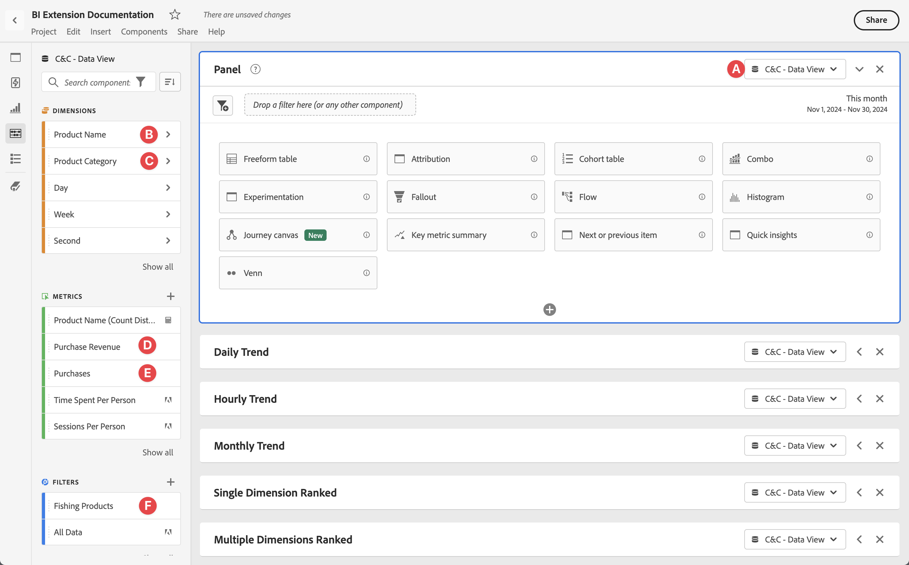
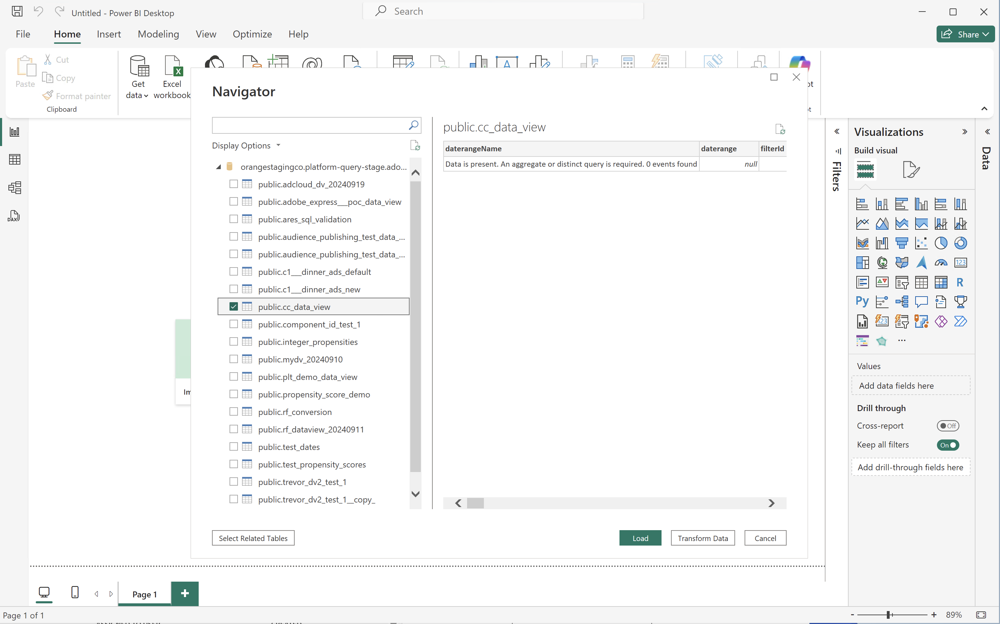
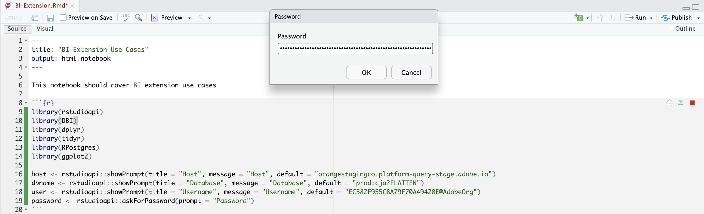

# Connect and validate


This use case sets up the connection from the BI tool to Customer Journey Analytics, lists the available data views, and selects a data view to use. 

+++ Customer Journey Analytics

The instructions refer to an example environment with the following objects:

* Data view: **[!UICONTROL C&C - Data View]** 🅐.
* Dimensions: **[!UICONTROL Product Name]** 🅑 and **[!UICONTROL Product Category]** 🅒.
* Metrics: **[!UICONTROL Purchase Revenue]** 🅓 and **[!UICONTROL Purchases]** 🅔.
* Filter: **[!UICONTROL Fishing Products]** 🅕.



When you go through the use cases, replace these example objects with objects that are appropriate for your specific environment.

+++

+++ BI tools

>[!BEGINTABS]

>[!TAB Power BI Desktop] 

1. Access the required credentials and parameters from the Experience Platform Query Service UI.

   1. Navigate to your Experience Platform sandbox.
   1. Select  **[!UICONTROL Queries]** from the left rail.
   1. Select **[!UICONTROL Credentials]** tab in the **[!UICONTROL Queries]** interface.
   1. Select `prod:cja` from the **[!UICONTROL Database]** drop-down menu.

      

1. Start Power BI Desktop.
   1. From the main interface, select **[!UICONTROL Get data from other sources]**.
   1. In the **[!UICONTROL Get Data]** dialog:
      
      1. Search for and select **[!UICONTROL PostgreSQL database]**.
      1. Select **[!UICONTROL Connect]**.
   1. In the **[!UICONTROL PostgreSQL database]** dialog:
      
      1. Use  to copy and paste the **[!UICONTROL Host]** and **[!UICONTROL Port]** values from the Experience Platform **[!UICONTROL Query]** **[!UICONTROL Expiring Credentials]** panel, separated by `:` as the value for **[!UICONTROL Server]**. For example: `examplecompany.platform-query.adobe.io:80`.
      1. Use  to copy and paste the **[!UICONTROL Database]** value from the Experience Platform **[!UICONTROL Query]** **[!UICONTROL Expiring Credentials]** panel. Add `?FLATTEN` to the value that you paste. For example, `prod:cja?FLATTEN`.
      1. Select **[!UICONTROL DirectQuery]** as the **[!UICONTROL Data connectivity mode]**.
      1. Select **[!UICONTROL OK]**.
   1. In the **[!UICONTROL PostgreSQL database]** - **[!UICONTROL Database]** dialog:
      
      1. Use  to copy the **[!UICONTROL Username]** and **[!UICONTROL Password]** values from the Experience Platform **[!UICONTROL Query]** **[!UICONTROL Expiring Credentials]** panel in the **[!UICONTROL User name]** and **[!UICONTROL Password]** fields. If you are using a [non-expiring credential](https://experienceleague.adobe.com/en/docs/experience-platform/query/ui/credentials?lang=en#use-credential-to-connect), use the password of your non-expiring credential.
      1. Ensure that the drop-down menu for **[!UICONTROL Select which level to apply these settings to]** is set to the **[!UICONTROL Server]** that you have defined earlier.
      1. Select **[!UICONTROL Connect]**.
   1. In the **[!UICONTROL Navigator]** dialog, the data views are retrieved. This retrieval can take some time. Once retrieved, you see the following in Power BI Desktop.
      
      1. Select **[!UICONTROL public.cc_data_view]** from the list in the left panel.
      1. You have two options:
         1. Select **[!UICONTROL Load]** to continue and finish the setup.
         1. Select **[!UICONTROL Transform Data]**. You see a dialog where you can optionally apply transformations as part of the configuration.
         
            * Select **[!UICONTROL Close & Apply]**.
   1. After a while, **[!UICONTROL public.cc_data_view]** is displayed in the **[!UICONTROL Data]** pane. Select  to show dimensions and metrics.
      


## To FLATTEN or not

Power BI Desktop supports the following scenarios for the `FLATTEN` parameter. See [Flatten nested data](https://experienceleague.adobe.com/en/docs/experience-platform/query/key-concepts/flatten-nested-data) for more information.

| FLATTEN parameter | Example | Supported | Remarks |
|---|---|:---:|---|
| None | `prod:cja` |  | |
| `?FLATTEN` | `prod:cja?FLATTEN` |  | **Recommended option to use!** |
| `%3FFLATTEN` | `prod:cja%3FFLATTEN` |  | Power BI Desktop displays error: **[!UICONTROL We couldn't authenticate with the credentials provided. Please try again.]** |

### More information

* [Prerequisites](/help/data-views/bi-extension.md#prerequisites)
* [Credentials guide](https://experienceleague.adobe.com/en/docs/experience-platform/query/ui/credentials)
* [Connect Power BI to Query Service](https://experienceleague.adobe.com/en/docs/experience-platform/query/clients/power-bi).


   

>[!TAB Tableau Desktop] 

1. Access the required credentials and parameters from the Experience Platform Query Service UI.

   1. Navigate to your Experience Platform sandbox.
   1. Select  **[!UICONTROL Queries]** from the left rail.
   1. Select **[!UICONTROL Credentials]** tab in the **[!UICONTROL Queries]** interface.
   1. Select `prod:cja` from the **[!UICONTROL Database]** drop-down menu.

      

1. Start Tableau.
   1. Select **[!UICONTROL PostgreSQL]** from the left rail underneath **[!UICONTROL To a Server]**. If not available, select **[!UICONTROL More...]** and select **[!UICONTROL PostgreSQL]** from the **[!UICONTROL Installed Connectors]**.
      
   1. In the **[!UICONTROL PostgreSQL]** dialog, in the **[!UICONTROL General]** tab:
      
      1. Use  to copy and paste the **[!UICONTROL Host]** from the Experience Platform **[!UICONTROL Query]** **[!UICONTROL Expiring Credentials]** panel to the **[!UICONTROL Server]**.
      1. Use  to copy and paste the **[!UICONTROL Port]** from the Experience Platform **[!UICONTROL Query]** **[!UICONTROL Expiring Credentials]** panel to the **[!UICONTROL Port]**.
      1. Use  to copy and paste the **[!UICONTROL Database]** from the Experience Platform **[!UICONTROL Query]** **[!UICONTROL Expiring Credentials]** panel to the **[!UICONTROL Database]**. Add `%3FFLATTEN` to the value that you paste. For example: `prod:cja%3FFLATTEN`.  
      1. Select **[!UICONTROL Username and Password]** from the **[!UICONTROL Authentication]** drop-down menu.
      1. Use  to copy and paste the **[!UICONTROL Username]** from the Experience Platform **[!UICONTROL Query]** **[!UICONTROL Expiring Credentials]** panel to the **[!UICONTROL Username]**.
      1. Use  to copy and paste the **[!UICONTROL Password]** from the Experience Platform **[!UICONTROL Query]** **[!UICONTROL Expiring Credentials]** panel to the **[!UICONTROL Password]**. If you are using a [non-expiring credential](https://experienceleague.adobe.com/en/docs/experience-platform/query/ui/credentials?lang=en#use-credential-to-connect), use the password of your non-expiring credential.
      1. Ensure that **[!UICONTROL Require SSL]** is checked.
      1. Select **[!UICONTROL Sign In]**.
      
      You see a **[!UICONTROL Progressing Request]** dialog while Tableau Desktop validates the connection.
   1. In the main window, you see in the **[!UICONTROL Data Source]** page, in the left pane:
      * The name of the connection, underneath **[!UICONTROL Connections]**.
      * The name of the database, underneath **[!UICONTROL Database]**.
      * A list of tables, underneath **[!UICONTROL Table]**.
      
      1. Drag the **[!UICONTROL cc_data_view]** entry and drop the entry on the main view that reads **[!UICONTROL Drag tables]** here.
   1. The main window displays details of the **[!UICONTROL cc_data_view]** data view.
      

## To FLATTEN or not

Tableau Desktop supports the following scenarios for the `FLATTEN` parameter. See [Flatten nested data](https://experienceleague.adobe.com/en/docs/experience-platform/query/key-concepts/flatten-nested-data) for more information.

| FLATTEN parameter | Example | Supported | Remarks |
|---|---|:---:|---|
| None | `prod:cja` |  | |
| `?FLATTEN` | `prod:cja?FLATTEN` |  | |
| `%3FFLATTEN` | `prod:cja%3FFLATTEN` |  | **Recommended option to use**. Note, `%3FFLATTEN` is URL-encoded version of `?FLATTEN`. |

## More information

* [Prerequisites](/help/data-views/bi-extension.md#prerequisites)
* [Credentials guide](https://experienceleague.adobe.com/en/docs/experience-platform/query/ui/credentials)
* [Connect Tableau Desktop to Query Service](https://experienceleague.adobe.com/en/docs/experience-platform/query/clients/tableau).


>[!TAB Looker] 

1. Access the required credentials and parameters from the Experience Platform Query Service UI.

   1. Navigate to your Experience Platform sandbox.
   1. Select  **[!UICONTROL Queries]** from the left rail.
   1. Select **[!UICONTROL Credentials]** tab in the **[!UICONTROL Queries]** interface.
   1. Select `prod:cja` from the **[!UICONTROL Database]** drop-down menu.

      

1. Log in to Looker

   1. Select **[!UICONTROL Admin]** from the left rail.
   1. Select **[!UICONTROL Connections]**.
   1. Select **[!UICONTROL Add Connection]**.
   1. In the **[!UICONTROL Connect your database to Looker screen]**.

      

      1. Enter a **[!UICONTROL Name]** for your connection, for example `Example Looker Connection`.
      1. Ensure **[!UICONTROL All Projects]** is selected as the **[!UICONTROL Connection Scope]**.
      1. Select **[!UICONTROL PostgreSQL 9.5+]** as the Dialect.
      1. Use  to copy and paste the **[!UICONTROL Host]** value from the Experience Platform **[!UICONTROL Query]** **[!UICONTROL Expiring Credentials]** panel, as the value for **[!UICONTROL Host]**. For example: `examplecompany.platform-query.adobe.io`.
      1. Use  to copy and paste the **[!UICONTROL Port]** value from the Experience Platform **[!UICONTROL Query]** **[!UICONTROL Expiring Credentials]** panel, as the value for **[!UICONTROL Port]**. For example: `80`.
      1. Use  to copy and paste the **[!UICONTROL Database]** value from the Experience Platform **[!UICONTROL Query]** **[!UICONTROL Expiring Credentials]** panel as the value for **[!UICONTROL Database]**. Add `%3FFLATTEN` to the value that you paste. For example, `prod:cja%3FFLATTEN`.
      1. Use  to copy and paste the **[!UICONTROL Username]** value from the Experience Platform **[!UICONTROL Query]** **[!UICONTROL Expiring Credentials]** panel as the value for **[!UICONTROL Username]**.
      1. Use  to copy and paste the **[!UICONTROL Password]** value from the Experience Platform **[!UICONTROL Query]** **[!UICONTROL Expiring Credentials]** panel as the value for **[!UICONTROL Password]**.
      1. Select **[!UICONTROL Expand all]** at **[!UICONTROL Optional Settings]**.
      1. Set **[!UICONTROL Max connections]** per node to `5`.
      1. Ensure **[!UICONTROL SSL]** is enabled.
      1. Select **[!UICONTROL Test]** to test the connection. You should see a banner appear at the top of the screen with a message like **[!UICONTROL Success, can connect JDBC ....]**.
      1. Select **[!UICONTROL Connect]** to establish and save the connection.
   1. You see the new connection in the **[!UICONTROL Connections]** interface.
   1. Select **←** from **[!UICONTROL Admin]** to go to main navigation in the left rail.
   1. Select **[!UICONTROL Develop]**.
   1. Select **[!UICONTROL Projects]**.
   1. Select **[!UICONTROL New Model]** in LookML Projects.
   1. To ensure you do not affect other users. select Enter Development Mode, when prompted.
   1. In the **[!UICONTROL Create Model]** experience:
      1. In **[!UICONTROL ➊ Select Database Connection]**:
         1. Select your database connection in **[!UICONTROL Select database connection]**. For example: **[!UICONTROL example_looker_connection]**.
         1. Name your project in **[!UICONTROL Create a new LookML Project for this model]**. For `example: example_looker_project`.
         1. Select **[!UICONTROL Next]**.
      1. In **[!UICONTROL ➋ Select Tables]**:
         1. Select **[!UICONTROL public]** and then ensure your Customer Journey Analytics data view is selected. For example:  **[!UICONTROL cc_data_view]**.
         1. Select **[!UICONTROL Next]**.
      1. In **[!UICONTROL ➌ Select Primary Keys]**:
         1. Select **[!UICONTROL Next]**.
      1. In **[!UICONTROL ➍ Select Explores to Create]**:
         1. Ensure you select your view. For example: **[!UICONTROL cc_data_view.view]**. 
         1. Select **[!UICONTROL Next]**.
      1. In **[!UICONTROL ➎ Enter Model Name]**:
         1. Name your model. For example: `example_looker_model`.
      1. Select **[!UICONTROL Complete and Explore Data]**.
   
   You are redirected to the **[!UICONTROL Explore]** interface of Looker, ready to explore the data.
   
      

## To FLATTEN or not

Looker supports the following scenarios for the `FLATTEN` parameter. See [Flatten nested data](https://experienceleague.adobe.com/en/docs/experience-platform/query/key-concepts/flatten-nested-data) for more information.

| FLATTEN parameter | Example | Supported | Remarks |
|---|---|:---:|---|
| None | `prod:cja` |  | |
| `?FLATTEN` | `prod:cja?FLATTEN` |  | |
| `%3FFLATTEN` | `prod:cja%3FFLATTEN` |  | **Recommended option to use**. Note, `%3FFLATTEN` is URL-encoded version of `?FLATTEN`. |

## More information

* [Prerequisites](/help/data-views/bi-extension.md#prerequisites)
* [Credentials guide](https://experienceleague.adobe.com/en/docs/experience-platform/query/ui/credentials)


>[!TAB Jupyter Notebook]

1. Access the required credentials and parameters from the Experience Platform Query Service UI.

   1. Navigate to your Experience Platform sandbox.
   1. Select  **[!UICONTROL Queries]** from the left rail.
   1. Select **[!UICONTROL Credentials]** tab in the **[!UICONTROL Queries]** interface.
   1. Select `prod:cja` from the **[!UICONTROL Database]** drop-down menu.

      

1. Ensure you have set up a dedicated Python virtual environment for running your Jupyter Notebook environment.
1. Ensure you have installed the required libraries in your virtual environment:
   * ipython-sql: `pip install ipython-sql`.
   * psycopg2-binary: `pip install psycopg-binary`.
   * sqlalchemy: pip `install sqlalchemy`.

1. Start Jupyter Notebook from your virtual environment: `jupyter notebook`.
1. Create a new notebook, or download [this sample notebook](../assets/BI-Extension.ipynb.zip).
1. In your first cell, enter and execute:
   
   ```
   %config SqlMagic.style = '_DEPRECATED_DEFAULT'
   ```

1. In a new cell, enter the config parameters for your connection. Use  to copy and paste values from the Experience Platform **[!UICONTROL Query]** **[!UICONTROL Expiring Credentials]** panel to the values required for the config parameters. For example:

   ```
   import ipywidgets as widgets
   from IPython.display import display

   config_host = widgets.Text(description='Host:', value='example.platform-query-stage.adobe.io',
                           layout=widgets.Layout(width="600px"))
   display(config_host)
   config_port = widgets.IntText(description='Port:', value=80,
                              layout=widgets.Layout(width="200px"))
   display(config_port)
   config_db = widgets.Text(description='Database:', value='prod:cja',
                         layout=widgets.Layout(width="300px"))
   display(config_db)
   config_username = widgets.Text(description='Username:', value='EC582F955C8A79F70A49420E@AdobeOrg',
                               layout=widgets.Layout(width="600px"))
   display(config_username)
   config_password = widgets.Password(description='Password:', value='***',
                                   layout=widgets.Layout(width="600px"))
   display(config_password)
   ```

1. Execute the cell.
1. Use  to copy and paste the password from the Experience Platform **[!UICONTROL Query]** **[!UICONTROL Expiring Credentials]** panel to the **[!UICONTROL Password]** field in Jupyter Notebook.

   

1. In a new cell, enter the statements to load the SQL extension, the required library and connect with Customer Journey Analytics.

   ```python
   %load_ext sql
   from sqlalchemy import create_engine
   %sql postgresql://{config_username.value}:{config_password.value}@{config_host.value}:{config_port.value}/{config_db.value}?sslmode=require
   ```

   Execute the shell. You should see no output but the cell should execute without any warning.

   

1. In a new call, enter the statements to get a list of available data views based on the connection.

   ```python
   %%sql
   SELECT n.nspname as "Schema",
      c.relname as "Name",
      CASE c.relkind WHEN 'r' THEN 'table' WHEN 'v' THEN 'view' WHEN 'm' THEN 'materialized view' WHEN 'i' THEN 'index' WHEN 'S' THEN 'sequence' WHEN 's' THEN 'special' WHEN 't' THEN 'TOAST table' WHEN 'f' THEN 'foreign table' WHEN 'p' THEN 'partitioned table' WHEN 'I' THEN 'partitioned index' END as "Type",
      pg_catalog.pg_get_userbyid(c.relowner) as "Owner"
   FROM pg_catalog.pg_class c
   LEFT JOIN pg_catalog.pg_namespace n ON n.oid = c.relnamespace
   WHERE c.relkind IN ('v','')
      AND n.nspname <> 'pg_catalog'
      AND n.nspname !~ '^pg_toast'
      AND n.nspname <> 'information_schema'
      AND pg_catalog.pg_table_is_visible(c.oid)
      AND c.relname NOT LIKE '%test%'
      AND c.relname NOT LIKE '%ajo%'
   ORDER BY 1,2;
   ```

   Execute the shell. You should see output simular to the screenshot below.

   

   You should see the **[!UICONTROL cc_data_view]** in the list of data views.

## To FLATTEN or not

Jupyter Notebook supports the following scenarios for the `FLATTEN` parameter. See [Flatten nested data](https://experienceleague.adobe.com/en/docs/experience-platform/query/key-concepts/flatten-nested-data) for more information.

| FLATTEN parameter | Example | Supported | Remarks |
|---|---|:---:|---|
| None | `prod:cja` |  | |
| `?FLATTEN` | `prod:cja?FLATTEN` |  | |
| `%3FFLATTEN` | `prod:cja%3FFLATTEN` |  | **Recommended option to use**. Note, `%3FFLATTEN` is URL-encoded version of `?FLATTEN`. |

## More information

* [Prerequisites](/help/data-views/bi-extension.md#prerequisites)
* [Credentials guide](https://experienceleague.adobe.com/en/docs/experience-platform/query/ui/credentials)

>[!TAB RStudio]

1. Access the required credentials and parameters from the Experience Platform Query Service UI.

   1. Navigate to your Experience Platform sandbox.
   1. Select  **[!UICONTROL Queries]** from the left rail.
   1. Select **[!UICONTROL Credentials]** tab in the **[!UICONTROL Queries]** interface.
   1. Select `prod:cja` from the **[!UICONTROL Database]** drop-down menu.

      

1. Start RStudio.
1. Create a new R Markdown file, or download [this example R markdown file](../assets/BI-Extension.Rmd.zip).
1. In your first chunk, enter the following statements between ` ```{r} ` and ` ``` `. Use  to copy and paste values from the Experience Platform **[!UICONTROL Query]** **[!UICONTROL Expiring Credentials]** panel to the values required for the various parameters, like `host`, `dbname`, and `user`. For example:
   
   ```R
   library(rstudioapi)
   library(DBI)
   library(dplyr)
   library(tidyr)
   library(RPostgres)
   library(ggplot2)

   host <- rstudioapi::showPrompt(title = "Host", message = "Host", default = "orangestagingco.platform-query-stage.adobe.io")
   dbname <- rstudioapi::showPrompt(title = "Database", message = "Database", default = "prod:cja?FLATTEN")
   user <- rstudioapi::showPrompt(title = "Username", message = "Username", default = "EC582F955C8A79F70A49420E@AdobeOrg")
   password <- rstudioapi::askForPassword(prompt = "Password")
   ```

1. Run the chunk. You are prompted for **[!UICONTROL Host]**, **[!UICONTROL Database]**, and **[!UICONTROL User]**. Simply accept the values you have provided as part of the previous step. 
1. Use  to copy and paste the password from the Experience Platform **[!UICONTROL Query]** **[!UICONTROL Expiring Credentials]** panel to the **[!UICONTROL Password]** dialog prompt in RStudio.

   

1. Create a new chunk and enter the following statements between ` ``` {r} ` and ` ``` `.

   ```R
   con <- dbConnect(
      RPostgres::Postgres(),
      host = host,
      port = 80,
      dbname = dbname,
      user = user,
      password = password,
      sslmode = 'require'
   )
   ```

1. Run the chunk. You should see no output if the connection is successful.


1. Create a new chunk and enter the following statements between ` ``` {r} ` and ` ``` `.

   ```R
   views <- dbListTables(con)
   print(views)
   ```

1. Run the chunk. You should see `character(0)` as the only output.


1. Create a new chunk and enter the following statements between ` ``` {r} ` and ` ``` `.

   ```R
   glimpse(dv)
   ```

1. Run the chunk. You should see output simular to the screenshot below.

   

## To FLATTEN or not

RStudio supports the following scenarios for the `FLATTEN` parameter. See [Flatten nested data](https://experienceleague.adobe.com/en/docs/experience-platform/query/key-concepts/flatten-nested-data) for more information.

| FLATTEN parameter | Example | Supported | Remarks |
|---|---|:---:|---|
| None | `prod:cja` |  | |
| `?FLATTEN` | `prod:cja?FLATTEN` |  |  **Recommended option to use**. |
| `%3FFLATTEN` | `prod:cja%3FFLATTEN` |  | |

## More information

* [Prerequisites](/help/data-views/bi-extension.md#prerequisites)
* [Credentials guide](https://experienceleague.adobe.com/en/docs/experience-platform/query/ui/credentials)

>[!ENDTABS]

+++
